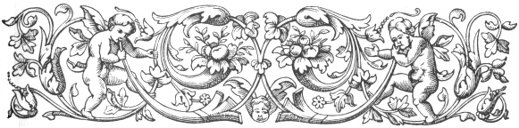
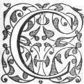

  
[Intangible Textual Heritage](../../index)  [Ancient Near
East](../index)  [Index](index)  [Previous](caog11)  [Next](caog13) 

------------------------------------------------------------------------

  
*The Chaldean Account of Genesis*, by George Smith, \[1876\], at
Intangible Textual Heritage

------------------------------------------------------------------------

p. 137

 

### CHAPTER IX.

### BABYLONIAN FABLES.

Fables.—Common in the East.—Description.—Power of
speech in animals.—Story of the eagle.—Serpent.—Shamas.—The eagle
caught.—Eats the serpent.—Anger of birds.—Etana.—Seven gods.—Third
tablet.—Speech of eagle.—Story of the fox.—His cunning.—Judgment of
Shamas.—His show of sorrow.—His punishment.—Speech of fox:—Fable of the
horse and ox.—They consort together.—Speech of the ox.—His good
fortune.—Contrast with the horse.—Hunting the ox.—--Speech of the
horse.—Offers to recount story.—Story of Ishtar.—Further tablets.

|                    |
|--------------------|
|  |

COMBINED with these stories of the gods, traditions of the early history
of man, and accounts of the Creation, are fragments of a series in which
the various animals speak and act. I call these tablets "Fables" to
distinguish them from the others, but, as many of the others are equally
fabulous and very similar in style, the name must not be taken to imply
any distinctive character in this direction. It is probable that all
these stories even in Babylonia were equally believed in by the devout
and the ignorant, treated as allegories

p. 138

by the poets, and repudiated as fabulous by the learned. In the "Fables"
or stories in which animals play prominent parts, each creature is
endowed with the power of speech, and this idea was common even in that
day in the whole of Western Asia and Egypt, it is found in various
Egyptian stories, it occurs in Genesis, where we have a speaking
serpent, in Numbers where Balaam's ass reproves his master, and in the
stories of Jotham and Joash, where the trees are made to speak; again in
the Izdubar legends, where the trees answer Heabani.

These legends so far as I have discovered are four in number.

The first contained at least four tablets each having four columns of
writing. Two of the acting animals in it are the eagle and the serpent.

The second is similar in character, the leading animal being the fox or
jackal, there are only four fragments, and I have no evidence as to the
number of tablets; this may belong to the same series as the fable of
the eagle.

The third is a single tablet with two columns of writing, it is a
discussion between the horse and ox.

The fourth is a single fragment in which a calf speaks, but there is
nothing to show the nature of the story.

I. The Story of the Eagle.

This story appears to be the longest and most curious of these legends,
but the very mutilated condition of the various fragments gives as usual

p. 139

considerable difficulty in attempting an explanation. One of the actors
in the story is an ancient monarch named Etana who is mentioned as
already dead, and as being an inhabitant of the infernal regions in the
time of Izdubar.

I am unable to ascertain the order of the fragments of these legends and
must translate them as they come.

K 2527.

Many lines lost at commencement.

1\. The serpent in . . .

2\. I give command? . . . . . .

3\. to the eagle . . . . . .

4\. Again the nest . . . . . .

5\. my nest I leave . . . . . .

6\. the assembly? of my people . . . . . .

7\. I go down and enter?

8\. the sentence which Shamas has pronounced on me . . . . . .

9\. I feel? Shamas thy sight? in the earth . . . .

10\. thy stroke? this . . . .

11\. in thy sight? let me not . . . .

12\. doing evil the goddess Bau (Gula) was . . . .

13\. The sorrow of the serpent \[shamas saw and\]

14\. Shamas opened his mouth and word he spoke to. . . .

15\. Go the way . . . . pass . . . .

16\. I cut thee off? . . . .

17\. open also his heart . . . .

18\. . . . . he placed . . . .

19\. . . . . birds of heaven . . .

p. 140

Reverse.

1\. The eagle with them . . . .

2\. the god? knew . . . .

3\. to enter to the food he sought . . . .

4\. to cover the . . . .

5\. to the midst at his entering . . . .

6\. enclosed the feathers of his wings . . . .

7\. his claws? and his pinions to . . . .

8\. dying of hunger and thirst . . . .

9\. at the work of Shamas the warrior, the serpent. . . .

10\. he took also the serpent to . . . .

11\. he opened also his heart . . . .

12\. seat he placed . . .

13\. the anger of the birds of heaven . . . .

14\. May the eagle . . . .

15\. with the young of the birds . . . .

16\. The eagle opened his mouth . . . .

Five other mutilated lines.

On another fragment are the following few words:—

Obverse.

1\. . . . issu to him also . . . .

2\. . . . god my father . . . .

3\. like Etana kill thee . . . .

4\. like me . . . .

5\. Etana the king . . . .

6\. took him . . . .

Reverse.

1\. Within the gate of Anu, Elu . . . .

p. 141

2\. . . . .we will fix . . . .

3\. within the gate of sin, Shamas, Vul and . . . .

4\. . . . . I opened . . . .

5\. . . . . I sweep . . . .

6\. . . . . in the midst . . . .

7\. the king . . . .

8\. turned? and . . . .

9\. I cover the throne . . . .

10\. I take also . . . .

11\. and greatly I break . . . .

12\. The eagle to him also to Etana . . . .

13\. I fear the serpent?

14\. the course do thou fix for me . . . .

15\. . . . . make me great . . . .

The next fragment, K 2606, is curious, as containing an account of some
early legendary story in Babylonian history. This tablet formed the
third in the series, and from it we gain part of the title of the
tablets.

K 2606.

1\. . . . . placed . . . .

2\. . . . back bone . . . .

3\. this . . . . placed . . .

4\. . . . . fixed its brickwork . . . .

5\. . . . . to the government of them . . . .

6\. Etana he gave them . . . .

7\. . . . . sword . . . .

8\. the seven spirits . . . .

9\. . . . . they took their counsel . . . .

p. 142

10\. . . . . placed in the country . . . .

11\. . . . . all of them the angels . . . .

12\. . . . . they . . . .

13\. In those days also . . . .

14\. and a sceptre of ukni stone . . . .

15\. to rule the country . . . .

16\. the seven gods over the people they raised . . . .

17\. over the cities they raised . . . .

18\. the city of the angels Surippak?

19\. Ishtar to the neighbourhood to . . . .

20\. and the king flew . . . .

21\. Inninna to the neighbourhood . . . .

22\. and the king flew . . . .

23\. Elu encircled the sanctuary of . . . .

24\. he sought also . . . .

25\. in the wide country . . . .

26\. the kingdom . . . .

27\. he took and

28\. the gods of the country

Reverse.

Many lines lost.

1\. from of old he caused to wait . . . .

------------------------------------------------------------------------

2.. Third tablet of “The city they . . . .

------------------------------------------------------------------------

3\. The eagle his mouth opened and to Shamas his lord he spake

The next fragment is a small portion probably of the fourth tablet.

1\. The eagle his mouth opened . . . .

p. 143

2\. . . . . . . . .

3\. the people of the birds . . . .

4\. . . . . . . . .

5\. angrily he spake . . . .

6\. angrily I speak . . . .

7\. in the mouth of Shamas the warrior . . . .

8\. the people of the birds . . . .

9\. The eagle his mouth opened and . . . .

10\. Why comest thou . . . .

11\. Etana his mouth opened and . . . .

12\. speech? . . . . he . . . .

Such are the principal fragments of this curious legend. According to
the fragment K 2527, the serpent had committed some sin for which it was
condemned by the god Shamas to be eaten by the eagle; but the eagle
declined the repast.

After this, some one, whose name is lost, baits a trap for the eagle,
and the bird going to get the meat, falls into the trap and is caught.
Now the eagle is left, until dying for want of food it is glad to eat
the serpent, which it takes and tares open. The other birds then take
offence, and desire that the eagle should be excluded from their ranks.

The other fragments concern the building of some city, Etana being king,
and in these relations the eagle again appears, there are seven spirits
or angels principal actors in the matter, but the whole story is obscure
at present, and a connected plot cannot be made out.

This fable has evidently some direct connection

p. 144

with the mythical history of Babylonia, for Etana is mentioned as an
ancient Babylonian monarch in the Izdubar legends. His memory was
cherished as belonging to one of the terrible monarchs who were
inhabiting Hades, probably on account of their deeds.

II\. Story of the Fox.

The next fable, that of the fox, is perhaps part of the same story, the
fragments are so disconnected that they must be given without any
attempt at arrangement.

K. 3641.

Column I.

1\. To. . . .

2\. the people . . . .

3\. father . . . .

4\. mother called . . . .

5\. he had asked and . . . .

6\. he had raised life . . . .

7\. thou in that day also . . . .

8\. thou knowest enticing? and cunning, thou . . . .

9\. of . . . . chains, his will he . . . .

10\. about the rising of the jackal also he sent me let not . . . .

11\. in a firm command he set my feet,

12\. again by his will is the destruction of life.

13\. Shamas in thy sentence, the answer? let him not escape,

p. 145

14\. by wisdom and cunning let them put to death the fox.

------------------------------------------------------------------------

15\. The fox on hearing this, bowed his head in the presence of Shamas
and wept.

16\. To the powerful presence of Shamas he went in his tears:

17\. With this sentence O Shamas do not destroy me,

(Columns II. and III. lost.)

Column IV.

1\. Go to my forest, do not turn back afterwards

2\. . . . shall not come out, and the sun shall not be seen,

3\. thou, any one shall not cut thee off . . . .

4\. by the anger of my heart and fierceness of my face thou shalt fear
before me,

5\. may they keep thee and I will not . . . .

6\. may they take hold of thee and not . . . .

7\. may they bind thee and not . . . .

8\. may they fell thy limbs . . . .

9\. Then wept the jackal . . . .

10\. he bowed his head . . . .

11\. thou hast fixed . . . .

12\. taking the . . . .

Four other mutilated lines.

The next fragment has lost the commencements and ends of all the lines.

1\. . . . . carried in his mouth . . . .

2\. . . . . before his . . . .

p. 146

3\. . . . . thou knowest wisdom and all . .

4\. . . . . in . . . . of the jackal it was . . . .

5\. . . . . in the field the fox . . . .

6\. . . . . was decided under the ruler the . . . .

7\. . . . . all laying down under him and of . . . .

8\. . . . . he . . . . also . . . . he fled . . . .

9 . . . . . angry command, and not any one . . . .

10\. . . . . mayest thou become old . . . . and take. . . .

11\. . . . . in those days also the fox carried . . . .

12\. . . . . the people he spoke. Why . . . .

13\. . . . . the dog is removed and . . . .

The following fragment is in similar condition.

1\. . . . . The limbs not . . . .

2\. . . . . I did not weave and unclothed I am not. . . .

3\. . . . . stranger I know . . . .

4\. . . . . I caught and I surrounded . . . .

5\. . . . from of old also the dog was my brother . . .

6\. . . . . he begot me, a good place . .

7\. . . . . of the city of Nisin I of Bel . . . .

8\. . . . . limbs and the bodies did not stand . . .

9\. . . . . life I did not end . . . .

10\. . . . . brought up . . . . me . . . .

The fourth fragment contains only five legible lines.

1\. . . . . was placed also right and left . .

2\. . . . . their ruler sought . . . . .

3\. . . . . let it not be . . . .

p. 147

4\. . . . he feared and did not throw down his spoil . . .

------------------------------------------------------------------------

5\. . . . fox in the forest . . . .

The last fragment is a small scrap, at the end of which the fox
petitions Shamas to spare him.

The incidental allusions in these fragments show that the fox or jackal
was even then considered cunning, and the animal in the story was
evidently a watery specimen, as he brings tears to his assistance
whenever anything is to be gained by it. He had offended Shamas by some
means and the god sentenced him to death, a sentence which he escaped
through powerful pleading on his own behalf.

III\. Fable of the Horse and Ox.

The next fable, that of the horse and the ox, is a single tablet with
only two columns of text. The date of the tablet is in the reign of
Assurbanipal, and there is no statement that it is copied from an
earlier text. There are altogether four portions of the text, but only
one is perfect enough to be worth translating. This largest fragment, K
3456, contains about one third of the story.

K 3456.

(Several lines lost at commencement.)

1\. . . . . . . the river . . . .

2\. of food . . . . rest . . . .

3\. height . . . . the Tigris situated

p. 148

4\. they ended . . . . was . . . .

5\. in the flowers . . . . they disported in the floods?

6\. the high places . . . . appearance

7\. the vallies . . . . the country

8\. at the appearance . . . . made the timid afraid

9\. a boundless place . . . . he turned

10\. in the side . . . .

11\. of the waste . . . . earth were free within it

12\. the tribes of beasts rejoiced in companionship and friendship,

13\. between the ox and the horse friendship was made,

14\. they rejoiced their . . . . over the friendship,

15\. they consorted and pleased their hearts, and were prosperous.

16\. The ox opened his mouth, and spake and said to the horse glorious
in war:

17\. I am pondering now upon the good fortune at my hand.

18\. From the beginning of the year to the end of the year I ponder at
my appearance.

19\. He destroyed abundance of food, he dried up rivers of waters,

20\. in the flowers he rolled, a carpet he made,

21\. the vallies and springs he made for his country,

22\. the high places he despised, he raged in the floods,

p. 149

23\. the sight of his horns make the timid afraid,

24\. A boundless place is portioned for his . . . .

25\. the man . . . . learned ceased . . . .

26\. he broke the ropes and waited . . . .

27\. and the horse will not approach a child, and he drives him . . . .

28\. they catch thee thyself

29\. he ascends also . . . .

------------------------------------------------------------------------

Here the ox gives a good picture of his state and enjoyment, and looks
with contempt on the horse because he is tamed.

After this comes a speech from the horse to the bull, the rest of the
tablet being occupied by speeches and answers between the two animals.
Most of these speeches are lost or only present in small fragments, and
the story recommences on the reverse with the end of a speech from the
horse.

1\. fate . . . .

2\. strong brass? . . . .

3\. like with a cloak I am clothed and . . . .

4\. over me any one not suited . . . .

5\. king, high priest, lord and prince do not seek . . . .

------------------------------------------------------------------------

6\. The ox opened his mouth and spake and said to the horse glorious . .
. .

7\. I say I am noble and thou gatherest . . . .

8\. in thy fighting why . . . .

p. 150

9\. the lord of the chariot destroys me and desolation . . . .

10\. in my body I am firm . . . .

11\. in my inside I am firm . . . .

12\. the warrior draws out of his quiver . . . .

13\. strength carries a curse . . . .

14\. the weapon of my masters over . . . .

15\. he causes to see servitude like . . . .

16\. . . . . in thee is not . . . .

17\. he causes to go on the path over . . . .

------------------------------------------------------------------------

18\. The horse opened his mouth and spake arid said to the ox . . . .

19\. In my hearing . . . .

20\. the weapon . . . .

21\. the swords . . . .

22\. . . . . . .

23\. strength? of the heart which does not . . . .

24\. in crossing that river . . . .

25\. in the paths of thy country . . . .

26\. I reveal? ox the story . . . .

27\. in thy appearance, it is not . . . .

28\. thy splendour is subdued? . . . .

29\. like . . . . the horse . . . .

------------------------------------------------------------------------

30\. The ox opened his mouth and spake and said to the horse . . . .

31\. Of the stories which thou tellest . . . .

p. 151

32\. open first (that of) "When the noble Ishtar. . . .

(Colophon)

Palace of Assurbanipal, king of nations, king . . .

It appears from these fragments that the story described a time when the
animals associated together, and the ox and horse fell into a friendly
conversation. The ox, commencing the discussion, praised himself; the
answer of the horse is lost, but where the story recommences it appears
that the ox objects to the horse drawing the chariot from which he (the
ox) is hunted, and the horse ultimately offers to tell the ox a story,
the ox choosing the story called "When the noble Ishtar ", probably some
story of the same character as Ishtar's descent into Hades.

It is uncertain if any other tablet followed this; it is, however,
probable that there was one containing the story told by the horse.
Although there is no indication to show the date of this fable, I should
think, by the style and matter, it belonged to about the same date as
the other writings given in this volume. The loss of the tablet
containing the story of Ishtar, told by the horse to the ox, is
unfortunate. It is evident that Ishtar was a very celebrated goddess,
and her adventures formed the subject of many narratives. Some of the
words and forms in these fables are exactly the same as those used in
the Izdubar and Creation legends, and in all these stories the

p. 152

deity Shamas figures more prominently than is usual in the mythology.
The last fable is a mere fragment similar to the others, containing a
story in which the calf speaks. There is not enough of this to make it
worth translation.

------------------------------------------------------------------------

[Next: Chapter X. Fragments of Miscellaneous Texts](caog13)

