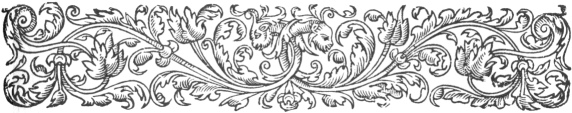
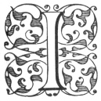

  
[Intangible Textual Heritage](../../index)  [Ancient Near
East](../index)  [Index](index)  [Previous](caog12)  [Next](caog14) 

------------------------------------------------------------------------

  
*The Chaldean Account of Genesis*, by George Smith, \[1876\], at
Intangible Textual Heritage

------------------------------------------------------------------------

p. 153

 

### CHAPTER X.

### FRAGMENTS OF MISCELLANEOUS TEXTS.

Atarpi.—Sin of the world.—Mother and daughter
quarrel.—Zamu.—Punishment of world.—Hea.—Calls his sons.—Orders
drought.—Famine.—Building.—Nusku.—Riddle of wise man.—Nature and
universal presence of air.—Gods.—Sinuri.—Divining by fracture of
reed.—Incantation.—Dream.—Tower of Babel.—Obscurity of legend.—Not
noticed by Berosus.—Fragmentary tablet.—Destruction of
Tower.—Dispersion.—Locality Babylon.—Birs Nimrud.—Babil.—Assyrian
representations.

|                    |
|--------------------|
|  |

I HAVE included in this chapter a number of stories of a similar
character to those of Genesis, but which are not directly connected, and
a fragment relating to the tower of Babel. The first and principal text
is the story of Atarpi, or Atarpi-nisi. 'This story is on a tablet in
six columns, and there is only one copy. It is very mutilated, very
little being preserved except Column III., and there are numerous
repetitions throughout the text. The inscription has originally been a
long one, probably extending to about 400 lines of writing, the text
differs

p. 154

from the generality of these inscriptions, being very obscure and
difficult. In consequence of this and other reasons, I only give an
outline of most of the story.

We are first told of a quarrel between a mother and her daughter, and
that the mother shuts the door of the house, and turns her daughter
adrift. The doings of a man named Zamu have some connection with the
affair; and at the close we are told of Atarpi, sometimes called
Atarpi-nisi, or Atarpi the "man" who had his couch beside a river, and
was pious to the gods, but took no notice of these things. Where the
story next opens, the god Elu or Bel calls together an assembly of the
gods his sons, and relates to them that he is angry at the sin of the
world, stating also that he will bring down upon them disease, poison,
and distress. This is followed by the statement that these things came
to pass, and Atarpi then invoked the god Hea to remove these evils. Hea
answers, and announces his resolve to destroy the people. After this the
story reads:

1\. Hea called his assembly he said to the gods his sons

2\. . . . . . . I made them

3\. . . . shall not stretch until before he turns.

4\. Their wickedness I am angry at,

5\. their punishment shall not be small,

6\. I will look to judge the people,

7\. in their stomach let food be exhausted,

8\. above let Vul drink up his rain,

p. 155

9\. let the lower regions be shut up, and the floods not be carried in
the streams,

10\. let the ground be hardened which was overflown,

11\. let the growth of corn cease, may blackness overspread the fields,

12\. let the plowed fields bring forth thorns,

13\. may the cultivation be broken up, food not arise and it not
produce,

14\. may distress be spread over the people,

15\. may favour be broken off, and good not be given.

------------------------------------------------------------------------

16\. He looked also to judge the people,

17\. in their stomach food he exhausted,

18\. Above Vul drank up his rains,

19\. the lower regions were shut up, and floods not carried in the
streams,

20\. The ground was hardened which had been overflown,

21\. the growth of corn ceased, blackness spread over the fields,

22\. the plowed fields brought forth thorns, the cultivation was broken
up,

23\. food did not rise, and it did not produce,

24\. distress was spread over the people,

25\. favour was broken off, good was not given.

------------------------------------------------------------------------

This will serve to show the style of the tablet. The instrument of
punishment was apparently a

p. 156

famine from want of rain, but there are some obscure words even in this
passage.

Here the story is again lost, and where it recommences some one is
making a speech, directing another person to cut something into
portions, and place seven on each side, then to build brickwork round
them. After this comes a single fragment, the connection of which with
the former part is obscure.

1\. I curse the goddess . . . .

2\. to her face also . . . .

------------------------------------------------------------------------

3\. Anu opened his mouth and spake and said to Nusku

4\. Nusku open thy gate thy weapons take

5\. in the assembly of the great gods the will?

6\. their speech?

7\. Anu has sent me . . . .

8\. your king has sent?

At present no satisfactory story can be made out of the detached
fragments of this tablet, but it evidently belongs to the mythical
portion of Babylonian history.

The next text is a single fragment, K 2407, belonging to a curious story
of a wise man who puts a riddle to the gods.

K 2407.

(Many lines lost.)

1\. which in the house is . . . .

2\. which in the secret place is . . . .

p. 157

3\. which is in the foundation of the house . . . .

4\. which on the floor? of the house stands, which. . . .

5\. which in the vicinity . . . .

6\. which by the sides of the house goes down . . . .

7\. which in the ditch of the house open, lays down. . . .

8\. which roars like a bull, which brays like an ass,

9\. which flutters like a sail, which bleats like a sheep,

10\. which barks like a dog,

11\. which growls like a bear,

12\. which into the breast of a man enters, which into the breast of a
woman enters.

13\. Sar-nerra heard the word which the wise son of man

14\. asked, and all the gods he sent to:

15\. Friends are ye I am unable? . . . . to you

After this there is a mutilated passage containing the names, titles,
and actions of the gods who consider the riddle. It is evident that it
is air or wind which the wise man means in his riddle, for this is
everywhere, and in its sounds imitates the cries of animals.

Next we have another single fragment about a person named Sinuri, who
uses a divining rod to ascertain the meaning of a dream.

1\. Sinuri with the cut reed pondered . . . .

2\. with his right hand he broke it, and Sinuri spake and thus said:

p. 158

3\. Now the plant of Nusku, shrub? of Shamas at thou,

4\. Judge, thou judgest (or divinest), divine concerning this dream,

5\. which in the evening, at midnight, or in the morning,

6\. has come, which thou knowest, but I do not know.

7\. If it be good may its good not be lost to me,

8\. if it be evil may its evil not happen to me.

There are some more obscure and broken lines, but

no indication as to the story to which it belongs.

One of the most obscure incidents in the Book of Genesis is undoubtedly
the building of the Tower of

  [  
Click to enlarge](img/15800.jpg)  
MEN ENGAGED IN BUILDING; FROM BABYLONIAN CYLINDER.  

\[paragraph continues\] Babel. So far as
we can judge from the fragments of his copyists, there was no reference
to it in the work of Berosus, and early writers had to quote from
writers of more than doubtful authority in order to confirm it.

There is also no representation on any of the Babylonian gems which can
with any certainty be described as belonging to this story. I have,
however,

p. 159

picked out three from a series of these carvings which I think may be
distorted representations of the event. In these and some others of the
same sort, figures have their hands on tall piles, as if erecting them;
and there is a god always represented

  [  
Click to enlarge](img/15900.jpg)  
MEN ENGAGED IN BUILDING; FROM BABYLONIAN CYLINDER.  

near, in much the same attitude. There is no proper proportion between
the supposed structure and the men, and I would not urge more than a
possible connection with the myth. The utter absence of any allusion to
the tower, either in Berosus or the inscriptions, led me to doubt at one
time if the story. ever formed part of the Babylonian history.

p. 160

Early this year I was astonished to find, on having one of the Assyrian
fragments cleaned, that it contained a mutilated account of part of the
story of the tower. I have since searched through the whole collection,
but have been unable to find any more of this tablet, except two minute
fragments which add nothing to the text.

It is evident from the wording of the fragment that it was preceded by
at least one tablet, describing the sin of the people in building the
tower. The fragment preserved belongs to a tablet containing from four
to six columns of writing, of which fragments of four remain. The
principal part is the beginning of Column I.

Column I.

1\. . . . . them? the father . . . .

2\. . . . . of him, his heart was evil,

3\. . . . . against the father of all the gods was wicked,

4\. . . . of him, his heart was evil,

5\. . . . . Babylon brought to subjection,

6\. \[small\] and great he confounded their speech.

7\. . . . . Babylon brought to subjection,

8\. \[small\] and great he confounded their speech.

9\. their strong place (tower) all the day they founded;

10\. to their strong place in the night

11\. entirely he made an end.

12\. In his anger also word thus he poured out:

p. 161

13\. \[to\] scatter abroad he set his face

14\. he gave this? command, their counsel was confused

15\. . . . . the course he broke

16\. . . . . fixed the sanctuary

There is a small fragment of Column II., but the connection with Column
I. is not apparent.

Column II.

1\. Sar-tul-elli . . . .

2\. in front carried Anu . . . .

3\. to Bel-sara his father . . . .

4\. like his heart also . . . .

5\. which carried wisdom . . . .

6\. In those days also . . . .

7\. he carried him . . . .

8\. Nin-kina . . . .

9\. My son I rise and . . . .

10\. his number(?) . . . .

11\. entirely . . . .

There is a third portion on the same tablet belonging to a column on the
other side, either the third or the fifth.

Reverse Column III. or V.

1\. In . . . .

2\. he blew and . . . .

3\. for a long time in the cities . . . .

4\. Nunanner went . . . .

5\. He said, like heaven and earth . . .

p. 162

6\. that path they went . . . .

7\. fiercely they approached to the presence . . . .

8\. he saw them and the earth . . . .

9\. of stopping not . . . .

10\. of the gods . . . .

11\. the gods looked . . . .

12\. violence(?) . . . .

13\. Bitterly they wept at Babi . . . .

14\. very much they grieved . . . .

15\. at their misfortune and . . . .

  [  
Click to enlarge](img/16200.jpg)  
VIEW OF THE BIRS NIMRUD, THE SUPPOSED SITE OF THE TOWER OF BABEL.  

These fragments are so remarkable that it is most unfortunate we have
not the remainder of the tablet.

In the first part we have the anger of the gods at the sin of the world,
the place mentioned being Babylon. The building or work is called
tazimat or tazimtu, a word meaning strong, and there is a curious
relation, lines 9 to 11, that what they built in the day the god
destroyed in the night.

p. 163

The remainder of the fragment and the two fragments of the other columns
agree with the story as far as their mutilated condition allows. The
fractured end of the 13th line of the third fragment has the beginning
of a name Babi, which may be completed Babil or Babel, but I have not
ventured on the restoration. In the case of the 6th and 8th lines of the
first fragment I have translated the word "speech" with a prejudice; I
have never seen the Assyrian word with this meaning.

  [  
Click to enlarge](img/16300.jpg)  
VIEW OF THE BABIL MOUND AT BABYLON, THE SITE OF THE TEMPLE OF BEL.  

The whole account is at present so fragmentary that I think it better to
make no detailed comparisons until more of the text is obtained. The
various notices which have come down to us seem to me to point to the
great pile of Birs Nimrud, near Babylon, as the site of the tower, this
opinion is held by Sir Henry Rawlinson and most other authorities of
weight. This ruin has been examined

p. 164

by Sir Henry Rawlinson; details of his operations here are given in
"Jour. Asiatic Soc.," vol. xviii., and Rawlinson's "Ancient Monarchies,"
p. 544. Sir Henry discovered by excavation that the tower consisted of
seven stages of brickwork on an earthen

  [  
Click to enlarge](img/16400.jpg)  
TOWER IN STAGES, FROM AN ASSYRIAN BAS-RELIEF.  

platform, each stage being of a different colour. The temple was devoted
to the seven planets; the height of the earthen platform was not
ascertained, the first stage, which was an exact square, was 272 feet
each way, and 26 feet high, the bricks blackened with bitumen; this
stage is supposed to

p. 165

have been devoted to the planet Saturn. The second stage was a square of
230 feet, 26 feet high, faced with orange-coloured bricks; supposed to
be devoted to Jupiter. The third stage, 188 feet square, and 26 feet
high, faced with red bricks, was probably dedicated to Mars. The fourth
stage, 146 feet square, and 15 feet high, was probably devoted to the
Sun, and is supposed by Sir H. Rawlinson to have been originally plated
with gold. The fifth stage is supposed to have been 104, the sixth 62,
and the seventh 20 feet square, but the top was too ruinous to decide
these measurements. These stages were probably devoted to Venus,
Mercury, and the Moon. Each stage of the building was not set in the
centre of the stage on which it rested, but was placed 30 feet from the
front, and 12 feet from the back. The ruin at present rises 154 feet
above the level of the plain, and is the most imposing pile in the whole
country. The only other ruin which has any claim to represent the tower
is the Babil mound within the enclosure of Babylon, which is the site of
the Temple of Bel. I have given views of both ruins as the possible
alternative sites.

In the Babylonian and Assyrian sculptures there are occasionally
representations of towers similar in style to the supposed Tower of
Babel; one of these is given on the stone of Merodach Baladan I.,
opposite p. 236 of "Assyrian Discoveries;" another occurs on the
sculptures at Nineveh, representing the city of Babylon; this tower is
probably the Borsippa pile,

p. 166

which is supposed to represent the Tower of Babel. Birs Nimrud now
consists of seven stages, but the top stages were only built by
Nebuchadnezzar; before his time it probably presented the appearance
shown in the Assyrian sculpture, and in the similar Babylonian
representation figured opposite page 236 of "Assyrian Discoveries."

 

------------------------------------------------------------------------

[Next: Chapter XI. The Izdubar Legends](caog14)

