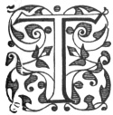
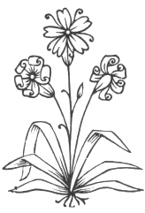

  
[Intangible Textual Heritage](../../index.md)  [Ancient Near
East](../index)  [Index](index)  [Previous](caog13)  [Next](caog15.md) 

------------------------------------------------------------------------

  
*The Chaldean Account of Genesis*, by George Smith, \[1876\], at
Intangible Textual Heritage

------------------------------------------------------------------------

p. 167

 

### CHAPTER XI.

### THE IZDUBAR LEGENDS.

Account of Deluge.—Nimrod.—Izdubar.—Age of
Legends.—Babylonian cylinders.—Notices of Izdubar.—Surippak.—Ark
City.—Twelve tablets.—Extent of
Legends.—Description.—Introduction.—Meeting of Heabani and
Izdubar.—Destruction of tyrant Humbaba.—Adventures of Ishtar.—Illness
and wanderings of Izdubar.—Description of Deluge and conclusion.—First
Tablet.—Kingdom of
Nimrod.—Traditions.—Identifications.—Translation.—Elamite
Conquest.—Dates.

|                    |
|--------------------|
|  |

THESE legends, which I discovered in 1872, are principally of interest
from their containing the Chaldean account of the Deluge. I have
published the most perfect portions in various forms since, the most
complete account being in my "Assyrian Discoveries." These legends have
also been commented upon by M. Lenormant in his "Les Premières
Civilizations," and by Mr. Fox Talbot in the "Transactions of the
Society of Biblical Archæology."

The Izdubar legends give, I believe, the history of the Biblical hero
Nimrod. They record the adventures of a famous sovereign of Babylonia
whom I provisionally call Izdubar, but whose name cannot at

p. 168

present be phonetically rendered. He appears to me to be the monarch who
bears the closest resemblance in his fame and actions to the Nimrod of
the Bible.

Since the first discovery of his history, very little light has been
thrown on the age and exploits of Izdubar. Among all the references and
allusions there is nothing exact or satisfactory to fix his place in the
scheme of Babylonian history. The age of the legends of Izdubar in their
present form is unknown, but may fairly be placed about B.C. 2000. As
these stories were traditions in the country before they were committed
to writing, their antiquity as traditions is probably much greater than
that.

The earliest evidence we have of these traditions is in the carvings on
early Babylonian cylindrical seals. Among the earliest known devices on
these seals we have scenes from the legends of Izdubar, and from the
story of the Creation. These seals belong to the age of the kings of
Akkad and of Ur, and some of them may be older than B.C. 2000. The
principal incidents represented on these seals are the struggles of
Izdubar and his companion Heabani with the lion and the bull, the
journey of Izdubar ih search of Hasisadra, Noah or Hasisadra in his ark,
and the war between Tiamat the sea-dragon and the god Merodach. There is
a fragment of one document in the British Museum which claims to be
copied from an omen tablet belonging to the time of Izdubar himself, but
it is probably not earlier than B.C. 1600, when many similar tablets
were written.

p. 169

There is an incidental notice of Izdubar and his ship, in allusion to
the story of his wanderings, in the tablet printed in "Cuneiform
Inscriptions," vol. ii. p. 46. This tablet, which contains lists of
wooden objects, was written in the time of Assurbanipal, but is copied
from an original, which must have been written at least eighteen hundred
years before the Christian era. The geographical notices on this tablet
suit the period between B.C. 2000 and 1800, long before the rise of
Babylon. In this tablet Surippak is called the ship or ark city, this
name forming another reference to the Flood legends. Izdubar is also
mentioned in a series of tablets relating to witchcraft, and on a tablet
containing prayers to him as a god; this last showing that he was
deified, an honour also given to several other Babylonian kings.

The legends of Izdubar are inscribed on twelve tablets, of which there
are remains of at least four editions. Ail the tablets are in fragments,
and none of them are complete; but it is a fortunate circumstance that
the most perfect tablet is the eleventh, which describes the Deluge,
this being the most important of the series. In chapter i. I have
described the successive steps in the discovery of these legends, and
may now pass on to the description and translation of the various
fragments. All the fragments of our present copies belong, as I have
before stated, to the reign of Assurbanipal, king of Assyria, in the
seventh century B.C. From the mutilated condition of many of them it is
impossible

p. 170

at present to gain an accurate idea of the whole scope of the legends,
and many parts which are lost have to be supplied by conjecture, the
order even of some of the tablets cannot be determined, and it is
uncertain if we have fragments of the whole twelve tablets; in my
present account, however, I have conjecturally divided the fragments
into groups corresponding roughly with the subjects of the tablets. Each
tablet when complete contained six columns of writing, and each column
had generally from forty to fifty lines of writing, there being in all
about 3,000 lines of cuneiform text. The divisions I have adopted will
be seen by the following summary, which exhibits my present knowledge of
the fragments.

*Part I.—Introduction*.

Tablet I.—Number of lines uncertain, probably about 240. First column
initial line preserved, second column lost, third column twenty-six
lines preserved, fourth column doubtful fragment inserted, fifth and
sixth columns lost.

Probable subjects: conquest of Babylonia by the Elamites, birth and
parentage of Izdubar.

*Part II.—Meeting of Heabani and Izdubar*.

Tablet II.—Number of lines uncertain, probably about 240. First and
second columns lost, third and fourth columns about half preserved,
fifth and sixth columns lost.

p. 171

Tablet III.—Number of lines about 270. First column fourteen lines
preserved, second, third, fourth and fifth columns nearly perfect, sixth
column a fragment.

Probable subjects: dream of Izdubar, Heabani invited comes to Erech, and
explains the dream.

*Part III.—Destruction of the tyrant Humbaba*.

Tablet IV.—Number of lines probably about 260. About one-third of first,
second, and third columns, doubtful fragments of fourth, fifth, and
sixth columns.

Tablet V.—Number of lines about 260. Most of first column, and part of
second column preserved, third, fourth, and fifth columns lost, fragment
of sixth column.

Probable subjects: contests with wild animals, Izdubar and Heabani slay
the tyrant Humbaba.

*Part IV.—Adventures of Ishtar*.

Tablet VI.—Number of lines about 210. Most of first column preserved,
second column nearly perfect, third and fourth columns partly preserved,
fifth and sixth columns nearly perfect.

Tablet VII.—Number of lines probably about 240. First line of first
column preserved, second column lost, third and fourth column partly
preserved, fifth and sixth columns conjecturally restored from tablet of
descent of Ishtar into Hades.

p. 172

Probable subjects: Ishtar loves Izdubar, her amours, her ascent to
heaven, destruction of her bull, her descent to hell.

*Part V.—Illness and wanderings of Izdubar*.

Tablet VIII.—Number of lines probably about 270. Conjectured fragments
of first, second, and third columns, fourth and fifth columns lost,
conjectured fragments of sixth column.

Tablet IX.—Number of lines about 190. Portions of all six columns
preserved.

Tablet X.—Number of lines about 270. Portions of all six columns
preserved.

Probable subjects: discourse to trees, dreams, illness of Izdubar, death
of Heabani, wanderings of Izdubar in search of the hero of the Deluge.

*Part VI—Description of Deluge, and conclusion*.

Tablet XI.—Number of lines 294. All six columns nearly perfect.

Tablet XII.—Number of lines about 200. Portions of first four columns
preserved, two lines of fifth column, sixth column perfect.

Probable subjects: description of Deluge, cure of Izdubar, his
lamentation over Heabani.

In this chapter I give under the head of the first tablet an account of
my latest conclusions on the subject of the personality of Nimrod, and
his identity with the Izdubar of these legends.

p. 173

##### Tablet I.

The opening words of the first tablet are preserved, they happen as
usual to form the title of the series, but the expressions in the title
are obscure, from want of any context to explain them. There are two
principal or key words, *naqbi* and *kugar;* the meaning of *kugar* is
quite unknown, and *naqbi* is ambiguous, having several meanings, one
being "channel" or "water-course," which I have before conceived to be
its meaning here; but it has another meaning, which I now think better
fits the character of the legends, this meaning is "curse" or
"misfortune." Taking this meaning, the opening line will read as the
title of the legends, "Of the misfortune seen to happen to Izdubar."
This makes the legends the story of a curse or misfortune which befell
the great Babylonian king Izdubar; and, now that the fragments are put
together and arranged in order, it appears that this is a correct
description of the contents of these curious tablets.

After the heading and opening line there is a considerable blank in the
story, two columns of writing being entirely lost. It is probable that
this part contained the account of the parentage and previous history of
Izdubar, forming the introduction to the story. In the subsequent
portions of the history there is very little information to supply the
loss of this part of the inscription; but it appears that the mother of
Izdubar was named Dannat,

p. 174

which is only a title meaning "lady" or "wife of the chief." His father
is not named in any of our present fragments, but he is referred to in
the third tablet. He is most probably represented to be a god, and the
most likely deity is Samas, who is supposed to interfere very much in
his behalf. It was a common idea of antiquity, that men who
distinguished themselves very much, although born of earthly mothers,
had divine fathers. Izdubar, whose parentage, like that of so many
heroes of antiquity, is thus doubtful, appears as a mighty leader, a man
strong in war and hunting, a giant who gained dominion in Babylonia. The
whole of the Euphrates valley was at this time divided into petty
kingdoms, and Izdubar by his prowess established a dominion over many of
these, making thus the first empire in Asia.

The centre of the empire of Izdubar appears to have laid in the region
of Shinar, at Babylon, Akkad, Erech, and Nipur, and agrees with the site
of the kingdom of Nimrod, according to Genesis x. 8, 9, 10, where we
read: "And Cush begat Nimrod: he began to be a mighty one in the earth.
He was a mighty hunter before the Lord: wherefore it is said, even as
Nimrod the mighty hunter before the Lord. And the beginning of his
kingdom was Babel, and Erech, and Accad, and Calneh, in the land of
Shinar." All these cities were ultimately within the dominion of
Izdubar, whose character as hunter, leader, and king corresponds with
that of

p. 175

\[paragraph continues\] Nimrod, and the
name of Shamas, or Samas the sun-god, who is most probably represented
as his father, may read Kusu, the same name as that of the father of
Nimrod.

The next passage in Genesis after the one describing Nimrod's dominion
also in my opinion refers to Nimrod, and relates the extension of his
kingdom into Assyria. Our version makes Assur the moving party here, but
I prefer to read with the margin, "Out of that land he went forth to
Assyria," instead of "Out of that land went forth Assur." These verses
will then read (Genesis, x. 11, 12): "Out of that land he went forth to
Assyria, and builded Nineveh, and Rehobothair, and Calah, and Resen,
between Nineveh and Calah: the same is a great city."

As my [identification](errata.htm#0.md) of Izdubar with Nimrod has met with
some objection, I think it will be useful to notice the various accounts
of this hero, and the different hypotheses propounded with respect to
his identification.

The two passages already quoted from Genesis afford the only reliable
information with respect to Nimrod outside the cuneiform inscriptions.
According to Genesis Nimrod was a "son of Cush," that is a Cushite, or
Ethiopian, and he distinguished himself as a mighty hunter, his prowess
being so great that his name passed into a proverb. He afterwards became
king, commencing his reign in Shinar or Babylonia, and still later
extended his empire into Assyria, where he laid the foundations of that
state

p. 176

by the foundation of the four leading cities, Nineveh, Calah,
Rehobothair, and Resen. The fame of Nimrod is again alluded to in the
Bible, where Assyria is called the land of Nimrod.

After the date of the later books of the Old Testament we know nothing
of Nimrod for some time; it is probable that he was fully mentioned by
Berosus in his history, but his account of the giant hunter has been
lost. The reason of this appears to be, that a false idea had grown up
among early Christian writers that the Biblical Nimrod was the first
king of Babylonia after the Flood, and looking at the list of Berosus
they found that after the Flood according to him Evechous first reigned
in Babylonia, and they at once assumed that the Evechous of Berosus was
the Nimrod of the Bible, and as Evechous has given to him the
extravagant reign of four ners or 2,400 years, and his son and
successor, Chomasbelus, four ners and five sosses, or 2,700 years, this
identification gives little hope of finding an historical Nimrod.

It is most probable that this false identification of Nimrod with
Evechous, made by the early chronologists, has caused them to overlook
his name and true epoch in the list of Berosus, and has thus lost to us
his position in the series of Babylonian sovereigns.

Belonging to the first centuries of the Christian era are the works of
various Jewish and Christian writers, who have made us familiar with a
number of later traditions of Nimrod. Josephus declares that he was a
prime mover in building the Tower of

p. 177

\[paragraph continues\] Babel, an enemy of
God, and that he reigned at Babylon during the dispersion. Later writers
make him contemporary with Abraham, the inventor of idol worship, and a
furious worshipper of fire. At the city of Orfa, in Syria, he is said to
have cast Abraham into a burning fiery furnace because he would not bow
down to his idols. These traditions have been taken up by the Arabs, and
although his history has been lost and replaced by absurd and worthless
stories Nimrod still remains the most prominent name in the traditions
of the country; everything good or evil is attributed to him, and the
most important ruins are even now called after his name. From the time
of the early Christian writers down to to-day, men have been busy
framing systems of general chronology, and as Nimrod was always known as
a famous sovereign it was necessary to find a definite place for him in
any chronological scheme. Africanus and Eusebius held that he was the
Evechous of Berosus, and reigned first after the Flood. Moses of Khorene
identified him with Bel, the great god of Babylon; and he is said to
have extended his dominions to the foot of the Armenian mountains,
falling in battle there when attempting to enforce his authority over
Haic, king of Armenia. Some other writers identified Nimrod with Ninus,
the mythical founder of the city of Nineveh. These remained the
principal identifications before modern research took up the matter; but
so wide a door was open to conjecture, that one writer actually
identified

p. 178

\[paragraph continues\] Nimrod with the
Alorus of Berosus, the first king of Babylonia before *the* Flood.

One of the most curious theories about Nimrod, suggested in modern
times, was grounded on the "Book of Nabatean Agriculture." This work is
a comparatively modern forgery, pretending to be a literary production
of the early Chaldean period. What grounds there may be for any of its
statements I do not know; but it is possible that some of the book may
be compiled from traditions now lost. In this work, Nimrod heads a list
of Babylonian kings called Canaanite, and a writer, whose name is
unknown to me, argued with considerable. force in favour of these
Canaanites being the Arabs of Berosus, who reigned about B.C. 1550 to
1300. Part of Arabia was certainly Cushite, and, as Nimrod is called a
Cushite in Genesis, there was a great temptation to identify him with
the leader of the Arab dynasty. This idea, however, gained little
favour, and has not, I think, been held by any section of inquirers as
fixing the position of Nimrod. The discovery of the cuneiform
inscriptions threw a new light on the subject of Babylonian history, and
soon after the decipherment of the inscriptions attention was directed
to the question of the identity and age of Nimrod. Sir Henry Rawlinson,
the father of Assyrian discovery, first seriously attempted to fix the
name of Nimrod in the cuneiform inscriptions, and he endeavoured to find
the name in that of the second god of the great Chaldean triad. (See

p. 179

\[paragraph continues\] Rawlinson's
"Ancient Monarchies," vol. i. p. 117.) The names of this deity are
really Enu, Elu, Kaptu, and Bel, and he was evidently worshipped at the
dawn of Babylonian history, in fact he is represented as one of the
creators of the world; beside which, time has shown that the cuneiform
characters on which the identification was grounded do not bear the
phonetic values then supposed.

Sir Henry Rawlinson also suggested ("Ancient Monarchies," p. 136) that
the god Nergal was a deification of Nimrod. Sir Henry rightly explains
Her-gal as meaning " great man," and his character as a warrior and
hunter-god is similar to that of Nimrod, but even if Nimrod was deified
under the name of Nergal this does not explain his position or epoch.

Canon Rawlinson, brother of Sir Henry, in the first volume of his
"Ancient Monarchies," p. 153, and following, makes some judicious
remarks on the chronological position of Nimrod, and suggests that he
may have reigned a century or two before B.C. 2286; he also recognizes
the historical character of his reign, and supposes him to have founded
the Babylonian monarchy, but he does not himself identify him with any
king known from the inscriptions. At the time when this was written
(1871), the conclusions of Canon Rawlinson were the most satisfactory
that had been advanced since the discovery of the cuneiform
inscriptions. Since this time, however, some new theories have been
started, with the idea of identifying Nimrod; one of these, brought
forward

p. 180

by Professor Oppert, makes the word a geographical name, but such an
explanation is evidently quite insufficient to account for the
traditions attached to the name.

Another theory brought forward by the Rev. A. H. Sayce and Josef Grivel,
"Transactions of Society of Biblical Archæology," vol. ii. part 2,
p.243, and vol. iii. part 1, p. 136, identifies Nimrod with Merodach,
the god of Babylon; but, beside other objections, we have the fact that
Merodach was considered by the Babylonians to have been one of the
creators of the world, and therefore they could not have supposed him to
be a deified king whose reign was after the Flood. I have always felt
that Nimrod, whose name figures so prominently in Eastern tradition, and
whose reign is clearly stated in Genesis, ought to be found somewhere in
the cuneiform text, but I first inclined to the mistaken idea that he
might be Hammurabi, the first Arab king of Berosus, as this line of
kings appeared to be connected with the Cosseans. This identification
failing, I was entirely in the dark until I discovered the Deluge tablet
in 1872, I then conjectured that the hero whose name I provisionally
called Izdubar was the Nimrod of the Bible, a conjecture which I have
strengthened by fresh evidence from time to time.

Considering that Nimrod was the most famous of the Babylonian kings in
tradition, it is evident that no history of the country can be complete
without some notice of him. His absence from previous histories, and

p. 181

the unsatisfactory theories which have been propounded to account for
it, serve to show the difficulties which surround his identification.

The supposition that Nimrod was an ethnic or geographical name, which
was slightly favoured by Sir Henry Rawlinson, and has since been urged
by Professor Oppert, is quite untenable, for it would be impossible on
this theory to account for the traditions which spread abroad with
regard to Nimrod.

The idea that Nimrod was Bel, or Elu, the second god in the great
Babylonian triad, was equally impossible for the same reason, and
because the worship of Bel was, as I have already stated, much more
ancient, he being considered one of the creators of the universe and the
father of the gods. Bel was the deification of the powers of nature on
earth, just as Anu was a deification of the powers of nature in heaven.
Similar objections apply to the supposition that Nimrod was Merodach,
the god of Babylon, and to his identification with Nergal, who was the
man-headed lion. Of course Nimrod was deified like several other
celebrated kings, but in no case was a deified king invested as one of
the supreme gods and represented as a creator; such a process could only
come if a nation entirely forgot its history, and lost its original
mythology.

My own opinion that he was the hero I have hitherto called Izdubar was
first founded on the discovery that he formed the centre of the national
historical poetry, and was the hero of Babylonian

p. 182

cuneiform history, just as Nimrod is stated to have been in the later
traditions.

I subsequently found that he agreed exactly in character with Nimrod; he
was a giant hunter, according to the cuneiform legends, who contended
with and destroyed the lion, tiger, leopard, and wild bull or buffalo,
animals the most formidable in the chase in any country. He ruled first
in Babylonia over the region which from other sources we know to have
been the centre of Nimrod's kingdom. He extended his dominion to the
Armenian mountains, the boundary of his late conquests according to
tradition, and one principal scene of his exploits and triumphs was the
city of Erech, which, according to Genesis, was the second capital of
Nimrod.

There remains the fact that the cuneiform name of this hero is
undeciphered, the name Izdubar, which I applied to him, being, as I have
always stated, a makeshift, only adhered to because some scholars were
reluctant to believe he was Nimrod, and I thought it better to continue
the use of a name which did not prejudice the question of his identity,
and could consequently be used by all irrespective of their opinions. My
own conviction is, however, that when the phonetic reading of the
characters is found it will turn out to correspond with the name Nimrod.
I have already evidence for applying this reading to the characters, but
it is impossible to give the proofs in a popular work like the present.
I believe that the translations and notes

p. 183

given in this book will lead to the general admission of the identity of
the hero I call Izdubar with the traditional Nimrod, and when this
result is established I shall myself abandon the provisional name
Izdubar, which cannot possibly be correct.

At the time of the opening of this story, the great city of the south of
Babylonia, and the capital of this part of the country, was Uruk or
Aruk, called, in the Genesis account of Nimrod, Erech. Erech was devoted
to the worship of Anu, god of heaven, and his wife, the goddess Anatu,
and was ruled at this time by a queen named Istar or Ishtar, who was
supposed to be daughter of Anu and Anatu. Istar had been the wife of the
chief of Erech, Dumuzi (the Tammuz of the Greeks), who like her was
afterwards deified. On the death of Dumuzi, Ishtar had ruled at Erech,
and according to the accounts had indulged in a dissolute course of
life, which was the scandal of the whole country.

Here I provisionally place the first fragment of the Izdubar legends, K
3200. This fragment consists of part of the third column of a tablet, I
believe of the first tablet; and it gives an account of a conquest of
Erech by some enemy, which happened during the time of Istar and
Izdubar. This fragment reads:—

1\. his . . . . . he left

2\. his . . . . . went down to the river,

3\. in the river his ships were placed.

4\. . . . were . . . . and wept bitterly

p. 184

5\. . . . placed, the city of Ganganna was powerless.

6\. . . . their . . . . she asses

7\. . . . their . . . . great.

8\. Like animals the people feared,

9\. like doves the slaves mourned.

10\. The gods of Erech Suburi

11\. turned to flies and fled away in droves.

12\. The spirits of Erech Suburi

13\. turned to Sikkim and went out in companies.

14\. For three years the city of Erech could not resist the enemy,

15\. the great gates were thrown down and trampled upon,

16\. the goddess Istar before her enemies could not lift her head.

17\. Bel his mouth opened and spake,

18\. to Ishtar the queen a speech he made:

19\. . . . in the midst of Nipur my hands have placed,

20\. . . . my country? Babylon the house of my delight,

21\. and my people? my hands have given.

22\. . . . he looked at the sanctuaries

23\. . . . in the day

24\. . . . the great gods.

Here we have a graphic account of the condition of Erech, when the enemy
overran the country, and the first question which occurs is, who were
these conquerors? My original idea was that they were

p. 185

a tribe who held Erech for a short time, and were driven out by Izdubar,
whose exploit and subsequent assumption of the crown of Erech were
related in the remainder of the first tablet (see "Assyrian
Discoveries," p. 169), but this conjecture has not been confirmed by my
subsequent investigations; in fact it appears that Izdubar did not
assume the crown until long after the events recorded on this tablet. It
appears that Izdubar did not become king until after he had slain the
tyrant Humbaba, and this leads directly to the conclusion that it was
Humbaba, or at least the race to which he belonged, that conquered and
tyrannized over Erech and probably over the whole of Babylonia.

The name of Humbaba, or Hubaba, as it is occasionally written, is
evidently Elamite and composed of two elements, "Humba," the name of a
celebrated Elamite god, and "ba," a verb, usually a contraction for ban,
bana, and bani, meaning "to make," the whole name meaning "Humbaba has
made \[me\]." Many other Elamite names compounded with Humba are
mentioned in the inscriptions: Humba-sidir, an early chief;
Humba-undasa, an Elamite general opposed to Sennacherib; Humba-nigas, an
Elamite monarch opposed to Sargon; Tul-humba, an Elamite city, &c.

The notice of foreign dominion, and particularly of Elamite supremacy at
this time, may, I think, form a clue from which to ascertain the
approximate age of Izdubar; but I would first guard against the

p. 186

impression that the Elamites of this age were the same race as the
Elamites known in later times. It is probable that new waves of conquest
and colonization passed over all these regions between the time of
Izdubar and the Assyrian period, although the same deities continued to
be adored in the countries.

Looking at the fragments of Berosus and the notices of Greek and Roman
authors, the question now arises, is there any epoch of conquest and
foreign dominion which can approximately be fixed upon as the era of
Izdubar? I think there is.

The earlier part of the list of Berosus gives the following dynasties
or, more properly, periods from the Flood downwards:—

86 Chaldean kings reigned from the Flood down to the Median conquest,
34,080 or 33,091 years.

8 Median kings who conquered and held Babylon, 234, or 224, or 190
years.

11 other kings, race and duration unknown.

49 Chaldean kings, 458 years.

The last of these dynasties, the 49 kings, reigned, as I have already
pointed out in [p. 25](caog05.htm#page_25.md), from about B.C. 2000 to
1550, and throughout their time the Izdubar legends were known, and
allusions to them are found. The time of Izdubar must therefore be
before their period, and, as he headed a native rule after a period of
conquest, the only possible place for him, according to our present
knowledge, is at the head of the 11 kings, and succeeding the Medes of
Berosus.

p. 187

This position for Izdubar or Nimrod, if it should turn out correct, will
guide us to several valuable conclusions as to Babylonian history. So
far as the dynasty is concerned, which Berosus calls Median, it is most
probable that these kings were Elamites; certainly we have no knowledge
of the Arian Medes being on the Assyrian frontier until several
centuries later, and it is generally conceded that Berosus, in calling
them Medes, has only expressed their Eastern origin. Allowing them to be
Elamites, or inhabitants of Elam, there remains the question, to what
race did they belong?

The later Elamites are believed to have been either Turanians or Arians;
but we are by no means certain that no new race had come into the
country since the time of Izdubar. There was a constant stream of
immigration from the east and north, which gradually but surely altered
the character of several of the races of Western Asia.

In Babylonia itself it is believed that a change of this sort took place
in early times, the original Turanian population having been conquered
and enslaved by Semitic tribes, and there has always been a difficulty
as to where the Semitic peoples originated.

The Semitic race was already dominant in Babylonia two thousand years
before the Christian era, and before this time there is only one
conquest recorded—that of Babylonia by the Medes or Elamites, and I
think it is most likely that from Elam the

p. 188

\[paragraph continues\] Semites first
came. The usual theory is that the Semitic race came from Arabia; but
this is quite unlikely, as there is no known conquest of Babylonia from
this direction previous to the sixteenth century before the Christian
era.

  [  
Click to enlarge](img/18800.jpg.md)  
MIGRATION OF EASTERN TRIBE; FROM EARLY BABYLONIAN CYLINDER.  

In the Book of Genesis Elam is counted as the first son of Shem or
Semitic nation, and I think this may indicate a knowledge, at the time
that book was written, that the Semitic race came from this direction;
they were probably driven westward by the advance of the Arians, and
these latter in their progress may have obliterated nearly all the
traces of the Semites whom they dispossessed.

The next question which strikes an observer is as to the date of these
events. Some years back I published a curious inscription, of which I
gave the texts and translations in my "History of Assurbanipal," pp. 234
to 251, referring to the goddess Nana, the Ishtar of Erech, also called
Uzur-amat-sa. In these inscriptions a period of 1635 is mentioned as
ending

p. 189

at the capture of Shushan, the capital of Elam, by the Assyrians, about
B.C. 645, thus making the initial date B.C. 2280. At that time an image
of Nana was carried into captivity from Erech by the Elamite king,
Kudur-nanhundi, who, according to these inscriptions, appears to have
then ruled over and oppressed the land of Babylonia. It is possible that
the ravaging of the city of Erech, mentioned in the fragment of the
first tablet of the Izdubar legends, recounts the very event alluded to
by Assurbanipal. This date and the circumstances of the Elamite conquest
form, I think, a clue to the age of Izdubar. Kudur-nanhundi, who
plundered Erech, was probably one of the later kings of this dynasty,
and Humba-ba was the last. A fragment which refers to this period in "
Cuneiform Inscriptions," vol. iii. p. 38, relates the destruction
wrought in the country by the Elamites, and gives Kudur-nanhundi as
following one of the other monarchs of this line, and as exceeding his
predecessors in the injury he did to the country.

Putting together the detached notices of this period, I conjecture the
following to be somewhere about the chronology, the dates being
understood as round numbers.

B.C. 2450, Elamites overrun Babylonia.

B.C. 2280, Kudur-nanhundi, king of Elam, ravages Erech.

B.C. 2250, Izdubar or Nimrod slays Humba-ba, and restores the Chaldean
power.

p. 190

There is one serious objection to this idea. Although the date B.C. 2280
appears to be given in the inscription of Assurbanipal for the ravages
of Kudur-nanhundi, yet the other mutilated notices of this Elamite
monarch are combined with names of Babylonian monarchs who do not appear
to be anything like so ancient. One of these, said in the inscription,
"Cuneiform Inscriptions," vol. iii. p. 38, No. 2, to be contemporary
with Kudur-nanhundi, is Bel-zakir-uzur. No name compounded in this form
has yet been found earlier than B.C. 1500.

Although the dates transmitted through ancient authors are as a rule
vague and doubtful, there are many independent notices which seem to
point to somewhere about the twenty-third century before the Christian
era for the foundation of the Babylonian and Assyrian power. Several of
these dates are connected either directly or by implication with Nimrod,
who first formed a united empire over these regions.

The following are some of these notices:—

Simplicius relates that Callisthenis, the friend of Alexander, sent to
Aristotle from Babylon a series of stellar observations reaching back
1,903 years before the taking of Babylon by Alexander. This would make
1903 + 331 = B.C. 2234.

Philo-biblius, according to Stephen, made the foundation of Babylon
1,002 years before Semiramis and the Trojan war, as these later were
supposed to

p. 191

have been in the thirteenth century B.C. This comes to about the same
date.

Berosus and Critodemus are said by Pliny to have made the inscribed
stellar observations reach to 480 years before the era of Phoroneus; the
latter date was supposed to be about the middle of the eighteenth
century B.C., 480 years before it, comes also to about the same date.

These three instances are given in Rawlinson's "Ancient Monarchies," p.
149.

Diodorus makes the Assyrian empire commence a thousand years or more
before the Trojan war.

Ctesius and Cephalion make its foundation early in the twenty-second
century B.C.

Auctor Barbarus makes it in the twenty-third century B.C.

These and other notices probably point to about the same period, the
time when Nimrod united Babylonia into one monarchy, and founded Nineveh
in Assyria.

Before parting with the consideration of the first tablet, I will give a
small fragment, which I provisionally insert here for want of a better
place.

1\. . . . to thee . . . . .

2\. Bel thy father sent me . . . .

3\. thus . . . . heard . . . .

4\. When in the midst of those forests . . . .

5\. he rejoiced at its fragrance and . . . .

6\. at first . . . . .

p. 192

7\. Go and thou shalt take . . . .

8\. Mayest thou rejoice . . . .

Of the latter part of the first tablet we have as yetno knowledge.

 

------------------------------------------------------------------------

[Next: Chapter XII. Meeting of Heabani and Izdubar](caog15.md)

