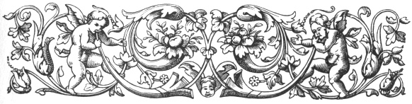
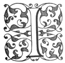
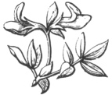

  
[Intangible Textual Heritage](../../index.md)  [Ancient Near
East](../index)  [Index](index)  [Previous](caog14)  [Next](caog16.md) 

------------------------------------------------------------------------

  
*The Chaldean Account of Genesis*, by George Smith, \[1876\], at
Intangible Textual Heritage

------------------------------------------------------------------------

p. 193

 

### CHAPTER XII.

### MEETING OF HEABANI AND IZDUBAR.

Dream of Izdubar.—Heabani.—His wisdom.—His solitary
life.—Izdubar's petition.—Zaidu.—Harimtu and Samhat.—Tempt
Heabani.—Might and fame of Izdubar.—Speech of Heabani.—His journey to
Erech.—The midannu or tiger.—Festival at Erech.—Dream of
Izdubar.—Friendship with Heabani.

|                    |
|--------------------|
|  |

IN this chapter I have included the fragments of what appear to be the
second and third tablets. In this section of the story Izdubar comes
prominently forward, and meets with Heabani. I have already noticed the
supposed parentage of Izdubar; the notice of his mother Dannat appears
in one of the tablets given in this chapter.

Izdubar, in the Babylonian and Assyrian sculptures, is always
represented with a marked physiognomy, and his peculiarities can be seen
by noticing the photograph from a Babylonian gem at the beginning of the
book, the engraving from an Assyrian sculpture

p. 194

in the last chapter, and the engraving in page
[239](caog17.htm#page_239.md) showing Izdubar and Heabani struggling with
wild animals. In all these cases, and in every other instance where
Izdubar is represented, he is indicated as a man with masses of curls
over his head and a large curly beard. So marked is this, and different
in cast to the usual Babylonian type, that I cannot help the impression
of its being a representation of a distinct and probably Ethiopian type.

The deity of Izdubar was Sarturda, from which I suppose he was a native
of the district of Amarda or Marad, where that god was worshipped. This
district was probably the Amordacia or Mardocæa of Ptolemy, but I do not
know where it was situated.

The fragments of the second and third tablets assume by their notices
that Izdubar was already known as a mighty hunter, and it appeared a
little later that he claimed descent from the old Babylonian kings,
calling Hasisadra his "father."

Tablet II.

I have recovered a single fragment, which I believe to belong to this
tablet; it is K 3389, and it contains part of the third and fourth
columns of writing. It appears from this that Izdubar was then at Erech,
and he had a curious dream. He thought he saw the stars of heaven fall
to the ground, and in their descent they struck upon his back. He then
saw standing over him a terrible being, the aspect of his face was
fierce, and he was armed with

p. 195

claws, like the claws of lions. The greater part of the description of
the dream is lost; it probably occupied columns I. and II. of the second
tablet. Thinking that the dream portended some fate to himself, Izdubar
calls on all the wise men to explain it, and offers a reward to any one
who can interpret the dream. Here the fragment Ii 3389 comes in:

Column III.

1\. . . . . ru kili I . . . .

2\. . . . . he and the princes may he . . .

3\. . . . . in the vicinity send him,

4\. . . . . may they ennoble his family,

5\. . . . . at the head of his feast may he set thee

6\. . . . . may he array thee in jewels and gold

7\. . . . . may he enclose thee

8\. . . . . in his . . . . seat thee

9\. into the houses of the gods may he cause thee to enter

10\. . . . . seven wives

11\. . . . . cause illness in his stomach

12\. . . . . went up alone

13\. . . . . his heaviness to his friend

14\. . . . . a dream I dreamed in my sleep

15\. . . . . the stars of heaven fell to the earth

16\. . . . . I stood still

17\. . . . . his face

18\. . . . . his face was terrible

19\. . . . . like the claws of a lion, were his claws

20\. . . . . the strength in me

p. 196

21\. . . . . he slew

22\. . . . . me

23\. . . . . over me

24\. . . . . corpse . . . .

The first part of this fragment appears to contain the honours offered
by Izdubar to any one who should interpret the dream. These included the
ennobling of his family, his recognition in assemblies, his being
invested with jewels of honour, and his wives being increased. A
description of the dream of the hero, much mutilated, follows. The
conduct of Nebuchadnezzar in the Book of Daniel, with reference to his
dreams, bears some resemblance to that of Izdubar.

After this fragment we have again a blank in the story, and it would
appear that in this interval application was made to a hermit named
Heabani that he would go to the city of Erech and interpret the dream of
Izdubar.

Heabani appears, from the representations on seals and other objects on
which he is figured, to have been a satyr or faun. He is always drawn
with the feet and tail of an ox, and with horns on his head. He is said
to have lived in a cave among the wild animals of the forest, and was
supposed to possess wonderful knowledge both of nature and human
affairs. Heabani was angry at the request that he should abandon his
solitary life for the friendship of Izdubar, and where our narrative
reopens the god Samas is persuading him to accept the offer.

p. 197

Column IV.

1\. . . . . me

2\. . . . . on my back

------------------------------------------------------------------------

3\. And Shamas opened his mouth

4\. and spake and from heaven said to him:

5\. . . . . and the female Samhat (delightful) thou shalt choose

6\. they shall array thee in trappings of divinity

7\. they shall give thee the insignia of royalty

8\. they shall make thee become great

9\. and Izdubar thou shalt call and incline him towards thee

10\. and Izdubar shall make friendship unto thee

11\. he shall cause thee to recline on a grand couch

12\. on a beautiful couch he shall seat thee

13\. he will cause thee to sit on a comfortable seat a seat on the left

14\. the kings of the earth shall kiss thy feet

15\. he shall enrich thee and the men of Erech he shall make silent
before thee

16\. and he after thee shall take all . . . .

17\. he shall clothe thy body in raiment and . . . .

------------------------------------------------------------------------

18\. Heabani heard the words of Shamas the warrior

19\. and the anger of his heart was appeased

20\. . . . . was appeased

Here we are still dealing with the honours which Izdubar promises to the
interpreter of his dream, and these seem to show that Izdubar had some
power

p. 198

at Erech at this time; he does not, however, appear to have been an
independent king, and it is probable that the next two columns of this
tablet, now lost, contain negotiations for bringing Heabani to Erech,
the subject being continued on the third tablet.

Tablet III.

This tablet is far better preserved than the two previous ones; it gives
the account of the successful mission to bring Heabani to Ur, opening
with a broken account of the wisdom of Heabani.

Column I.

1\. . . . . knows all things

2\. . . . . and difficult

3\. . . . . wisdom of all things

4\. . . . . the knowledge that is seen and that which is hidden

5\. . . . . bring word of peace to . . .

6\. from a far off road he will come and I rest and. . . .

7\. . . . . on tablets and all that rests . . .

8\. . . . . and tower of Erech Suburi

9\. . . . . beautiful

10\. . . . . which like . . . .

11\. . . . . I strove with him not to leave . . . .

12\. . . . . god? who from . . . .

13\. . . . . carry . . . .

14\. . . . . leave . . . .

(Many lines lost.)

p. 199

Column II.

1\. Izdubar did not leave . . . .

2\. Daughter of a warrior . . . .

3\. their might . . . .

4\. the gods of heaven, lord . . . .

5\. thou makest to be sons and family? . . . .

6\. there is not any other like thee . . . .

7\. in the depth made . . . .

8\. Izdubar did not leave, the son to his father day and night . . . .

9\. he the ruler also of Erech . . . .

10\. he their ruler and . . . .

11\. made firm? and wise . . . .

12\. Izdubar did not leave Dannat, the son to his mother . . . .

13\. Daughter of a warrior, wife of . . . .

14\. their might the god . . . . heard and . . . .

15\. Aruru strong and great, thou Aruru hast made . . . .

16\. again making his strength, one day his heart . . . . . .

17\. he changed and the city of Erech . . . . . .

18\. Aruru on hearing this, the strength of Anu made in the midst . . .
. . .

19\. Aruru put in her hands, she bowed her breast and lay on the ground

20\. . . . Heabani she made a warrior, begotten of the seed of the
soldier Ninip

21\. . . . . covered his body, retiring in companionship like a woman,

p. 200

22\. the features of his aspect were concealed like the corn god

23\. possessing knowledge of men and countries, in clothing clothed like
the god Ner

24\. with the gazelles he eat food in the night

25\. with the beasts of the field he consorted in the day

26\. with the creeping things of the waters his heart delighted

27\. Zaidu catcher of men

28\. in front of that field confronted him

29\. the first day the second day and the third in the front of that
field the same

30\. the courage of Zaidu dried up before him

31\. and he and his beast entered into his house and

32\. . . . . fear dried up and overcome

33\. . . . . his courage grew before him

34\. . . . . his face was terrible

------------------------------------------------------------------------

Column III.

1\. Zaidu opened his mouth and spake and said to . . . . .

2\. My father the first leader who shall go . . . . .

3\. in the land of . . . . .

4\. like the soldier of Anu . . . . .

5\. shall march over the country . . . . .

6\. and firmly with the beast . . . . .

7\. and firmly his feet in the front of the field . . .

8\. I feared and I did not approach it

p. 201

9\. he filled the cave which he had dug

10\. . . . . .

11\. I ascended on my hands to the . . . .

12\. I did not reach to the . . . . .

------------------------------------------------------------------------

13\. . . . . and said to Zaidu

14\. . . . . Erech, Izdubar

15\. . . . . ascend his field

16\. . . . . his might

17\. . . . . thy face

18\. . . . . the might of a man

19\. . . . .

20\. . . . . like a chief

21\. . . . . field

22 to 24 three lines of directions

25\. According to the advice of his father . . . .

26\. Zaidu went . . . .

27\. he took the road and in the midst of Erech he halted

28\. . . . . Izdubar . . . .

29\. the first leader who shall go . . . .

30\. in the land of . . . .

31\. like the soldier of Anu . . . .

32\. shall march over the country . . . .

33\. and firmly with the beast . . . .

34\. and firmly his feet . . . .

35\. I feared and I did not approach it

36\. he filled the cave which he had dug

37\. . . . . . .

38\. I ascended on my hands . . . . .

39\. I was not able to reach to the covert.

------------------------------------------------------------------------

p. 202

40\. Izdubar to him also said to Zaidu:

41\. go Zaidu and with thee the female Harimtu, and Samhat take,

42\. and when the beast . . . in front of the field

------------------------------------------------------------------------

43 to 45. directions to the female how to entice Heabani.

46\. Zaidu went and with him Harimtu, and Samhat he took, and

47\. they took the road, and went along the path.

48\. On the third day they reached the land where the flood happened.

49\. Zaidu and Harimtu in their places sat,

50\. the first day and the second day in front of the field they sat,

51\. the land where the beast drank of drink,

Column IV.

1\. the land where the creeping things of the water rejoiced his heart.

2\. And he Heabani had made for himself a mountain

3\. with the gazelles he eat food,

4\. with the beasts he drank of drink,

5\. with the creeping things of the waters his heart rejoiced.

6\. Samhat the enticer of men saw him

7 to 26. details of the actions of the female Sam-hat and Heabani.

------------------------------------------------------------------------

p. 203

27\. And Heabani approached Harimtu then, who before had not enticed
him.

28\. And he listened . . . . and was attentive,

29\. and he turned and sat at the feet of Harimtu.

30\. Harimtu bent down her face,

31\. and Harimtu spake; and his ears heard

32\. and to him also she said to Heabani:

33\. Famous Heabani like a god art thou,

34\. Why dost thou associate with the creeping things in the desert?

35\. I desire thy company to the midst of Erech Suburi,

36\. to the temple of Elli-tardusi the seat of Anu and Ishtar,

37\. the dwelling of Izdubar the mighty giant,

38\. who also like a bull towers over the chiefs.

39\. She spake to hint and before her speech,

40\. the wisdom of his heart flew away and disappeared.

41\. Heabani to her also said to Harimtu:

42\. I join to Samhat my companionship,

43\. to the temple of Elli-tardusi the seat of Anu and Ishtar,

44\. the dwelling of Izdubar the mighty giant,

45\. who also like a bull towers over the chiefs.

46\. I will meet him and see his power,

Column V.

1\. I will bring to the midst of Erech a tiger,

2\. and if he is able he will destroy it.

p. 204

3\. In the desert it is begotten, it has great strength,

4\. . . . . . . before thee

5\. . . . . everything there is I know

6\. Heabani went to the midst of Erech Suburi

7\. . . . . the chiefs . . . made submission

8\. in that day they made a festival

9\. . . . . city

10\. . . . . daughter

11\. . . . . made rejoicing

12\. . . . . becoming great

13\. . . . . mingled and

14\. . . . . Izdubar rejoicing the people

15\. went before him

16\. A prince thou becomest glory thou hast

17\. . . . . fills his body

18\. . . . . who day and night

19\. . . . . destroy thy terror

20\. . . . . the god Samas loves him and

21\. . . . . and Hea have given intelligence to his ears

22\. he has come from the mountain

23\. to the midst of Erech he will ponder thy dream

24\. Izdubar his dream revealed and said to his mother

25\. A dream I dreamed in my sleep

26\. . . . . the stars of heaven

97\. . . . . struck upon my back

28\. . . . . of heaven over me

29\. . . . . did not rise over it

p. 205

30\. . . . . stood over . . . . .

31\. . . . . him and

32\. . . . . over him

33\. . . . . his . . . .

34\. . . . . . .princess

35\. . . . . . . me

36\. . . . . I know

37\. . . . . to Izdubar

38\. . . . . of heaven

39\. . . . . over thy back

40\. . . . . over thee

41\. . . . . did not rise over it

42\. . . . . my . . . . .

43\. . . . . thee

There is one other mutilated fragment of this and the next column with
part of a relation respecting beasts and a fragment of a conversation
between Izdubar and his mother.

The whole of this tablet is curious, and it certainly gives the
successful issue of the attempt to bring Heabani to Erech, and in very
fragmentary condition the dream of the monarch.

I have omitted some of the details in columns III. and IV. because they
were on the one side obscure, and on the other hand appeared hardly
adapted for general reading.

It appears that the females Samhat and Harimtu prevailed upon Heabani to
come to Erech and see the exploits of the giant Izdubar, and he declared
that he would bring a *Midannu*, most probably a tiger, to

p. 206

\[paragraph continues\] Erech, in order to
make trial of the strength of Izdubar, and to see if he could destroy
it.

The Midannu is mentioned in the Assyrian texts as a fierce carnivorous
animal allied to the lion and leopard; it is called *Midannu*, Mindinu,
and Mandinu.

In the fifth column, after the description of the festivities which
followed the arrival of Heabani, there appears a break between lines 15
and 16, some part of the original story being probably omitted here. I
believe that the Assyrian copy is here defective, at least one line
being lost. The portion here omitted probably stated that the following
speech was made by the mother of Izdubar, who figures prominently in the
earlier part of these legends.

 

------------------------------------------------------------------------

[Next: Chapter XIII. Destruction of the Tyrant Humbaba](caog16.md)

