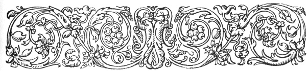
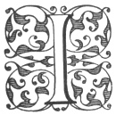

  
[Intangible Textual Heritage](../../index.md)  [Ancient Near
East](../index)  [Index](index)  [Previous](caog15)  [Next](caog17.md) 

------------------------------------------------------------------------

  
*The Chaldean Account of Genesis*, by George Smith, \[1876\], at
Intangible Textual Heritage

------------------------------------------------------------------------

p. 207

 

### CHAPTER XIII.

### DESTRUCTION OF THE TYRANT HUMBABA.

Elamite dominion.—Forest
region.—Humbaba.—Conversation.—Petition to Shamas.—Journey to
forest.—Dwelling of Humbaba.—Entrance to forest.—Meeting with
Humbaba.—Death of Humbaba.—Izdubar king.

|                    |
|--------------------|
|  |

I HAVE had considerable difficulty in writing this chapter; in fact I
have arranged the matter now three times, and such is the wretched
broken condition of the fragments that I am even now quite uncertain if
I have the correct order. The various detached fragments belong to the
fourth and fifth tablets in the series, and relate the contest between
Izdubar and Humbaba.

I have already stated my opinion that Humbaba was an Elamite, and that
he was the last of the dynasty which, according to Berosus, conquered
and held Babylonia for about two centuries, between B.C. 2450 and 2250.
Humbaba held his court in the midst of a region of *erini* trees, where
there were also trees of the specie called *Survan;* these two words are
very vaguely used in the inscriptions, and

p. 208

appear to refer rather to the quality and appearance of the trees than
to the exact species. *Erini* is used for a tall fine tree: it is used
for the pine, cedar, and ash. I have here translated the word "pine,"
and *survan* I have translated "cedar." In one inscription Lebanon is
said to be the country of *survan*, in allusion to its cedar trees.

This section of the Izdubar legends was undoubtedly of great importance,
for, although it was disfigured by the poetical adornments deemed
necessary to give interest to the narrative, yet of itself, as it
described the overthrow of a dynasty and the accession of Izdubar to the
throne, it has interest for us in spite of its mutilated condition. When
I published my "Assyrian Discoveries" none of these fragments were in
condition for publication, but I have since joined and restored some of
them, and the new fragments have given sufficient aid to enable me now
to present them in some sort, but it is quite possible that any further
accession of new fragments would alter the arrangement I have here
given.

I at first placed in this division a fragment of the story made up from
three parts of a tablet, and containing a discourse of Heabani to some
trees, but subsequent investigation has caused me to withdraw this
fragment and place it in the space of the eighth tablet.

In the case of the fourth tablet I think I have fragments of all six
columns, but some of these fragments are useless until we have further
fragments to complete them.

p. 209

Tablet IV.

Column I.

1\. . . . . mu . . . .

2\. . . . . thy. . . .

3\. . . . . me, return

4\. . . . . the birds shall rend him

5\. . . . . in thy presence

6\. . . . . of the forest of pine trees

7\. . . . . all the battle

8\. . . . . may the birds of prey surround him

9\. . . . . that, his carcass may they destroy

10\. . . . . to me and we will appoint thee king,

11\. . . . . thou shalt direct after the manner of a king

------------------------------------------------------------------------

12\. \[Izdubar\] opened his mouth and spake,

13\. and said to Heabani:

14\. . . . he goes to the great palace

15\. . . . . the breast of the great queen

16\. . . . . . knowledge, everything he knows

17\. . . . . . . establish to our feet

18\. . . . . . . . his hand

19\. . . . . . . . . I to the great palace

20\. . . . . . . . . . .the great queen

(Probably over twenty lines lost here.)

It was this fragment, which gives part of the conversation between
Heabani and Izdubar previous to the attack on Humbaba, which led me to
the opinion that Izdubar was not yet king of Babylonia, for

p. 210

\[paragraph continues\] Heabani promises
(lines 10 and 11) that they will make Izdubar king when they have slain
Humbaba and given his corpse to the vultures (lines 4, 8, and 9).

Column II.

1\. . . . . enter

2\. . . . . he raised

3\. . . . . the ornaments of her . . . .

4\. . . . . the ornaments of her breast

5\. . . . . and her crown I divided

6\. . . . . of the earth he opened

7\. he . . . he ascended to the city

8\. he went up to the presence of Shamas he made a sacrifice?

9\. he built an altar. In the presence of Shamas he lifted his hands:

10\. Why hast thou established Izdubar, in thy heart thou hast given him
protection,

11\. when the son . . . . and he goes

12\. on the remote path to Humbaba,

13\. A battle he knows not he will confront,

14\. an expedition he knows not he will ride to,

15\. for long he will go and will return,

16\. to take the course to the forest of pine trees,

17\. to Humbaba of \[whom his city may\] he destroy,

18\. and every one who is evil whom thou hatest . . .

19\. In the day of the year he will . . . .

20\. May she not return at all, may she not . . .

21\. him to fix . . . .

p. 211

(About ten lines lost here.)

Here we see that Izdubar, impressed with the magnitude of the task he
had undertaken, makes a prayer and sacrifice to Shamas to aid him in his
task. The next fragment appears also to belong to this column, and may
refer to preliminaries for sacrificing to Ishtar, with a view also to
gain her aid in the enterprise.

This fragment of Column II. reads

1\. . . . . neighbourhood of Erech . . . .

2\. . . . . strong and . . .

3\. he burst open the road . . . .

4\. and that city . . . .

5\. and the collection . . . .

6\. placed the people together . . . .

7\. the people were ended . . . .

8\. like of a king . . . .

9\. which for a long time had been made . . . .

10\. to the goddess Ishtar the bed . . . .

11\. to Izdubar like the god Sakim . . . .

12\. Heabani opened the great gate of the house of assembly . . . .

13\. for Izdubar to enter . . . .

14\. . . . . in the gate of the house . . . .

Column III.

1\. the corpse of . . . .

2\. to . . . .

3\. to the rising of . . .

p. 212

4\. the angels . . . .

5\. may she not return . . . .

6\. him to fix . . . .

7\. the expedition which he knows not . . .

8\. may he destroy also . . . .

9\. of which he knows . . . .

10\. the road . . . . .

Five more mutilated lines, the rest of the column being lost.

This fragment shows Izdubar still invoking the gods for his coming
expedition. Under the next column I have placed a fragment, the position
and meaning of which are quite unknown.

Column IV.—Uncertain Fragment.

1\. he was heavy . . .

2\. Heabani was . . . .

3\. Heabani strong not rising . . . .

4\. When . . . .

5\. with thy song? . . . .

6\. the sister of the gods faithful . . . .

7\. wandering he fixed to . . . .

8\. the sister of the gods lifted . . . .

9\. and the daughters of the gods grew . . . .

10\. I Heabani . . . . he lifted to . . . .

Somewhere here should be the story, now lost, of the starting of Izdubar
on his expedition accompanied by his friend Heabani. The sequel shows
they arrive at the palace or residence of Heabani, which is surrounded
by a forest of pine and cedar, the whole

p. 213

being enclosed by some barrier or wall, with a gate for entrance.
Heabani and Izdubar open this gate where the story reopens on the fifth
column.

Column V.

1\. the sharp weapon

2\. to make men fear him . . . .

3\. Humbaba poured a tempest out of his mouth . . . .

4\. he heard the gate of the forest \[open\]

5\. the sharp weapon to make men fear him \[he took\]

6\. and in the path of his forest he stood and \[waited\]

------------------------------------------------------------------------

7\. Izdubar to him also \[said to Heabani\]

Here we see Humbaba waiting for the intruders, but the rest of the
column is lost; it appears to have principally consisted of speeches by
Izdubar and Heabani on the magnificent trees they saw, and the work
before them. A single fragment of Column VI., containing fragments of
six lines, shows them still at the gate, and when the next tablet, No.
V., opens, they had not yet entered.

Tablet V.

The fifth tablet is more certain than the last; it appears to refer to
the conquest of Humbaba or Hubaba. I have only discovered fragments of
this tablet, which opens with a description of the retreat of Humbaba.

p. 214

Column I.

1\. He stood and surveyed the forest

2\. of pine trees, he perceived its height,

3\. of the forest he perceived its approach,

4\. in the place where Humbaba went his step was placed,

5\. on a straight road and a good path.

6\. He saw the land of the pine trees, the seat of the gods, the
sanctuary of the angels,

7\. in front? of the seed the pine tree carried its fruit,

8\. good was its shadow, full of pleasure,

9\. an excellent tree, the choice of the forest,

10\. . . . . the pine heaped . . . .

11\. . . . . for one kaspu (7 miles) . .

12\. . . . . cedar two-thirds of it . . .

13\. . . . . grown . .

14\. . . . . like it . . .

. . . . . . .

(About 10 lines lost here.)

25\. . . . . he looked . . . .

26\. . . . . he made and he . . . .

27\. . . . drove to . . . .

28\. . . . he opened and . . . .

------------------------------------------------------------------------

29\. Izdubar opened his mouth and spake, and said to \[Heabani\]:

30\. My friend . . . .

31\. . . . . with their slaughter . . . .

p. 215

32\. . . . . he did not speak before her, he made with him . . . .

33\. . . . . knowledge of war who made fighting,

34\. in entering to the house thou shalt not fear, . . . . .

35\. . . . . and like I take her also they . . . .

36\. to an end may they seat . . . .

37\. . . . . thy hand . . . .

38\. . . . . took my friend first . . . .

39\. . . . . his heart prepared for war, that year and day also

40\. . . . . on his falling appoint the people

41\. . . . . slay him, his corpse may the birds of prey surround

42\. . . . . . . of them he shall make

43\. . . . . going he took the weight

44\. they performed it, their will they established

------------------------------------------------------------------------

45\. . . . . they entered into the forest

Column II.

(Five lines mutilated.)

6\. they passed through the forest . . . .

------------------------------------------------------------------------

7\. Humbaba . . . .

8\. he did not come . . . .

9\. he did not . . . .

(Seven lines lost.)

17\. heavy . . . .

p. 216

18\. Heabani opened his mouth . . . .

19\. . . . . Humbaba in . . . .

20\. . . . one by one and . . . .

(Many other broken lines.)

There are a few fragments of Columns III., IV., and V. and a small
portion of Column VI. which reads:

1\. . . . . cedar to . . . .

2\. . . . . he placed and . . . .

3\. . . . . 120 . . . . Heabani . . . .

4\. . . . . the head of Humbaba . . . .

------------------------------------------------------------------------

5\. . . . . his weapon he sharpened . . . .

6\. . . . . tablet of the story of fate of . . . .

It appears from the various mutilated fragments of this tablet that
Izdubar and Heabani conquer and slay Humbaba and take his goods, but
much is wanted to connect the fragments.

The conclusion of this stage of the story and triumph of Izdubar are
given at the commencement of the sixth tablet. It appears, when the
matter is stripped of the marvellous incidents with which the poets have
surrounded it, that Izdubar and his friend went privately to the palace
of Humbaba, killed the monarch and carried off his regalia, the death of
the oppressor being the signal for the proclamation of Babylonian
freedom and the reign of Izdubar.

------------------------------------------------------------------------

[Next: Chapter XIV. The Adventures of Ishtar](caog17.md)

