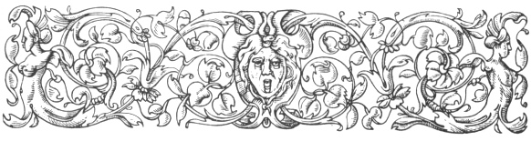
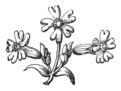

  
[Intangible Textual Heritage](../../index)  [Ancient Near
East](../index)  [Index](index)  [Previous](caog18)  [Next](caog20) 

------------------------------------------------------------------------

  
*The Chaldean Account of Genesis*, by George Smith, \[1876\], at
Intangible Textual Heritage

------------------------------------------------------------------------

p. 263

 

### CHAPTER XVI.

### THE STORY OF THE FLOOD AND CONCLUSION.

Eleventh tablet.—The gods.—Sin of the world.—Command
to build the ark.—Its contents.—The building.—The Flood.—Destruction of
people.—Fear of the gods.—End of Deluge.—Nizir.—Resting of ark.—The
birds.—The descent from the ark.—The sacrifice.—Speeches of
gods.—Translation of Hasisadra.—Cure of Izdubar.—His return.—Lament over
Heabani.—Resurrection of Heabani.—Burial of warrior.—Comparison with
Genesis.—Syrian nation.—Connection of legends.—Points of
contact.—Duration of deluge.—Mount of descent—Ten generations.—Early
cities.—Age of Izdubar.

|                    |
|--------------------|
|  |

THE eleventh tablet of the Izdubar series is the one which first
attracted attention, and certainly the most important on account of its
containing the story of the Flood. This tablet is the most perfect in
the series, scarcely any line being entirely lost.

Tablet XI.

Column I.

1\. Izdubar after this manner also said to Hasisadra afar off:

p. 264

2\. I consider the matter,

3\. why thou repeatest not to me from thee,

4\. and thou repeatest not to me from thee,

5\. thy ceasing my heart to make war

6\. presses? of thee, I come up after thee,

7\. . . . how thou hast done, and in the assembly of the gods alive thou
art placed.

------------------------------------------------------------------------

8\. Hasisadra after this manner also said to Izdubar:

9\. Be revealed to thee Izdubar the concealed story,

10\. and the judgment of the gods be related to thee,

11\. The city Surippak the city where thou standest not . . . . placed,

12\. that city is ancient . . . . the gods within it

13\. . . . . . . their servant, the great gods

14\. . . . . . . the god Anu,

15\. . . . . . . the god Bel,

16\. . . . . . . the god Ninip,

17\. and the god . . . . lord of Hades;

18\. their will he revealed in the midst . . . . and

19\. I his will was hearing and he spake to me:

20\. Surippakite son of Ubaratutu

21\. . . . . make a ship after this . . . .

22\. . . . . I destroy? the sinner and life . . . .

23\. . . . . cause to go in? the seed of life all of it to the midst of
the ship.

24\. The ship which thou shalt make,

25\. 600? cubits shall be the measure of its length, and

p. 265

26\. 60? cubits the amount of its breadth and its height.

27\. . . . into the deep launch it.

28\. I perceived and said to Hea my lord:

29\. The ship making which thou commandest me,

30\. when I shall have made,

31\. young and old will deride me.

32\. Hea opened his mouth and spake and said to me his servant:

33\. . . . . . . thou shalt say unto them,

34\. . . . . . he has turned from me and

35\. . . . . . . fixed over me

36\. . . . . like caves . . . .

37\. . . . above and below

38\. . . . closed the ship . . .

39\. . . . the flood which I will send to you,

40\. into it enter and the door of the ship turn.

41\. Into the midst of it thy grain, thy furniture, and thy goods,

42\. thy wealth, thy woman servants, thy female slaves, and the young
men,

43\. the beasts of the field, the animals of the field all, I will
gather and

44\. I will send to thee, and they shall be enclosed in thy door.

------------------------------------------------------------------------

45\. Adrahasis his mouth opened and spake, and

46\. said to Hea his lord:

47\. Any one the ship will not make . . .

48\. on the earth fixed . . . .

p. 266

49\. . . . . I may see also the ship . . . .

50\. . . . . on the ground the ship . . . .

51\. the ship making which thou commandest me . .

52\. which in . . . .

Column II.

1\. strong . . . .

2\. on the fifth day . . . . it

3\. in its circuit 14 measures . . . its frame.

4\. 14 measures it measured . . . over it.

5\. I placed its roof, it . . . . I enclosed it.

6\. I rode in it on the sixth time; I examined its exterior on the
seventh time;

7\. its interior I examined on the eighth time.

8\. Planks against the waters within it I placed.

9\. I saw rents and the wanting parts I added.

10\. 3 measures of bitumen I poured over the outside.

11\. 3 measures of bitumen I poured over the inside.

12\. 3 . . . men carrying its baskets, they constructed boxes

13\. I placed in the boxes the offering they sacrificed.

14\. Two measures of boxes I had distributed to the boatmen.

15\. To . . . . were sacrificed oxen

16\. . . . . . . . . dust and

17\. . . . . . . . . wine in receptacle of goats 18. I collected like
the waters of a river, also

p. 267

19\. food like the dust of the earth also

20\. I collected in boxes with my hand I placed.

21\. . . . . Shamas . . . . material of the ship completed.

22\. . . . . . . . . strong and

23\. the reed oars of the ship I caused to bring above and below.

24\. . . . . . . . . they went in two-thirds of it.

------------------------------------------------------------------------

25\. All I possessed the strength of it, all I possessed the strength of
it silver,

26\. all I possessed the strength of it gold,

27\. all I possessed the strength of it the seed of life, the whole

28\. I caused to go up into the ship; all my male servants and my female
servants,

29\. the beast of the field, the animal of the field, the sons of the
people all of' them, I caused to go up.

30\. A flood Shamas made and

31\. he spake saying in the night: I will cause it to rain heavily,

32\. enter to the midst of the ship and shut thy door.

33\. that flood happened, of which

34\. he spake saying in the night: I will cause it to rain (or it will
rain) from heaven heavily.

35\. In the day I celebrated his festival

36\. the day of watching fear I had.

37\. I entered to the midst of the ship and shut my door.

p. 268

38\. To close the ship to Buzur-sadirabi the boatman

39\. the palace I gave with its goods.

------------------------------------------------------------------------

40\. Ragmu-seri-ina-namari

41\. arose, from the horizon of heaven extending and wide.

42\. Vul in the midst of it thundered, and

43\. Nebo and Saru went in front,

44\. the throne bearers went over mountains and plains,

45\. the destroyer Nergal overturned,

46\. Ninip went in front and cast down,

47\. the spirits carried destruction,

48\. in their glory they swept the earth;

49\. of Vul the flood reached to heaven.

50\. The bright earth to a waste was turned,

Column III.

1\. the surface of the earth like . . . . it swept,

2\. it destroyed all life from the face of the earth. . . . .

3\. the strong deluge over the people, reached to heaven.

4\. Brother saw not his brother, they did not know the people. In heaven

5\. the gods feared the tempest and

6\. sought refuge; they ascended to the heaven of Anu.

7\. The gods like dogs fixed in droves prostrate.

p. 269

8\. Spake Ishtar like a child,

9\. uttered Rubat her speech:

10\. All to corruption are turned and

11\. then I in the presence of the gods prophesied evil.

12\. As I prophesied in the presence of the gods evil,

13\. to evil were devoted all my people and I prophesied

14\. thus: I have begotten my people and

15\. like the young of the fishes they fill the sea.

16\. The gods concerning the spirits were weeping with her,

17\. the gods in seats seated in lamentation,

18\. covered were their lips for the coming evil.

19\. Six days and nights

20\. passed, the wind, deluge, and storm, overwhelmed.

21\. On the seventh day in its course was calmed the storm, and all the
deluge

22\. which had destroyed like an earthquake,

23\. quieted. The sea he caused to dry, and the wind and deluge ended.

24\. I perceived the sea making a tossing;

25\. and the whole of mankind turned to corruption,

26\. like reeds the corpses floated.

27\. I opened the window, and the light broke over my face,

28\. it passed. I sat down and wept,

29\. over my face flowed my tears.

p. 270

30\. I perceived the shore at the boundary of the sea,

31\. for twelve measures the land rose.

32\. To the country of Nizir went the ship;

33\. the mountain of Nizir stopped the ship, and to pass over it it was
not able.

34\. The first day, and the second day, the mountain of Nizir the same.

35\. The third day, and the fourth day, the mountain of Nizir the same.

36\. The fifth, and sixth, the mountain of Nizir the same.

37\. On the seventh day in the course of it

------------------------------------------------------------------------

38\. I sent forth a dove and it left. The dove went and turned, and

39\. a resting-place it did not find, and it returned.

40\. I sent forth a swallow and it left. The swallow went and turned,
and

41\. a resting-place it did not find, and it returned.

42\. I sent forth a raven and it left.

43\. The raven went, and the decrease of the water it saw, and

44\. it did eat, it swam, and wandered away, and did not return.

45\. I sent the animals forth to the four winds, I poured out a
libation,

46\. I built an altar on the peak of the mountain,

47\. by sevens herbs I cut,

p. 271

48\. at the bottom of them I placed reeds, pines, and simgar.

49\. The gods collected at its savour, the gods collected at its good
savour;

50\. the gods like flies over the sacrifice gathered.

51\. From of old also Rubat in her course

52\. The great brightness of Anu had created. When the glory

53\. of those gods on the charm round my neck I would not leave;

Column IV.

1\. in those days I desired that for ever I might not leave them.

2\. May the gods come to my altar,

3\. may Elu not come to my altar,

4\. for he did not consider and had made a deluge,

5\. and my people he had consigned to the deep.

6\. From of old also Elu in his course

7\. saw the ship, and went Elu with anger filled to the gods and
spirits:

8\. Let not any one come out alive, let not a man be saved from the
deep,

9\. Ninip his mouth opened, and spake and said to the warrior Elu

10\. Who then will ask Hea, the matter he has done?

11\. and Hea knew all things.

12\. Hea his mouth opened and spake, and said to the warrior Bel:

13\. "Thou prince of the gods warrior,

p. 272

14\. when thou art angry a deluge thou makest;

15\. the doer of sin did his sin, the doer of evil did his evil.

16\. the just prince let him not be cut off, the faithful let him not be
destroyed.

17\. Instead of thee making a deluge, may lions increase and men be
reduced;

18\. instead of thee making a deluge, may leopards increase and men be
reduced;

19\. instead of thee making a deluge, may a famine happen and the
country be destroyed;

20\. instead of thee making a deluge, may pestilence increase and men be
destroyed."

21\. I did not peer into the judgment of the gods.

22\. Adrahasis a dream they sent, and the judgment of the gods he heard.

23\. When his judgment was accomplished, Bel went up to the midst of the
ship.

24\. He took my hand and raised me up,

25\. he caused to raise and to bring my wife to my side;

26\. he made a bond, he established in a covenant, and gave this
blessing,

27\. in the presence of Hasisadra and the people thus:

28\. When Hasisadra, and his wife, and the people, to be like the gods
are carried away;

29\. then shall dwell Hasisadra in a remote place at the mouth of the
rivers.

30\. They took me, and in a remote place at the mouth of the rivers they
seated me.

p. 273

31\. When to thee whom the gods have chosen also,

32\. for the health which thou seekest and askest,

33\. this be done six days and seven nights,

34\. like sitting on the edge of his seat,

35\. the way like a storm shall be laid upon him.

36\. Hasisadra to her also said to his wife

37\. I announce that the chief who grasps at health

38\. the way like a storm shall be laid upon him.

39\. His wife to him also said to Hasisadra afar off:

40\. clothe him, and let the man be sent away;

41\. the road that he came may he return in peace,

42\. the great gate open and may he return to his country.

43\. Hasisadra to her also said to his wife:

44\. The cry of a man alarms thee,

45\. this do his *kurummat* place on his head.

46\. And the day when he ascended the side of the ship,

47\. she did, his *kurummat* she placed on his head.

48\. And the day when he ascended the side of the ship,

49\. first the *sabusat* of his *kurummat*,

50\. second the *mussukat*, third the *radbat*, fourth she opened his
*zikaman*,

51\. fifth the cloak she placed, sixth the *bassat*,

Column V.

1\. seventh in a mantle she clothed him and let the man go free.

------------------------------------------------------------------------

p. 274

2\. Izdubar to him also said to Hasisadra afar off:

3\. In this way thou vast compassionate over me,

4\. joyfully thou hast made me, and thou hast restored me.

5\. Hasisadra to him also said to Izdubar.

6\. . . . . . . thy *kurummit*,

7\. . . . . . . separated thee,

8\. . . . . . . thy *kurummat*,

9\. second the *mussukat*, third the *radbat*,

10\. fourth she opened the *zikaman*,

11\. fifth the cloak she placed, sixth the *bassat*,

12\. seventh in a cloak I have clothed thee and let thee go free.

13\. Izdubar to him also said to Hasisadra afar off:

14\. . . . . . . Hasisadra to thee may we not come,

15\. . . . . . . collected

16\. . . . . . . dwelling in death,

17\. . . . . . . his back? dies also.

------------------------------------------------------------------------

18\. Hasisadra to him also said to Urhamsi the boatman:

19\. Urhamsi . . . . . . to thee we cross to preserve thee.

20\. Who is beside the . . . . . . of support;

21\. the man whom thou comest before, disease has filled his body;

22\. illness has destroyed the strength of his limbs.

p. 275

23\. carry him Urhamsi, to cleanse take him,

24\. his disease in the water to beauty may it turn,

25\. may he cast off his illness, and the sea carry it away, may health
cover his skin,

26\. may it restore the hair of his head,

27\. hanging to cover the cloak of his body.

28\. That he may go to his country, that he may take his road,

29\. the hanging cloak may he not cast off, but alone may he leave.

30\. Urhamsi carried him, to cleanse he took him,

31\. his disease in the water to beauty turned,

32\. he cast off his illness, and the sea carried it away, and health
covered his skin,

33\. he restored the hair of his head, hanging down to cover the cloak
of his body.

34\. That he might go to his country, that he might take his road,

35\. the hanging cloak he did not cast off, but alone he left.

36\. Izdubar and Urhamsi rode in the ship,

37\. where they placed them they rode.

------------------------------------------------------------------------

38\. His wife to him also said to Hasisadra afar off:

39\. Izdubar goes away, he is satisfied, he performs

40\. that which thou hast given him, and returns to his country.

p. 276

41\. And he carried the spear? of Izdubar,

42\. and the ship touched the shore.

43\. Hasisadra to him also said to Izdubar:

44\. Izdubar thou goest away, thou art satisfied, thou performest

45\. that which I have given thee, and thou re-turnest to thy country.

46\. Be revealed to thee Izdubar the concealed story;

47\. and the judgment of the gods be related to thee.

48\. This account like bitumen . . . .

49\. its renown like the Amurdin tree . . . .

50\. when the account a hand shall take . . . .

51\. Izdubar, this in his hearing heard, and . . . .

52\. he collected great stones . . . .

Column VI.

1\. they dragged it and to . . . .

2\. he carried the account . . . .

3\. piled up the great stones . . . .

4\. to his mule . . . .

------------------------------------------------------------------------

5\. Izdubar to him also said

6\. to Urhamsi: this account . . . .

7\. If a man in his heart take . . . .

8\. may they bring him to Erech Suburi 9 speech . . . .

10\. I will give an account and turn to. . . .

p. 277

11\. For 10 kaspu (70 miles) they journeyed the stage, for 20 kapsu (140
miles) they journeyed the stage

12\. and Izdubar saw the hole . . .

13\. they returned to the midst of Erech Suburi.

14\. noble of men . . . .

15\. in his return . . . .

16\. Izdubar approached . . . .

17\. and over his face coursed his tears, and he said to Urhamsi:

18\. At my misfortune Urhamsi in my turning,

19\. at my misfortune is my heart troubled.

20\. I have not done good to my own self;

21\. and the lion of the earth does good.

22\. Then for 20 kaspu (140 miles) . . . .

23\. . . . . then I opened . . . . the instrument

24\. the sea not to its wall then could I get,

25\. And they left the ship by the shore, 20 kaspu (140 miles) they
journeyed the stage.

26\. For 30 kaspu (210 miles) they made the ascent, they came to the
midst of Erech Suburi.

------------------------------------------------------------------------

27\. Izdubar to her also said to Urhamsi the boatman:

28\. Ascend Urhamsi over where the wall of Erech will go;

29\. the cylinders are scattered, the bricks of its casing are not made,

30\. and its foundation is not laid to thy height;

p. 278

31\. 1 measure the circuit of the city, 1 measure of plantations, 1
measure the boundary of the temple of Nantur the house of Ishtar,

32\. 3 measures together the divisions of Erech . . .

------------------------------------------------------------------------

The opening line of the next tablet is preserved, it reads: "Tammabukku
in the house of the . . . . was left." After this the story is again
lost for several lines, and where it reappears Izdubar is mourning for
Heabani. In my first account in "Assyrian Discoveries" there are several
errors which were unavoidable from the state of the twelfth tablet.

I am now able to correct some of these, and find the words tambukku and
mikke do not refer to the author or manner of the death of Heabani, who
most probably died in attempting to imitate the feat of Izdubar when he
destroyed the lion.

The fragments of this tablet are:—

Column I.

1\. Tammabukku in the house of the . . . . was left

(Several lines lost.)

1\. Izdubar . . . .

2\. When to . . . .

3\. to happiness thou . . . .

4\. a cloak shining . .

5\. like a misfortune also . . . .

6\. The noble banquet thou dost not share,

7\. to the assembly they do not call thee:

p. 279

8\. The bow from the ground thou dost not lift,

9\. what the bow has struck escapes thee:

10\. The mace in thy hand thou dost not grasp,

11\. the spoil defies thee:

12\. Shoes on thy feet thou dost not wear,

13\. the slain on the ground thou dost not stretch.

14\. Thy wife whom thou lovest thou dost not kiss,

15\. thy wife whom thou hatest thou dost not strike;

16\. Thy child whom thou lovest thou dost not kiss,

17\. thy child whom thou hatest thou dost not strike;

18\. The arms of the earth have taken thee.

19\. O darkness, O darkness, mother Ninazu, O darkness.

20\. Her noble stature as his mantle covers him

21\. her feet like a deep well enclose him.

This is the bottom of the first column. The next column has lost all the
upper part, it appears to have contained the remainder of this lament,
an appeal to one of the gods on behalf of Heabani, and a repetition of
the lamentation, the third person being used instead of the second. The
fragments commence at the middle of this:

1\. his wife whom he hated he struck,

2\. his child whom he loved he kissed;

3\. his child whom he hated he struck,

4\. the might of the earth has taken him.

5\. O darkness, O darkness, mother Ninazu, O darkness

6\. Her noble stature as his mantle covers him,

7\. her feet like a deep well enclose him.

p. 280

8\. Then Heabani from the earth

9\. Simtar did not take him, Asakku did not take him, the earth took
him.

10\. The resting place of Nergal the unconquered did not take him, the
earth took him.

11\. In the place of the battle of heroes they did not strike him, the
earth took him.

12\. Then . . . . ni son of Ninsun for his servant Heabani wept;

13\. to the house of Bel alone he went.

14\. "Father Bel, a sting to the earth has struck me,

15\. a deadly wound to the earth has struck me,

Column III.

1\. Heabani who to fly . . . .

2\. Simtar did not take him . . . .

3\. the resting place of Nergal the unconquered did not take him . . .

4\. In the place of the battle of heroes they did not . . . .

5\. Father Bel the matter do not despise . . . .

6\. Father Sin, a sting . . . .

7\. a deadly wound . . . .

8\. Heabani who to fly . . . .

9\. Simtar did not take him . . . .

10\. the resting-place of Nergal . . . .

(About 12 lines lost, containing repetition of this passage.)

23\. Simtar . . . .

p. 281

24\. the resting place of Nergal the unconquered

25\. in the place of the battle of heroes they did not . . . .

26\. Father Hea . . .

27\. To the noble warrior Merodach . . . .

28\. Noble warrior Merodach . . . .

29\. the divider . . . .

30\. the spirit . . . .

31\. To his father . . . .

32\. the noble warrior Merodach son of Hea

33\. the divider the earth opened, and

34\. the spirit (or ghost) of Heabani like glass (or transparent) from
the earth arose:

35\. . . . . . and thou explainest,

36\. he pondered and repeated this:

Column IV.

1\. Terrible my friend, terrible my friend,

2\. may the earth cover what thou hast seen, terrible,

3\. I will not tell my friend, I will not tell,

4\. When the earth covers what I have seen I will tell thee.

5\. . . . . . thou sittest weeping

6\. . . . . . may you sit may you weep

7\. . . . . . in youth also thy heart rejoice

8\. . . . . . become old, the worm entering

9\. . . . . . in youth also thy heart rejoice

10 full of dust

p. 282

11\. . . . . . . he passed over

12\. . . . . I see

Here there is a serious blank in the inscription, about twenty lines
being lost, and I conjecturally insert a fragment which appears to
belong to this part of the narrative. It is very curious from the
geographical names it contains.

1\. . . . . I poured out . . . .

2\. . . . . which thou trusted . . . .

3\. . . . . city of Babylon *ri* . . . .

4\. . . . . which he was blessed . . . .

5\. . . . . may he mourn for my fault . . . .

6\. . . . . may he mourn for him and for . . . .

7\. . . . . Kisu and Harriskalama, may he mourn

8\. . . . . his . . . . Cutha . . . .

9\. . . . . Eridu? and Nipur . . . .

The rest of Column IV. is lost, and of the next column there are only
remains of the two first lines.

Column V.

1\. like a good prince who . . . .

2\. like . . . .

Here there are about thirty lines missing, the story recommencing with
Column VI., which is perfect.

Column VI.

1\. On a couch reclining and

2\. pure water drinking.

3\. He who in battle is slain, thou seest and I see;

p. 283

4\. His father and his mother carry his head,

5\. and his wife over him weeps;

6\. His friends on the ground are standing,

7\. thou seest and I see.

8\. His spoil on the ground is uncovered,

9\. of the spoil account is not taken,

10\. thou seest and I see.

11\. The captives conquered come after; the food

12\. which in the tents is placed is eaten.

------------------------------------------------------------------------

13\. The twelfth tablet of the legends of Izdubar.

14\. Like the ancient copy written and made clear. This passage closes
this great national work, which even in its present mutilated form is of
the greatest

  [  
Click to enlarge](img/28300.jpg)  
HASISADRA OR NOAH AND IZDUBAR; FROM AN EARLY BABYLONIAN CYLINDER.  

importance in relation to the civilization, manners, and customs of this
ancient people. The main feature in this part of the Izdubar legends is
the description of the Flood in the eleventh tablet, which evidently
refers to the same event as the Flood of Noah in Genesis.

In my two papers in "The Transactions of the Biblical Archæological
Society," vol. ii. and vol. iii.

p. 284

\[paragraph continues\] I have given some
comparisons with the Biblical account and that of Berosus, and I have
made similar comparisons in my work, "Assyrian Discoveries; " but I have
myself to acknowledge that these comparisons are to a great extent
superficial, a thorough comparison of the Biblical and Babylonian
accounts of the Flood being only possible in conjunction with a critical
examination both of the Chaldean and Biblical texts. Biblical criticism
is, however, a subject on which I am not competent to pronounce an
independent opinion, and the views of Biblical scholars on the matter
are so widely at variance, and some of them so unmistakably coloured by
prejudice, that I feel I could not take up any of the prevailing views
without being a party to the controversy.

There is only one point which I think should not be avoided in this
matter: it is the view of a large section of scholars that the Book of
Genesis contains, in some form, matter taken from two principal
independent sources; one is termed the Jehovistic narrative, the other
the Elohistic. The authorship and dates of the original documents and
the manner, date, and extent of their combination, are points which I
shall not require to notice, and I must confess I do not think we are at
present in a position to form a judgment upon them. I think all will
admit a connection of some sort between the Biblical narrative and those
of Berosus and the cuneiform texts, but between Chaldea and Palestine
was a wide extent of country inhabited by different nations,

p. 285

whose territories formed a connecting link between these two extremes.
The Aramean and Hittite races who once inhabited the region along the
Euphrates and in Syria have passed away, their history has been lost,
and their mythology and traditions are unknown; until future researches
on the sites of their cities shall reveal the position in which their
traditions stood towards those of Babylonia and Palestine, we shall not
be able to clear up the connection between the two.

There are some differences between the accounts in Genesis and the
Inscriptions, but when we consider the differences between the two
countries of Palestine and Babylonia these variations do not appear
greater than we should expect. Chaldea was essentially a mercantile and
maritime country, well watered and fiat, while Palestine was a hilly
region with no great rivers, and the Jews were shut out from the coast,
the maritime regions being mostly in the hands of the Philistines and
Phoenicians. There was a total difference between the religious ideas of
the two peoples, the Jews believing in one God, the creator and lord of
the Universe, while the Babylonians worshipped gods and lords many,
every city having its local deity, and these being joined by complicated
relations in a poetical mythology, which was in marked contrast to the
severe simplicity of the Jewish system. With such differences it was
only natural that, in relating the same stories, each nation should
colour them in accordance with its own ideas, and

p. 286

stress would naturally in each case be laid upon points with which they
were familiar. Thus we should expect beforehand that there would be
differences in the narrative such as we actually find, and we may also
notice that the cuneiform account does not always coincide even with the
account of the same events given by Berosus from Chaldean sources.

The great value of the inscriptions describing the Flood consists in the
fact that they form an independent testimony in favour of the Biblical
narrative at a much earlier date than any other evidence. The principal
points in the two narratives compared in their order will serve to show
the correspondences and differences between the two.

|      |                                        |                                           |                                           |
|------|----------------------------------------|-------------------------------------------|-------------------------------------------|
|      |                                        | Bible—Genesis. | Deluge tablet. |
| 1\.  | Command to build the                   | Chap. vi.                                 | Col. I.                                   |
|      | ark                                    | v\. 14                                    | l\. 21                                    |
| 2\.  | Sin of the world                       | v\. 5                                     | l\. 22                                    |
| 3\.  | Threat to destroy it                   | v\. 7                                     | l\. 22                                    |
| 4\.  | Seed of life to be saved               | v\. 19                                    | l\. 23                                    |
| 5\.  | Size of the ark                        | v\. 15                                    | l\. 25, 26                                |
| 6\.  | Animals to go in ark                   | v\. 20                                    | l\. 43                                    |
|      |                                        |                                           | Col. II.                                  |
| 7\.  | Building of ark                        | v\. 22                                    | l\. 1–9                                   |
| 8\.  | Coated within and without with bitumen | v\. 14                                    | l\. 10, 11                                |
| 9\.  | Food taken in the ark                  | v\. 21                                    | l\. 19                                    |
|      |                                        | Chap. vii.                                |                                           |
| 10\. | Coming of flood                        | v\. 11                                    | l\. 40                                    |
|      | p. 287      |                                           |                                           |
|      |                                        | Bible—Genesis. | Deluge tablet. |
|      |                                        | Chap. vii.                                | Col. III.                                 |
| 11\. | Destruction of people                  | v\. 21                                    | l\. 1–15                                  |
| 12\. | Duration of deluge                     | v.12, 17, 24,&c.                          | l\. 19–21                                 |
|      |                                        | Chap. viii.                               |                                           |
| 13\. | End of deluge                          | v\. 13                                    | l\. 21–26                                 |
| 14\. | Opening of window                      | v\. 6                                     | l\. 27                                    |
| 15\. | Ark rests on a mountain                | v\. 4                                     | l\. 33                                    |
| 16\. | Sending forth of the birds             | v\. 7–12                                  | l\. 384–4                                 |
| 17\. | Leaving the ark                        | v\. 18, 19                                | l\. 45                                    |
| 18\. | Building the altar                     | v\. 20                                    | l\. 46                                    |
| 19\. | The sacrifice                          | v\. 20                                    | l\. 47, 48                                |
| 20\. | The savour of the offering             | v\. 21                                    | l\. 49                                    |
| 21\. | A deluge not to happen again           | Chap. ix.                                 | Col. IV.                                  |
|      |                                        | v\. 11                                    | l\. 17–20                                 |
| 22\. | Covenant and blessing                  | v\. 9                                     | l\. 26                                    |
| 23\. | Translation of the patriarch           | Chap. v.                                  |                                           |
|      | (in Genesis of Enoch)                  | v\. 24                                    | l\. 28                                    |

There is no unexpected or material difference in the first four of these
points, but with reference to the size of the ark there is certainly a
discrepancy, for although the Chaldean measures are effaced it is
evident that in the inscription the breadth and height of the vessel are
stated to be the same, while these are given in Genesis as fifty cubits
and thirty cubits respectively.

With regard to those who were saved in the ark there is again a clear
difference between the two

p. 288

accounts, the Bible stating that only eight persons, all of the family
of Noah, were saved, while the inscription includes his servants,
friends, and boatmen or pilots; but certainly the most remarkable
difference between the two is with respect to the duration of the
deluge. On this point the inscription gives seven days for the flood,
and seven days for the resting of the ark on the mountain, while the
Bible gives the commencement of the flood on the 17th day of the second
month and its termination on the 27th day of the second month in the
following year, making a total duration of one year and ten days. Here
it may be remarked, that those scholars who believe in two distinct
documents being included in Genesis, hold that in the Jehovistic
narrative the statement is that the flood lasted forty days, which is
certainly nearer to the time specified in the cuneiform text. Forty is,
however, often an ambiguous word, meaning "many," and not necessarily
fixing exactly the number. There is again a difference as to the
mountain on which the ark rested; Nizir, the place mentioned in the
cuneiform text, being east of Assyria, probably between latitudes 35°
and 36° (see "Assyrian Discoveries," pp. 216, 217), while Ararat, the
mountain mentioned in the Bible, was north of Assyria, near Lake Van. It
is evident that different traditions have placed the mountain of the ark
in totally different positions, and there is not positive proof as to
which is the earlier traditionary spot. The word Ararat is derived from
an old Babylonian word *Urdu*, meaning "highland," and might be a

p. 289

general term for any hilly country, and I think it quite possible that
when Genesis was written the land of Armenia was not intended by this
term. My own view is that the more southern part of the mountains east
of Assyria was the region of the original tradition, and that the other
sites are subsequent identifications due to changes in geographical
names and other causes.

In the account of sending forth the birds there is a difference in
detail between the Bible and the Inscriptions which cannot be explained
away; this and other similar differences will serve to show that neither
of the two documents is copied directly from the other.

Some of the other differences are evidently due to the opposite
religious systems of the two countries, but there is again a curious
point in connection with the close of the Chaldean legend, this is the
translation of the hero of the Flood.

In the Book of Genesis it is not Noah but the seventh patriarch Enoch
who is translated, three generations before the Flood.

There appears to have been some connection or confusion between Enoch
and Noah in ancient tradition; both are holy men, and Enoch is said,
like Noah, to have predicted the Flood.

It is a curious fact that the dynasty of gods, with which Egyptian
mythical history commences, shows some similar points.

This dynasty has sometimes seven, sometimes ten

p. 290

reigns, and in the Turin Papyrus of kings, which gives ten reigns, there
is the same name for the seventh and tenth reign, both being called
Horus, and the seventh reign is stated at 300 years, which is the length
of life of the seventh patriarch Enoch after the birth of his son.

I here show the three lists, the Egyptian gods, the Jewish patriarchs,
and Chaldean kings.

|                                   |                                        |                                            |
|-----------------------------------|----------------------------------------|--------------------------------------------|
| Egypt. | Patriarchs. | Chaldean Kings. |
| Ptah.                             | Adam.                                  | Alorus.                                    |
| Ra.                               | Seth.                                  | Alaparus.                                  |
| Su.                               | Enos.                                  | Almelon.                                   |
| Seb.                              | Cainan.                                | Ammenon.                                   |
| Hosiri.                           | Mahalaleel                             | Amegalarus.                                |
| Set.                              | Jared.                                 | Daonus.                                    |
| Hor.                              | Enoch.                                 | Ædorachus.                                 |
| Tut                               | Methusaleh.                            | Amempsin.                                  |
| Ma.                               | Lamech.                                | Otiartes.                                  |
| Hor.                              | Noah.                                  | Xisuthrus.                                 |

I think it cannot be accidental that in each case we have ten names, but
on the other hand there is no resemblance between the names, which
appear to be independent in origin. What connection there may be between
the three lists we have at present no means of knowing. It is probable
that the literature of the old Syrian peoples, if it should ever be
recovered, may help us to the discovery of the connection between these
various accounts.

The seal which I have figured, [p. 106](caog09.htm#page_106), belonged
to

p. 291

a Syrian chief in the ninth century B.C., and the devices upon it, the
sacred tree, and composite beings, show similar stories and ideas to
have prevailed there to those in Babylonia.

One question which will be asked, and asked in vain is: "Did either of
the two races, Jews or Babylonians, borrow from the other the traditions
of these early times, and if so, when?"

There is one point in connection with this question worth noticing:
these traditions are not fixed to any localities near Palestine, but
are, even on the showing of the Jews themselves, fixed to the
neighbourhood of the Euphrates valley, and Babylonia in particular; this
of course is clearly stated in the Babylonian inscriptions and
traditions.

Eden, according even to the Jews, was by the Euphrates and Tigris; the
cities of Babylon, Larancha, and Sippara were supposed to have been
founded before the Flood. Surippak was the city of the ark, the
mountains east of the Tigris were the resting-place of the ark, Babylon
was the site of the tower, and Ur of the Chaldees the birthplace of
Abraham. These facts and the further statement that Abraham, the father
and first leader of the Hebrew race, migrated from Ur to Harran in
Syria, and from there to Palestine, are all so much evidence in favour
of the hypothesis that Chaldea was the original home of these stories,
and that the Jews received them originally from the Babylonians; but on
the other hand there are such striking differences

p. 292

in some parts of the legends, particularly in the names of the
patriarchs before the Flood, that it is evident further information is
required before attempting to decide, the question. Passing to the next,
the twelfth and last tablet, the picture there given, the lament for
Heabani, and the curious story of his ghost rising from the ground at
the bidding of Merodach, serve to make this as important in relation to
the Babylonian religion as the eleventh tablet was to the book of
Genesis.

Asakku is the spirit of one of the diseases, and Simtar is the attendant
of the goddess of Hades; the trouble appears to be that Simtar and
Asakku would not receive the soul of Heabani, while he was equally
repudiated by Nergal and shut out from the region appointed for warlike
heroes. The soul of Heabani was confined to the earth, and, not resting
there, intercession was made to transfer him to the region of the
blessed. I at one time added to this tablet a fragment which then
appeared to belong and which I interpreted to refer to Heabani's
dwelling in hell and taking his way from there to heaven. The discovery
of a new fragment has forced me to alter both the translation and
position of this notice, which I now place in the seventh tablet. This
considerably weakens my argument that the Babylonians had two separate
regions for a future state, one of bliss, the other of joy.

Under the fourth column I have provisionally placed a curious fragment
where Izdubar appears

p. 293

to call on his cities to mourn with him for his friend. This tablet is
remarkable for the number of cities mentioned as already existing in the
time of Izdubar. Combining this notice with other parts of the legends,
the statements of Berosus and the notice of the cities of Nimrod in
Genesis, we get the following list of the oldest known cities in the
Euphrates valley.

|               |                    |
|---------------|--------------------|
| 1\. Babylon.  | 11\. Sippara.      |
| 2\. Borsippa. | 12\. Kisu.         |
| 3\. Cutha.    | 13\. Harriskalama. |
| 4\. Larancha. | 14\. Ganganna.     |
| 5\. Surippak. | 15\. Amarda.       |
| 6\. Eridu.    | 16\. Assur.        |
| 7\. Nipur.    | 17\. Nineveh.      |
| 8\. Erech.    | 18\. Rehobothair.  |
| 9\. Akkad.    | 19\. Resen.        |
| 10\. Calneh.  | 20\. Calah.        |

So far as the various statements go, all these cities and probably many
others were in existence in the time of Nimrod, and some of them even
before the Flood; the fact, that the Babylonians four thousand years ago
believed their cities to be of such antiquity, shows that they were not
recent foundations, and their attainments at that time in the arts and
sciences proves that their civilization had already known ages of
progress. The epoch of Izdubar must be considered at present as the
commencement of the united monarchy in Babylonia, and as marking the
first of the series of great conquests in Western Asia, but how far back
we have to go from our

p. 294

earliest known monuments to reach his era we cannot now tell.

It is probable that after the death of Izdubar the empire he had founded
fell to pieces, and was only partially restored when Urukh, king of Ur,
extended his power over the country and founded the Chaldean or Southern
Sumerian dynasty.

Every nation has its hero, and it was only natural on the revival of his
empire that the Babylonians should consecrate the memory of the king,
who had first aimed to give them that unity without which they were
powerless as a nation.

 

------------------------------------------------------------------------

[Next: Chapter XVII. Conclusion](caog20)

