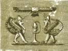

  
[Intangible Textual Heritage](../../index.md)  [Ancient Near
East](../index)  [Index](index)  [Previous](caog20.md) 

------------------------------------------------------------------------

  
*The Chaldean Account of Genesis*, by George Smith, \[1876\], at
Intangible Textual Heritage

------------------------------------------------------------------------

p. 315

 

### INDEX.

|                    |
|--------------------|
|  |

ABRAM, [296](caog20.htm#page_296.md).

Abydenus, [45](caog06.htm#page_45), [46](caog06.htm#page_46.md).

Accad or Akkad, [25](caog05.htm#page_25), [293](caog19.htm#page_293.md).

Adrahasis, [265](caog19.htm#page_265), [272](caog19.htm#page_272.md).

Age of documents, [23](caog05.htm#page_23.md).

Alaparus, [46](caog06.htm#page_46.md).

Alexander Polyhistor, [38](caog06.htm#page_38.md),
[49](caog06.htm#page_49.md).

Alexander the Great, [1](caog04.htm#page_1.md).

Alorus, [45](caog06.htm#page_45), [46](caog06.htm#page_46.md).

Amarda, [293](caog19.htm#page_293.md).

Amempsin, [46](caog06.htm#page_46.md).

Amillarus, [46](caog06.htm#page_46.md).

Ammenon, [46](caog06.htm#page_46.md).

Anatu, [55](caog07.htm#page_55.md).

Anementus, [47](caog06.htm#page_47.md).

Animals, creation of, [76](caog08.htm#page_76.md).

Antiquity of legends, [28](caog05.htm#page_28.md).

Anu, [53](caog07.htm#page_53), [54](caog07.htm#page_54.md),
[109](caog09.htm#page_109), [116](caog10.htm#page_116.md).

Anus, [50](caog06.htm#page_50.md).

Apason, [49](caog06.htm#page_49.md).

Apollodorus, [45](caog06.htm#page_45.md).

Ardates, [42](caog06.htm#page_42.md).

Ark, [48](caog06.htm#page_48), [261](caog18.htm#page_261.md),
[265](caog19.htm#page_265.md).

Armenia, [47](caog06.htm#page_47.md).

Arnold, Mr. E., [6](caog04.htm#page_6.md).

Arrangement of tablets, [20](caog05.htm#page_20.md),
[21](caog05.htm#page_21.md).

Assorus, [50](caog06.htm#page_50.md).

Assur, [31](caog05.htm#page_31), [293](caog19.htm#page_293.md).

Assurbanipal, [6](caog04.htm#page_6), [33](caog05.htm#page_33.md).

Assur-nazir-pal, [31](caog05.htm#page_31.md).

Assyrian excavations, [6](caog04.htm#page_6.md).

Atarpi, story of, [154](caog13.htm#page_154.md),
[155](caog13.htm#page_155.md).

Athenæum, [8](caog04.htm#page_8.md).

Aus, [50](caog06.htm#page_50.md).

 

Babel, [17](caog04.htm#page_17.md).

Babil mound, [163](caog13.htm#page_163.md).

Babylon, [45](caog06.htm#page_45), [48](caog06.htm#page_48.md),
[293](caog19.htm#page_293.md).

Babylonia, [44](caog06.htm#page_44.md).

Babylonian cities, [293](caog19.htm#page_293.md).

     legends, [3](caog04.htm#page_3.md).

     seals, [168](caog14.htm#page_168.md).

     sources of literature, [22](caog05.htm#page_22.md).

Bel, [53](caog07.htm#page_53), [58](caog07.htm#page_58.md),
[99](caog08.htm#page_99.md).

Belat, [53](caog07.htm#page_53.md).

Belus, [42](caog06.htm#page_42), [50](caog06.htm#page_50.md).

Berosus, [1](caog04.htm#page_1), [14](caog04.htm#page_14.md),
[37](caog06.htm#page_37), [46](caog06.htm#page_46.md).

p. 316

Bil-kan, [56](caog07.htm#page_56.md).

Birs Nimrud, [162](caog13.htm#page_162.md).

Borsippa, [293](caog19.htm#page_293.md).

Bull, destruction of, [224](caog17.htm#page_224.md).

 

Calah, [293](caog19.htm#page_293.md).

Calneh, [293](caog19.htm#page_293.md).

Cedars, [208](caog16.htm#page_208.md).

Chaldean account of deluge, [7](caog04.htm#page_7.md).

     astrology, [26](caog05.htm#page_26.md).

     dynasties, [186](caog14.htm#page_186.md).

Change in Assyrian language, [23](caog05.htm#page_23.md).

Chaos, [65](caog08.htm#page_65.md).

Chronology, [24](caog05.htm#page_24), [25](caog05.htm#page_25.md),
[189](caog14.htm#page_189)–[191](caog14.htm#page_191.md).

Clay records, [22](caog05.htm#page_22.md).

Coming of deluge, [267](caog19.htm#page_267.md),
[268](caog19.htm#page_268.md).

Comparison of accounts of creation, [79](caog08.htm#page_79.md)

     of deluge, [284](caog19.htm#page_284)–[289](caog19.htm#page_289.md).

Composite creatures, [40](caog06.htm#page_40), [41](caog06.htm#page_41.md),
[102](caog09.htm#page_102), [103](caog09.htm#page_103.md).

Conclusion, [295](caog20.htm#page_295.md).

Conquest of Babylon, [24](caog05.htm#page_24.md).

     of Erech, [184](caog14.htm#page_184.md).

     of Humbaba, [216](caog16.htm#page_216.md).

Constellations, creation of, [69](caog08.htm#page_69.md).

Contents of library, [34](caog05.htm#page_34.md).

Copies of texts, [305](caog20.htm#page_305.md).

Corcyræan mountains, [44](caog06.htm#page_44.md).

Cory, translations of,
[38](caog06.htm#page_38)–[50](caog06.htm#page_50.md).

Creation, [1](caog04.htm#page_1), [3](caog04.htm#page_3.md),
[7](caog04.htm#page_7),[12](caog04.htm#page_12),[17](caog04.htm#page_17.md),
[61](caog08.htm#page_61),[101](caog09.htm#page_101.md),
[303](caog20.htm#page_303.md).

Creation of animals, [76](caog08.htm#page_76.md).

     of man, [15](caog04.htm#page_15), [77](caog08.htm#page_77.md),
[78](caog08.htm#page_78.md).

     of moon, [70](caog08.htm#page_70.md).

     of stars, [69](caog08.htm#page_69.md).

     of sun, [70](caog08.htm#page_70.md).

Cronos, [47](caog06.htm#page_47), [48](caog06.htm#page_48.md),
[49](caog06.htm#page_49.md).

Cure of Izdubar, [275](caog19.htm#page_275.md).

Cutha, [27](caog05.htm#page_27), [105](caog09.htm#page_105.md),
[293](caog19.htm#page_293.md).

 

Dache, [50](caog06.htm#page_50.md).

Dachus, [50](caog06.htm#page_50.md).

Dæsius, month, [47](caog06.htm#page_47.md).

"Daily Telegraph," [6](caog04.htm#page_6), [11](caog04.htm#page_11.md),
[16](caog04.htm#page_16.md).

     collection, [15](caog04.htm#page_15.md).

Damascius, [49](caog06.htm#page_49.md).

Dannat, [199](caog15.htm#page_199.md).

Daonus, [45](caog06.htm#page_45.md).

Daos, [46](caog06.htm#page_46.md).

Date of Nimrod, [302](caog20.htm#page_302.md).

Davce, [50](caog06.htm#page_50.md).

Davkina, [57](caog07.htm#page_57.md).

Death of Heabani, [257](caog18.htm#page_257.md).

Delitzsch, Dr., [121](caog10.htm#page_121.md).

Deluge, [1](caog04.htm#page_1), [4](caog04.htm#page_4.md),
[5](caog04.htm#page_5), [46](caog06.htm#page_46.md),
[48](caog06.htm#page_48), [167](caog14.htm#page_167.md),
[169](caog14.htm#page_169.md).

     tablet, [10](caog04.htm#page_10), [16](caog04.htm#page_16.md).

     predicted, [265](caog19.htm#page_265.md).

     commencement of, [267](caog19.htm#page_267.md).

     destruction wrought by, [268](caog19.htm#page_268.md).

     end of, [269](caog19.htm#page_269.md).

Descent to Hades, [227](caog17.htm#page_227.md).

Description of Hades,
[227](caog17.htm#page_227)–[229](caog17.htm#page_229.md).

     of Izdubar legends, [170](caog14.htm#page_170.md).

Destruction made by deluge, [268](caog19.htm#page_268.md),
[269](caog19.htm#page_269.md).

Dragon, [90](caog08.htm#page_90), [91](caog08.htm#page_91.md).

Dreams of Izdubar, [194](caog15.htm#page_194.md),
[245](caog18.htm#page_245.md).

 

Eagle, [17](caog04.htm#page_17.md).

Eagle-headed men, [106](caog09.htm#page_106.md).

Eagle, fable of, [138](caog12.htm#page_138.md).

Eden, [3](caog04.htm#page_3), [88](caog08.htm#page_88.md),
[291](caog19.htm#page_291), [306](caog20.htm#page_306.md).

p. 317

Elamites, [187](caog14.htm#page_187.md).

Eneuboulus, [47](caog06.htm#page_47.md).

Eneugamus, [47](caog06.htm#page_47.md).

Erech, [129](caog11.htm#page_129), [183](caog14.htm#page_183.md),
[293](caog19.htm#page_293.md).

Eridu, [293](caog19.htm#page_293.md).

Esarhaddon, [32](caog05.htm#page_32.md).

Etana, [17](caog04.htm#page_17), [140](caog12.htm#page_140.md),
[141](caog12.htm#page_141.md).

Euedocus, [47](caog06.htm#page_47.md).

Euedorachus, [45](caog06.htm#page_45.md).

Euedoreschus, [47](caog06.htm#page_47.md).

Evil spirits, legend of, [27](caog05.htm#page_27.md).

Expedition to Assyria, [11](caog04.htm#page_11.md).

Exploits of Lubara, [26](caog05.htm#page_26.md).

 

Fables, [17](caog04.htm#page_17), [18](caog04.htm#page_18.md),
[137](caog12.htm#page_137.md).

Fall, [13](caog04.htm#page_13.md).

Fifth tablet of the creation,
[69](caog08.htm#page_69)–[71](caog08.htm#page_71.md).

Filling the ark, [267](caog19.htm#page_267.md).

First tablet of the creation, [62](caog08.htm#page_62.md).

Flood, [1](caog04.htm#page_1), [264](caog19.htm#page_264.md),
[307](caog20.htm#page_307.md).

Forest of Humbaba, [214](caog16.htm#page_214.md).

Fox, fable of, [144](caog12.htm#page_144.md).

Fox Talbot, Mr., [239](caog17.htm#page_239.md).

Fragments of tablets, [19](caog05.htm#page_19.md).

 

Ganganna, [293](caog19.htm#page_293.md).

Generation of the gods, [66](caog08.htm#page_66.md).

Genesis, [1](caog04.htm#page_1), [3](caog04.htm#page_3.md),
[11](caog04.htm#page_11.md).

     stories, [33](caog05.htm#page_33.md).

God Zu, [113](caog10.htm#page_113), [122](caog10.htm#page_122.md).

 

Hammurabi, [24](caog05.htm#page_24.md).

Harriskalama, [293](caog19.htm#page_293.md).

Hasisadra, [256](caog18.htm#page_256), [262](caog18.htm#page_262.md).

Hea, [53](caog07.htm#page_53), [109](caog09.htm#page_109.md),
[111](caog09.htm#page_111.md).

Heabani, [7](caog04.htm#page_7), [193](caog15.htm#page_193.md),
[198](caog15.htm#page_198.md).

Heabani comes to Erech, [204](caog15.htm#page_204.md).

History of Izdubar,
[309](caog20.htm#page_309)–[311](caog20.htm#page_311.md).

Horse and ox, fable of,
[147](caog12.htm#page_147)–[150](caog12.htm#page_150.md).

Humbaba, [185](caog14.htm#page_185), [207](caog16.htm#page_207.md),
[213](caog16.htm#page_213.md).

 

Illinus, [50](caog06.htm#page_50.md).

Ishmael, [298](caog20.htm#page_298.md).

Ishtar, [17](caog04.htm#page_17), [54](caog07.htm#page_54.md),
[56](caog07.htm#page_56), [108](caog09.htm#page_108.md),
[129](caog11.htm#page_129), [217](caog17.htm#page_217.md).

     loves Izdubar, [218](caog17.htm#page_218.md).

     amours of, [220](caog17.htm#page_220.md).

     anger of, [221](caog17.htm#page_221.md).

     descent to Hades, [227](caog17.htm#page_227.md).

     in Hades, [231](caog17.htm#page_231.md).

     return of, [235](caog17.htm#page_235.md).

Ismi-dagan, [26](caog05.htm#page_26.md).

Itak, [124](caog11.htm#page_124.md).

Izdubar, [5](caog04.htm#page_5), [173](caog14.htm#page_173.md),
[194](caog15.htm#page_194), [308](caog20.htm#page_308.md).

     legends, [8](caog04.htm#page_8), [18](caog04.htm#page_18.md),
[27](caog05.htm#page_27), [167](caog14.htm#page_167.md),
[170](caog14.htm#page_170.md).

     same as Nimrod, [167](caog14.htm#page_167.md),
[168](caog14.htm#page_168.md).

     parentage, [173](caog14.htm#page_173.md).

     exploits of, [174](caog14.htm#page_174.md),
[203](caog15.htm#page_203.md).

     conquers Humbaba, [216](caog16.htm#page_216.md).

     loved by Ishtar, [218](caog17.htm#page_218.md).

     struck with disease, [245](caog18.htm#page_245.md).

     wanderings of, [247](caog18.htm#page_247.md).

     meets scorpion men, [248](caog18.htm#page_248.md).

     travels over desert, [251](caog18.htm#page_251.md).

     meets Sabitu and Siduri, [253](caog18.htm#page_253.md).

     meets Urhamsi, [254](caog18.htm#page_254.md).

     sees Hasisadra, [260](caog18.htm#page_260.md).

     hears the story of the flood, [264](caog19.htm#page_264.md).

     cured of his illness, [275](caog19.htm#page_275.md).

     returns to Erech, [277](caog19.htm#page_277.md).

     mourns for Heabani, [279](caog19.htm#page_279.md).

     friendship with Heabani, [193](caog15.htm#page_193.md).

     dream of, [194](caog15.htm#page_194.md).

p. 318

Jewish traditions, [284](caog19.htm#page_284.md).

Jove, [49](caog06.htm#page_49.md).

 

Karrak, [25](caog05.htm#page_25), [30](caog05.htm#page_30.md).

Kissare, [50](caog06.htm#page_50.md).

Kisu, [293](caog19.htm#page_293.md).

Kouyunjik, [2](caog04.htm#page_2), [19](caog05.htm#page_19.md).

Kudur-mabuk, [31](caog05.htm#page_31.md).

 

Lament of Izdubar,
[278](caog19.htm#page_278)–[280](caog19.htm#page_280.md).

Language of inscriptions, [23](caog05.htm#page_23.md).

Larancha, [46](caog06.htm#page_46), [293](caog19.htm#page_293.md).

Larsa, [25](caog05.htm#page_25), [26](caog05.htm#page_26.md),
[30](caog05.htm#page_30.md).

Layard, Mr., [2](caog04.htm#page_2.md).

Lecture on the deluge, [11](caog04.htm#page_11.md).

Lenormant, M. F., [8](caog04.htm#page_8), [239](caog17.htm#page_239.md).

Libraries, [20](caog05.htm#page_20.md).

Library of Assurbanipal, [33](caog05.htm#page_33.md).

Literary period, [29](caog05.htm#page_29.md).

Literature, Babylonian and Assyrian, [19](caog05.htm#page_19.md).

Local mythology, [52](caog07.htm#page_52.md).

Lubara, [17](caog04.htm#page_17.md).

     exploits of, [123](caog11.htm#page_123)–[136](caog11.htm#page_136.md).

 

Mamitu, [261](caog18.htm#page_261.md).

Man, creation of, [77](caog08.htm#page_77), [78](caog08.htm#page_78.md).

     fall of, [83](caog08.htm#page_83)–[87](caog08.htm#page_87.md).

     pure, [79](caog08.htm#page_79), [80](caog08.htm#page_80.md).

     rebels, [81](caog08.htm#page_81.md).

Megalarus, [45](caog06.htm#page_45), [46](caog06.htm#page_46.md).

Merodach, [53](caog07.htm#page_53.md),
[57](caog07.htm#page_57),[112](caog09.htm#page_112.md).

Minyas, [48](caog06.htm#page_48.md).

Miscellaneous texts, [153](caog13.htm#page_153.md).

Moon, creation of, [70](caog08.htm#page_70.md).

Moses, [48](caog06.htm#page_48), [300](caog20.htm#page_300.md).

Moymis, [50](caog06.htm#page_50.md).

Mummu-tiamat, [63](caog08.htm#page_63)–[65](caog08.htm#page_65.md).

Mythological tablets, [4](caog04.htm#page_4.md).

Mythology, [51](caog07.htm#page_51.md).

 

Nabubalidina, [32](caog05.htm#page_32.md).

Names in Genesis, [295](caog20.htm#page_295.md).

Natural history, [35](caog05.htm#page_35.md).

Nebo, [58](caog07.htm#page_58), [118](caog10.htm#page_118.md).

Nebuchadnezzar, [36](caog05.htm#page_36), [166](caog13.htm#page_166.md).

Nergal, [53](caog07.htm#page_53), [59](caog07.htm#page_59.md),
[105](caog09.htm#page_105.md).

Nicolaus Damascenus, [48](caog06.htm#page_48.md).

Nimrod, [167](caog14.htm#page_167.md),
[174](caog14.htm#page_174)–[183](caog14.htm#page_183.md),
[301](caog20.htm#page_301.md).

Nineveh, [293](caog19.htm#page_293.md).

Ninip, [53](caog07.htm#page_53), [59](caog07.htm#page_59.md).

Nipur, [293](caog19.htm#page_293.md).

Nizir, [4](caog04.htm#page_4), [270](caog19.htm#page_270.md).

"North British Review," [239](caog17.htm#page_239.md).

Notices of legends,
[312](caog20.htm#page_312)–[314](caog20.htm#page_314.md).

Nusku, [53](caog07.htm#page_53.md).

 

Oannes, [39](caog06.htm#page_39), [45](caog06.htm#page_45.md),
[46](caog06.htm#page_46), [306](caog20.htm#page_306.md).

Odacon, [45](caog06.htm#page_45.md).

Omoroca, [41](caog06.htm#page_41.md).

Oppert, Prof., [239](caog17.htm#page_239.md).

Otiartes, [46](caog06.htm#page_46.md).

 

Pantibiblon, [45](caog06.htm#page_45), [46](caog06.htm#page_46.md).

Paradise, [251](caog18.htm#page_251.md).

Patriarchs, [290](caog19.htm#page_290.md).

Pentateuch, [14](caog04.htm#page_14.md).

Pine trees, [207](caog16.htm#page_207.md).

Planets, creation of, [70](caog08.htm#page_70.md).

Position of inscribed fragments, [20](caog05.htm#page_20.md).

Prometheus, [49](caog06.htm#page_49.md).

p. 319

Queen, great, [209](caog16.htm#page_209.md).

 

Ragmu, [257](caog18.htm#page_257.md).

Rawlinson, Sir H. C., [2](caog04.htm#page_2), [3](caog04.htm#page_3.md),
[8](caog04.htm#page_8), [86](caog08.htm#page_86.md),
[88](caog08.htm#page_88), [164](caog13.htm#page_164.md),
[165](caog13.htm#page_165), [178](caog14.htm#page_178.md),
[179](caog14.htm#page_179.md).

Rehobothair, [293](caog19.htm#page_293.md).

Resen, [293](caog19.htm#page_293.md).

Resurrection of Heabani, [281](caog19.htm#page_281.md).

Return of Izdubar to Erech, [277](caog19.htm#page_277.md).

Riddle of the wise man, [156](caog13.htm#page_156.md),
[157](caog13.htm#page_157.md).

 

Sabitu, [253](caog18.htm#page_253.md).

Sacrifice, [271](caog19.htm#page_271.md).

Sargon, [26](caog05.htm#page_26), [32](caog05.htm#page_32.md),
[299](caog20.htm#page_299.md).

     saved in ark, [299](caog20.htm#page_299.md).

Sarturda, [119](caog10.htm#page_119), [194](caog15.htm#page_194.md).

Satan, [14](caog04.htm#page_14.md).

Sayce, Rev. A. H., [8](caog04.htm#page_8.md).

Scorpion men, [249](caog18.htm#page_249.md).

Semitic race, [188](caog14.htm#page_188.md).

Senaar, [49](caog06.htm#page_49.md).

Sending out birds, [270](caog19.htm#page_270.md).

Sennacherib, [32](caog05.htm#page_32.md).

Serpent, [139](caog12.htm#page_139), [140](caog12.htm#page_140.md).

Seven evil spirits, [17](caog04.htm#page_17.md),
[107](caog09.htm#page_107.md).

Siduri, [253](caog18.htm#page_253). Sin, [53](caog07.htm#page_53.md),
[59](caog07.htm#page_59.md).

Sin of Zu, [113](caog10.htm#page_113.md).

Sinuri, [157](caog13.htm#page_157), [158](caog13.htm#page_158.md).

Sippara, [43](caog06.htm#page_43), [45](caog06.htm#page_45.md),
[293](caog19.htm#page_293.md).

Sisithrus, [47](caog06.htm#page_47.md).

Shalmaneser II., [32](caog05.htm#page_32.md).

Shamas, [53](caog07.htm#page_53), [59](caog07.htm#page_59.md),
[109](caog09.htm#page_109), [197](caog15.htm#page_197.md).

Society of Biblical Archæology, [5](caog04.htm#page_5.md),
[283](caog19.htm#page_283), [304](caog20.htm#page_304.md).

Speaking trees, [243](caog18.htm#page_243.md).

Stars, creation of, [69](caog08.htm#page_69.md).

Story of Ishtar, [151](caog12.htm#page_151.md).

Sumir, [25](caog05.htm#page_25.md).

Sun, creation of, [70](caog08.htm#page_70.md).

Surippak, [293](caog19.htm#page_293.md).

Sibyl, [49](caog06.htm#page_49.md).

 

Table of gods, [60](caog07.htm#page_60.md).

Tablets, mutilation of, [9](caog04.htm#page_9.md).

Tablets upon evil spirits, [111](caog09.htm#page_111.md).

Tauth, [49](caog06.htm#page_49.md).

Thalassa, [41](caog06.htm#page_41.md).

Thalatth, [14](caog04.htm#page_14), [41](caog06.htm#page_41.md).

Tiamat, [14](caog04.htm#page_14), [99](caog08.htm#page_99.md),
[107](caog09.htm#page_107.md).

Tiglath Pileser, [32](caog05.htm#page_32.md).

Tisallat, [14](caog04.htm#page_14.md).

Titan, [48](caog06.htm#page_48), [49](caog06.htm#page_49.md).

Tower in stages, [164](caog13.htm#page_164), [165](caog13.htm#page_165.md).

Tower of Babel, [8](caog04.htm#page_8), [9](caog04.htm#page_9.md),
[13](caog04.htm#page_13), [48](caog06.htm#page_48.md),
[158](caog13.htm#page_158)–[161](caog13.htm#page_161.md).

Traditions collected, [28](caog05.htm#page_28.md).

     of Genesis, [29](caog05.htm#page_29.md).

Tugulti-ninip, [24](caog05.htm#page_24.md).

 

Uddusu-namir, [240](caog17.htm#page_240.md).

Ur, [25](caog05.htm#page_25), [30](caog05.htm#page_30.md).

Urhamsi, [254](caog18.htm#page_254), [274](caog19.htm#page_274.md),
[275](caog19.htm#page_275.md).

Urukh, [25](caog05.htm#page_25), [30](caog05.htm#page_30.md),
[294](caog19.htm#page_294.md).

 

Vul, [53](caog07.htm#page_53), [55](caog07.htm#page_55.md),
[108](caog09.htm#page_108), [109](caog09.htm#page_109.md),
[116](caog10.htm#page_116), [117](caog10.htm#page_117.md).

 

War in heaven, [92](caog08.htm#page_92)–[98](caog08.htm#page_98.md).

     with evil, [304](caog20.htm#page_304.md).

 

Xisuthrus, [42](caog06.htm#page_42), [43](caog06.htm#page_43.md),
[44](caog06.htm#page_44), [46](caog06.htm#page_46.md).

 

Zaidu, [200](caog15.htm#page_200.md).

Zirat-banit, [58](caog07.htm#page_58.md).

p. 320

 

PRINTED BY WHITTINGHAM AND WILKINS,  
TOOKS COURT, CHANCERY LANE.

 

 

 

 

 
