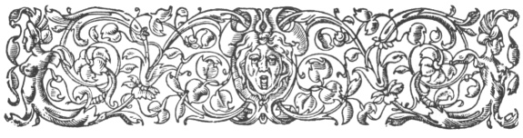

  
[Intangible Textual Heritage](../../index)  [Ancient Near
East](../index)  [Index](index)  [Previous](caog20) 

------------------------------------------------------------------------

  
*The Chaldean Account of Genesis*, by George Smith, \[1876\], at
Intangible Textual Heritage

------------------------------------------------------------------------

p. 315

 

### INDEX.

|                    |
|--------------------|
|  |

ABRAM, [296](caog20.htm#page_296).

Abydenus, [45](caog06.htm#page_45), [46](caog06.htm#page_46).

Accad or Akkad, [25](caog05.htm#page_25), [293](caog19.htm#page_293).

Adrahasis, [265](caog19.htm#page_265), [272](caog19.htm#page_272).

Age of documents, [23](caog05.htm#page_23).

Alaparus, [46](caog06.htm#page_46).

Alexander Polyhistor, [38](caog06.htm#page_38),
[49](caog06.htm#page_49).

Alexander the Great, [1](caog04.htm#page_1).

Alorus, [45](caog06.htm#page_45), [46](caog06.htm#page_46).

Amarda, [293](caog19.htm#page_293).

Amempsin, [46](caog06.htm#page_46).

Amillarus, [46](caog06.htm#page_46).

Ammenon, [46](caog06.htm#page_46).

Anatu, [55](caog07.htm#page_55).

Anementus, [47](caog06.htm#page_47).

Animals, creation of, [76](caog08.htm#page_76).

Antiquity of legends, [28](caog05.htm#page_28).

Anu, [53](caog07.htm#page_53), [54](caog07.htm#page_54),
[109](caog09.htm#page_109), [116](caog10.htm#page_116).

Anus, [50](caog06.htm#page_50).

Apason, [49](caog06.htm#page_49).

Apollodorus, [45](caog06.htm#page_45).

Ardates, [42](caog06.htm#page_42).

Ark, [48](caog06.htm#page_48), [261](caog18.htm#page_261),
[265](caog19.htm#page_265).

Armenia, [47](caog06.htm#page_47).

Arnold, Mr. E., [6](caog04.htm#page_6).

Arrangement of tablets, [20](caog05.htm#page_20),
[21](caog05.htm#page_21).

Assorus, [50](caog06.htm#page_50).

Assur, [31](caog05.htm#page_31), [293](caog19.htm#page_293).

Assurbanipal, [6](caog04.htm#page_6), [33](caog05.htm#page_33).

Assur-nazir-pal, [31](caog05.htm#page_31).

Assyrian excavations, [6](caog04.htm#page_6).

Atarpi, story of, [154](caog13.htm#page_154),
[155](caog13.htm#page_155).

Athenæum, [8](caog04.htm#page_8).

Aus, [50](caog06.htm#page_50).

 

Babel, [17](caog04.htm#page_17).

Babil mound, [163](caog13.htm#page_163).

Babylon, [45](caog06.htm#page_45), [48](caog06.htm#page_48),
[293](caog19.htm#page_293).

Babylonia, [44](caog06.htm#page_44).

Babylonian cities, [293](caog19.htm#page_293).

     legends, [3](caog04.htm#page_3).

     seals, [168](caog14.htm#page_168).

     sources of literature, [22](caog05.htm#page_22).

Bel, [53](caog07.htm#page_53), [58](caog07.htm#page_58),
[99](caog08.htm#page_99).

Belat, [53](caog07.htm#page_53).

Belus, [42](caog06.htm#page_42), [50](caog06.htm#page_50).

Berosus, [1](caog04.htm#page_1), [14](caog04.htm#page_14),
[37](caog06.htm#page_37), [46](caog06.htm#page_46).

p. 316

Bil-kan, [56](caog07.htm#page_56).

Birs Nimrud, [162](caog13.htm#page_162).

Borsippa, [293](caog19.htm#page_293).

Bull, destruction of, [224](caog17.htm#page_224).

 

Calah, [293](caog19.htm#page_293).

Calneh, [293](caog19.htm#page_293).

Cedars, [208](caog16.htm#page_208).

Chaldean account of deluge, [7](caog04.htm#page_7).

     astrology, [26](caog05.htm#page_26).

     dynasties, [186](caog14.htm#page_186).

Change in Assyrian language, [23](caog05.htm#page_23).

Chaos, [65](caog08.htm#page_65).

Chronology, [24](caog05.htm#page_24), [25](caog05.htm#page_25),
[189](caog14.htm#page_189)–[191](caog14.htm#page_191).

Clay records, [22](caog05.htm#page_22).

Coming of deluge, [267](caog19.htm#page_267),
[268](caog19.htm#page_268).

Comparison of accounts of creation, [79](caog08.htm#page_79)

     of deluge, [284](caog19.htm#page_284)–[289](caog19.htm#page_289).

Composite creatures, [40](caog06.htm#page_40), [41](caog06.htm#page_41),
[102](caog09.htm#page_102), [103](caog09.htm#page_103).

Conclusion, [295](caog20.htm#page_295).

Conquest of Babylon, [24](caog05.htm#page_24).

     of Erech, [184](caog14.htm#page_184).

     of Humbaba, [216](caog16.htm#page_216).

Constellations, creation of, [69](caog08.htm#page_69).

Contents of library, [34](caog05.htm#page_34).

Copies of texts, [305](caog20.htm#page_305).

Corcyræan mountains, [44](caog06.htm#page_44).

Cory, translations of,
[38](caog06.htm#page_38)–[50](caog06.htm#page_50).

Creation, [1](caog04.htm#page_1), [3](caog04.htm#page_3),
[7](caog04.htm#page_7),[12](caog04.htm#page_12),[17](caog04.htm#page_17),
[61](caog08.htm#page_61),[101](caog09.htm#page_101),
[303](caog20.htm#page_303).

Creation of animals, [76](caog08.htm#page_76).

     of man, [15](caog04.htm#page_15), [77](caog08.htm#page_77),
[78](caog08.htm#page_78).

     of moon, [70](caog08.htm#page_70).

     of stars, [69](caog08.htm#page_69).

     of sun, [70](caog08.htm#page_70).

Cronos, [47](caog06.htm#page_47), [48](caog06.htm#page_48),
[49](caog06.htm#page_49).

Cure of Izdubar, [275](caog19.htm#page_275).

Cutha, [27](caog05.htm#page_27), [105](caog09.htm#page_105),
[293](caog19.htm#page_293).

 

Dache, [50](caog06.htm#page_50).

Dachus, [50](caog06.htm#page_50).

Dæsius, month, [47](caog06.htm#page_47).

"Daily Telegraph," [6](caog04.htm#page_6), [11](caog04.htm#page_11),
[16](caog04.htm#page_16).

     collection, [15](caog04.htm#page_15).

Damascius, [49](caog06.htm#page_49).

Dannat, [199](caog15.htm#page_199).

Daonus, [45](caog06.htm#page_45).

Daos, [46](caog06.htm#page_46).

Date of Nimrod, [302](caog20.htm#page_302).

Davce, [50](caog06.htm#page_50).

Davkina, [57](caog07.htm#page_57).

Death of Heabani, [257](caog18.htm#page_257).

Delitzsch, Dr., [121](caog10.htm#page_121).

Deluge, [1](caog04.htm#page_1), [4](caog04.htm#page_4),
[5](caog04.htm#page_5), [46](caog06.htm#page_46),
[48](caog06.htm#page_48), [167](caog14.htm#page_167),
[169](caog14.htm#page_169).

     tablet, [10](caog04.htm#page_10), [16](caog04.htm#page_16).

     predicted, [265](caog19.htm#page_265).

     commencement of, [267](caog19.htm#page_267).

     destruction wrought by, [268](caog19.htm#page_268).

     end of, [269](caog19.htm#page_269).

Descent to Hades, [227](caog17.htm#page_227).

Description of Hades,
[227](caog17.htm#page_227)–[229](caog17.htm#page_229).

     of Izdubar legends, [170](caog14.htm#page_170).

Destruction made by deluge, [268](caog19.htm#page_268),
[269](caog19.htm#page_269).

Dragon, [90](caog08.htm#page_90), [91](caog08.htm#page_91).

Dreams of Izdubar, [194](caog15.htm#page_194),
[245](caog18.htm#page_245).

 

Eagle, [17](caog04.htm#page_17).

Eagle-headed men, [106](caog09.htm#page_106).

Eagle, fable of, [138](caog12.htm#page_138).

Eden, [3](caog04.htm#page_3), [88](caog08.htm#page_88),
[291](caog19.htm#page_291), [306](caog20.htm#page_306).

p. 317

Elamites, [187](caog14.htm#page_187).

Eneuboulus, [47](caog06.htm#page_47).

Eneugamus, [47](caog06.htm#page_47).

Erech, [129](caog11.htm#page_129), [183](caog14.htm#page_183),
[293](caog19.htm#page_293).

Eridu, [293](caog19.htm#page_293).

Esarhaddon, [32](caog05.htm#page_32).

Etana, [17](caog04.htm#page_17), [140](caog12.htm#page_140),
[141](caog12.htm#page_141).

Euedocus, [47](caog06.htm#page_47).

Euedorachus, [45](caog06.htm#page_45).

Euedoreschus, [47](caog06.htm#page_47).

Evil spirits, legend of, [27](caog05.htm#page_27).

Expedition to Assyria, [11](caog04.htm#page_11).

Exploits of Lubara, [26](caog05.htm#page_26).

 

Fables, [17](caog04.htm#page_17), [18](caog04.htm#page_18),
[137](caog12.htm#page_137).

Fall, [13](caog04.htm#page_13).

Fifth tablet of the creation,
[69](caog08.htm#page_69)–[71](caog08.htm#page_71).

Filling the ark, [267](caog19.htm#page_267).

First tablet of the creation, [62](caog08.htm#page_62).

Flood, [1](caog04.htm#page_1), [264](caog19.htm#page_264),
[307](caog20.htm#page_307).

Forest of Humbaba, [214](caog16.htm#page_214).

Fox, fable of, [144](caog12.htm#page_144).

Fox Talbot, Mr., [239](caog17.htm#page_239).

Fragments of tablets, [19](caog05.htm#page_19).

 

Ganganna, [293](caog19.htm#page_293).

Generation of the gods, [66](caog08.htm#page_66).

Genesis, [1](caog04.htm#page_1), [3](caog04.htm#page_3),
[11](caog04.htm#page_11).

     stories, [33](caog05.htm#page_33).

God Zu, [113](caog10.htm#page_113), [122](caog10.htm#page_122).

 

Hammurabi, [24](caog05.htm#page_24).

Harriskalama, [293](caog19.htm#page_293).

Hasisadra, [256](caog18.htm#page_256), [262](caog18.htm#page_262).

Hea, [53](caog07.htm#page_53), [109](caog09.htm#page_109),
[111](caog09.htm#page_111).

Heabani, [7](caog04.htm#page_7), [193](caog15.htm#page_193),
[198](caog15.htm#page_198).

Heabani comes to Erech, [204](caog15.htm#page_204).

History of Izdubar,
[309](caog20.htm#page_309)–[311](caog20.htm#page_311).

Horse and ox, fable of,
[147](caog12.htm#page_147)–[150](caog12.htm#page_150).

Humbaba, [185](caog14.htm#page_185), [207](caog16.htm#page_207),
[213](caog16.htm#page_213).

 

Illinus, [50](caog06.htm#page_50).

Ishmael, [298](caog20.htm#page_298).

Ishtar, [17](caog04.htm#page_17), [54](caog07.htm#page_54),
[56](caog07.htm#page_56), [108](caog09.htm#page_108),
[129](caog11.htm#page_129), [217](caog17.htm#page_217).

     loves Izdubar, [218](caog17.htm#page_218).

     amours of, [220](caog17.htm#page_220).

     anger of, [221](caog17.htm#page_221).

     descent to Hades, [227](caog17.htm#page_227).

     in Hades, [231](caog17.htm#page_231).

     return of, [235](caog17.htm#page_235).

Ismi-dagan, [26](caog05.htm#page_26).

Itak, [124](caog11.htm#page_124).

Izdubar, [5](caog04.htm#page_5), [173](caog14.htm#page_173),
[194](caog15.htm#page_194), [308](caog20.htm#page_308).

     legends, [8](caog04.htm#page_8), [18](caog04.htm#page_18),
[27](caog05.htm#page_27), [167](caog14.htm#page_167),
[170](caog14.htm#page_170).

     same as Nimrod, [167](caog14.htm#page_167),
[168](caog14.htm#page_168).

     parentage, [173](caog14.htm#page_173).

     exploits of, [174](caog14.htm#page_174),
[203](caog15.htm#page_203).

     conquers Humbaba, [216](caog16.htm#page_216).

     loved by Ishtar, [218](caog17.htm#page_218).

     struck with disease, [245](caog18.htm#page_245).

     wanderings of, [247](caog18.htm#page_247).

     meets scorpion men, [248](caog18.htm#page_248).

     travels over desert, [251](caog18.htm#page_251).

     meets Sabitu and Siduri, [253](caog18.htm#page_253).

     meets Urhamsi, [254](caog18.htm#page_254).

     sees Hasisadra, [260](caog18.htm#page_260).

     hears the story of the flood, [264](caog19.htm#page_264).

     cured of his illness, [275](caog19.htm#page_275).

     returns to Erech, [277](caog19.htm#page_277).

     mourns for Heabani, [279](caog19.htm#page_279).

     friendship with Heabani, [193](caog15.htm#page_193).

     dream of, [194](caog15.htm#page_194).

p. 318

Jewish traditions, [284](caog19.htm#page_284).

Jove, [49](caog06.htm#page_49).

 

Karrak, [25](caog05.htm#page_25), [30](caog05.htm#page_30).

Kissare, [50](caog06.htm#page_50).

Kisu, [293](caog19.htm#page_293).

Kouyunjik, [2](caog04.htm#page_2), [19](caog05.htm#page_19).

Kudur-mabuk, [31](caog05.htm#page_31).

 

Lament of Izdubar,
[278](caog19.htm#page_278)–[280](caog19.htm#page_280).

Language of inscriptions, [23](caog05.htm#page_23).

Larancha, [46](caog06.htm#page_46), [293](caog19.htm#page_293).

Larsa, [25](caog05.htm#page_25), [26](caog05.htm#page_26),
[30](caog05.htm#page_30).

Layard, Mr., [2](caog04.htm#page_2).

Lecture on the deluge, [11](caog04.htm#page_11).

Lenormant, M. F., [8](caog04.htm#page_8), [239](caog17.htm#page_239).

Libraries, [20](caog05.htm#page_20).

Library of Assurbanipal, [33](caog05.htm#page_33).

Literary period, [29](caog05.htm#page_29).

Literature, Babylonian and Assyrian, [19](caog05.htm#page_19).

Local mythology, [52](caog07.htm#page_52).

Lubara, [17](caog04.htm#page_17).

     exploits of, [123](caog11.htm#page_123)–[136](caog11.htm#page_136).

 

Mamitu, [261](caog18.htm#page_261).

Man, creation of, [77](caog08.htm#page_77), [78](caog08.htm#page_78).

     fall of, [83](caog08.htm#page_83)–[87](caog08.htm#page_87).

     pure, [79](caog08.htm#page_79), [80](caog08.htm#page_80).

     rebels, [81](caog08.htm#page_81).

Megalarus, [45](caog06.htm#page_45), [46](caog06.htm#page_46).

Merodach, [53](caog07.htm#page_53),
[57](caog07.htm#page_57),[112](caog09.htm#page_112).

Minyas, [48](caog06.htm#page_48).

Miscellaneous texts, [153](caog13.htm#page_153).

Moon, creation of, [70](caog08.htm#page_70).

Moses, [48](caog06.htm#page_48), [300](caog20.htm#page_300).

Moymis, [50](caog06.htm#page_50).

Mummu-tiamat, [63](caog08.htm#page_63)–[65](caog08.htm#page_65).

Mythological tablets, [4](caog04.htm#page_4).

Mythology, [51](caog07.htm#page_51).

 

Nabubalidina, [32](caog05.htm#page_32).

Names in Genesis, [295](caog20.htm#page_295).

Natural history, [35](caog05.htm#page_35).

Nebo, [58](caog07.htm#page_58), [118](caog10.htm#page_118).

Nebuchadnezzar, [36](caog05.htm#page_36), [166](caog13.htm#page_166).

Nergal, [53](caog07.htm#page_53), [59](caog07.htm#page_59),
[105](caog09.htm#page_105).

Nicolaus Damascenus, [48](caog06.htm#page_48).

Nimrod, [167](caog14.htm#page_167),
[174](caog14.htm#page_174)–[183](caog14.htm#page_183),
[301](caog20.htm#page_301).

Nineveh, [293](caog19.htm#page_293).

Ninip, [53](caog07.htm#page_53), [59](caog07.htm#page_59).

Nipur, [293](caog19.htm#page_293).

Nizir, [4](caog04.htm#page_4), [270](caog19.htm#page_270).

"North British Review," [239](caog17.htm#page_239).

Notices of legends,
[312](caog20.htm#page_312)–[314](caog20.htm#page_314).

Nusku, [53](caog07.htm#page_53).

 

Oannes, [39](caog06.htm#page_39), [45](caog06.htm#page_45),
[46](caog06.htm#page_46), [306](caog20.htm#page_306).

Odacon, [45](caog06.htm#page_45).

Omoroca, [41](caog06.htm#page_41).

Oppert, Prof., [239](caog17.htm#page_239).

Otiartes, [46](caog06.htm#page_46).

 

Pantibiblon, [45](caog06.htm#page_45), [46](caog06.htm#page_46).

Paradise, [251](caog18.htm#page_251).

Patriarchs, [290](caog19.htm#page_290).

Pentateuch, [14](caog04.htm#page_14).

Pine trees, [207](caog16.htm#page_207).

Planets, creation of, [70](caog08.htm#page_70).

Position of inscribed fragments, [20](caog05.htm#page_20).

Prometheus, [49](caog06.htm#page_49).

p. 319

Queen, great, [209](caog16.htm#page_209).

 

Ragmu, [257](caog18.htm#page_257).

Rawlinson, Sir H. C., [2](caog04.htm#page_2), [3](caog04.htm#page_3),
[8](caog04.htm#page_8), [86](caog08.htm#page_86),
[88](caog08.htm#page_88), [164](caog13.htm#page_164),
[165](caog13.htm#page_165), [178](caog14.htm#page_178),
[179](caog14.htm#page_179).

Rehobothair, [293](caog19.htm#page_293).

Resen, [293](caog19.htm#page_293).

Resurrection of Heabani, [281](caog19.htm#page_281).

Return of Izdubar to Erech, [277](caog19.htm#page_277).

Riddle of the wise man, [156](caog13.htm#page_156),
[157](caog13.htm#page_157).

 

Sabitu, [253](caog18.htm#page_253).

Sacrifice, [271](caog19.htm#page_271).

Sargon, [26](caog05.htm#page_26), [32](caog05.htm#page_32),
[299](caog20.htm#page_299).

     saved in ark, [299](caog20.htm#page_299).

Sarturda, [119](caog10.htm#page_119), [194](caog15.htm#page_194).

Satan, [14](caog04.htm#page_14).

Sayce, Rev. A. H., [8](caog04.htm#page_8).

Scorpion men, [249](caog18.htm#page_249).

Semitic race, [188](caog14.htm#page_188).

Senaar, [49](caog06.htm#page_49).

Sending out birds, [270](caog19.htm#page_270).

Sennacherib, [32](caog05.htm#page_32).

Serpent, [139](caog12.htm#page_139), [140](caog12.htm#page_140).

Seven evil spirits, [17](caog04.htm#page_17),
[107](caog09.htm#page_107).

Siduri, [253](caog18.htm#page_253). Sin, [53](caog07.htm#page_53),
[59](caog07.htm#page_59).

Sin of Zu, [113](caog10.htm#page_113).

Sinuri, [157](caog13.htm#page_157), [158](caog13.htm#page_158).

Sippara, [43](caog06.htm#page_43), [45](caog06.htm#page_45),
[293](caog19.htm#page_293).

Sisithrus, [47](caog06.htm#page_47).

Shalmaneser II., [32](caog05.htm#page_32).

Shamas, [53](caog07.htm#page_53), [59](caog07.htm#page_59),
[109](caog09.htm#page_109), [197](caog15.htm#page_197).

Society of Biblical Archæology, [5](caog04.htm#page_5),
[283](caog19.htm#page_283), [304](caog20.htm#page_304).

Speaking trees, [243](caog18.htm#page_243).

Stars, creation of, [69](caog08.htm#page_69).

Story of Ishtar, [151](caog12.htm#page_151).

Sumir, [25](caog05.htm#page_25).

Sun, creation of, [70](caog08.htm#page_70).

Surippak, [293](caog19.htm#page_293).

Sibyl, [49](caog06.htm#page_49).

 

Table of gods, [60](caog07.htm#page_60).

Tablets, mutilation of, [9](caog04.htm#page_9).

Tablets upon evil spirits, [111](caog09.htm#page_111).

Tauth, [49](caog06.htm#page_49).

Thalassa, [41](caog06.htm#page_41).

Thalatth, [14](caog04.htm#page_14), [41](caog06.htm#page_41).

Tiamat, [14](caog04.htm#page_14), [99](caog08.htm#page_99),
[107](caog09.htm#page_107).

Tiglath Pileser, [32](caog05.htm#page_32).

Tisallat, [14](caog04.htm#page_14).

Titan, [48](caog06.htm#page_48), [49](caog06.htm#page_49).

Tower in stages, [164](caog13.htm#page_164), [165](caog13.htm#page_165).

Tower of Babel, [8](caog04.htm#page_8), [9](caog04.htm#page_9),
[13](caog04.htm#page_13), [48](caog06.htm#page_48),
[158](caog13.htm#page_158)–[161](caog13.htm#page_161).

Traditions collected, [28](caog05.htm#page_28).

     of Genesis, [29](caog05.htm#page_29).

Tugulti-ninip, [24](caog05.htm#page_24).

 

Uddusu-namir, [240](caog17.htm#page_240).

Ur, [25](caog05.htm#page_25), [30](caog05.htm#page_30).

Urhamsi, [254](caog18.htm#page_254), [274](caog19.htm#page_274),
[275](caog19.htm#page_275).

Urukh, [25](caog05.htm#page_25), [30](caog05.htm#page_30),
[294](caog19.htm#page_294).

 

Vul, [53](caog07.htm#page_53), [55](caog07.htm#page_55),
[108](caog09.htm#page_108), [109](caog09.htm#page_109),
[116](caog10.htm#page_116), [117](caog10.htm#page_117).

 

War in heaven, [92](caog08.htm#page_92)–[98](caog08.htm#page_98).

     with evil, [304](caog20.htm#page_304).

 

Xisuthrus, [42](caog06.htm#page_42), [43](caog06.htm#page_43),
[44](caog06.htm#page_44), [46](caog06.htm#page_46).

 

Zaidu, [200](caog15.htm#page_200).

Zirat-banit, [58](caog07.htm#page_58).

p. 320

 

PRINTED BY WHITTINGHAM AND WILKINS,  
TOOKS COURT, CHANCERY LANE.

 

 

 

 

 
