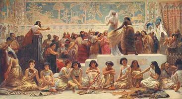

  
[Intangible Textual Heritage](../../index.md)  [Ancient Near
East](../index.md) 

------------------------------------------------------------------------

[Buy this Book on
Kindle](https://www.amazon.com/exec/obidos/ASIN/B002GYVU7A/internetsacredte.md)

------------------------------------------------------------------------

<table width="75%">
<colgroup>
<col style="width: 50%" />
<col style="width: 50%" />
</colgroup>
<tbody>
<tr class="odd">
<td width="50%" data-valign="TOP"></td>
<td width="50%" data-valign="CENTER"><h1 id="myths-of-babylonia-and-assyria" data-align="CENTER">Myths of Babylonia and Assyria</h1>
<h2 id="by-donald-a.-mackenzie" data-align="CENTER">by Donald A. Mackenzie</h2>
<h4 id="section" data-align="CENTER">[1915]</h4></td>
</tr>
</tbody>
</table>

------------------------------------------------------------------------

[Contents](#contents)    [Start Reading](mba00.md)    [Page
Index](pageidx)    [Text \[Zipped\]](mba.txt.gz.md)

------------------------------------------------------------------------

|                                                                                                                           |
|---------------------------------------------------------------------------------------------------------------------------|
|  |

This volume of the Myths and Legends series covers the still nascent
subject of ancient Near Eastern mythology. Because the primary documents
had only been deciphered a few decades prior to the writing of this
book, Mackenzie necessarily has to round out the exposition with a
detailed history of the region, Biblical accounts, and speculative
cross-cultural comparisons, particularly to Hindu and Northern European
mythology and folklore.

The picture emerges of the birth of the world culture in the region
which is today known as Iraq. Besides writing, codes of law, irrigation,
mathematics, astronomy, urban life and many other innovations, the
fertile crescent developed a brutal form of despotism. The history is a
constant churn of wars, invasions, massacres, genocide and regicide.

This work remains a decent introduction and reference work for the
religion, culture, history and general background of the ancient Near
East, and well worth studying by anyone interested in the topic.

------------------------------------------------------------------------

 [Title Page](mba00.md)  
[Preface](mba01.md)  
[Contents](mba02.md)  
[Plates in Colour](mba03.md)  
[Plates in Monochrome](mba04.md)  
[Map](mba05.md)  
[Introduction](mba06.md)  
[Chapter I. The Races and Early Civilization of Babylonia](mba07.md)  
[Chapter II. The Land of Rivers and the God of the Deep](mba08.md)  
[Chapter III. Rival Pantheons and Representative Deities](mba09.md)  
[Chapter IV. Demons, Fairies, and Ghosts](mba10.md)  
[Chapter V. Myths of Tammuz and Ishtar](mba11.md)  
[Chapter VI. Wars of the City States of Sumer and Akkad](mba12.md)  
[Chapter VII. Creation Legend: Merodach the Dragon Slayer](mba13.md)  
[Chapter VIII. Deified Heroes: Etana and Gilgamesh](mba14.md)  
[Chapter IX. Deluge Legend, the Island of the Blessed, and
Hades](mba15.md)  
[Chapter X. Buildings and Laws and Customs of Babylon](mba16.md)  
[Chapter XI. The Golden Age of Babylonia](mba17.md)  
[Chapter XII. Rise of the Hittites, Mitannians, Kassites, Hyksos, and
Assyrians](mba18.md)  
[Chapter XIII. Astrology and Astronomy](mba19.md)  
[Chapter XIV. Ashur the National God of Assyria](mba20.md)  
[Chapter XV. Conflicts for Trade and Supremacy](mba21.md)  
[Chapter XVI. Race Movements that Shattered Empires](mba22.md)  
[Chapter XVII. The Hebrews in Assyrian History](mba23.md)  
[Chapter XVIII. The Age of Semiramis](mba24.md)  
[Chapter XIX. Assyria's Age of Splendour](mba25.md)  
[Chapter XX. The Last Days of Assyria and Babylonia](mba26.md)  

### Index

[A-C](mba27.md)  
[D-G](mba28.md)  
[H-L](mba29.md)  
[M-R](mba30.md)  
[S-Z](mba31.md)  
