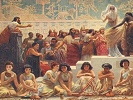

  
[Intangible Textual Heritage](../../index)  [Ancient Near
East](../index)  [Index](index)  [Previous](mba03)  [Next](mba05) 

------------------------------------------------------------------------

[Buy this Book on
Kindle](https://www.amazon.com/exec/obidos/ASIN/B002GYVU7A/internetsacredte)

------------------------------------------------------------------------

  
*Myths of Babylonia and Assyria*, by Donald A. MacKenzie, \[1915\], at
Intangible Textual Heritage

------------------------------------------------------------------------

p. xvii

### PLATES IN MONOCHROME

<table data-border="0">
<colgroup>
<col style="width: 50%" />
<col style="width: 50%" />
</colgroup>
<tbody>
<tr class="odd">
<td data-valign="top">
 
</td>
<td data-valign="top">
PAGE
</td>
</tr>
<tr class="even">
<td data-valign="top">
EXAMPLES OF RACIAL TYPES <em>facing</em> 
 <em>From a drawing by E. Wallcousins</em>
</td>
<td data-valign="top">
<a href="mba07.htm#img_00200">2</a>
</td>
</tr>
<tr class="odd">
<td data-valign="top">
STATUE OF A ROYAL PERSONAGE OR OFFICIAL OF NON-SEMITIC ORIGIN
</td>
<td data-valign="top">
<a href="mba07.htm#img_01200">12</a>
</td>
</tr>
<tr class="even">
<td data-valign="top">
WORSHIP OF THE MOON GOD (CYLINDER-SEAL)
</td>
<td data-valign="top">
<a href="mba09.htm#img_05000">50</a>
</td>
</tr>
<tr class="odd">
<td data-valign="top">
WINGED MAN-HEADED LION 
 <em>From N.W. Palace of Nimroud</em>
</td>
<td data-valign="top">
<a href="mba10.htm#img_06200">62</a>
</td>
</tr>
<tr class="even">
<td data-valign="top">
TWO FIGURES OF DEMONS
</td>
<td data-valign="top">
<a href="mba10.htm#img_07200">72</a>
</td>
</tr>
<tr class="odd">
<td data-valign="top">
WINGED HUMAN-HEADED COW(?) 
 <em>From Kouyunjik</em> (<em>Nineveh</em>)
</td>
<td data-valign="top">
<a href="mba11.htm#img_10000">100</a>
</td>
</tr>
<tr class="even">
<td data-valign="top">
CYLINDER-SEAL IMPRESSIONS SHOWING MYTHOLOGICAL FIGURES AND DEITIES
</td>
<td data-valign="top">
<a href="mba11.htm#img_10600">106</a>
</td>
</tr>
<tr class="odd">
<td data-valign="top">
PLAQUE OF UR-NINA
</td>
<td data-valign="top">
<a href="mba12.htm#img_11600">116</a>
</td>
</tr>
<tr class="even">
<td data-valign="top">
SILVER VASE DEDICATED TO THE GOD NIN-GIRSU BY ENTEMENA
</td>
<td data-valign="top">
<a href="mba12.htm#img_12000">120</a>
</td>
</tr>
<tr class="odd">
<td data-valign="top">
STELE OF NARAM SIN
</td>
<td data-valign="top">
<a href="mba12.htm#img_12800">128</a>
</td>
</tr>
<tr class="even">
<td data-valign="top">
GUDEA 
 <em>From the statue in the Louvre, Paris</em>
</td>
<td data-valign="top">
<a href="mba12.htm#img_13000">130</a>
</td>
</tr>
<tr class="odd">
<td data-valign="top">
p. xviii
</td>
<td data-valign="top">
 
</td>
</tr>
<tr class="even">
<td data-valign="top">
 
</td>
<td data-valign="top">
PAGE
</td>
</tr>
<tr class="odd">
<td data-valign="top">
"THE SEVEN TABLETS OF CREATION" <em>facing</em> 
 <em>From the library of Ashur-bani-pal at Kouyunjik</em> (<em>Nineveh</em>)
</td>
<td data-valign="top">
<a href="mba13.htm#img_13800">138</a>
</td>
</tr>
<tr class="even">
<td data-valign="top">
SLIPPER-SHAPED COFFIN, MADE OF GLAZED EARTHENWARE
</td>
<td data-valign="top">
<a href="mba15.htm#img_21400">214</a>
</td>
</tr>
<tr class="odd">
<td data-valign="top">
STELE OF HAMMURABI, WITH "CODE OF LAWS"
</td>
<td data-valign="top">
<a href="mba16.htm#img_22200">222</a>
</td>
</tr>
<tr class="even">
<td data-valign="top">
HAMMURABI RECEIVING THE "CODE OF LAWS" FROM THE SUN GOD
</td>
<td data-valign="top">
<a href="mba17.htm#img_24800">248</a>
</td>
</tr>
<tr class="odd">
<td data-valign="top">
THE HORSE IN WARFARE (ASHUR-NATSIR-PAL AND ARMY ADVANCING 
 <em>Marble slab from N.W. Palace of Nimroud</em>
</td>
<td data-valign="top">
<a href="mba18.htm#img_27000">270</a>
</td>
</tr>
<tr class="even">
<td data-valign="top">
LETTER FROM TUSHRATTA, KING OF MITANNI, TO AMENHOTEP III, KING OF EGYPT
</td>
<td data-valign="top">
<a href="mba18.htm#img_28000">280</a>
</td>
</tr>
<tr class="odd">
<td data-valign="top">
THE GOD NINIP AND ANOTHER DEITY
</td>
<td data-valign="top">
<a href="mba19.htm#img_30200">302</a>
</td>
</tr>
<tr class="even">
<td data-valign="top">
SYMBOLS OF DEITIES AS ASTRONOMICAL SIGNS 
 <em>From sculptured stone in the British Museum</em>
</td>
<td data-valign="top">
<a href="mba19.htm#img_30600">306</a>
</td>
</tr>
<tr class="odd">
<td data-valign="top">
ASHUR SYMBOLS
</td>
<td data-valign="top">
<a href="mba20.htm#img_33400">334</a>
</td>
</tr>
<tr class="even">
<td data-valign="top">
WINGED DEITIES KNEELING BESIDE A SACRED TREE 
 <em>Marble slab from N.W. Palace of Nimroud</em>
</td>
<td data-valign="top">
<a href="mba20.htm#img_34000">340</a>
</td>
</tr>
<tr class="odd">
<td data-valign="top">
EAGLE-HEADED WINGED DEITY (ASHUR)
</td>
<td data-valign="top">
<a href="mba20.htm#img_34400">344</a>
</td>
</tr>
<tr class="even">
<td data-valign="top">
ASSYRIAN KING HUNTING LIONS
</td>
<td data-valign="top">
<a href="mba22.htm#img_38400">384</a>
</td>
</tr>
<tr class="odd">
<td data-valign="top">
TYRIAN GALLEY PUTTING OUT TO SEA 
 <em>Marble slab from Kouyunjik</em> (<em>Nineveh</em>)
</td>
<td data-valign="top">
<a href="mba22.htm#img_38800">388</a>
</td>
</tr>
<tr class="even">
<td data-valign="top">
STATUE OF ASHUR-NATSIR-PAL 
 <em>From S.W. Palace of Nimroud</em>
</td>
<td data-valign="top">
<a href="mba23.htm#img_39600">396</a>
</td>
</tr>
<tr class="odd">
<td data-valign="top">
p. xix
</td>
<td data-valign="top">
 
</td>
</tr>
<tr class="even">
<td data-valign="top">
 
</td>
<td data-valign="top">
PAGE
</td>
</tr>
<tr class="odd">
<td data-valign="top">
DETAILS FROM SECOND SIDE OF BLACK OBELISK OF SHALMANESER III <em>facing</em>
</td>
<td data-valign="top">
<a href="mba23.htm#img_41000">410</a>
</td>
</tr>
<tr class="even">
<td data-valign="top">
STATUE OF NEBO, DEDICATED BY ADAD-NIRARI IV AND THE QUEEN SAMMU-RAMMAT
</td>
<td data-valign="top">
<a href="mba24.htm#img_42200">422</a>
</td>
</tr>
<tr class="odd">
<td data-valign="top">
TIGLATH-PILESER IV IN HIS CHARIOT
</td>
<td data-valign="top">
<a href="mba25.htm#img_44600">446</a>
</td>
</tr>
<tr class="even">
<td data-valign="top">
COLOSSAL WINGED AND HUMAN-HEADED BULL AND MYTHOLOGICAL BEING 
 <em>From doorway in Palace of Sargon at Khorsabad</em>
</td>
<td data-valign="top">
<a href="mba25.htm#img_45600">456</a>
</td>
</tr>
<tr class="odd">
<td data-valign="top">
ASSAULT ON THE CITY OF . . .ALAMMU (JERUSALEM) BY THE ASSYRIANS UNDER SENNACHERIB 
 <em>Marble slab from Kouyunjik</em> (<em>Nineveh</em>)
</td>
<td data-valign="top">
<a href="mba25.htm#img_46800">468</a>
</td>
</tr>
<tr class="even">
<td data-valign="top">
ASHUR-BANI-PAL RECLINING IN A BOWER 
 <em>Marble slab from Kouyunjik</em> (<em>Nineveh</em>)
</td>
<td data-valign="top">
<a href="mba26.htm#img_48600">486</a>
</td>
</tr>
<tr class="odd">
<td data-valign="top">
PERSIANS BRINGING CHARIOTS, RINGS, AND WREATHS 
 <em>Bas-relief from Persepolis</em>
</td>
<td data-valign="top">
<a href="mba26.htm#img_49400">494</a>
</td>
</tr>
<tr class="even">
<td data-valign="top">
MAP OF BABYLONIA AND ASSYRIA
</td>
<td data-valign="top">
<a href="mba05.htm#img_map">xx</a>
</td>
</tr>
</tbody>
</table>

 

------------------------------------------------------------------------

[Next: Map](mba05)
