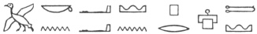
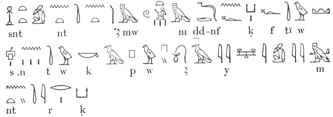
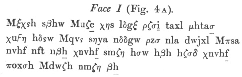
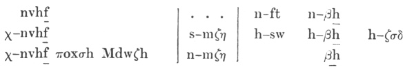

  
[Intangible Textual Heritage](../../index.md)  [Ancient Near
East](../index)  [Index](index)  [Previous](phc07)  [Next](phc09.md) 

------------------------------------------------------------------------

  
*The Philistines*, by R.A.S. Macalister, \[1913\], at Intangible Textual
Heritage

------------------------------------------------------------------------

p. 79

### CHAPTER IV

### THE CULTURE OF THE PHILISTINES

#### I. Their Language.

Of the language of the Philistines we are
profoundly ignorant. An inscription in their tongue, written in an
intelligible script, would be one of the greatest rewards that an
explorer of Palestine could look for. As yet, the only materials we have
for a study of the Philistine language are a few proper names, and
possibly some words, apparently non-Semitic, embedded here and there in
the Hebrew of the Old Testament. Thus, our scanty information is
entirely drawn from foreign sources. We are exactly in the same position
as a student of some obscure Oriental language would be, if his only
materials were the names of natives as reported in English newspapers.
Now, we are all familiar with the barbarous and meaningless abbreviation
'Abdul', applied with various depreciatory epithets to a certain
ex-potentate. Some time ago a friend called my attention to a paragraph
in, I think, a Manchester paper, describing how a certain Arab 'named
Sam Seddon' had been prosecuted for some offence: though the 'Arabian
Nights' is almost an English classic, the reporter had failed to
recognize the common name *Shems ed-Din*! If we were obliged to
reconstruct the Arabic language from materials of this kind, we could
hardly expect to get very far; but in attempting to recover something of
the Philistine language we are no better off.

The one common noun which we know with tolerable certainty is *ṣeren*,
the regular word in the Hebrew text for the 'lords' by which the
Philistines were governed: a word very reasonably compared with the
Greekτύραννος. [1](#fn_100.md) This, however, does
not lead us very far. It happens that no satisfactory Indo-European
etymology has been found for τύραννος, so that it may be a word
altogether foreign to the Indo-European family. In any case, one word
could hardly decide the relationship of the Philistine language any more
than

p. 80

could 'benval' (*sic!*) decide the relationship of Pictish in the hands
of Sir Walter Scott's amateur philologists.

The word *ṣeren* is once used (1 Kings vii. 30) as a technical term for
some bronze objects, part of the 'bases' made for the temple
(wheel-axles?). This is probably a different word with different
etymological connexions. The word mekōnah in the list cited
below, is found in the same verse.

Renan, in his so-called *Histoire du peuple d’Israël*, has collected a
list of words which he suggests may have been imported into Hebrew from
Philistine sources. That there should be such borrowing is *a priori*
not improbable: we have already shown that the leaders among Hebrew
speakers must have understood the Philistine tongue down to the time of
David at least. But Renan's list is far from convincing. It is as
follows:

parbār or parvār, 'a suburb': compare *peribolus*.

mekōnah, something with movable wheels: compare *machina*.

mekhērah, 'a sword': compare μάχαιρα.

caphtōr, 'a crown, chaplet': compare *capital*.

pīlegesh, 'a concubine': compare *pellex*.

A further comparison of the name of Araunah the Jebusite, on whose
threshing-floor the plague was stayed (and therefore 'the place in
Jerusalem from which pestilential vapours arose'!), with the neuter
plural form *Averna*, need hardly he taken seriously.

But since Renan wrote, the discovery of the inscription on the Black
Stone of the Forum has shown us what Latin was like, as near as we can
get to the date of the Philistines, and gives us a warning against
attempts to interpret supposed Philistine words by comparison with
Classical Latin. And, even if the above comparisons be sound, the
borrowing, as Noordtzij [1](#fn_101.md) justly
remarks, might as well have taken place the other way; as is known to
have happened in several cases which he quotes.

There is a word ‏כובע‎ or ‏קובע‎ meaning a 'helmet', the etymology of
which is uncertain. [2](#fn_102.md) It may
possibly be a Philistine word: the random use of ‏כ‎ and ‏ק‎ suggests
that they are attempts to represent a foreign initial guttural (cf.
*ante*, p. 75). Both forms are used in 1 Samuel xvii, the one (‏׳כ‎) to
denote the helmet of the *foreigner* Goliath, the other (‏׳ק‎) that of
the Hebrew Saul. No stress can, however, be laid on this distinction.
The form ‏׳ק‎ is used of the helmets of the *foreigners* named in
Ezekiel xxiii. 24, while ‏׳כ‎ is used of those of Uzziah's *Hebrew*
army, 2 Chronicles xxvi. 14.

p. 81

Of the place-names mentioned in the Old Testament there is not one, with
the possible exception of Ziklag, which can be referred to the
Philistine language. All are either obviously Semitic, or in any case
(being mentioned in the Tell el-Amarna letters) are older than the
Philistine settlement. Hitzig has made ingenious attempts to explain
some of them by various Indo-European words, but these are not
successful.

The persons known to us are as follows:

\(1\) *Abimelech*, the king who had dealings with Abraham. A Semitic
name.

\(2\) *Aḫuzzath*, Counsellor of No. (1): Semitic name.

\(3\) *Phicol*, General of No. (1). Not explained as Semitic: possibly a
current Philistine name adopted by the narrator.

\(4\) *Badyra*, king of Dor, in Wen-Amon's report. Probably not Semitic.

\(5\) *Warati*, a merchant, mentioned by Wen-Amon.

\(6\) *Makamaru*, a merchant, mentioned by Wen-Amon.

\(7\) *Dagon*, chief god of the Philistines.

\(8\) *Delilah*, probably not Philistine. See *ante*, p. 45.

\(9\) *Sisera*, king of Harosheth. See *ante*, p. 41, and compare
Beneṣasira on the tablet of Keftian names.

\(10\) *Achish* or *Ekosh*, [1](#fn_103.md)
apparently the standard Philistine name, like 'John' among ourselves. It
seems to reappear in the old Aegean home in the familiar form
*Anchises*. It occurs twice in the tablet of Keftian names (*ante*, p.
10) and in the Assyrian tablets it appears in the form *Ikausu*. [2](#fn_104.md)

\(11\) *Maoch*, father of Achish, king of Gath. Unexplained and probably
Philistine.

\(12\) *Ittai*, David's faithful Gittite friend, perhaps Philistine.

\(13\) *Obed-Edom*, a Gittite who sheltered the Ark: a pure Semitic
name.

\(14\) *Goliath*, a Rephaite, and therefore not Philistine.

\(15\) *Saph*, a Rephaite, and therefore not Philistine.

\(16\) *Zaggi*, a person signing as witness an Assyrian contract tablet
of the middle of the seventh century B.C. found at Gezer. The name is
not explained, and may be Philistine.

p. 82

(17–26) The ten Philistine kings mentioned on the Assyrian tablets, who
without exception bear Semitic names. *Sarludâri* is an Assyrian name,
which may possibly have been adopted by its bearer as a compliment to
his master.

This list is so meagre that it is scarcely worth discussing. It will be
observed that at the outside not more than eight of these names can be
considered native Philistine.

Down to about the time of Solomon the Philistines preserved their
linguistic individuality. A basalt statuette of one Pet-auset was found
somewhere in the Delta, [1](#fn_105.md) in which
he is described as an interpreter 
 'for Canaan *and* Philistia'. There would be no point
in mentioning the two places if they had a common language. Ashdod, we
have seen, preserved a patois down to the time of Nehemiah; but it is
clear that the Philistines had become semitized by the time of the
operations of the Assyrian kings. It is likely that the Rephaite element
in the population was the leaven through which the Philistines became
finally assimilated in language and other customs to the surrounding
Semitic tribes, as soon as their supremacy had been destroyed by David's
wars. The Rephaites, of course, were primarily a pre-Semitic people: but
probably they had themselves already become thoroughly semitized by
Amorite influence before the Philistines appeared on the scene.

We have, besides, a number of documents which, when they have been
deciphered, may help us in reconstructing the 'speech of Ashdod'. The
close relationship of the Etruscans to the Philistines suggests that the
Etruscan inscriptions may some time be found to have a bearing on the
problem. It is also not inconceivable that some of the obscure languages
of Asia Minor, specimens of which are preserved for us in the Hittite,
Mitannian, Lycian, and Carian inscriptions may have light to contribute.
The inscriptions of Crete, in the various Minoan scripts, and the
Eteocretan inscriptions of Praesos [2](#fn_106.md)
may also prove of importance in the investigation. Two other alleged
fragments of the 'Keftian' language are at our service: the list of
names already quoted on p. 10, which suggestively contains *Akašou* and
*Beneṣasira*: and a magical formula in a medical MS. of the time of
Thutmose III, published by Birch in 1871, [3](#fn_107.md) which contains

p. 83

*inter alia* the following—copied here from a corrected version
published by Ebers. [1](#fn_108.md)

 

'Conjuration in the *Amu* language which people call
Keftiu—*senutiukapuwaimantirek*' or something similar. This is not more
intelligible than such formulae usually are. Mr. Alton calls my
attention to the tempting resemblance of the last letters to trke,
turke, θrke, a verb (?) common in the Etruscan inscriptions.

There is one document of conspicuous importance for our present purpose,
although it is as yet impossible to read it. This is the famous disk of
terra-cotta found in the excavation of the Cretan palace of Phaestos,
and dated to the period known as Middle Minoan III—that is to say, about
1600 B.C. It is a roughly circular tablet of terra cotta, 15.8–16.5 cm.
in diameter. On each face is a spiral band of four coils, indicated by a
roughly drawn meandering line; and an inscription, in some form of
picture-writing, has been impressed on this band, one by one, from dies,
probably resembling those used by bookbinders. I suppose it is the
oldest example of printing with movable types in the world. On one face
of the disk, which I call Face I, there are 119 signs; on the other
face, here called Face II, there are 123. They are divided into what
appear to be word-groups, 30 in number on Face I and 31 on Face II, by
lines cutting across the spiral bands at right angles. These word-groups
contain from two to seven characters each. There are forty-five
different characters employed. It is likely, therefore, from the
largeness of this number that we have to deal with a *syllabary* rather
than an alphabet.

I have discussed this inscription in a paper contributed to the
*Proceedings* of the Royal Irish Academy, [2](#fn_109.md) to which I must refer the reader for the
full investigation. Its special importance for our present purpose is
based upon the fact that the most frequently used character, a man's
head with a plumed head-dress, has from the

p. 84

moment of its first discovery been recognized as identical in type with
the plumed head-dresses of the Philistine captives pictured at Medinet
Habu. This character appears *only at the beginnings of words*, from
which I infer that it is not a phonetic sign, but a determinative, most
probably denoting personal names. Assuming this, it next appears that
Face II consists of a list of personal names. Representing

  [  
Click to enlarge](img/08400.jpg.md)  
Fig. 4 A. The Phaestos Disk (Face 1).  

each character by a letter, which is to be regarded as a mere algebraic
symbol and not a phonetic sign, we may write the inscription on the disk
in this form:

 

p. 85

  [  
Click to enlarge](img/08500.jpg.md)  
Fig. 4B. The Phaestos Disk (Face II).  

 

 

There is just one type of ancient document which shows such a
'sediment', so to speak, of proper names at the end. This is a contract
tablet, which ends with a list of witnesses, and in the paper above

p. 86

referred to I have put forward the conjecture that the disk is of this
nature. In Face I, although not one word of the inscription can be
deciphered, it will be found that, applying the clue of the proper
names, everything fits exactly in its place, assuming the ordinary
formula of a contract such as we find it in cuneiform documents.

The first two words would give us the name and title of the presiding
magistrate: then comes the name of one of the contracting parties,
uζ<u>c</u> χηs: then come six words or word-groups, quite
unintelligible, but not improbably stating what this person undertakes
to do: then follows what would be the name of the other contracting
party.

Next come some words which ought to give some such essential detail as
the *date* of the contract. And we find among these words just what we
want, a proper name πsa, denoting the officer who was eponymous of the
year.

The last thirteen words we might expect to be a detailed inventory of
the transaction, whatever its nature may have been. It is therefore
satisfactory to notice that they arrange themselves neatly, just as they
stand, in three parallel columns, having obvious mutual relations: thus—

 

which table not only confirms the conclusions arrived at, but
illustrates a rule that may also be inferred from the list of witnesses
on Face II. Words are declined by prefixes ξ, s, n, h, χ and suffixes w,
ξ; and *words in apposition have the same prefix*. See the third column
of the above table, and the titles of witnesses 1, 2. We have a word βh
in several forms: s-βh-w, n-β<u>h</u>, h-β<u>h</u>, s-βh-ξ. Further, ξ,
prefixed to the 'name of the magistrate' and all the names of witnesses,
probably means 'before, in the presence of'. The name which follows that
of the two witnesses 5 and 6 is probably that of their father, and this
assumed it follows that the prefix s probably has a genitive sense.

There remains one important point. At the bottom of certain characters
there is a sloping line running to the left. This is always at the end
of a word-group: the two apparent exceptions shown in some drawings of
the disk (in word-groups 6 and 23 on Face II) being seemingly cracks in
the surface of the disk. The letters marked are underlined in the
transcript given above. I suggest with regard to

p. 87

these marks that they are meant to express a modification of the
phonetic value of the character, too slight to require a different
letter to express it, but too marked to allow it to be neglected
altogether. And obviously the most likely modification of the kind would
be the elision of the vowel of a final open syllable. The mark would
thus be exactly like the *virāma* of the Devanāgarī alphabet. [1](#fn_110.md) When we examine the text, we find that
it is only in certain words that this mark occurs. It is found in
β<u>h</u>, however declined, except when the suffixes w, ξ are present.
It is found in the word nvh<u>f</u>, however declined, and appears in
the two similar words µhta<u>σ</u> and Mξta<u>σ</u>. It is found in the
personal name k<u>q</u> (in the formula p<u>a</u> Mξk<u>q</u>). There
are only one or two of the eighteen examples of its use outside these
groups, and probably if we had some more examples of the script, or a
longer text, these would be found to fit likewise into series. This
stroke would therefore be a device to express a final closed syllable.
Thus, if it was desired to write the name of the god *Dagon*, it would
be written on this theory, let us say, DA-GO-NA, with a stroke
underneath the last symbol to elide its vowel. The consequences that may
follow if this assumption should at any time be proved, and the culture
which the objects represented by the various signs indicate, are
subjects for discussion in later sections of this chapter. For further
details of the analysis of the disk I must refer to my *Royal Irish
Academy* paper above quoted: I have dwelt on it here, because if, as is
most probable, the plumed head-dress shows that in this disk we have to
deal with 'proto-Philistines', we must look to this document and others
of the same kind, with which excavators of the future may be rewarded,
to tell us something of the language of the people with whom we have to
deal.

------------------------------------------------------------------------

### Footnotes

[79:1](phc08.htm#fr_100.md) The 'Lords of the
Philistines' are, however, in the Greek Version called σατράπαι; but in
Judges (except iii. 3), Codex Vaticanus and allied MSS. have ἄρχοντες, a
rendering also found sometimes in Josephus.

[80:1](phc08.htm#fr_101.md) *De Filistijnen*, p.
81.

[80:2](phc08.htm#fr_102.md) Cf. Latin *cappa*, &c.
(?).

[81:1](phc08.htm#fr_103.md) Max Müller in his
account of the school-tablet (ante, p. 10) compares the Assyrian form
Ikausu and the Greek Ἀγχοῦς, and infers that the true pronunciation of
the name was something like *Ekôsh*.

[81:2](phc08.htm#fr_104.md) But in the last
edition of *KAT*. p. 437, it is noticed that this name can possibly be
read Ikasamsu or Ikasamsu.

[82:1](phc08.htm#fr_105.md) See the description by
Chassinat, *Bulletin de l’inst. franç. d’arch. au Caire*, i. (1901), p.
98.

[82:2](phc08.htm#fr_106.md) See Conway in the
*Annual of the British School at Athens*, vol. viii, p. 125, for an
exhaustive analysis of these inscriptions.

[82:3](phc08.htm#fr_107.md) *Zeitschr. f. ägypt.
Sprache* (1871), p. 61.

[83:1](phc08.htm#fr_108.md) *Zeitschr. der D. M.
G.* xxxi, pp. 451, 452.

[83:2](phc08.htm#fr_109.md) *Proceedings of the
Royal Irish Academy*, vol. xxx, section C, p. 342.

[87:1](phc08.htm#fr_110.md) I find that this
comparison has been anticipated in an article in Harper's Magazine
(European Edition, vol. lxi, p. 187), which I have read since writing
the above. The rest of the article, I regret to say, does not convince
me.

------------------------------------------------------------------------

[Next: II. Their Organization](phc09.md)

