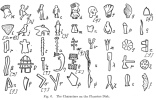

  
[Intangible Textual Heritage](../../index.md)  [Ancient Near
East](../index)  [Index](index)  [Previous](phc10)  [Next](phc12.md) 

------------------------------------------------------------------------

  
*The Philistines*, by R.A.S. Macalister, \[1913\], at Intangible Textual
Heritage

------------------------------------------------------------------------

### IV. Their Place in History and Civilization

A people, or rather a group of peoples, the remnant—the degenerate
remnant if you will—of a great civilization, settled on the Palestine
coast. They found before them a servile aboriginal population ready to
their use, who could relieve them of the necessary but unaccustomed
labour of extracting life and wealth from the prolific soil. They were
thus free to cultivate the commercial facilities which were already
established in the land they made their own. Gaza, Ashkelon, and Ashdod
had harbours which opened the way to trade by sea. The great land route
from Egypt to Babylon passed right through the heart of the country from
end to end—Gaza was from the beginning the principal mart for northern
Arabia: in the expressive words of Principal G. A. Smith, we hear the
jingling of shekels in the very name of Ashkelon. Corn and wine were
produced abundantly within their favoured territory, even in years when
the rest of the country suffered famine; an active slave-trade (one of
the most lucrative sources of wealth) centred in Philistia, as we learn
from the bitter denunciation of Amos. Small wonder then that the lords
of the Philistines could offer an enormous bribe to a wretched woman to
betray her husband. Small wonder that the Philistines were the carriers
and controllers of the arts of civilization in Palestine.

The settlement of the Philistines in Palestine falls in that period of
fog, as we may call it, when the iron culture succeeds the bronze in the
Eastern Mediterranean. Recent excavations have given us a clear-cut
picture of the development of civilization during the bronze age; that
wonderful history which was sketched in its barest outline in the course
of Chapter I. Then a cloud seems to settle down on the world, through
which we can dimly perceive scenes of turmoil, and the shifting of
nations. When the mist rolls away it is as though a new world is before
us. We see new powers on earth, new gods in heaven: new styles of
architecture, new methods of warfare: the alphabet has been invented,
and above all, iron has become the metal of which the chief implements
are made. Crete and the great days of Egypt belong to the past: the
glorious days of classical Greece are the goal before us.

p. 115

The chief interest of the Philistines lies in this, that their history
falls almost entirely within this period of obscurity, when the iron age
of Europe was in its birth-throes. They and their kin, the Zakkala in
the east and Turisha in the west, bridge the gap between the old world
and the new. It is owing to them that the reminiscences of the days of
Crete were handed across a couple of troubled centuries, to form the
basis of new civilizations in Greece, in Italy, and in the East.

Our materials for estimating the culture of the Philistines and their
place in civilization are the following: (1) The Phaestos Disk; (2) The
Medinet Habu sculptures; (3) The results of excavation in Philistia; (4)
Scattered Biblical references.

 

\(1\) On the Phaestos Disk are forty-five characters. Of some of these
it is not very easy to determine the signification, but others have some
value as indicating the nature of the civilization of those who invented
its script, and its analogues.

The writing, running from right to left, is in the same direction as the
Carian inscriptions, but not as the Minoan linear tablets.

The *plumed head-dress* of the sign here called M has been referred to
as being the link which connects this disk with Caria on the one hand
and with the Philistines on the other. A. J. Reinach (*Revue
archéologique*, Sér. V, vol. xv, pp. 26, 27) publishes Sardinian
statuettes showing the same form of head-dress. The Sardinians being
probably a later stage in the history of one branch of the sea-peoples,
it is natural that they should show an analogous equipment.

The sign *a*, a man running, shows the simple waist-band which forms the
sole body-covering of the Keftian envoys.

The sign *b*, a captive with arms bound behind, has no more covering
than a girdle. The symbol *z* appears to represent a handcuff or fetter.
Perhaps Samson was secured with some such fastening.

The sign *c* from its small size appears to represent a child. He is
clad in a tunic fitting closely to the body and reaching barely to the
hips. No doubt, as often in Egypt ancient and modern, in some of the
remoter parts of Palestine and among the Bedawin, young children went
naked.

Fig. *d* represents a woman. She has long flowing hair, and seems to be
wearing a single garment not unlike the *fustān* of the modern
Palestinian peasant, the upper part of which, however, has been dropped
down over the lower so as to expose the body from the girdle upwards.
Hall, in a recent article in the *Journal of Hellenic Studies*, shows
that the figure has Mycenaean analogies.

p. 116

Fig. *e*, with the shaved head, perhaps represents a slave. A
figure-of-eight (an ownership mark in tatu) is represented on the
cheek. [1](#fn_154.md)

  [  
Click to enlarge](img/11600.jpg.md)

Fig. *f* may represent a sandalled foot; fig. *g* may possibly represent
a closed hand; but both are doubtful. Figs. *h* and *i* possibly
represent a breast and *membrum muliebre* respectively, though the

p. 117

former may be a Phrygian cap. The interpretation of these four signs is
too uncertain to allow us to attach any weight to them.

In figs. *j* and *k* we may *possibly* see the sacred doves, and in *l*
the sacred fish. But this cannot be pressed. The ram's head (*o*), the
hoof (*p*), the horn (*q*), and the hide (*s*) all indicate a pastoral
life. The symbols *t*, *u*, *y*, *w*, *x*, *y* are drawn from the plant
world, and it must be noticed that those who developed the script of the
Disk showed an unusual appreciation of plant-shapes. It is quite
remarkable to find such a variety of floral symbols.

The sign ß is probably a section of a river, suggestive of water.

The sign δ is very remarkable. It is almost certainly a representation
of a domed house, such as is imitated in the Lycian tombs. It may be the
prototype of one of the 'palaces of Ashdod'! The sign ζ is a pillar with
a square capital. The curious sign θ may represent some kind of key.

Very important is the ship, fig. η. It is one more link with the Medinet
Habu sculptures, in which, as we shall see, an identical ship makes its
appearance.

The bow and arrow, figs. κ, λ, are especially interesting. Reinach (*op.
cit.* p. 35) ingeniously points out that it is a true picture of the bow
of the Lycian Pandarus, made of two horns of the wild goat fixed and
bound on a piece of wood.

…

*Iliad*, iv. 105–11.

The curved poignard (ρ) has also Lycian and Carian analogies (Reinach,
*op. cit.* p. 35). The axe (μ), square (σ), plane (τ), signet-ring (ψ),
and leather-cutter's knife (φ), the latter perforated with a hole in the
butt for suspension, all show the specializing of tools which is a
characteristic of civilization.

Of especial importance is the round shield with bosses (ξ). It is not
Cretan: the Cretan shield is a long oval. But the Sherdanian warriors at
Medinet Habu bear the round bossed shield, and Reinach (*op. cit.* p.
30) figures an Etruscan statuette which bears an identical protection.

The other signs (π, σ, τ, χ and ϝ) are not sufficiently clear to
identify (τ may be an astragalus, used in games, and π may be an adze).
But enough will have been said to show that quite apart

p. 118

from its literary value, the Phaestos Disk is of very considerable
importance as a document in the history of Aegean civilization.

\(2\) We now turn to the sculptures on the temple of Medinet Habu. Here
we have precious illustrations of costumes, vehicles, and arms.

  [  
Click to enlarge](img/11800.jpg.md)  
Fig. 7. Wagons of the Pulasati.  

  [  
Click to enlarge](img/11801.jpg.md)  
Fig. 8. The Head-dress of the Pulasati.  

The Pulasati wear a plumed head-dress, the plumes being fitted into an
elaborately embroidered band encircling the temples, and secured by a
chin-strap passing in front of the ears. The other tribes wear similar
head-dresses, except the Shekelesh, who have a cap. The Zakkala are
represented as beardless. Their sole body-costume is the waistband,
though some of them seem to have bracelets or armlets, and bands or
straps crossing the upper part of the body. The women have the
close-fitting *fustān;* the children are naked.

The land contingent travel in wagons, of a square box-like shape, some
with framed, some with wickerwork sides. They have two solid wheels,
secured to the axle by a linch-pin; and are drawn

p. 119

  [  
Click to enlarge](img/11900.jpg.md)  
Fig. 9. The Sea-fight between Ramessu III and the Allies.  

p. 120

by four oxen abreast. The sea-contingent travel in ships which show a
marked resemblance to that of the Phaestos Disk. The keel is curved
(more so at Medinet Habu than at Phaestos) and both bow and stem rise
high above the deck, with ornamental finials. A rudder-oar projects from
the stem; and at Medinet Habu (not at Phaestos) a mast rises from the
middle of the boat, with a yard and a lug-sail. The ships are fitted
with oars, which in the summary Phaestos hieroglyphic are not shown.

The warriors in the coalition are armed with a sword and with the long
Carian spear; they have also daggers and javelins for throwing, and
carry circular shields.

A number of enamelled tablets, once forming part of the decoration of
the temple, have been described, [1](#fn_155.md)
and these add some further valuable details. They show prisoners in full
costume, not the summary fighting costume. A number of these do not
concern us, being Semitic or North African; but a *Shekelesh*, a
*Philistine*, and one of the *Turisha* are represented, if Daressy's
identifications are to be accepted. Unfortunately there is no
explanatory inscription with the figures.

The *Shekelesh* has a yellow-coloured skin, a small pointed beard, not
meeting the lower lip. His hair is combed backward, in a way remarkably
similar to the hair of the woman in the Phaestos disk (or he wears a
crimped head-dress). He is apparelled in a gown, black with yellow
circles above, green below, with vertical folds; over this is a
waistband divided into coloured squares by bands of green. On his breast
he wears an amulet, in the shape of a ring suspended round his neck by a
cord. A sort of torque \[or a chain\] surrounds his neck, and his hands
are secured in a handcuff.

The *Philistine* is more fully bearded: he has likewise a
yellow-coloured skin. The top of the tablet is unfortunately broken, so
only the suggestion of the plumed head-dress is to be seen. He wears a
long white robe with short sleeves, quatrefoil ornament embroidered upon
it, and with some lines surrounding the neck; over this is a waistband
extending from the knees up to the breast, with elaborate embroidery
upon it: a tassel hangs in the middle. On the arms are bracelets. The
face of this prisoner is of a much more refined cast than any of the
others.

The supposed *Turisha* has a red skin: his costume resembles that of the
Philistine, but it is less elaborately embroidered. Three long
ornamental tassels hang from the waistband.

\(3\) In a country like Palestine, frequently plundered and possessing

p. 121

a climate that does not permit of the preservation of frescoes and
similar ancient records, we cannot hope to find anything like the rich
documentation that Egypt offers us on the subject of commerce. Some
suggestive facts may, however, be learnt from finds made in recent
excavations, more especially pottery with coloured decoration. This will
be found described in the section on pottery in my *Excavation of
Gezer*, vol. ii, pp. 128–241.

  [  
Click to enlarge](img/12100.jpg.md)  
Fig. 10. A Bird, as painted on an Amorite and a Philistine Vase
respectively.  

Putting aside details, for which I may refer the reader to that work, it
may be said that the periods, into which the history down to the fall of
the Hebrew monarchy is divided, are five in number; to these have been
given the names pre-Semitic, and First to Fourth Semitic. The Second
Semitic, which I have dated 1800–1400 B.C., the time which ends in the
Tell el-Amarna period, shows Egyptian and Cypriote influence in its
pottery, and here for the first time painted ornament becomes prominent.
The figures are outlined in broad brush strokes, and the spaces are
filled in afterwards, wholly

p. 122

or partly, with strokes in another colour. The subjects are animals,
birds, fishes, and geometrical patterns generally, and there can be
little doubt that they are crude local imitations of models of Late
Minoan ware, directly imported into the country. The Third Semitic,
1400–1000 B.C., includes the time of the Philistine supremacy: and
though I have dated the beginning of the period rather earlier than the
time of their arrival, the peculiar technique of painted pottery that
distinguishes it need not be dated so early, and may well have been
introduced by them, as it certainly comes to an abrupt end about the
time of their fall. In this there is a degeneration observable as
compared with the best work of the Second Semitic ware. The designs had
in fact become 'hieratic', and the fine broad lines in several colours
had given place to thin-line monochrome patterns, which will be found
illustrated in the book referred to.

The Philistines thus, in this particular art, show an inferiority to
their Semitic predecessors. The reason is simple: they were removed
farther in time from the parent designs. But the sudden substitution of
the fine-line technique of the Third Semitic period for the broad-line
technique of the Second, while the general plan of the designs remains
the same, can be most easily accounted for by the assumption that the
art passed from one race to another. And the sudden disappearance of the
fine-line technique coincides so completely with the subjugation of the
Philistines, that we can hardly hesitate to call painted ware displaying
the peculiar Third Semitic characters 'Philistine'. This may be a
valuable help for future exploration.

The five graves found at Gezer, of which a fully illustrated detailed
description will be found in *Excavation of Gezer*, vol. i, pp. 289–300,
were so absolutely different from native Palestinian graves of any
period that unless they were those of Philistines or some other foreign
tribe they would be inexplicable. They were oblong rectangular
receptacles sunk in the ground and covered with large slabs. Each
contained a single body stretched out (not crouched, as in the Canaanite
interments), the head, with one exception, turned to the east. Ornaments
and food-deposits were placed around. The mouth-plate found on some of
the skeletons was an important link with Cretan tradition, and the
graves, as a whole, show decided kinship with the shaft-graves of
Knossos or Mycenae, although naturally the art-centre has shifted to
Cyprus, which was the origin of such of the deposits as had no Egyptian
analogies. The bones from these tombs presented analogies with Cretan
bones (seep. 60 *ante*); but of course five skeletons are quite
insufficient as a basis for anthropological deductions.

With further excavation the debt of Palestinian civilization to the

p. 123

\[paragraph continues\] Philistines will
probably be found to be even greater than the foregoing paragraphs would
suggest. Briefly, the impression which the daily study of objects found
in excavation has made on the present writer is, that from about
1400–1200 B.C. onwards to about 800 B.C. Western Palestine was the scene
of a struggle between the Aegean and Egyptian civilizations, with a
slight mingling of Mesopotamian influence, and that the local tribes
took a merely passive interest in the conflict and made no contribution
whatever to its development.

\(4\) The Biblical and other literary sources point to the same
conclusion.

Let us take as an illustration the art of Architecture. It is notable
that the only Palestine temples we read about in the Old Testament,
until the building of Solomon's temple, are the houses of the Philistine
deities. [1](#fn_156.md) Yahweh has a simple tent;
the Canaanite deities have to be content with their primitive High
Places—open areas of ground with rude pillar-stones. But Gaza, Ashdod,
and Beth-Shan have their temples, and most likely the place called
Beth-Car and some of the Beth-Dagons derived their Semitic names from
some conspicuous temples of gods of the Philistine pantheon.

We can deduce something as to the architecture of the Gaza temple from
the account of its destruction by Samson (Judges xvi). There were two
groups of spectators—a large crowd (the figure 3000 need not be taken
literally) on the roof, and the lords and their attendants inside. If
Samson was also inside, those on the roof could not have seen him, for
no *hypaethrum* of any probable size would have allowed any considerable
number to enjoy the sport. Samson must therefore have been outside the
temple; and it follows that the lords and their attendants must have
been, not in an enclosed *naos*, but under an open portico. That is to
say, the structure must have been a building of the *megaron* type. When
Samson rested—just where we should expect, at the edge of the grateful
shade of the portico, where he could the more quickly recover his
strength but would be at a respectful distance from the Philistine
notables—he seized the wooden pillars of the portico, which probably
tapered

p. 124

downwards in the Mycenean style. He pushed them off their bases by
'bowing himself with all his might', and, the portico being distyle and
having thus no other support, he brought the whole structure down. Only
a *megaron* plan will satisfy all the conditions of the story.

Buildings such as this must have been familiar to David in Gath, and
perhaps the sight of them suggested to his mind the idea of erecting a
more worthy temple to his own Deity, as soon as he came into his
kingdom. And when the work was carried out by Solomon, we see that the
same model was followed.

  [  
Click to enlarge](img/12400.jpg.md)  
Fig. 11. Sketch-plans and Elevations of the Marneion at Gaza and of
Solomon's Temple (accessory buildings omitted). The dimensions of the
latter are figured in cubits: the former is not to scale.  

The description in 1 Kings vi, vii is not an architect's specification,
and it has numerous technical terns hard to understand. Many attempts
have been made to design a building which should conform to this
account, helped out by the not always trustworthy Josephus. The mutual
incompatibility of these restorations (to say nothing of their *prima
facie* architectural improbability) is sufficient to deter the present
writer from attempting to add to their number. The main

p. 125

lines of the description are, however, clear enough to show with what
kind of building we have to deal. We need not attempt to assign a place
to the subsidiary external buildings in three stories, their winding
stairs and other appurtenances, erected against the outside of the main
structure. But we note that the latter was oblong, 60 cubits long, 30
cubits high, and 20 cubits broad. These figures show a classical sense
of *proportion* for which we look in vain in any ancient building that
excavation has revealed in Palestine. A portico in front, of the breadth
of the house, was 20 cubits broad and 10 cubits deep. Here again the
dimensions are proportioned. The portico was distyle, like that in the
temple of Gaza: the two pillars were called by names which show that
they were NOT massēbōth—'the stablisher' and
'strength in it' are very suitable names for pillars that have to bear
the responsibility of keeping up a heavy portico. These pillars had
shafts 18 cubits long, and capitals 5 cubits high—a total length of 23
cubits, which leaves, when subtracted from the height of the building, 7
cubits, a margin that is just about sufficient for the entablature above
and the plinth below. At the opposite end of the building 'the oracle'
or 'the most holy place' corresponds exactly to the *opisthodomos*. It
was 20 cubits square, which left a *naos*, measuring 30 cubits by 20, in
the middle of the building: the 'forty cubits' of 1 Kings vi. 16
evidently includes the portico.

With regard to the ordinary domestic architecture of the Philistines, it
must be admitted that the excavations which have been made in Philistine
towns do not lead us to infer that they were on the whole much better
housed than their Semitic neighbours. Amos, [is](errata.htm#0.md) true,
speaks of the 'palaces' of Gaza and Ashdod (i. 8, iii. 9); but this is
rather a favourite word (‏ארמנות‎) of the prophet's, and he finds
'palaces' in other towns as well. To a rough herdsman many buildings
would look palatial, which when viewed from another standpoint would
hardly make the same impression.

One of the Philistine tombs at Gezer contained a small knife of iron;
and this leads us at once to a discussion of fundamental importance.

Inserted into the account of the battle of Michmash there is a very
remarkable passage (1 Sam. xiii. 19–23). It is corrupt, and some parts
of it cannot be translated, but the meaning of it seems to be something
like this: 'Now there was no smith found throughout all the land of
Israel, for the Philistines said, "Lest the Hebrews make them sword or
spear." But all the Israelites went down to the Philistines to sharpen
every man his share, and his coulter, and his axe and his ox-goad (?).'
The next verse is too corrupt to translate, and then the passage
proceeds: 'In the day of battle there was neither

p. 126

sword nor spear in the hand of any of the people, except with Saul and
Jonathan themselves.'

This is sometimes referred to as a 'disarmament', but there is no hint
of anything of the kind. It simply says that the Philistines kept the
monopoly of the iron trade in their own hands, and naturally restricted
the sale of weapons of offence to the Hebrews, just as modern civilized
nations have regulations against importing firearms among subject or
backward communities. The Hebrews were just emerging from the bronze age
culture. Iron agricultural implements, which seem slightly to precede
iron war-weapons, had been introduced among them [1](#fn_157.md); but the novelty of iron had not worn
off by the time of Solomon when he built his temple without the
profaning touch of this metal (1 Kings vi. 7)—just as when Joshua made
flint knives to perform the sacred rite of circumcision (Joshua v. 2);
the old traditions must be maintained in religious functions. The
champions of the Philistines, of course, were able to use iron freely,
although for defensive purposes they still use bronze. [2](#fn_158.md)

Goliath had a bronze helmet, a bronze cuirass of scale-armour (not a
mail-coat, as in the English translation), bronze greaves, and a bronze
'javelin', but a spear with a great shaft and a heavy head of iron. The
armour of 'Ishbi-benob' was probably similar, but the text is corrupt
and defective. The armour of Goliath is indeed quite Homeric, and very
un-Semitic. The κυνέν πάγχαλκος, the χαλκοκνήμιδες, [3](#fn_159.md) and the enormous spear—

… [4](#fn_160.md)—

are noteworthy in this connexion, especially the greaves, the Hebrew
word for which (‏מצחת‎) occurs nowhere else. The θώραξ λεπιδωτός alone
would seem post-Homeric, but this is an *argumentum e silentio*.
Fragments of a scale-cuirass, in iron, and of a rather later date, were
found in the excavation of Tell Zakariya, overlooking the scene where
the battle is laid (*Excavations in Palestine*, p. 150). But the culture
that Goliath's equipment illustrates, like his ordeal by single combat,
is much more European or Aegean than Palestinian.

p. 127

In the report of Wen-Amon we found that the Zakkala were busy in the
Phoenician ports, and had large influence in Phoenicia. The
representations of Phoenician ships, such as the sadly damaged fresco
which W. Max Müller has published, [1](#fn_161.md)
shows them to have been identical in type with the ships of the
Pulasati. It is highly probable that further research will show that it
was due to the influence of the 'Peoples of the Sea' that the
Phoenicians were induced to take to their very un-Semitic seafaring
life. And it is also probable that it was due to Zakkala influence that
the same people abandoned the practice of circumcision, as Herodotus
says they did when they had commerce with 'Greeks'. [2](#fn_162.md)

An interesting question now arises. Was it to the Philistines and their
kinsmen that the civilized world owes the alphabet? The facts that
suggest this query may be briefly stated. For countless generations the
Egyptians, the Babylonians, and probably the Hittites, had been
lumbering away with their complex syllabaries; scripts as difficult to
learn and to use as is the Chinese of to-day. As in China, the
complexity of the scripts was a bar to the diffusion of learning: the
arts of reading and writing were perforce in the hand of specially
trained guilds of scribes. No one thought of the possibility of
simplifying the complexities; while current 'hieratic' forms of the
letters might come into being with hasty writing, all the elaborate
machinery of syllables and ideograms and determinatives was retained
without essential modification.

Suddenly we find that a little nation in Syria appears to have hit upon
a series of twenty-two easily-written signs by which the whole complex
system of the sounds of their language can be expressed with sufficient
clearness. If it was really the Phoenicians, of all people, who
performed this feat of analysis, it was one of the most stupendous
miracles in the history of the world. That the Phoenicians ever
originated the alphabet, or anything else, becomes more and more
impossible to believe with every advance of knowledge.

The alphabet makes its appearance soon after the movements of the
'sea-peoples'. Zakar-Baal is found keeping his accounts, not on clay
tablets (and therefore not in cuneiform) but on papyrus, which he
imports from Egypt in large quantities. And we are tempted to ask if the
characters he used were some early form of the signs of the so-called
'Phoenician' alphabet.

The oldest specimen of this alphabet yet found has come to light in
Cyprus: the next oldest is the far-famed Moabite Stone.

p. 128

\[paragraph continues\] W. Max
Müller [1](#fn_163.md) cleverly infers from some
peculiarities in the rendering of names in the list of Sheshonk's
captured towns, that the scribe of that document was working from a
catalogue in which the names were written in the Phoenician alphabet.
This would bring the use of this alphabet in Palestine back to about 930
B.C., or about a century earlier than the Moabite Stone. A letter in
neo-Babylonian cuneiform, probably not much earlier than this, and
certainly of local origin, was found at Gezer: the date of the
introduction of the Phoenician alphabet is thus narrowed down very
closely.

Whence came the signs of this alphabet? De Rougé's theory, which derived
them from Egyptian hieratic, was the most reasonable of any, but no
longer commands favour. There was for long a script of linear signs,
strangely resembling the Phoenician alphabet, in use in Crete. It must
be admitted, however, that so far no very satisfactory analogies have
been drawn between them, though their comparison is not without promise
of future fruit.

But in this connexion the Phaestos Disk once more seems to assume
importance. We are inclined to ask if it is possible that in the script
of which this document is so far the sole representative, we are to see
the long-sought origin? It is not unreasonable to suppose that in
process of time the script of the Disk would become simplified into just
such a linear script as that alphabet: and the principle of elision of
the terminal vowel of syllables, already noticed in analysing the
inscription on the Disk, is just what is wanted to help the process of
evolution over that last most difficult fence, which divides a syllabary
from a pure alphabet. Suppose that three syllables, *ka*, *ko*, *ku*,
represented each by a special symbol, lost their vowel under certain
grammatical or euphonic conditions; then all three being simply
pronounced *k* might in writing become confused, leading ultimately to
the choice of one of the syllabic signs to denote the letter *k*. Thus
an alphabet of consonants would develop, which is just what we have in
the Phoenician alphabet. The 45 +*x* characters of the original
script—for we have no guarantee that we have all the characters of the
script represented on the disk—could very easily wear down by some such
process as this to the twenty-two signs of the Phoenician alphabet.

As to the forms of the letters, in the total absence of intermediate
links, and our total ignorance of the phonetic value of the Phaestos
signs, it would be premature to institute any elaborate comparisons
between the two scripts. The Phaestos Disk is dated not later than

p. 129

\[paragraph continues\] 1600 B.C., the
Phoenician alphabet cannot be traced even so far back as about 1000
B.C., and what may have happened in the intervening six hundred years we
do not know. But some arresting comparisons are already possible. The
symbol which I have called (h) might well in rapid writing develop into
the Phoenician sign *aleph*. The little man running (a) is not unlike
some forms of *tzade*. The head (e) both in name and shape reminds us of
*rēsh*. The dotted triangle (i) recalls *daleth* or *teth*, the fish (l)
in name and to some extent in shape suggests *nun*—it is notable that
the fish on the Disk always stands upright on its tail—the five-leaved
sprig (w) is something like *samekh*, the water-sign (ß) might be *mem*
(the three teeth of the Phoenician letter preserving the three lines of
the original sign). The manacles (z) resembles *beth*, the nail-pillar
or prop (ζ) resembles nay in both shape and meaning, the remarkable key
(θ) simplifies into *zayin*, the square (σ) into *gimel*, and the object
(π) whatever it may be, into *pe*. These tentative equivalents have been
added for comparison to the table of characters on p. 116. The direction
of writing is from right to left in each case.

The plumed head-dress, so conspicuous as a sign on the Disk, connects it
with the Philistines: and the evidence of forded us by the Golénischeff
papyrus of the Syrian colonies of Philistines, or of their near kinsmen
the Zakkala, links it with the Phoenicians. How far it may be possible
to make further comparisons, with the various scripts of Crete, Cyprus,
and Asia Minor, are questions which must be left for future discoveries
and for special research.

We are not here writing a history of the alphabet: but one or two points
may be noticed which have a bearing on the subject. It is commonly
assumed that because the names of the letters have a meaning in Semitic,
and no meaning in Greek, therefore they are Semitic words adapted into
Greek. This is, however, a *non sequitur*. [1](#fn_164.md) It would be more probable that the
*borrowing* nation should cast about for words similar in sound, and
possessing a meaning which would make the names of the letters easily
remembered. Such an attempt would be sure to be unsuccessful in some
cases: and in point of fact there are several letter-names in the
Semitic alphabet to which the tortures of the Inquisition have to be
applied before a meaning can be extracted from them through Semitic. It
may thus be that all the letter-names are a heritage from some
pre-Hellenic, non-Semitic language: and instead of the old idea of a
Phoenician *Ur-Alphabet* from which all the South Semitic, North
African, West

p. 130

\[paragraph continues\] Asian, Hellenic,
and Italic alphabetic scripts are derived, we are to picture a number of
parallel and nearly related alphabets developing out of one of the
hieroglyphic syllabaries of the Aegean basin—one of which scripts was
taught to the Phoenicians by the despised Philistines. Whoever invented
the alphabet laid the foundation-stone of civilization. Can it be that
we owe this gift to the Philistines, of all people?

And even this is not all. The rude tribes of Israel were forced to wage
a long and stubborn fight with the Philistines for the possession of the
Promised Land. For long it seemed doubtful whether Canaan would be
retained by the Semitic tribes or lost to them: and it is no mere
accident that the best-known name of the country is derived from that of
the sea-rovers. In the struggle the Hebrews learned the lessons of
culture which they needed for their own advancement: and what was more
important, they learned their own essential unity. The pressure of
external opposition welded, as nothing else could have done, their
loosely-knitted clans into a nation. This was the historic function of
the Philistines; they accomplished their task, and then vanished with
startling suddenness from the stage. But the Chosen People were led on
from strength to strength, till they too fulfilled their mission of
teaching mankind to look forward to a time when the knowledge of the
Lord should cover the earth as the waters cover the sea.

Thus the influence of the Philistines remains, even if indirectly, a
heritage of humanity to the end of time.

------------------------------------------------------------------------

### Footnotes

[116:1](phc11.htm#fr_154.md) Compare the scarified
lines still to be seen on the faces of negroes who have been liberated
from slavery within recent years in the Turkish empire.

[120:1](phc11.htm#fr_155.md) Daressy, 'Plaquettes
émaillées de Médinet Habu,' in *Annales du Service des Antiquités de
l’Égypte*, vol. xi, p. 49.

[123:1](phc11.htm#fr_156.md) Except the temple at
Shechem (Judges viii. 33–ix. 46). The events described as taking place
there certainly postulate a covered building. This, however, is perhaps
no real exception: it may have originally been a Philistine structure.
It was dedicated to a certain *Baal*- or *El-Berith*. But 'the Lord of
the Covenant' is a strange name for a local *ba‘al*: can it be that
*Berith* is a corruption of Βριτο\[μαρτις\]? The Book of Judges was
probably written about the sixth century B.C.: by then the temple was
most likely a ruin, and the memory of its dedication might easily have
become obscured. The curious expression in Ezekiel, commented upon on p.
6 *ante*, might be similarly explained: by the ordinary canons of
criticism the difficult original reading is to be preferred to the easy
emendation there quoted.

[126:1](phc11.htm#fr_157.md) See the essay on
'Bronze and Iron' in Andrew Lang's *The World of Homer*, pp. 96–104.

[126:2](phc11.htm#fr_158.md) An elaborate paper,
entitled 'Die Erfinder der Eisentechnik', by W. Belck, will be found in
*Zeitschrift für Ethnologie* (1907), p. 334. It claims the Philistines
as the original inventors of the smith's art. That is, perhaps, going a
little too far.

[126:3](phc11.htm#fr_159.md) Greaves appear to be
unknown in Oriental or Egyptian warfare. See Daremberg and Saglio,
*Dict. des antt. gr. et rom.*, s. v. *Ocrea*.

[126:4](phc11.htm#fr_160.md) Il. vi. 318.

[127:1](phc11.htm#fr_161.md) *Mitth. der vorderas.
Gesell.* (1904), 2, plate iii.

[127:2](phc11.htm#fr_162.md) II. 104.

[128:1](phc11.htm#fr_163.md) *Asien and Europa*,
p. 171.

[129:1](phc11.htm#fr_164.md) See M. René Dussaud's
paper 'L’Origine égéenne des alphabets sémitiques' in *Journal
asiatique*, Sér. X, vol. v, p. 357.

------------------------------------------------------------------------

[Next: Index](phc12.md)

