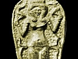

  
[Intangible Textual Heritage](../../index)  [Ancient Near
East](../index)  [Index](index)  [Previous](phc11)  [Next](phc13) 

------------------------------------------------------------------------

  
*The Philistines*, by R.A.S. Macalister, \[1913\], at Intangible Textual
Heritage

------------------------------------------------------------------------

p. 131

### INDEX

Abarbanel, [100](phc10.htm#page_100).

Abimelech, [38](phc05.htm#page_38), [81](phc08.htm#page_81).

Abi-Milki, [19](phc03.htm#page_19).

Abraham, [38](phc05.htm#page_38).

Achaeans, [25](phc03.htm#page_25).

Achish, [51](phc05.htm#page_51), [52](phc05.htm#page_52),
[60](phc05.htm#page_60), [62](phc05.htm#page_62),
[65](phc06.htm#page_65), [72](phc07.htm#page_72),
[81](phc08.htm#page_81).

Adullam, [53](phc05.htm#page_53).

Agenor, [97](phc10.htm#page_97).

Ahaz, Philistine revolt under, [63](phc06.htm#page_63).

Aḫimilki, [65](phc06.htm#page_65).

Aḫimiti, [64](phc06.htm#page_64).

Aḫuzzath, [81](phc08.htm#page_81).

Aijalon, [63](phc06.htm#page_63).

Akašou, [10](phc03.htm#page_10), [11](phc03.htm#page_11),
[26](phc03.htm#page_26) (*see also* Achish).

‘Akir, [74](phc07.htm#page_74).

Alašia, [8](phc03.htm#page_8), [19](phc03.htm#page_19).

Alcaeus, [26](phc03.htm#page_26).

Aldemios, [107](phc10.htm#page_107).

Aldioma, [107](phc10.htm#page_107).

ἀλλόφυλοι, [2](phc03.htm#page_2).

Alphabet, origin of, [127](phc11.htm#page_127).

Alton, [13](phc03.htm#page_13),
[18](phc03.htm#page_18):[83](phc08.htm#page_83),
[105](phc10.htm#page_105), [113](phc10.htm#page_113).

Amos, [125](phc11.htm#page_125) (*see also under* Scriptural Passages).

Anakim, [60](phc05.htm#page_60), [68](phc07.htm#page_68).

Anath, [41](phc05.htm#page_41).

Anchises, [81](phc08.htm#page_81).

Antipater of Tarsus, [97](phc10.htm#page_97).

Antoninus Liberalis, [97](phc10.htm#page_97).

Aphek, [46](phc05.htm#page_46).

Aphrodite, statue of, at Gaza, [108](phc10.htm#page_108).

Architecture, Philistine influence on, [123](phc11.htm#page_123).

Ark, the, [47](phc05.htm#page_47), [76](phc07.htm#page_76),
[91](phc10.htm#page_91).

Armour of Goliath, [54](phc05.htm#page_54), [126](phc11.htm#page_126).

Arnold, [3](phc03.htm#page_3).

Aryans, Philistines probably not, [13](phc03.htm#page_13).

Ashdod, [47](phc05.htm#page_47), [60](phc05.htm#page_60),
[63](phc06.htm#page_63), [64](phc06.htm#page_64),
[65](phc06.htm#page_65), [71](phc07.htm#page_71),
[72](phc07.htm#page_72), [81](phc08.htm#page_81),
[100](phc10.htm#page_100), [106](phc10.htm#page_106).

—history and site of, [73](phc07.htm#page_73).

—palaces of, [117](phc11.htm#page_117).

—siege of, [66](phc06.htm#page_66), [73](phc07.htm#page_73).

—speech of, [66](phc06.htm#page_66).

—temple at, [47](phc05.htm#page_47).

Ashdodimmu, [64](phc06.htm#page_64), [73](phc07.htm#page_73).

Asher, tribe of, [69](phc07.htm#page_69).

Ashkelon, [37](phc04.htm#page_37), [40](phc05.htm#page_40),
[95](phc10.htm#page_95), [97](phc10.htm#page_97).

—coins of, [112](phc10.htm#page_112).

—history and site of, [71](phc07.htm#page_71).

Ashtoreth, Ashtaroth, [93](phc10.htm#page_93).

—temple of, [52](phc05.htm#page_52), [91](phc10.htm#page_91).

Asi, [7](phc03.htm#page_7), [8](phc03.htm#page_8).

Ἀσκληπιὸς λεοντοῦχος, [115](phc11.htm#page_115).

Assyrian annals, Philistines in, [63](phc06.htm#page_63) sqq.

Astarte, [95](phc10.htm#page_95) (*see also* Ashtoreth).

Aswân, Jewish colony at, [11](phc03.htm#page_11),
[41](phc05.htm#page_41).

Atar, Ate, [95](phc10.htm#page_95).

Atargatis, [95](phc10.htm#page_95)–[97](phc10.htm#page_97),
[99](phc10.htm#page_99).

Athenaeus, [97](phc10.htm#page_97).

‘Avvim, [5](phc03.htm#page_5), [68](phc07.htm#page_68).

Azuri (king of Ashdod), [64](phc06.htm#page_64).

Azuri (city captured by Sennacherib), [64](phc06.htm#page_64).

Ἁζώτιοι, [66](phc06.htm#page_66).

 

Baal-Berith, [123](phc11.htm#page_123).

Baal-Perazim, [53](phc05.htm#page_53), [54](phc05.htm#page_54),
[58](phc05.htm#page_58).

Baal-zebub, [91](phc10.htm#page_91).

Badyra, [30](phc04.htm#page_30), [81](phc08.htm#page_81).

Baethgen, [95](phc10.htm#page_95).

Bauer, [74](phc07.htm#page_74).

Baur, [27](phc03.htm#page_27).

Beecher, [13](phc03.htm#page_13).

Belt Dejan, [70](phc07.htm#page_70) (*see also* Beth-Dagon).

Belck, [126](phc11.htm#page_126).

Bene-Berak, [64](phc06.htm#page_64).

Benesasira, [10](phc03.htm#page_10), [44](phc05.htm#page_44).

Benjamin of Tudela, [72](phc07.htm#page_72).

Berossos, [104](phc10.htm#page_104).

Βητάγων, [106](phc10.htm#page_106) (*see also* Beth-Dagon).

Beth-Car, [27](phc03.htm#page_27), [48](phc05.htm#page_48),
[49](phc05.htm#page_49), [93](phc10.htm#page_93).

Beth-Dagon, [42](phc05.htm#page_42), [64](phc06.htm#page_64),
[69](phc07.htm#page_69), [103](phc10.htm#page_103).

Beth-Shan, [52](phc05.htm#page_52), [91](phc10.htm#page_91),
[93](phc10.htm#page_93).

Beth-Shemesh, [48](phc05.htm#page_48), [63](phc06.htm#page_63),
[76](phc07.htm#page_76).

Birch, [82](phc08.htm#page_82).

Body-guard of Hebrew kings, Philistine, [61](phc05.htm#page_61).

Bones of Philistines, [60](phc05.htm#page_60).

Boylan, [105](phc10.htm#page_105).

Breasted, [19](phc03.htm#page_19), [20](phc03.htm#page_20),
[21](phc03.htm#page_21), [29](phc04.htm#page_29).

Britomartis, [96](phc10.htm#page_96), [97](phc10.htm#page_97),
[98](phc10.htm#page_98), [99](phc10.htm#page_99),
[123](phc11.htm#page_123).

Βρύτον, Βρύτος, [97](phc10.htm#page_97).

Burrows, [15](phc03.htm#page_15).

Byblos, [8](phc03.htm#page_8), [30](phc04.htm#page_30) sq.,
[36](phc04.htm#page_36).

 

Callimachus, [96](phc10.htm#page_96).

Callinus, [28](phc03.htm#page_28).

Calmet, [11](phc03.htm#page_11).

Canopus, decree of, [11](phc03.htm#page_11).

Caphtor, Caphtorim, [4](phc03.htm#page_4), [5](phc03.htm#page_5),
[11](phc03.htm#page_11), [12](phc03.htm#page_12),
[13](phc03.htm#page_13), [27](phc03.htm#page_27).

Cappadocia, [11](phc03.htm#page_11), [12](phc03.htm#page_12).

Carians, Carites, [7](phc03.htm#page_7), [25](phc03.htm#page_25),
[26](phc03.htm#page_26), [61](phc05.htm#page_61).

Carpathos, [27](phc03.htm#page_27).

Casluhim, [4](phc03.htm#page_4), [5](phc03.htm#page_5),
[12](phc03.htm#page_12), [28](phc03.htm#page_28). Caunus,
[26](phc03.htm#page_26).

Chariots, [40](phc05.htm#page_40), [43](phc05.htm#page_43).

Chassinat, [81](phc08.htm#page_81).

Cherethites, [5](phc03.htm#page_5), [61](phc05.htm#page_61),
[88](phc09.htm#page_88), [89](phc09.htm#page_89).

Cicero, [105](phc10.htm#page_105).

Cilicia, Cilicians, [12](phc03.htm#page_12), [25](phc03.htm#page_25).

Circumcision, [21](phc03.htm#page_21), [39](phc05.htm#page_39),
[46](phc05.htm#page_46).

p. 132

Clermont-Ganneau, [28](phc03.htm#page_28), [56](phc05.htm#page_56),
[75](phc07.htm#page_75), [94](phc10.htm#page_94).

Clusium, [88](phc09.htm#page_88).

Colchians, [12](phc03.htm#page_12).

Conway, [82](phc08.htm#page_82).

Cornill, [6](phc03.htm#page_6).

Crest, Carian, [26](phc03.htm#page_26).

Crete, Cretans, [6](phc03.htm#page_6), [9](phc03.htm#page_9),
[10](phc03.htm#page_10), [13](phc03.htm#page_13).

—messengers from, to Egypt, [8](phc03.htm#page_8).

Cyprus, [8](phc03.htm#page_8), [35](phc04.htm#page_35),
[122](phc11.htm#page_122).

 

Daedalus, [96](phc10.htm#page_96).

Dagon, Dagan, [46](phc05.htm#page_46), [81](phc08.htm#page_81),
[99](phc10.htm#page_99), [104](phc10.htm#page_104).

—image of, [100](phc10.htm#page_100).

—names compounded with, [103](phc10.htm#page_103),
[104](phc10.htm#page_104).

—temples of, [67](phc06.htm#page_67), [73](phc07.htm#page_73),
[90](phc09.htm#page_90), [91](phc10.htm#page_91),
[99](phc10.htm#page_99).

Dagon, a place by Jericho, [69](phc07.htm#page_69) (see also
Beth-Dagon).

Δαχαρηνοί, [28](phc03.htm#page_28).

Damascius, [104](phc10.htm#page_104), [112](phc10.htm#page_112).

Dan, tribe of, [38](phc05.htm#page_38), [69](phc07.htm#page_69).

Danaoi, [25](phc03.htm#page_25).

Danuna, Danunu, [19](phc03.htm#page_19), [22](phc03.htm#page_22),
[24](phc03.htm#page_24), [25](phc03.htm#page_25).

Dardanu, [19](phc03.htm#page_19), [25](phc03.htm#page_25).

Daressy, [120](phc11.htm#page_120).

Deborah, song of, [38](phc05.htm#page_38), [40](phc05.htm#page_40),
[41](phc05.htm#page_41), [90](phc09.htm#page_90).

Deir edh-Dhubbān, [77](phc07.htm#page_77).

Delilah, [55](phc05.htm#page_55), [61](phc05.htm#page_61),
[81](phc08.htm#page_81), [87](phc08.htm#page_87).

Delos, inscription at, [94](phc10.htm#page_94).

Delta, [12](phc03.htm#page_12).

Democratic instincts of Philistines, [88](phc09.htm#page_88).

Derketo, [95](phc10.htm#page_95), [98](phc10.htm#page_98).

De Rouge, [128](phc11.htm#page_128).

De Saulcy, [114](phc10.htm#page_114).

Dhikerin, [75](phc07.htm#page_75).

Dictynna, [96](phc10.htm#page_96), [98](phc10.htm#page_98),
[99](phc10.htm#page_99).

Diodorus Siculus, [95](phc10.htm#page_95), [96](phc10.htm#page_96),
[99](phc10.htm#page_99).

Dodecapylon, [111](phc10.htm#page_111).

Dome of the Rock, Jerusalem, [111](phc10.htm#page_111),
[112](phc10.htm#page_112).

Dor, [30](phc04.htm#page_30), [36](phc04.htm#page_36),
[69](phc07.htm#page_69).

Dussaud, [129](phc11.htm#page_129).

 

Eben-Ezer, [47](phc05.htm#page_47).

Ebers, [12](phc03.htm#page_12), [14](phc03.htm#page_14),
[83](phc08.htm#page_83).

Ekron, [40](phc05.htm#page_40), [47](phc05.htm#page_47),
[62](phc05.htm#page_62), [64](phc06.htm#page_64),
[65](phc06.htm#page_65), [71](phc07.htm#page_71),
[91](phc10.htm#page_91).

—history and site of, [74](phc07.htm#page_74).

Ekron-Ṣaphōnah, [74](phc07.htm#page_74).

Ekwesh, [20](phc03.htm#page_20), [24](phc03.htm#page_24),
[25](phc03.htm#page_25).

Elhanan, [55](phc05.htm#page_55).

Eli, [46](phc05.htm#page_46).

El-Tekeh, [13](phc03.htm#page_13), [64](phc06.htm#page_64),
[76](phc07.htm#page_76).

Ephes-Dammim, [50](phc05.htm#page_50), [54](phc05.htm#page_54),
[57](phc05.htm#page_57).

Epiphanius of Constantia, [113](phc10.htm#page_113).

Erman, [29](phc04.htm#page_29).

Esar-haddon, [65](phc06.htm#page_65).

Eshmunazar, [102](phc10.htm#page_102).

Etruscans, [13](phc03.htm#page_13), [82](phc08.htm#page_82),
[88](phc09.htm#page_88), [89](phc09.htm#page_89),
[91](phc10.htm#page_91), [105](phc10.htm#page_105),
[117](phc11.htm#page_117).

Europa, [97](phc10.htm#page_97).

Evans, [15](phc03.htm#page_15).

Ewald, [6](phc03.htm#page_6).

Fenish, [67](phc06.htm#page_67).

Festivals, [90](phc09.htm#page_90).

Festus, [105](phc10.htm#page_105).

Fish, sacred, [95](phc10.htm#page_95).

—avoided by Syrians, [97](phc10.htm#page_97).

Fourmont, [2](phc03.htm#page_2).

Frazer, [28](phc03.htm#page_28).

 

Gath, [47](phc05.htm#page_47), [51](phc05.htm#page_51),
[54](phc05.htm#page_54), [60](phc05.htm#page_60),
[71](phc07.htm#page_71), [89](phc09.htm#page_89).

—history and site of, [72](phc07.htm#page_72).

Gatis, [97](phc10.htm#page_97).

Gaza, [40](phc05.htm#page_40), [60](phc05.htm#page_60),
[65](phc06.htm#page_65)–[67](phc06.htm#page_67),
[71](phc07.htm#page_71), [100](phc10.htm#page_100),
[106](phc10.htm#page_106).

—coins of, [15](phc03.htm#page_15), [112](phc10.htm#page_112).

—history and site of, [71](phc07.htm#page_71).

—temples of, [108](phc10.htm#page_108).

Γαζαῖοι, [66](phc06.htm#page_66).

Geba, [49](phc05.htm#page_49), [53](phc05.htm#page_53),
[54](phc05.htm#page_54), [56](phc05.htm#page_56),
[58](phc05.htm#page_58).

Gederoth, [63](phc06.htm#page_63).

George, St., and the Dragon, [98](phc10.htm#page_98).

Gesenius, [2](phc03.htm#page_2).

Gezer, [56](phc05.htm#page_56), [59](phc05.htm#page_59),
[62](phc05.htm#page_62), [122](phc11.htm#page_122).

Gibbethon, [62](phc05.htm#page_62).

Gibeah of God, [49](phc05.htm#page_49).

Gibeon, [54](phc05.htm#page_54).

Gilboa, [52](phc05.htm#page_52).

Gimzo, [63](phc06.htm#page_63).

Gob, [55](phc05.htm#page_55), [56](phc05.htm#page_56).

Golénischeff Papyrus, [24](phc03.htm#page_24), [29](phc04.htm#page_29)
(*see also* Wen-Amon).

Goliath, [50](phc05.htm#page_50), [54](phc05.htm#page_54),
[60](phc05.htm#page_60), [61](phc05.htm#page_61),
[81](phc08.htm#page_81), [126](phc11.htm#page_126).

Governors, Philistine, in Hebrew territory, [49](phc05.htm#page_49),
[88](phc09.htm#page_88).

Goyim, [43](phc05.htm#page_43).

Greaves, [126](phc11.htm#page_126).

 

Habiru, [18](phc03.htm#page_18).

Hadad-Nirari III conquers the Philistines, [63](phc06.htm#page_63).

Hadrian, [111](phc10.htm#page_111).

Hall, H. R., [5](phc03.htm#page_5), [7](phc03.htm#page_7),
[8](phc03.htm#page_8), [16](phc03.htm#page_16), [27](phc03.htm#page_27),
[116](phc11.htm#page_116).

Hanunu, king of Gaza, [63](phc06.htm#page_63).

Harosheth, [42](phc05.htm#page_42).

Harris Papyrus, [23](phc03.htm#page_23).

Hazael, [62](phc05.htm#page_62).

Head-dress of Philistines, [83](phc08.htm#page_83),
[87](phc08.htm#page_87) (*see also* Crest).

Hebrews in Philistine service, [52](phc05.htm#page_52).

Herodotus, [6](phc03.htm#page_6), [12](phc03.htm#page_12),
[26](phc03.htm#page_26), [47](phc05.htm#page_47),
[65](phc06.htm#page_65), [66](phc06.htm#page_66).
[73](phc07.htm#page_73), [94](phc10.htm#page_94),
[127](phc11.htm#page_127).

Hesychius, [96](phc10.htm#page_96).

Hezekiah, [63](phc06.htm#page_63), [64](phc06.htm#page_64).

Hierapolis, [95](phc10.htm#page_95).

Hittites, [18](phc03.htm#page_18).

Hitzig, [2](phc03.htm#page_2), [12](phc03.htm#page_12),
[81](phc08.htm#page_81).

Hrihor, [29](phc04.htm#page_29).

Hrozný, [104](phc10.htm#page_104), [105](phc10.htm#page_105).

Human sacrifice, [91](phc10.htm#page_91), [109](phc10.htm#page_109),
[110](phc10.htm#page_110).

Hunger, [92](phc10.htm#page_92).

Iamblichus, [92](phc10.htm#page_92).

Ikašamsu, [81](phc08.htm#page_81).

Ikausu, [65](phc06.htm#page_65), [81](phc08.htm#page_81).

Ikhnaton, [18](phc03.htm#page_18), [19](phc03.htm#page_19).

Images used as amulets, [91](phc10.htm#page_91).

Insanity, Semitic attitude towards, [51](phc05.htm#page_51).

Iron, introduction of, [125](phc11.htm#page_125).

Isaac, [38](phc05.htm#page_38).

Ish-baal or Ish-bosheth, [52](phc05.htm#page_52).

Ishbi-benob, [55](phc05.htm#page_55), [60](phc05.htm#page_60).

Ittai, [61](phc05.htm#page_61), [81](phc08.htm#page_81).

 

Jabin, [42](phc05.htm#page_42).

p. 133

Jabneh, [63](phc06.htm#page_63).

Jehoram, Philistine revolt under, [61](phc05.htm#page_61),
[62](phc05.htm#page_62).

Jehoshaphat, Philistines tributaries to, [62](phc05.htm#page_62).

Jensen, [104](phc10.htm#page_104).

Jerome, [99](phc10.htm#page_99), [103](phc10.htm#page_103),
[113](phc10.htm#page_113).

Jest, Egyptian, [34](phc04.htm#page_34).

Jonah, [98](phc10.htm#page_98).

Jonathan Maccabaeus, [67](phc06.htm#page_67).

Jonathan, son of Shimei, [57](phc05.htm#page_57).

Joppa, [64](phc06.htm#page_64).

Josephus, [1](phc03.htm#page_1), [12](phc03.htm#page_12),
[69](phc07.htm#page_69), [79](phc08.htm#page_79),
[92](phc10.htm#page_92), [100](phc10.htm#page_100),
[106](phc10.htm#page_106), [124](phc11.htm#page_124).

Justin, [37](phc04.htm#page_37).

 

Kadesh, [66](phc06.htm#page_66).

Kadytis, [65](phc06.htm#page_65).

Kalt, [44](phc05.htm#page_44).

Kamphausen, [53](phc05.htm#page_53).

Karnak, temple of, [8](phc03.htm#page_8), [20](phc03.htm#page_20).

Kasios Mountain, [12](phc03.htm#page_12).

Kanata, inscription at, [113](phc10.htm#page_113).

Keftiu, [7](phc03.htm#page_7)–[11](phc03.htm#page_11),
[14](phc03.htm#page_14).

Keilah, [51](phc05.htm#page_51), [57](phc05.htm#page_57).

Kelekesh, [19](phc03.htm#page_19), [24](phc03.htm#page_24).
[25](phc03.htm#page_25).

Ḳimḥi, David, [100](phc10.htm#page_100), [101](phc10.htm#page_101).

Kingship, Hebrew, foundation of, [49](phc05.htm#page_49).

Kiriath-Jearim, [48](phc05.htm#page_48).

Kirkmichael, truly well at, [93](phc10.htm#page_93).

Knobel, [12](phc03.htm#page_12).

Knossos, [9](phc03.htm#page_9), [10](phc03.htm#page_10),
[18](phc03.htm#page_18), [122](phc11.htm#page_122).

Knudtzon, [19](phc03.htm#page_19), [103](phc10.htm#page_103).

Köhler, [12](phc03.htm#page_12).

Kom Ombo, [4](phc03.htm#page_4), [11](phc03.htm#page_11).

 

Lagarde, [100](phc10.htm#page_100).

Lakemacher, [6](phc03.htm#page_6).

Lampridius, [113](phc10.htm#page_113).

Land of Philistines, borders of, [68](phc07.htm#page_68).

—physical character of, [78](phc07.htm#page_78).

Lang, [126](phc11.htm#page_126).

Language, [50](phc05.htm#page_50), [79](phc08.htm#page_79).

Leaping over threshold, [62](phc05.htm#page_62) (*see also* Threshold).

Leleges, [26](phc03.htm#page_26).

Lenormant, [92](phc10.htm#page_92).

Levi, Rabbi, [100](phc10.htm#page_100).

Libnah, [62](phc05.htm#page_62).

Libyans, [20](phc03.htm#page_20), [21](phc03.htm#page_21).

Lords of Philistines, [46](phc05.htm#page_46), [87](phc08.htm#page_87).

Lucian, [95](phc10.htm#page_95), [97](phc10.htm#page_97),
[98](phc10.htm#page_98).

Lucumones, [88](phc09.htm#page_88).

Lukku, [19](phc03.htm#page_19), [20](phc03.htm#page_20),
[25](phc03.htm#page_25).

Lycians, [25](phc03.htm#page_25).

—their tombs, [117](phc11.htm#page_117).

Lydia, [25](phc03.htm#page_25).

 

Maeonia, [25](phc03.htm#page_25).

Magical formula in Keftian language, [83](phc08.htm#page_83).

Maiouma, [71](phc07.htm#page_71).

Makamaru, [30](phc04.htm#page_30), [81](phc08.htm#page_81).

Manoah, [46](phc05.htm#page_46).

Maoch, [81](phc08.htm#page_81).

Marcus the Deacon, [91](phc10.htm#page_91), [106](phc10.htm#page_106).

Marinus, [113](phc10.htm#page_113).

Marna, [2](phc03.htm#page_2), [15](phc03.htm#page_15),
[71](phc07.htm#page_71). [91](phc10.htm#page_91),
[106](phc10.htm#page_106), [107](phc10.htm#page_107),
[113](phc10.htm#page_113).

Marneion, [107](phc10.htm#page_107) sqq., [124](phc11.htm#page_124).

Masa, [19](phc03.htm#page_19), [24](phc03.htm#page_24).

Mawuna, [19](phc03.htm#page_19), [24](phc03.htm#page_24),
[25](phc03.htm#page_25).

Medinet Habu, [12](phc03.htm#page_12), [21](phc03.htm#page_21),
[23](phc03.htm#page_23), [26](phc03.htm#page_26),
[68](phc07.htm#page_68), [90](phc09.htm#page_90),
[103](phc10.htm#page_103), [117](phc11.htm#page_117),
[118](phc11.htm#page_118).

Menkheperuseneb, tomb of, [8](phc03.htm#page_8), [9](phc03.htm#page_9).

Mermaid form of deity, [98](phc10.htm#page_98),
[100](phc10.htm#page_100).

Merueptah, [20](phc03.htm#page_20), [69](phc07.htm#page_69).

Metheg ha-ammah, [60](phc05.htm#page_60).

Meyer (E.), [76](phc07.htm#page_76).

Meyer (M. A.), [66](phc06.htm#page_66).

Michmash, battle of, [49](phc05.htm#page_49), [50](phc05.htm#page_50).

Military equipment of Philistines, [90](phc09.htm#page_90).

Mīnet el-Ḳal‘ah, [74](phc07.htm#page_74).

Minoa, [15](phc03.htm#page_15).

Minoan Periods, [15](phc03.htm#page_15) sqq.

Minos, [26](phc03.htm#page_26), [46](phc05.htm#page_46),
[96](phc10.htm#page_96).

Mitinti, king of Ashkelon, [65](phc06.htm#page_65),
[68](phc07.htm#page_68).

Mnaseus, [97](phc10.htm#page_97).

Moabite stone, [128](phc11.htm#page_128).

Moore, [40](phc05.htm#page_40), [41](phc05.htm#page_41).

Movers, [2](phc03.htm#page_2).

Müller, W. Max, [8](phc03.htm#page_8), [9](phc03.htm#page_9),
[10](phc03.htm#page_10), [12](phc03.htm#page_12),
[14](phc03.htm#page_14), [21](phc03.htm#page_21),
[28](phc03.htm#page_28). [29](phc04.htm#page_29),
[58](phc05.htm#page_58), [81](phc08.htm#page_81),
[103](phc10.htm#page_103), [127](phc11.htm#page_127).

Mysia, [25](phc03.htm#page_25).

 

Necho, [65](phc06.htm#page_65),

Nehemiah, [66](phc06.htm#page_66).

Nesubenebded, [29](phc04.htm#page_29).

Neubauer, [75](phc07.htm#page_75), [107](phc10.htm#page_107).

Nisus, [46](phc05.htm#page_46).

Nob, [51](phc05.htm#page_51).

Noordtzij, [12](phc03.htm#page_12), [39](phc05.htm#page_39),
[66](phc06.htm#page_66), [80](phc08.htm#page_80).

 

Oannes, [104](phc10.htm#page_104).

Obed-Edom, [61](phc05.htm#page_61).

Odakon, [104](phc10.htm#page_104).

Ophiussa, [27](phc03.htm#page_27).

Oracle at Ekron, [62](phc05.htm#page_62), [91](phc10.htm#page_91),
[106](phc10.htm#page_106).

Oscans, [25](phc03.htm#page_25).

 

Padi, [64](phc06.htm#page_64), [65](phc06.htm#page_65).

Pamphylia, [25](phc03.htm#page_25).

Pantheon, [111](phc10.htm#page_111), [112](phc10.htm#page_112).

Paton, [104](phc10.htm#page_104).

Pausanias, [96](phc10.htm#page_96), [105](phc10.htm#page_105).

Pedasus, [25](phc03.htm#page_25).

Pelasgians, [2](phc03.htm#page_2), [12](phc03.htm#page_12),
[26](phc03.htm#page_26).

Pelethites, [6](phc03.htm#page_6), [61](phc05.htm#page_61).

Peoples of the sea, [18](phc03.htm#page_18) sqq.

Perseus. [98](phc10.htm#page_98).

Pet-auset, statue of, [82](phc08.htm#page_82).

Petrie, [21](phc03.htm#page_21), [27](phc03.htm#page_27).

Phaestos, [16](phc03.htm#page_16).

—Disk, [26](phc03.htm#page_26), [83](phc08.htm#page_83) sqq.,
[106](phc10.htm#page_106). [115](phc11.htm#page_115).

Phicol, [81](phc08.htm#page_81).

Philistia in the time of Abraham, [39](phc05.htm#page_39).

—fertility of, [62](phc05.htm#page_62), [114](phc10.htm#page_114).

Philistine, the name, [1](phc03.htm#page_1), [2](phc03.htm#page_2).

—language, [43](phc05.htm#page_43).

Philitis, Philition, [6](phc03.htm#page_6), [12](phc03.htm#page_12).

Philo, [102](phc10.htm#page_102), [103](phc10.htm#page_103).

Phoenicians, [11](phc03.htm#page_11).

—Philistine influence on, [69](phc07.htm#page_69),
[127](phc11.htm#page_127).

Pidasa, [19](phc03.htm#page_19), [24](phc03.htm#page_24),
[25](phc03.htm#page_25).

Pisidia, [25](phc03.htm#page_25).

p. 134

Pliny, [92](phc10.htm#page_92).

Porphyrius, [106](phc10.htm#page_106).

Pottery, Philistine, [121](phc11.htm#page_121).

Praesos inscriptions, [43](phc05.htm#page_43), [82](phc08.htm#page_82).

Priests, Philistine, [100](phc10.htm#page_100).

Prophetic denunciations of Philistines, [70](phc07.htm#page_70).

—Ecstasy, fits of, [32](phc04.htm#page_32), [109](phc10.htm#page_109).

Psammetichus, [66](phc06.htm#page_66).

Pulasati, Purasatu, [22](phc03.htm#page_22), [24](phc03.htm#page_24),
[25](phc03.htm#page_25).

 

Quatremère, [12](phc03.htm#page_12).

 

Ramessu II, [19](phc03.htm#page_19).

—III, [21](phc03.htm#page_21), [22](phc03.htm#page_22),
[35](phc04.htm#page_35).

—VI, [14](phc03.htm#page_14).

—IX, [34](phc04.htm#page_34).

—XII, [29](phc04.htm#page_29).

Rapha, [60](phc05.htm#page_60).

Redslob, [3](phc03.htm#page_3).

Reinach (A. J.), [36](phc04.htm#page_36), [115](phc11.htm#page_115),
[117](phc11.htm#page_117).

Rekhmara, tomb of, [8](phc03.htm#page_8), [9](phc03.htm#page_9),
[11](phc03.htm#page_11), [12](phc03.htm#page_12).

Renan, [80](phc08.htm#page_80).

Rephaites, Rephaim, [60](phc05.htm#page_60), [68](phc07.htm#page_68).

Rephaim, Philistine camp at, [58](phc05.htm#page_58).

Rhinocolura, [68](phc07.htm#page_68).

Rhodes, [27](phc03.htm#page_27).

Rib-Addi, [19](phc03.htm#page_19), [25](phc03.htm#page_25).

River of Egypt, [68](phc07.htm#page_68).

Rost, [63](phc06.htm#page_63).

Rukipti, king of Ashkelon, [63](phc06.htm#page_63).

 

Sagalassus, [25](phc03.htm#page_25).

Samson, [38](phc05.htm#page_38), [44](phc05.htm#page_44),
[87](phc08.htm#page_87), [100](phc10.htm#page_100).

Samuel, [47](phc05.htm#page_47), [49](phc05.htm#page_49).

Sardinians, [25](phc03.htm#page_25).

Sardis, [25](phc03.htm#page_25).

Sargon, [64](phc06.htm#page_64).

Sarludari, [64](phc06.htm#page_64).

Saph, [55](phc05.htm#page_55), [81](phc08.htm#page_81).

Saul, [49](phc05.htm#page_49) sqq.

Sayce, [4](phc03.htm#page_4).

Schliemann, [15](phc03.htm#page_15).

School exercise-tablet, Hieratic, [10](phc03.htm#page_10),
[44](phc05.htm#page_44), [82](phc08.htm#page_82).

Schrader, [63](phc06.htm#page_63).

Schwally, [13](phc03.htm#page_13).

Scylax, [37](phc04.htm#page_37).

Scylla, [46](phc05.htm#page_46).

Sea-monsters, [98](phc10.htm#page_98).

Selden, [97](phc10.htm#page_97).

Semiramis, [99](phc10.htm#page_99).

Sen-mut, tomb of, [8](phc03.htm#page_8).

Sennacherib, [64](phc06.htm#page_64), [104](phc10.htm#page_104).

Sepp, [73](phc07.htm#page_73).

Serapis, [113](phc10.htm#page_113).

Seren, [43](phc05.htm#page_43), [79](phc08.htm#page_79),
[87](phc08.htm#page_87) (*see also* Lords)

Shamgar, [41](phc05.htm#page_41).

Shammah the Hararite, [42](phc05.htm#page_42), [57](phc05.htm#page_57).

Shechem, temple at, [123](phc11.htm#page_123).

Shekelesh, [20](phc03.htm#page_20), [22](phc03.htm#page_22),
[24](phc03.htm#page_24), [25](phc03.htm#page_25).

Shen, [52](phc05.htm#page_52).

Sherdanu, [19](phc03.htm#page_19), [20](phc03.htm#page_20),
[22](phc03.htm#page_22), [24](phc03.htm#page_24).

Sheshonk, [59](phc05.htm#page_59).

Shī.(hōr, [68](phc07.htm#page_68).

Shiloh, [76](phc07.htm#page_76).

Ships, [117](phc11.htm#page_117), [120](phc11.htm#page_120),
[127](phc11.htm#page_127).

Shocho, [63](phc06.htm#page_63).

Shunammite sojourns among Philistines, [62](phc05.htm#page_62).

Sibbecai, [55](phc05.htm#page_55).

Sidon, [33](phc04.htm#page_33), [37](phc04.htm#page_37).

Sisera, [42](phc05.htm#page_42), [62](phc05.htm#page_62),
[81](phc08.htm#page_81).

Skinner, [4](phc03.htm#page_4).

Slave-trade, [71](phc07.htm#page_71), [114](phc10.htm#page_114).

Smith (G. A.), [114](phc10.htm#page_114).

Smith (H. P.), [47](phc05.htm#page_47).

Solinus, [96](phc10.htm#page_96).

Soothsaying, [91](phc10.htm#page_91).

Sorek, valley of, [45](phc05.htm#page_45).

Speech of Ashdod, [73](phc07.htm#page_73).

Spiegelberg, [10](phc03.htm#page_10).

Stade, [13](phc03.htm#page_13).

Stark, [12](phc03.htm#page_12).

Stephanus of Byzantium, [15](phc03.htm#page_15),
[28](phc03.htm#page_28), [72](phc07.htm#page_72),
[97](phc10.htm#page_97), [100](phc10.htm#page_100).

Strabo, [26](phc03.htm#page_26), [27](phc03.htm#page_27),
[28](phc03.htm#page_28), [66](phc06.htm#page_66).

Sutu, [18](phc03.htm#page_18).

Symbolic initial of Marna, [112](phc10.htm#page_112).

Syntax of names in Hebrew, [3](phc03.htm#page_3).

 

Table of nations, [1](phc03.htm#page_1), [4](phc03.htm#page_4),
[28](phc03.htm#page_28).

Tacitus, [15](phc03.htm#page_15).

Tages, [105](phc10.htm#page_105).

Tarsus, [25](phc03.htm#page_25).

Tell el-Amarna, [19](phc03.htm#page_19).

Tell es-Sāfi, [56](phc05.htm#page_56), [72](phc07.htm#page_72).

Tell Zakariya, [126](phc11.htm#page_126).

Temple, Solomon's, [124](phc11.htm#page_124).

Temples, Philistine, [123](phc11.htm#page_123).

Tent-Amon, [29](phc04.htm#page_29).

Teucrians, [28](phc03.htm#page_28).

Thargelia, [91](phc10.htm#page_91).

Thera, [18](phc03.htm#page_18).

Threshold, rites connected with, [102](phc10.htm#page_102),
[111](phc10.htm#page_111).

Thutmose III, [7](phc03.htm#page_7)–[9](phc03.htm#page_9).

Tiele, [13](phc03.htm#page_13).

Tiglath-Pileser III, [63](phc06.htm#page_63).

Timnath, [63](phc06.htm#page_63).

Tobit, [104](phc10.htm#page_104).

Toy, [6](phc03.htm#page_6).

Traditions, modern, of Philistines, [67](phc06.htm#page_67).

Trees, sacred, [68](phc07.htm#page_68).

Tribal subdivisions of Philistines, [88](phc09.htm#page_88).

Troas, [24](phc03.htm#page_24).

Trumbull, [102](phc10.htm#page_102).

Turisha, [20](phc03.htm#page_20), [24](phc03.htm#page_24).

Tyrrhenians, [24](phc03.htm#page_24).

 

Urania, [94](phc10.htm#page_94), [95](phc10.htm#page_95).

Uzziah, [62](phc05.htm#page_62), [72](phc07.htm#page_72).

 

Virey, [8](phc03.htm#page_8).

 

Warati, [30](phc04.htm#page_30), [81](phc08.htm#page_81).

Washasha, [22](phc03.htm#page_22), [25](phc03.htm#page_25),
[27](phc03.htm#page_27).

Waddington, [113](phc10.htm#page_113).

Wady el-Arish, [68](phc07.htm#page_68).

Weill, [25](phc03.htm#page_25), [27](phc03.htm#page_27),
[28](phc03.htm#page_28).

Wellhausen, [101](phc10.htm#page_101).

Wen-Amon, [29](phc04.htm#page_29), [69](phc07.htm#page_69),
[81](phc08.htm#page_81), [127](phc11.htm#page_127).

p. 135

Wilkinson, [8](phc03.htm#page_8).

Winckler, [19](phc03.htm#page_19), [52](phc05.htm#page_52),
[92](phc10.htm#page_92), [94](phc10.htm#page_94),
[103](phc10.htm#page_103).

Wredemann, [14](phc03.htm#page_14).

 

Xanthus, [97](phc10.htm#page_97).

 

Yamani, [64](phc06.htm#page_64).

Yaruna, [19](phc03.htm#page_19), [24](phc03.htm#page_24).

 

Zaggi, [81](phc08.htm#page_81).

Zakar-Baal, [30](phc04.htm#page_30), [127](phc11.htm#page_127).

Zakkala, [22](phc03.htm#page_22), [24](phc03.htm#page_24),
[25](phc03.htm#page_25), [30](phc04.htm#page_30),
[68](phc07.htm#page_68), [69](phc07.htm#page_69).

Zakro, [27](phc03.htm#page_27).

Zernukah, [76](phc07.htm#page_76).

Ζεὺς ἀπόμυιος, [92](phc10.htm#page_92).

—Careos, [26](phc03.htm#page_26), [27](phc03.htm#page_27).

Zibel, king of Gaza, [65](phc06.htm#page_65).

Zidka, [64](phc06.htm#page_64).

Ziklag, [13](phc03.htm#page_13), [51](phc05.htm#page_51),
[52](phc05.htm#page_52), [61](phc05.htm#page_61),
[71](phc07.htm#page_71), [81](phc08.htm#page_81),
[89](phc09.htm#page_89).

Ziph, [51](phc05.htm#page_51).

------------------------------------------------------------------------

[Next: Index of Scriptural References](phc13)

