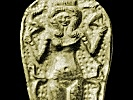

  
[Intangible Textual Heritage](../../index)  [Ancient Near
East](../index)  [Index](index)  [Previous](phc12) 

------------------------------------------------------------------------

  
*The Philistines*, by R.A.S. Macalister, \[1913\], at Intangible Textual
Heritage

------------------------------------------------------------------------

p. 136

### INDEX OF SCRIPTURAL REFERENCES

(*Where the English numeration of verses differs from the Hebrew, the
former is here adopted*.)

Genesis x. 6, 13, 14: 4, 28

xii\. 6: 3.

xii\. 10–20: 38.

xv\. 16: 3.

xx\. 1–18: 38.

xxi 22–34: 38, 39. xxvi. 1–23: 38, 39, 88.

Exodus xiii. 17: 39.

xv\. 14: 39.

xxxiii\. 31: 40.

Deuteronomy ii. 23: 5, 11, 68.

Joshua v. 2: 126.

xi\. 21: 60, 68.

xii\. 23: 43.

xiii\. 1–3: 4, 40, 43, 68, 74.

xiii\. 4: 5.

xvii: 74.

xvii\. 16: 43.

xix\. 27: 69.

xix\. 40: 76.

xix\. 43: 74.

Judges i. 18, 19: 40, 48, 89, 90.

iii\. 3: 40, 79.

iii\. 31: 41.

v\. 6: 41.

viii\. 33-ix. 46: 123.

x\. 6, 7, 11: 2, 44, 105.

xiii\. 1, 5: 2.

xiv\. 2: 2.

xvi\. 23–31: 41, 90, 123.

xviii\. 2: 38.

1 Samuel iv: 46.

v\. 1–5; 62, 89, 100.

vi\. 18: 89.

vii: 48.

vii\. 11, 12: 4,27, 47, 52.

ix\. 16: 49.

x\. 5: 49.

xiii\. 5: 90.

xiii\. 19–23: 4, 125.

xiv\. 3: 48, 76.

xvi\. 14–18: 57.

xvi\. 21: 54.

xvii: 54, 80.

xvii\. 51–54: 4, 75.

1 Samuel xviii. 1: 57.

xviii\. 30: 89.

xix\. 7: 57.

xxvii\. 2: 88.

xxvii\. 5: 89.

xxix\. 2: 90.

xxix\. 3, 9: 89.

xxx\. 14: 5, 89.

xxxi\. 9: 91.

2 Samuel v. 2: 57.

v\. 17–21: 4, 53.

v\. 21: 91.

v\. 22–25: 53.

viii\. 1: 53.

xviii\. 3: 55.

xx\. 23: 7.

xxi\. 12, 17: 4, 55.

xxi\. 18, 19: 56.

xxi\. 22: 60.

xxiii\. 9: 57.

xxiii\. 11: 42.

1 Kings ii. 39: 60.

iv\. 19: 49.

iv\. 21: 88.

vi, vii: 124.

vi\. 7: 126.

vii\. 30: 80.

ix\. 16: 59.

xiv\. 25: 59.

2 Kings i. 2: 77, 91.

xi\. 4, 19: 7.

xii\. 18: 63.

xviii\. 8: 63. 71, 89.

xviii\. 14: 64.

1 Chronicles iv. 19: 45.

vii\. 12: 6.

xi\. 13: 4, 42, 57.

xiv\. 8–12: 1, 54.

xiv\. 13–16: 54.

xviii\. 1: 54.

xx\. 4: 56.

2 Chronicles xi. 8: 73.

xxi\. 16: 4.

xxvi\. 14: 80.

xxviii\. 18: 63.

Ezra ii. 53: 62.

Nehemiah iv. 7: 66.

Nehemiah vii. 55: 62.

xiii\. 23, 24: 66.

Psalm xxxiv. title: 38.

lx\. 8–12: 61.

lxxxiii: 66.

lxxxiii\. 9; 42.

lxxxvii.: 70.

cviii\. 7–10: 61.

Isaiah ii. 6: 91.

ix\. 1: 43.

ix\. 12. 2,63.

x\. 32: 51.

xx\. 1: 64.

xxviii\. 21: 54.

xlvi\. 1: 99.

Jeremiah vii. 14: 76.

xxv\. 20: 73, 88.

xlvii\. 1: 65.

xlvii\. 4: 5, 11.

Ezekiel xvi. 27: 70.

xxiii\. 24: 80.

xxv\. 16: 6. 88.

xxx\. 5: 6, 123.

xliv\. 7: 61.

Joel iii. 4: 43.

Amos i. 6: 71.

i\. 8: 73, 88, 125.

iii\. 9: 73, 125.

vi\. 2: 73.

ix\. 7: 1, 5, 11, 13.

Micah 1. 10: 72.

Zephaniah i. 8, 9: 62, 102.

ii\. 4: 69, 74.

ii\. 5: 6.

ii\. 6: 13.

Zechariah ix. 5: 88.

ix\. 7: 70.

Ecclesiasticus 1. 26: 70.

1 Maccabees v. 68: 73.

x\. 83, 84: 47, 67, 73, 106.

xi\. 4: 67.

xiv\. 34: 89.

xvi\. 15: 69.

2 Maccabees xii. 40: 91.

Matthew xii. 24: 91.

John viii. 6: 51.

 

 

 

 
