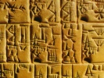

  
[Intangible Textual Heritage](../../../index.md)  [Ancient Near
East](../../index)  [Records of the Past](../index.md) 
[Egypt](../../../egy/index)  [Index](index)  [Previous](rp20112.md) 
[Next](rp20114.md) 

------------------------------------------------------------------------

  
*Records of the Past, 2nd series, Vol. I*, ed. by A. H. Sayce, \[1888\],
at Intangible Textual Heritage

------------------------------------------------------------------------

p. 64

### THE INSCRIPTIONS OF TEL-LOH

#### I. The Inscriptions of King Ur-Nina

No. 1. [1](#fn_137.md)—COLUMN
I

1\. Ninâ-ur  
2. king  
3. of Shirpurla,  
4. son of Nini-ghal-gin,  
5. the temple of the god Nin-girsu  
6. has erected.  
7. The *Ib-gal* (?)  
8. he has erected.  
9. The temple of the goddess Ninâ  
10. he has erected.

COLUMN II

1\. The *Sig-nir* (?)  
2. he has erected.  
3. His tower in stages (?)  
4. he has erected.  
5. The temple of Ê …  
6. he has erected.  
7. The temple of Ê-ghud  
8. he has erected.  
9. His observatory (?)  
10. he has erected.

p. 65

COLUMN III

? \[The palace\]  
1. of the *Ti-ash-ra* (?)  
2. he has erected.  
3. The temple of the goddess Gatumdug  
4. he has erected.  
5. The great *apzu* [1](#fn_138.md)  
6. he has constructed.  
7. After that the temple of Nin-girsu  
8. he has caused to be erected  
9. seventy great *measures* (?) of corn  
10. in his house of fruits

COLUMN IV

? \[he has stored up.\]  
1. From Mâgan [2](#fn_139.md)  
2. the mountain [3](#fn_140.md)  
3. all sorts of wood he has imported.  
4. The castle [4](#fn_141.md) of Shirpurla  
5. he has built.  
6. The small *apzu*  
7. he has constructed;

COLUMN V

? \[in the temple\]  
1. of the goddess Ninâ, lady of destinies
(?),  
2. he has placed it.  
3. Two statues (?)  
4. he has set up (?);  
5. these two statues (?) …

…………

*Lacuna*.

p. 66

No. 2. [1](#fn_142.md)—COLUMN
I

1\. Ninâ-ur  
2. the king  
3. of Shirpurla,  
4. son of Nini-ghal-gin,  
5. the *habitation* (?) of Girsu

COLUMN II

1\. has constructed.  
2. The bricks of the foundation (?)

…………

*The inscription breaks of here*.

\_\_\_\_\_\_\_\_\_

No. 3. [2](#fn_143.md)—COLUMN
I

1\. Ninâ-ur  
2. the king  
3. of Shirpurla,

COLUMN II

1\. the son of Nini-ghal-g\[in\].

------------------------------------------------------------------------

### Footnotes

[64:1](rp20113.htm#fr_138.md) *Découvertes en
Chaldée*, pl. 2, No. 1. Translated by Dr, Oppert in a *Communication to
the Académie des Inscriptions et Belles-Lettres*, 2d March 1883.

[65:1](rp20113.htm#fr_139.md) \[The *apzu*, or
"deep," was the basin for purification attached to a Babylonian temple,
corresponding to the "sea" of Solomon.—*Ed*.\]

[65:2](rp20113.htm#fr_140.md) The Sinaitic
Peninsula, perhaps including Midian.

[65:3](rp20113.htm#fr_141.md) Or "the country."

[65:4](rp20113.htm#fr_142.md) Or "wall."

[66:1](rp20113.htm#fr_143.md) *Découvertes*, pl.
2, No. 2. Translated by Dr. Hommel, *Geschichte Babyloniens und
Assyriens*, p. 285.

[66:2](rp20113.htm#fr_144.md) L. Heuzey, "Les Rois
de Tello," in the *Revue Archéologique*, Nov. 1882.

------------------------------------------------------------------------

[Next: II. Inscription of an Unknown Prince on a Boulder of
Stone](rp20114.md)
