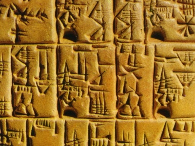

  
[Intangible Textual Heritage](../../../index)  [Ancient Near
East](../../index)  [Records of the Past](../index) 
[Egypt](../../../egy/index) 

------------------------------------------------------------------------

<table width="75%">
<colgroup>
<col style="width: 50%" />
<col style="width: 50%" />
</colgroup>
<tbody>
<tr class="odd">
<td width="50%" data-valign="TOP"></td>
<td width="50%" data-valign="CENTER"><h1 id="records-of-the-past-2nd-series-vol.-ii" data-align="CENTER">Records of the Past, 2nd series, Vol. II</h1>
<h2 id="ed.-by-a.-h.-sayce" data-align="CENTER">ed. by A. H. Sayce</h2>
<h4 id="section" data-align="CENTER">[1888]</h4></td>
</tr>
</tbody>
</table>

------------------------------------------------------------------------

[Contents](#contents)    [Start Reading](rp20200)    [Page
Index](pageidx)    [Text \[Zipped\]](rp202.txt.gz)

------------------------------------------------------------------------

Sargon asserts that he was preceded by 330 Assyrian
kings.--[p. 205](rp20240.htm#page_205)

Records of the Past 2:2 has more Egyptian material than the first,
including the Inscription of Uni, the Adventures of Sinuhit, and the
Legend of the Expulsion of the Hyksos. Also of interest on the Egyptian
side are some of the Tel El-Amarna letters, Babylonian cuneiform tablets
found in Upper Egypt, copies of correspondence between Amenophis III and
rulers throughout the ancient Near East. From Mesopotamia comes the
brutal Inscription of Assur-natsir-pal, the Moabite Stone and an
Akkadian Hymn to the Setting Sun, plus detailed king lists and
chronologies. If you are curious about Assyrian, but found cuneiform
off-putting, the Specimens of Assyrian Correspondence has complete
transliterations of three short texts in the footnotes. Even the most
mundane of these inscriptions are bejeweled with the names of gods and
goddesses, some of them little-known local deities. Another very
interesting entry in this series.--J.B. Hare,
October 14, 2008.

------------------------------------------------------------------------

 [Title Page](rp20200)  
[Preface](rp20201)  
[Contents](rp20202)  
[Hebrew Transliteration](rp20203)  

### I. Inscription of Uni (of the Sixth Dynasty)

[Introduction](rp20204)  
[Translation](rp20205)  

### II. The Adventures of Sinuhit (of the Twelfth Dynasty)

[Introduction](rp20206)  
[Text](rp20207)  

### III. The Legend of the Expulsion of the Hyksos

[Introduction](rp20208)  
[Text](rp20209)  

### IV. The Stele of Thothmes IV (of the Eighteenth Dynasty)

[Introduction](rp20210)  
[Text](rp20211)  

### V. Tablets of Tel El-Amarna Relating to Palestine in the Century Before the Exodus

[Introduction](rp20212)  
[No. I](rp20213)  
[No. II](rp20214)  
[No. III](rp20215)  
[No. IV](rp20216)  
[No. V](rp20217)  
[No. VI](rp20218)  

### VI. The Inscriptions of Telloh

[Introduction](rp20219)  
[Inscriptions of Ur-Bau](rp20220)  
[VII. Inscriptions of Gudea](rp20221)  
[VIII. Inscriptions of Ur-nin-girsu](rp20222)  
[IX. Inscription of Nam-maghâni](rp20223)  
[X. Inscription of Ghala-lamma](rp20224)  
[XI. Inscriptions of Dungi, King of Ur](rp20225)  

### VII. The Assyrian Chronological Canon

[Introduction](rp20226)  
[Text](rp20227)  
[The Assyrian Chronicle](rp20228)  

### VIII. The Standard Inscription of Assur-natsir-pal

[Introduction](rp20229)  
[Text](rp20230)  

### IX. Specimens of Assyrian Correspondence

[Introduction](rp20231)  
[Number 1](rp20232)  
[Number 2](rp20233)  
[Number 3](rp20234)  

### X. Akkadian Hymn to the Setting Sun

[Introduction](rp20235)  
[Text](rp20236)  

### XI. The Moabite Stone

[Introduction](rp20237)  
[Text](rp20238)  

 

[Table of the Egyptian Dynasties](rp20239)  
[List of Kings of Assyria](rp20240)  
[Egyptian Calendar](rp20241)  
