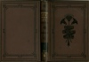

  
[Intangible Textual Heritage](../../../index.md)  [Ancient Near
East](../../index)  [Records of the Past](../index.md) 
[Egypt](../../../egy/index)  [Index](index)  [Next](rp20201.md) 

------------------------------------------------------------------------

  
*Records of the Past, 2nd series, Vol. II*, ed. by A. H. Sayce,
\[1888\], at Intangible Textual Heritage

------------------------------------------------------------------------

# RECORDS OF THE PAST

### BEING ENGLISH TRANSLATIONS

##### OF THE

## ANCIENT MONUMENTS OF EGYPT AND WESTERN ASIA

##### NEW SERIES

### EDITED BY A. H. SAYCE

###### HON. LL.D. DUBLIN; HON. D.D. EDINBURGH

#### VOL: II

Multæ terricolis linguæ cœlesibus una.

#### LONDON

#### SAMUEL BAGSTER AND SONS, LIMITED

#### 15 PATERNOSTER ROW

#### \[1888\]

Scanned, proofed and formatted by John Bruno Hare at Intangible Textual
Heritage, November 2008. This text is in the public domain in the US
because it was published prior to 1923.

 
[  
Click to enlarge](img/cover.jpg.md)  
Cover  

  [  
Click to enlarge](img/title.jpg.md)  
Title Page  

------------------------------------------------------------------------

[Next: Preface](rp20201.md)
