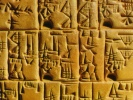

  
[Intangible Textual Heritage](../../../index.md)  [Ancient Near
East](../../index)  [Records of the Past](../index.md) 
[Egypt](../../../egy/index)  [Index](index)  [Previous](rp20204.md) 
[Next](rp20206.md) 

------------------------------------------------------------------------

  
*Records of the Past, 2nd series, Vol. II*, ed. by A. H. Sayce,
\[1888\], at Intangible Textual Heritage

------------------------------------------------------------------------

p. 4

#### THE INSCRIPTION OF UNI

\[Royal offering to Osiris the lord of Busiris\] in order that there may be given to
him a revenue in bread and liquors, at every festival and each day, with
an abundance \[of everything, a thousand loaves\], a thousand cups of
beer, a thousand oxen, a thousand geese, a thousand ducks, a thousand
fowls, a thousand birds, a thousand cloths, a thousand \[pieces of
linen, for\] the prefect of the country of the south, the guardian of
Nekhni, the dictator of Nekhabit, [1](#fn_0.md)
sole friend, feudal vassal of Osiris
Khontamentit, \[Uni;\]

\[He says:\]

\[I was born under the Majesty of Unas. I was still a youth\] wearing
the fillet under the Majesty of Teti, [2](#fn_1.md)
and employed as superintendent of the treasury, when I was
promoted [3](#fn_2.md) to the inspectorship of the
irrigated lands of Pharaoh. When I was chief of the secret chamber under
the Majesty of Pepi, his Majesty confers on me the dignity of Friend
(and) controlling prophet of his pyramid; then when \[I held this
office\] his Majesty made me Sâbu, guardian of Nekhni, \[for his heart\] was satisfied with me
above any other of his servants. I heard then all that happened, I alone
with a *Sâbu*, clerk to the Porte, in every secret affair, \[and I
executed all the writings\] [4](#fn_3.md) which had

p. 5

to be executed in the name of the king whether for the harem of the king
or for the residence of the Six, so that I satisfied the heart of the
king more than any other of his peers, (or) of his mamelouk nobles, more
than any other of his servants. \[An order was also issued\] by the
Majesty of my lord that a sarcophagus of white stone should be brought
to me from Roïu. [1](#fn_4.md) His Majesty sent a temple-slave in a boat
with the soldiers \[the hewers of the stone and the artisans\] with
orders to convey this sarcophagus to me from Roïu; and this sarcophagus comes with a
temple-slave in a large pontoon [2](#fn_5.md) from
the royal administration, as well as its lid, a stele in the form of a
gate, (to wit) the frame, the two middle blocks, and the
threshold; [3](#fn_6.md) never had anything like it
been made for any other servant whatever; but it happened that my wisdom
pleased his Majesty and that also my zeal pleased his Majesty and that
also the heart of his Majesty was satisfied with me. Also from my being
*Sâbu*, guardian of Nekhni, his Majesty
made me sole Friend, superintendent of the irrigated lands of the
Pharaoh [4](#fn_7.md) over the superintendents of
the cultivated lands who are there, and I acted to the satisfaction of
his Majesty, both when I had to keep guard behind the Pharaoh and (when
I had) to settle the royal itinerary, or to arrange the peers, and I
acted in all this to the satisfaction of his Majesty above everything.
When moreover one went to the royal harem to inform against the great
royal wife Amitsi, secretly, his Majesty made me alone descend into it
in order to listen to business, no *Sâbu* clerk of the Porte being
there, nor any peer except myself alone, because of (my) wisdom

p. 6

and my zeal which pleased his Majesty, because the heart of his Majesty
was satisfied with me; it was I who wrote everything down, I alone with
a *Sâbu* guardian of Nekhni. Now my
employment was that of superintendent of the irrigated lands of the
Pharaoh, and there never had been any of this rank who had heard the
secrets of the royal harem, in former days, excepting me, when his
Majesty made me hear (them), because my wisdom pleased his Majesty more
than any other of his peers, more than any other of his mamelouks, more
than any other of his servants.

When his Majesty carried war to the district of the nomad Hirushâu, and when his Majesty formed an army
of several myriads, levied throughout the entire South, southward
starting from Elephantinê, northward
starting from the Letopolitan nome, [1](#fn_8.md) in the country of the north, in the two
confines in their entirety, in each station between the fortified
stations of the desert, in Arotit a
country of the Negroes, in Zamu a country of the Negroes, In Amamu a country of the Negroes, in Uauaït a country of the Negroes, In Qaau
a country of the Negroes, in Totam a country of the Negroes [2](#fn_9.md); his
Majesty sent me at the head of this army. There were generals in it,
there were mamelouks of the king of Lower
Egypt in it, there were sole Friends of the Pharaoh in it, there
were in it dictators and princes of the south and of the land of the
north, [3](#fn_10.md) *Golden* Friends and
superintendents of the prophets of the south and of the land of the
north, prefects of the confines at the head of the militia of the south
and of the land of the north, cities and boroughs

p. 7

which they governed, as well as negroes from the regions mentioned
(above), and nevertheless it was I who laid down the law for
them—although my employment was that of superintendent of the irrigated
lands of the Pharaoh with the title belonging to my office [1](#fn_11.md)—so that each of them obeyed like all the
rest, [2](#fn_12.md) and each of them took with him
what he needed as regards bread and sandals for the journey, and each of
them took beer from every town, and each of them took every kind of
small cattle from every individual.

I led them to Amihit, Sibrinîhotpu, Uârit of Horu
Nibmâït; [3](#fn_13.md) then being in this
locality \[I marshalled them, I regulated\] everything and I counted the
number of this army which no servant had ever counted (before). This
army marched prosperously [4](#fn_14.md); it
shattered  [5](#fn_15.md) the country of the Hirushâu. This army marched prosperously; it
destroyed the country of the Hirushâu.
This army marched prosperously; it conquered their fortresses. [6](#fn_16.md) This army marched prosperously; it cut
down their fig-trees and their vines. This army marched prosperously; it
set fire to the \[houses of\] the inhabitants. [7](#fn_17.md) This army marched prosperously; it slew
their soldiers by myriads. This army marched in peace; it led away
captive [8](#fn_18.md) a very great number of the
inhabitants of the country, and his Majesty

p. 8

praised me because of this above everything. His Majesty sent me to lead
this army five times, in order to penetrate [1](#fn_19.md) into the country of the Hiru-shâu, as often as they revolted against
this army, and I acted to the satisfaction of his Majesty in this above
everything. Then as it was said that there were rebels among those
barbarians who extended as far as towards Tiba, [2](#fn_20.md) I
sailed in ships with this army, I attacked the coasts of this country to
the north of the country of the Hiru-shâu; then this army being on the march, I
went and overthrew them all, and I slew all the rebels among them.

When I was at the great House with the right of carrying the wand and
the sandals, the Pharaoh Mirinrî made me governor-general of the South,
southward starting from Elephantinê (and)
northward as far as the Letopolitan nome,
because my wisdom pleased his Majesty, because my zeal pleased his
Majesty, because the heart of his Majesty was satisfied with me: when
then I was invested with the right of carrying the wand and the sandals,
his Majesty favoured me therefore (giving me part of) the cattle
intended for the palace; when I was in my place I was above all his
peers, and all his mamelouks and all his servants, and this dignity had
never been conferred on any servant whatever before. I filled to the
satisfaction of the king my part of superintendent of the South, so as
to be allowed to stand at his side second (in rank) to him,
accomplishing all the duties of an engineer, judging all causes that
there were to judge

p. 9

for the royal administration in this south of Egypt, as second judge, at
every hour appointed for judgment for the royal administration in this
south of Egypt as second judge; regulating as governor all there was to
do in this south of Egypt, and never had anything like (this) taken
place in this south of Egypt before; and I did all this to the
satisfaction of his Majesty accordingly. His Majesty sent me to Abhaït, [1](#fn_21.md) to
bring back the sarcophagus (called) the Coffer of the Living, with its
lid, as well as the true and precious pyramidion of the pyramid (called)
"Khânofir mistress of Mirinrî." His
Majesty sent me to Elephantinê to bring a
stele in the form of a false door, together with its base of granite, as
well as the portcullis and the framework of granite \[for the passage of
the pyramid\], (and) to bring back the gates and the thresholds of the
exterior chapel of the pyramid "Khânofir
mistress of Mirin-rî." I returned with them to the pyramid Khânofir of Mirin-rî in six galliots, three
pontoons, three barges, (and) a man of war,—never had there been a man
of war at Abhaït or at Elephantinê; so all things that his Majesty had
ordered me (to do) were accomplished fully as his Majesty had ordered
them. His Majesty sent me to Hatnubu [2](#fn_22.md) to
transport a large table of offerings of alabaster. I brought this table
of offerings down \[from the mountain\]: as it was impossible in Hatnubu to despatch (it) along the course of
the current in this galliot, I cut a galliot out of the wood of the
acacia-sont, 60 cubits long and 30 cubits broad; I embarked the 17th day
of the third month of Shomu, and although there was no water over the
sand-banks of the river I reached the pyramid Khânofir of Mirin-rî prosperously; I was there
with \[the table of offerings\] without fail according to the order
which the majesty of my lord had deigned to command me. His Majesty sent
me to excavate five docks (?) in the South and to construct three
galliots and four pontoons of acacia-sont of Uauit; now the negro princes of the

p. 10

countries of Arotit, Uauait, Aamu,
(and) Maza felled the wood for that
purpose, and I accomplished it all in only one year, the transportation
to the water and the loading of large quantities of granite for the
pyramid Khânofir of Mirin-rî; [1](#fn_23.md) and moreover I caused a palace to be
constructed for each of these five docks (?), because I venerate,
because I exalt, because I adore above all the gods, the souls of the
king Mirin-rî, living for ever, because I have been (raised) above
everything according to the order of which his double has given unto me,
even to me who am the beloved of his father, the lauded of his mother,
the magnate in his city, the delighter of his brethren, the governor in
actual command of the South, the vassal of Osiris, Uni.

------------------------------------------------------------------------

### Footnotes

[4:1](rp20205.htm#fr_0.md) Nekhni and Nekhabit are
names applied to Eilithyia, to-day El-Kab, and to the surrounding
country.

[4:2](rp20205.htm#fr_1.md) The commencement is
conjecturally restored from an inscription published by Champollion:
*Notices*, vol. ii. p. 697. The name of King Unas is introduced only
conjecturally.

[4:3](rp20205.htm#fr_2.md) *Iri-ni Pirui-âa S. huzu*
\[*khonti*\], literally "I made an inspector," etc. *Iri* is used here
in the same manner as in the phrase *iri himit*, "to take a wife," "to
marry," literally "to make a wife."

[4:4](rp20205.htm#fr_3.md) I complete the passage
thus: *nuki iri m ân nib am sit*, "I execute p.
5 every writing among them … for the royal dwelling and the
dwelling of the Six," the pronoun *sit* referring to the feminine words
Suten-apit and *Haït-sas* which are found at the end of the sentence.

[5:1](rp20205.htm#fr_4.md) The quarries of Tourah,
opposite the site of Memphis.

[5:2](rp20205.htm#fr_5.md) For the exact sense of
the Egyptian words see Maspero, "De quelques termes," in the
*Proceedings*, May 1889.

[5:3](rp20205.htm#fr_6.md) The class of vessel named
*satu* is represented in Lepsius, ii. 76, where the *satu* Apahti of
king Assi is seen transporting the sarcophagus of this prince along with
its lid. It is a pontoon without a mast, whose bridge is so strengthened
as not to yield under the weight of the blocks of stone with which it is
loaded.

[5:4](rp20205.htm#fr_7.md) \[*Pirui-âa*, literally
"the two great houses" or "palaces." Compare the designation of the
Sublime-Porte.—Ed.\]

[6:1](rp20205.htm#fr_8.md) Aait; the symbol of the
leg is badly drawn, but perfectly recognisable in the original, as Rouge
saw from the beginning.

[6:2](rp20205.htm#fr_9.md) On these populations of
Nubia see the article of Brugsch, "Die Negerstämme der Una-Inschrift,"
in Lepsius’s *Zeitschrift*, 1882, pp. 30–36.

[6:3](rp20205.htm#fr_10.md) The term *hi-top* which
I render by "dictator" or "podestà" is peculiar to the governors and
feudal lords of the nomes of Upper Egypt, that of *Hiqa-hâit* or
"prince" being reserved for the governors and feudal lords of Lower
Egypt. The titles which follow—"Friends," "superintendents of the
prophets"—are usually attached to the preceding, and confer on those who
bear them religious authority over the priests of the nome which they
govern.

[7:1](rp20205.htm#fr_11.md) Literally "by the right
(*ni muti*) of my place." The phrase following is not yet so clear as
one could wish. It seems to enumerate what Uni did to "make the law"
(*iri sokheru*) for those who were above himself in rank and whom
nevertheless he commanded.

[7:2](rp20205.htm#fr_12.md) Literally "to put the
one of them like all his seconds."

[7:3](rp20205.htm#fr_13.md) Three localities on the
eastern frontier of the Delta, whose sites are unknown.

[7:4](rp20205.htm#fr_14.md) Literally "in peace"
(*m hotpu*), answering to the salutation of the modern Egyptian
fellahin, *bi-ssalâmat*.

[7:5](rp20205.htm#fr_15.md) *Bi* literally
signifies "to break up with the pick."

[7:6](rp20205.htm#fr_16.md) *Uonit*, Coptic *uon*,
"mound."

[7:7](rp20205.htm#fr_17.md) I have restored the
text from a passage in an inscription of Usir-tasen III, where analogous
raids are described (Lepsius: *Denkmäler*, H. pl. 136, lines 14–16).

[7:8](rp20205.htm#fr_18.md) The expression is
*m-sokit-onkhu*, literally "among those who had been struck alive," It
refers us to a barbarous mode of warfare in which no prisoners were
taken except those who had been struck by the stone mace,—a weapon which
serves as a determinative of the verb *soku*,—and whom their wound must
have left half dead on the field of battle. They were called "the
living-stricken" in opposition to those who had been killed by the mace.

[8:1](rp20205.htm#fr_19.md) *Teru-to* is in its
origin a nautical term, literally "to strike," "dash against the
ground," borrowed from the manœuvreing of vessels on the Nile.

[8:2](rp20205.htm#fr_20.md) On this name, see
Maspero: *Notes* in Lepsius’s *Zeitschrift*, 1883, p. 64; and Piehl:
*Varia* in the *Zeitschrift*, 1888, p. 111, who has not been able to
read the characters composing the name. Perhaps we may identify it, as
Krall does (*Studien sur Geschichte des Alten Ægyptens*, iii. p. 22),
with the name of Tebui met with in a text at Edfu (Dümichen:
*Tempelinschriften*, i. pl. lxxiii. l. 2, and *Die Oasen der libyschen
Wüste*, pl. xvi. *e*), which Brugsch (*Reise nach der Grossen Oase*, p.
92) does not know where to locate. If the identification is correct, we
can conclude that Tebui, associated as it is with Amit and the
north-east of Egypt, was a canton situated beyond Lake Menzaleh; the
expedition of Uni would have been made on the lake, not on the sea.
Possibly there may also be a reference to the arm of the sea which
extended to the Bitter Lakes.

[9:1](rp20205.htm#fr_21.md) A locality in the
vicinity of Assuân, where there were quarries of gray granite.

[9:2](rp20205.htm#fr_22.md) The modern Banûb
el-Hammâm, where there are quarries of marble on the right bank of the
Nile in the neighbourhood of Siut (Brugsch: *History of Egypt*, 2d
Edit., vol. i. p. 124).

[10:1](rp20205.htm#fr_23.md) These blocks of
granite are probably those which still obstruct the passage of the
pyramid of Mirin-rî (Maspero: *La Pyramide de Mirin-rî I* in the
*Recueil*, vol. ix. p. 179).

------------------------------------------------------------------------

[Next: Introduction](rp20206.md)
