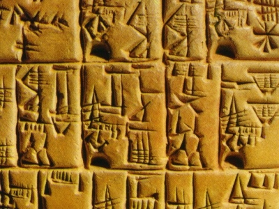

  
[Intangible Textual Heritage](../../../index.md)  [Ancient Near
East](../../index)  [Records of the Past](../index.md) 
[Egypt](../../../egy/index.md) 

------------------------------------------------------------------------

<table width="75%">
<colgroup>
<col style="width: 50%" />
<col style="width: 50%" />
</colgroup>
<tbody>
<tr class="odd">
<td width="50%" data-valign="TOP"></td>
<td width="50%" data-valign="CENTER"><h1 id="records-of-the-past-2nd-series-vol.-iii" data-align="CENTER">Records of the Past, 2nd series, Vol. III</h1>
<h2 id="ed.-by-a.-h.-sayce" data-align="CENTER">ed. by A. H. Sayce</h2>
<h4 id="section" data-align="CENTER">[1890]</h4></td>
</tr>
</tbody>
</table>

------------------------------------------------------------------------

[Contents](#contents)    [Start Reading](rp20300.md)    [Page
Index](pageidx)    [Text \[Zipped\]](rp203.txt.gz.md)

------------------------------------------------------------------------

This entry in the Records of the Past series includes the Precepts of
Ptah-Hotep, the 'oldest book in the world,' the Hymn to the Nile, and
the India House inscription of Nebuchadrezzer.

------------------------------------------------------------------------

 [Title Page](rp20300.md)  
[Preface](rp20301.md)  
[Table of Contents](rp20302.md)  
[Equivalents Of The Hebrew Letters In The Transliteration Of Assyrian
Names Mentioned In These Volumes](rp20303.md)  
[The Assyrian and Egyptian Calendars](rp20304.md)  

### The Precepts of Ptah-Hotep

[Introduction](rp20305.md)  
[Text](rp20306.md)  

### The Daughter of the Prince of Bakhtan and the Spirit that Possessed Her

[Introduction](rp20307.md)  
[Text](rp20308.md)  

### Hymn to the Nile

[Introduction](rp20309.md)  
[Text](rp20310.md)  

### Letters to Egypt from Babylonia, Assyria, and Syria, in the Fifteenth Century B.C.

[Introduction](rp20311.md)  
[I.—Letter of Assur-yuballidh, King of Assyria, to Amenophis IV, King of
Egypt](rp20312.md)  
[II.—Letter of Burna-buryas, King of Babylonia, to Amenophis IV of
Egypt](rp20313.md)  
[III.—Letter of Burna-buryas to Amenophis IV](rp20314.md)  
[IV.—Letter from Aziru to his Brother Khâi](rp20315.md)  
[V.—Letter from Aziru to his Father Dûdu](rp20316.md)  
[VI.—Letter from Rib-Addu to the King of Egypt](rp20317.md)  
[VII.—Letters from Dusratta, King of Mitanni, to Amenophis
III](rp20318.md)  
[VIII.](rp20319.md)  
[IX.—Letter of Dusratta to Amenophis IV](rp20320.md)  
[X.—Letter of Dusratta to Amenophis III](rp20321.md)  
[XI.—Letter of Dusratta to Amenophis IV](rp20322.md)  

 

### Ancient Babylonian Agricultural Precepts

[Introduction](rp20323.md)  
[Text](rp20324.md)  

### The India House Inscription of Nebuchadrezzar the Great

[Introduction](rp20325.md)  
[Text](rp20326.md)  

### Contract-Tablets Relating to Belshazzar

[Introduction](rp20327.md)  
[Text](rp20328.md)  

 

[The Kings of Ararat](rp20329.md)  
[The Kings of Persia](rp20330.md)  
[Advertisements](rp20331.md)  
