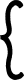
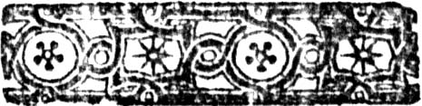

[Intangible Textual Heritage](../../index)  [Age of Reason](../index) 
[Roger Bacon](index)

------------------------------------------------------------------------

------------------------------------------------------------------------

**Friar** *B A C O N*  
H I S  
**DISCOVERY**  
O F T H E  
**M I R A C L E S**  
***A R T,***  
Of  ***N A T U R
E,***  
And  
***M A G I C K.***

Faithfully translated out of Dr *Dees*  
own Copy, by *T.M.* and never  
before in *English.*

  

------------------------------------------------------------------------

  
*L O N D O N,*  
Printed for *Simon Miller* at the Starre  
in St *Pauls* Churchyard, 1659.

------------------------------------------------------------------------

  

------------------------------------------------------------------------

  
Transcribed, printed and published privately at  
Caen, France by  
*Dr. Alan R. Young*, Ph.D.  
September, 1993

Adobe PDF version, November, 2002  
Netscape HTML version, November, 2002  

------------------------------------------------------------------------

T H E

**TRANSLATOR**

T O T H E

**READER.**

  
  
  
  
  

Prejudate eye much
lessens the noblenesse of the Subject. *Bacons* name may bring at the
first an inconvenience to the Book, but *Bacons* ingenuity will
recompence it ere he be solidly read. This as an Apology is the usher to
his other Workes, which may happily breath a more free Air hereafter,
when once the World sees how clear he was, from loving *Negromacy.*
'Twas the *Popes* smoak which made the eyes of that Age so sore, as they
could not discern any open hearted and clear headed *soul* from an
*heretical Phantasme.* The silly *Fryers* envying his too prying head,
by their craft had almost got it off his  shoulders. It's dangerous to
be wiser than the multitude, for that unruly *Beast* will have every
over-topping head to be lopped shorter, lest it plot, ruine, or stop the
light, or shadow  its extravagancies. How famous this *Frier* is in the
judgment of both godly and wise men, I referre you to the Probatums of
such men, whose single *Authorities* were of sufficiency to equallize a
Jury of others; and as for the Book, I refer it to thy reading. As for
myself, *I refer me to him, whom I serve, and hope thou wilt adore.*

------------------------------------------------------------------------

T H E

**J U D G M E N T**

O F

Divers Learned Men

C O N C E R N I N G

**Fryer *B A C O N.***

  
  
  
  
  

O Selden *de Diis
Syris Sintag.*I.r.2.—7.25.  
*    That singular Mathe-matician, learned be yond what the Age he liv'd
in did ordinarily bring forth,* Roger Bacon *an* Oxford *man, and a
Fryer minorite.*  
*    The Testimony of* Gabriel Powel *in his Book of Antichrist in
Preface,* p.14.

    Roger Bacon *an* Englishman, *a founded Scholar of* Merton-*Colledg
in* Oxford, *a very quick Philosopher, and withall a very famous Divine,
he had an incredible knowledge in the Mathematicks, but without
Necromancy (as* John Balleus *doth report) although he be defam'd for it
by many: Now this man after he had sharply reproved the times wherein he
liv'd; these Errours, saith he, speak Antichrist present.* Nicholas *the
Fourth Pope of* Rome *did condemn his Doctrine in many things, and he
was by him kept in prison for many years together; as* Antonine *hath it
in his Chronicle. He flourished in the year of our Lord,* 1270.

    John Gerhard Vossius *in his Book of the four Popular Arts, printed
at* Amsterdam, 1650 *is every where full of the praises of* Bacon, *as
in the year* 1252. *About these mens time* Roger Bacon *also flourished,
an* Englishman, *and a Monk of the Order of St.* Francis; *who as he had
div'd into all Arts and Sciences: so also he writ many things of them,
he was a man both learned and subtil unto a Miracle, and did such
won-derfull things by the help of* Mathematicks, *that by such as were
envious and ignorant, he was accused of Diabolical* Magick*, before
Pope* Clement *the 4*th, *and for that cause was detained in prison by
him for some time.* Jo. Pecus *Earl of* Mirandula, *the Phenix of all
the wits of his Age, cals him likewise, very ingenious.* Moranlicus
*also commends highly his Opticks. He was buried at* Oxford *in the
Monastery of the Monks of his own Order,* anno 1284. *So* Chap.35. §.32.
anno 1255. *So* Chap. 60. §. 13. *Of Musick,* anno 1270. *So*
Chap.70§.7. 1270. Roger Bacon *flourisht in* England, *a man wonderfully
learned. And* Chap. 71.§.8. anno 1270. Roger Bacon *a* Franciscan *Monk,
and a Divine of* Oxford, *was famous amongst the* English *in all sorts
of* *Sciences; a man of so vast learning, that neither* England, *no nor
the world beside, had almost any thing like or equal to him. And either
by envy or ignorance of the Age, wherein he lived, was accused of*
Magick. *He in the mean time did write and recommend to the Memory of
Posterity, a Book of Weights, of the Centers of heavy things, of the
Practicks of Natural Magick, &c. For he was a man well vers'd in all
sorts of study, very learned in the Latine, Greek and Hebrew Tongues, a
Mathematician every way accomplisht, and very skilfull both in
Philosophy, Physick, Law and Divinity.*  
 

------------------------------------------------------------------------

T H E

**C O N T E N T S**

Of the

Several Chapters.

  

<table data-border="" cols="2" width="100%">
<colgroup>
<col style="width: 50%" />
<col style="width: 50%" />
</colgroup>
<tbody>
<tr class="odd">
<td width="450">Chap.1. <em>Of and against fictitious Apparences and Invocation of Spirits.</em>

Chap.2. <strong></strong> <em>Of Charmes, Figures, and their Use.</em>

Chap.3. <em>Of the force of Speech, and a Check to Magick. </em>

Chap.4. <em>Of admirable Artificial Instruments.</em>

Chap.5. <em>Of Perspective Artificial Experience.</em>

Chap.6. <em>Concerning strange Experiments</em>. 

Chap.7. <em>Of Retarding the Accidents of Old Age, and Prologation of Life.</em>

Chap.8. <em>Of obscuring the Mysteries of Art and Nature.</em>

Chap.9. <em>Of the manner to make the Philosophers Egge.</em>

Chap.10. <em>Of the same Subject another way.</em>

Chap.11. <em>Of the same Subject another way. </em>
</td>
<td width="15">I. 

4 

10 

17 

19 

23 

28 

35 

41 

46 

49
</td>
</tr>
</tbody>
</table>

  
 

------------------------------------------------------------------------

**BE** pleased to take notice, that there is now in the Press 18 Books
of the *Secrets* of Arts & Nature, Collected out of the choicest
Authors, both Antient and Modern; first designed by *John Wecker*
Dr of Physick, and now much enlarged by Dr*R.
Read.* The like never before in the *English* Tongue. To be sold at the
Starre in St *Pauls* Church-yard.

------------------------------------------------------------------------

\(I\)

A

**L E T T E R**

SENT BY

Frier *ROGER BACON*

T O

*William* of *Paris,*

Concerning both

The Secret Operation

O F

**NATURE & ART,**

As also

*The Nullity of Magick.*

**\_\_\_\_\_\_\_\_\_\_\_\_\_\_\_\_\_\_\_\_\_\_\_**  
   
 

C H A P. I.

***Of and against fictitious Apparences and Invocation of Spirits.***

Hat I may carefully
render you an answer to your desire, understand, *Nature is potent and
admirable in her working,* yet Art using the advantage of  
   
   
 

**2 *Of the Invocation of Spirits.***

nature as an instrument (experience tels us) is of greater efficacy than
any natural activity.

    Whatsoever Acts otherwise than by natural or artificial means, is
not humane, but merely fictitious and deceitfull.

    We have many men that by the nimblenesse and activity of body,
diversification of sounds, exactness of instruments, darkness, or
consent, make things seem to be present, which never were really
existent in the course of Nature. The world, as any judicious eye may
see, groans under such bastard burdens. A Jugler by an handsome sleight
of hand, will put a compleat lie upon the very sight. The *Pythonissæ*
sometimes speaking from their bellies, otherwhile from the throat, than
by the mouth, do create what voices they please, either speaking at
hand, or farre off, in such a manner, as if a Spirit discoursed with a
man, and sometimes as though Beasts bellowed, which is all easily
discovered by private laying hollow Canes in the grasse, or secret
places, for so the voices of men will be known from other creatures.

    When inanimate things are violently moved, either in the Morning or
Eve-  
 

***Of the Invocation of Spirits.* 3**

ning twilight, expect no truth therein, but down-right cheating and
cousenage.

    As for consent, men by it may undertake any thing they please, if so
be they have a mutual disposition.

    These I mention, as practices wherein neither philosophical Reasons,
Art, or power of Nature is prevalent. Beyond these there is a more
damnable practice, when men despising the Rules of Philosophy,
irrationally call up wicked Spirits, supposing them of Energy to
satisfie their desires. In which there is a very vast errour, because
such persons imagine they have some authority over Spirits, and that
Spirits may be compelled by humane authority, which is altogether
impossible, since humane Energy or Authority is inferiour by much to
that of Spirits. Besides, they admit a more vast mistake, supposing such
natural instruments, as they use, to be able either to call up, or drive
away any wicked Spirit. And they continue their mistake in endeavouring
by Invocations, Deprecations or Sacrifices to please Spirits, making
them propitious to their design. Without all question, the way is
incomparably more easie  
 

------------------------------------------------------------------------

  
**4 *Of Charms, Figures,***

to obtain any thing, that is truly good for men, of God, or good Angels,
then of wicked Spirits. As for things which are incommodious for men,
wicked Spirits can no further yeeld assistance, then they have
permission, for the sins of the sonnes of men, from that God, who
governs and directs all humane affairs. Hence therefore I shall conclude
(these things being beyond, or rather against the Rules of Wisdome) No
true Philosopher did ever regard to work by any of these six wayes.

\_\_\_\_\_\_\_\_\_\_\_\_\_\_\_\_\_\_\_\_\_\_\_\_\_\_\_\_

C H A P. I I.

***Of Charms, Figures, and their Use.***

**W**Hat men ought to believe touching Figures, Charmes, and such stuff,
I shall deliver my opinion. Without doubt there is nothing in these
dayes of this kind, but what is either deceitfull, dubious, or
irrational, which Philosophers formerly invented to hide their secret
operations of Nature and Art from the eyes of an unworthy generation.
For instance, if the virtue of the Load-stone, whereby

***and their Use. 5***

whereby it draws iron to it were not discovered, some one or other who
hath a mind hereby to cosen the people, so goes about his businesse, as
lest any by-stander should discover the work of attraction to be
natural, he calls Figures, and mutters forth some Charmes. Thus many
things lie dark in Philosophical writings; in which the wiser sort of
Readers will expresse so much discretion, as reject the Figures and
Charmes, eying the works of Nature and Art, that so they may see the
mutual concurrence of animate and inanimate creatures, occasioned by
Natures conformity, not any efficacy of Figures or Charmes. This is the
cause why the unlearned crew have judged such natural or artificial
operations to be merely Magical. And some fond Magicians beleeve, That
their casting of Figures and Charmes was the sole cause of such
operations; hereupon leaving their natural and artificial operations
have stuck close to their erroneous casting of Figures and Charmes. And
thus they both have by their own folly deprived themselves of the
benefit of the others wisdome. In times past, godly and religious men,
or rather God himself, or his {Nnmb.6.27.}

------------------------------------------------------------------------

  
**6 *Of Charms, Figures,***

good Angels composed several Prayers which yet may retain their
primitive virtue. As to this day, in several Countreys certain prayers
are made over hot irons, and water in the River, &c. By which the
innocent are cleared, and guilty condemned; yet all this is done by the
Authority of the Church, and her Prelates. Our Priests exercise their
holy water, {Numb. 5.} as formerly the *Jews* did in the Old Testament,
in making the water of Tryal, whereby the wise was tryed, whether she
were an adultresse, or honest. Not to instance in others of the like
nature. Concerning those Secrets, which are revealed in Magicians
writings, although they may contain some truth, yet in regard those very
truths are enveloped with such a number of deceits, as it's not very
easie to judge betwixt the truth and falshood, they ought all worthily
to be rejected. Neither must men be believed, who would assure us, That
*Solomon,* or some other of our sage Progenitors were Authors of such
Books, because those Books are not received either by the Churches
Authority, or by any prudent men, but only by a few cheating Compa-

***and their Use.* 7**

nions to be the work of such men. Mine own experience assures me they
compose and set forth new works and inventions of their own, in lofty
high flown expressions, the more colourably to make their lies passe
under the shelter of the Text; prefixing some specious titles, the
better to set them off, impudently ascribe such bastard births to famous
Authors.

    Figures are either composed of words involved in the formes of
letters, invented to contain the sense of some \* speech or prayer {\*
Oraionis.}; or they are made according to the face of the Heavens in
proper and select seasons. The Figures of the former sort must have the
same sentence that I gave of prayers formerly; as for Figures and \* {\*
Sigillis.}Impressions of the other kind, unlesse they be made in their
peculiar seasons, they are not of any efficacy. And hence it is that all
wise men think they effect nothing, who only go according to their
prescribed Characters, not at all regarding more than the bare external
forme. The more knowing sonnes of Art, dispose all their works of Nature
and Art accord-

------------------------------------------------------------------------

  
**8 *Of Charms, Figures,***

ing to the power of the Heavens, casting their work under a right
Constellation, no lesse than the casting it in a right Figure. Now in
regard there is much difficulty to discern the motion of Celestial
Bodies, many are cousened, and very few know, how to begin their work
either profitably or truly. Hence it comes to passe, that the croud of
judicious Mathematicians and Starre gazers effect little, and that
unprofitable, while the more expert Professours, who sufficiently
understand their own Art, attain many conveniences both by their
Operations and Judgements in select and proper opportunities: And yet
let us take notice, how the Physician, or he that would re-erect a
drooping soul, effects his designe by the use of Figures or Charmes,
which in themselves are meerly fictitious (as *Constantine* the
Physician is of opinion.) {Thus some  
think the Kings evil is cured, by creating  a belief the touch of the
King can cure.} Physicians use Figures or Charmes, not for any
prevalency in them, but that the raising of the soul is of great
efficacy in the curing of the body, and raising it from infirmity to
health, by oy and confidence is done by Charmes;

***and their Use.* 9**

for they make the Patient receive the Medicine with greater confidence
and desire, exciting courage, more liberal belief, hope and pleasure.
The Physician then who would magnifie his cure, may work some way of
exciting hope and confidence in his Patient; not that hereby he should
cheat, but stirre up the sick to believe he shall recover, which if we
pin our faith on *Constantines* sleeve, is very tolerable. {This may
be  
done lawfully, if the party that is the principal agent doth nothing by
way of compact with any Spirit, or sinistrously.} Upon this account he
defends the hanging Charmes or Figures about the Neck. The soul no
question is of much prevalency by reason of its strong affections over
its proper body, as *Avicen* saith in *lib. de anima, &* 8. *& animal.*
to which all wise men accord. Hereupon it was, that they concluded sick
persons should be delighted by the company of children to play before
them, and other pleasing objects. Yea they frequently consent to such
things as please the appetite, though they be obnoxious to their
disease; because affection, desire and hope of the soul conquers many
diseases.

------------------------------------------------------------------------

  
**10 *Of the force of Speech,***  
   
   
  

C H A P. I I I.

*S E R M O N I S.*

***Of the force of Speech, and a Check to Magick.***

**I**N regard truth must not receive the least injury, we should take
more exact notice how every agent communicateth the Virtue and *Species*
which is in it to other extrinsecal objects; I mean not only the
substantial Virtue, but even A-ctive Accidents, such as are in *tertia
specie Qualitatis.*

    As for the Virtues which flows from the Creature, some of them are
sensible, some insensible. Man which is both the most noble corporeity,
and dignified rational soul, hath no lesse than other things heat and
spirits exhaling from him and so may no lesse than other things emit and
dispose of his Virtues and *Species* to external Objects.

    Some creatures we know have power to metamorphose and alter their
objects. {Plin. Nat.Hist. lib.39.c.4.} As the Basilisk, who kils by
sight alone. The Wolf,

***and a Check to Magick.* 11**

if she first see a man before the man see him, makes the man hoarse.
{Plin. lib.8.cap. 22. Solin. Poly. cap 8. Plin. lib.8. cap.30. Solin.c
30.} The *Hyæna* suffers not the dog which comes within his shadow to
bark (as *Solinus de mirabili bus mundi,* and others) And *Aristotle
lib*.3. *de Vegetab.* saith, That Female Palm-trees bring forth fruit to
maturity by the smell of their Males. And Mares in some Kingdoms
impregnate by the smell of Horses (as *Solinus* affirms.) *Aristotle* in
his Secrets assures us of several other contingencies which issue from
the *Species* and Virtues of Plants and Animals. Hence I argue, If
Plants and Animals, which are inferiour in dignity to our humane Nature,
can emit, then surely may man more abundantly emit *Species,* Virtues
and Colours to the alteration of external Bodies. To this purpose is
that, which *Aristotle* tels us (*Lib. de somno & Vigilia*) a menstruous
woman looking in a glasse, doth infect it with spots, like clouds of
blood. *Solinus* further writes, {Cap.6. vid. & C.Plin. l.7.c.2.} That
in *Scythia* there are women which have two  

------------------------------------------------------------------------

  
**12 *Of the force of Speech,***

sights in one eye. (Hence *Ovid, Nos et pupilla duplex*) and that these
women by their glances kill men. {In the Norhern Country some are said
to have an evil eye, and to do harm by their looks, yea though they  
do it not voluntarily.} And we our selves know, That men of an evil
complexion, full of contagious infirmities, as Leprosie, the
Falling-sickness, spotted Feaver, bleer-eyed, or the like, infects those
men in their company: While on the other side, men of a sound and
wholesome complexion, especially young men, do by their very presence
exhilerate and comfort others; which no question, as *Galen* in his
T*echne,* proceeds from their pure spirits wholsome and delightsome
vapours, their sweet natural colour, and from such *Species* and Virtues
as they emit. {He holds sight by emission.}

    That man whose soul {The soul sinful or not, works morally, not
physically to the hurt of others, but the man who hath a body may do
something *Medicante corpre.*} is defiledwithmany hainous sins, his Body
infirme, his Complexion evil, and hath a vehement fancy and desire to
hurt his neighbour, may bring more inconveniences,

***and a Check to Magick.* 13**

then another man. The Reason may be, the Nature of Complexion and
infirmity yeelds obedience to the thoughts of the Heart, and is more
augmented by the intervention of our desires. Hence it is that a leprous
person, who is solicitous, desirous and fancying to infect some one or
other in the room, may more easily and forceably effect it, than he
which hath no such intention, fancy or desire. For (as *Avicen* observes
in the fore cited place) the nature of the body is obedient to the
thoughts, and more intent fancies of the soul. And (as *Avicen* in the
3d*Metaph.* affirms) the thought is the first mover, after
that the desire is made conformable to the thought, then after that the
natural virtue, which is in the members, obeys the desire and thought;
and thus it is both in good and bad effects. Hence it is that a young
man of a good Complexion, healthfull, fair, well featured Body, having
his soul not debauched with sinne, but of a strong fancy and vehement
desire to compasse the effecting of some magnificent designe, withall
adding the power of his Virtues, *Species* and natural heat; He may by
the force of these \*Spirits, {\* Al. Species.} Vapours and in-

------------------------------------------------------------------------

  
**14 *Of the force of Speech,***

fluences work both more powerfully and vehemently, than if he should
want any of these fore going qualifications, especially strong
affections and forceable imaginations. Hence I conclude, Men by the
concurrence of the foresaid Causes, Words and Works being the
Instruments, bring great undertakings to perfection.

    As for words, they are hatched within, by the thoughts and desires
of the mind, sent abroad by heat, *Vocale arteries*, and motion of the
Spirits. The places of their generation are in open passages, by which
there is a great efflux of such spirits, heat, vapours, virtues, and
*Species,* as are made by the soul and heart. And therefore words may so
farre cause alterations by these parts or passages, as their Nature will
extend. For it's evident, That breathings, yawnings, several resolutions
of Spirits and heat come thorow these open passages from the heart and
inward parts: Now if these words come from an infirm and evil
complexionated body, they are constantly obnoxious. But if from a pure
sound and wholsome constitution, they are very beneficial and
comfortable. It's clear then, That the

***and a Check to Magick.* 15**

bare generation and prolation of words joyned with desire and intention
are considerable in natural operations. Hereupon we do justly say, *Vox
viva magnum habet virtutem;* Living words are of great Virtue. Not that
they have any such Virtue of doing or undoing, as *Magicians* speak of,
but only they have the Virtue of Nature, which makes me put in this
Caution of being extream cautelous herein. For a man may, as many have
already done, erre on both hands: Some wholly denying any operation of
words: Others superfluously decline to a Magical use thereof. Our duties
should be to have a care of such Books, as are fraught with Charms,
Figures, Orizons, Conjurations, Sacrifices, or the like, because they
are purely Magical. For instance, the Book *De Officiis Spirituum,liber
de morte animæ, liber de arte notoria* with infinite others, containing
neither precepts of Nature or Art, having nothing save Magical
Fopperies. Yet herewithall we must remember, there are many Books
commonly reputed to be Magical, but have no other fault then discovering
the dignity of wisdome. What Books are suspicious, and what not; Every
discreet Readers

------------------------------------------------------------------------

  
**16 *Of the force of Speech, &c.***

experience will show him. The Book which discovers natural or artificial
operations imbrace; that which is void of either or leave both, as
suspitious and unworthy the consideration of any wise man. 'Tis usual
with *Magicians,* to treat of both unnecessary and superfluous subjects.
'Twas excellently said of *Isaac (in lib. de Febribus,) The rational
soul is not impeded in its operations, unlesse by the Manicles of
ignorance.* And *Aristotle* is of opinion, *(in lib. secret.) That a
clear and strong intellect, being impregnated by the influences of
divine Virtue, may attain to anything which is necessary.* And in
3d Meteor, he saith, *There is no influence or power, but
from God.* In the Conclusion of his Ethics, *There is no Virtue, whether
Moral or Natural without divine influence.* Hence it is, that when we
discourse of particular agents, we exclude not the Regiment of the
universal Agent, and first Cause of all things. For every first Cause
hath more influence on the Effect, than any second Cause, as he speaks
in the first proposition of Causes.  
 

***Of Artificial Instruments.* 17**  
   
   
  

C H A P. I V.

***Of admirable Artificial Instruments.***

**T**Hat I may the better demonstrate the inferiority and indignity of
Magical power to that of Nature or Art, I shall a while discourse on
such admirable operations of Art and Nature, as have not the least
Magick in them, afterwards assign them their Causes and Frames. And
first of such Engines, as are purely artificial.

    It's possible to make Engines to sail withall, as that either fresh
or salt water vessels may be guided by the help of one man, and made
sail with a greater swiftness, than others will which are full of men to
help them.

    It's possible to make a Chariot move with an inestimable swiftnesse
(such as the *Currus falcati* were, wherein our fore fathers of old
fought,) and this motion to be without the help of any living creature.

    It's possible to make Engines for flying, a man sitting in the midst
whereof, by turning onely about

------------------------------------------------------------------------

  
**18 *Of Artificial Instruments.***

an Instrument, which moves artificiall Wings made to beat the Aire, much
after the fashion of a Birds flight.

    It's possible to invent an Engine of a little bulk, yet of great
efficacy, either to the depressing or elevation of the very greatest
weight, which would be of much consequence in several Accidents: For
hereby a man may either ascend or descend any walls, delivering himself
or comrads from prison; and this Engine is only three fingers high, and
four broad.

    A man may easily make an Instrument, whereby one man may in despight
of all opposition, draw a thousand men to himself, or any other thing,
which is tractable.

    A man may make an Engine, whereby without any corporal danger, he
may walk in the bottome of the Sea, or other water. These *Alexander*
(as the Heathen Astronomer assures us) used to see the secrets of the
deeps.

    Such Engines as these were of old, and are made even in our dayes.
These all of them (excepting only that instrument of flying, which I
never saw or know any,

***Artificial Experiments,&c.* 19**

who hath seen it, though I am exceedingly acquainted with a very prudent
man, who hath invented the whole Artifice) with infinite such like
inventions, Engines and devices are feasable, as making of Bridges over
Rivers without pillars or supporters.

\_\_\_\_\_\_\_\_\_\_\_\_\_\_\_\_\_\_\_\_\_\_\_\_\_\_\_\_\_  
 

C H A P. V.

***Of Perspective Artificial Experiments.***

**T**He physical figuration of rayes are found out to be very admirable.
Glas-ses and Perspectives may be framed, to make one thing appear many,
one man an Army, the Sun and Moon to be as many as we please. As *Pliny*
in the 2d Book, Nat. Hist. chap. 30. saith, *That Nature so
disposeth of vapours, as two Sunnes, and two Moons ; yea sometimes three
Sunnes shine together in the Air.* And by the same Reason one thing may
in appearance be multiplied to an infinity, in regard that after any
creature hath exceeded his own virtue (as *Aristotle cap. de vacuo.*) no
certain bounds is to be assigned it.

------------------------------------------------------------------------

  
**20 *Artificial Experiments***

    This designe may seem advantagious to strike terrours into an
Enemies Camp or Garison, there being a multiplication of appearances of
Starres, or men assembled purposely to destroy them; Especially if the
following designe be conjoyned to the former (*viz.*) Glasses so cast,
that things at hand may appear at distance, and things at distance, as
hard at hand: yea so farre may the designe be driven, as the least
letters may be read, and things reckoned at an incredible distance, yea
starres shine in what place you please. A way, as is verily believed,
*Julius Cæsar* took by great Glasses from the Coasts of *France,* to
view the site and disposition of stoth the Castles and SeaTowns in great
*Britain.* By the framing of Glasses, bodies of the largest bulk, may in
appearance be contracted to a minute volumne, things little in
themselves show great, while others tall and lofty appear low and
creeping, things creeping and low, high and mighty, things private and
hidden to be clear and manifest. For as *Socrates* did discover a
Dragon, whose prestiferous breathings and influences corrupted both City
and Countrey thereabouts, to have

***of Perspective.* 21**

his residence in the Caverns of the Mountains. So may any other thing
done in an Enemies Camp or Garison, be discovered. Glasses may be framed
to send forth *Species,* and poisonous infectious influences, whither a
man pleaseth. And this invention *Aristotle* shewed *Alexander,* by
which he erecting the poison of a Basilisk upon the Wall of a City,
which held out against his Army, conveyed the very poison into the City
it self. Glasses may be so framed and placed, as that any man coming
into a room, shall undoubtedly imagine he sees heaps of gold, silver,
precious stones, or what you please, though upon his approach to the
place he shall perceive his mistake.

    It's then folly to seek the effecting that by Magical Illusions,
which the power of Philosophy can demonstrate.

    To speak of the more sublimate powers of Figurations, leading and
congregating rayes by several Fractions and reflexions to what distance
we please, so as any object may prove combustible. It's evident by
Perspe-

------------------------------------------------------------------------

  
**22 *Artificial Experiments,&c.***

ctives they burn backward and forward, which Authours have treated on in
their Books. That which is the most strange of Figurations and
Mouldings, is the description of Celestial Bodies, both according to
their Longitude and Latitude, in such Corporeal Figures, as they
naturally move by their diurnal motion. An Invention of more
satisfaction to a discreet head, than a Kings Crown.

    But this will suffice as to Figurations, though we might produce
infinite prodigies of the like Nature.

\_\_\_\_\_\_\_\_\_\_\_\_\_\_\_\_\_\_\_\_\_\_\_\_\_\_\_\_

  
  
  

***Of strange Apparations.* 23**  
   
   

C H A P. V I.

***Concerning strange Experiments.***

**T**O our former discourse we may adjoyn such work as are effected
without Figurations. We may have an artificial composition of Saltpeter,
and other ingredients; or of the oil of Red Petrolei, {Oleum rubrum  
Petroleum.} and other things, or with Maltha, Naphtha, with such like,
which will burn at what distance we please, with which *Pliny* reports,
*Lib.* 2. *Chap.* 104. that he kept a City against the whole Roman Army:
For by casting down *Maltha* he could burn a Souldier, though he had on
his Armour. In the next place, to these we may place the *Grecian* fire,
{Ignis Gracus.} and other combustibles. To proceed, Lamps may be made to
burn, and waters to keep hot perpetually. For I know many things which
are not consumed in the fire, as the Salamanders skin Talk, with others,
which by some adjunct both are inflamed and shine, yet are not consumed,
but rather purified. Besides these, we may speak of di-

------------------------------------------------------------------------

  
**24 *Of strange Apparations.***

vers admirable peeces of \* Nature. {\* Art it should be, as I suppose.}
As the making Thunder and Lighting in the Air; yea with a greater
advantage of horrour, then those which are onely produced by Nature. For
a very competent quantity of matter rightly prepared (the bignesse of
ones thumb) will make a most hideous noise and corruscation, this may be
done several wayes; by which a City or Army may be overcome, much after
the fashion as *Gideon* overcame that vast Army of the *Midianites* with
three hundred men, by the breaking of their Pitchers, and shining of
their Lamps, together with the sudden leaping forth of the fire, and
inestimable crackings. These would appear strange, if they were designed
to their just height both of proportion and matter. I might produce many
strange works of another kind, which though they bring no sensible
profit, yet contain an ineffible spectacle of wit, and may be applied to
the probation of all such secrets, as the ignorant crew will not
imbrace. Such might I name the attraction, of Iron to the Loadstone, a
thing so in-  
 

***Of strange Apparations.* 25**

credulous, as none save an eye-witnesse would believe. And in this
attraction of Iron, experience will show a diligent searcher, more
wonders than any vulgar capacity can entertain.

    But to proceed to greater, and more than these. There is an
at-traction of gold, silver, and all other metals, by a certain stone,
much after the same manner. {Silver and all other metals.
Plin.Hist.l.36. cap.20. Aliter Vinegar.} Besides one stone will runne to
the heap. Plants may have their mutual concurrence, and the parts of
sensible creatures locally divided, will naturally move to a mutual
imbracement. The consideration whereof makes me think, that there is not
any thing, whether in divine or outward matters too difficult for my
faith. To proceed higher, The whole power of the Mathematicks may
compose a spherical Engine, according to *Ptolomies* frame in eight
Almagest; which sincerely describes both longitude and latitude of all
Celestial Bodies; but to give them a natural diurnal motion is not in
the power of the Mathematicks. However a discreet head-piece would do
well to try the making hereof of

------------------------------------------------------------------------

  
**26 *Of strange Apparations.***

such materials and artifice, as it might have a natural diurnal motion.
Which seems to me possible; and because many things are moved with the
motion of the Heavens, as Comets, the Sea tides, with several other
things, which are turned about either in the whole or in part. Such a
work might be thought more miracu-lous, and of a vaster benefit than any
thing hitherto mentioned. For the perfecting of this would frustrate all
other, whether the more curious, or the more vulgar Astronomical
Instruments, which surely would be more valuable than a Kings Coffers;
and yet there may matters be brought to passe, which though they will
not reach so near a miracle, yet of farre greater publick and private
profit. As the producing so much gold or silver, as we please, not by
the work of Nature yet accomplishment of Art: seeing there may be ten
and seven wayes of gold, eight by the mixture of silver with gold; and
the first way is made by sixteen parts of gold with some parts of
silver, which will attain the four and twentieth degree of gold, al-
{Quid sint decem & septem modi auri, octo seilicet ex admixtione
argenticum auro, & primus modus sit.}  
 

***Of strange Apparations.* 27**

wayes augmenting one degree of gold with one of silver, and so for the
mixture of brasse with gold. So the last way is \* {\* Ex from.} by the
four and twenty degrees of pure gold without mixture of other metal. And
beyond this, Nature knows no further progresse, as experience tels us.
Though Art may augment gold in the degrees of purity, even to
infinitenesse, and compleat silver, without the least cheat: And yet
that which seems more rare than all this is, That though the rational
soul (hath so farre its free-will, as) it cannot be compelled, yet may
effectually be excited,induced and disposed freely to alter its
affections, desires and behaviours to the dictates of another man. And
this may not only be practiced upon one particular person, but upon a
whole Army, City, or Body of a Nation living under one Region, if we
believe experience. And this experience, *Aristotle* discloseth in his
Book of Secrets, both of an Army, Region and single person. And thus I
have well nigh finished my thoughts of Nature and Art.

------------------------------------------------------------------------

  
**28 *Of Old Age, and Long Life.***  
   
   

C H A P. V I I.

***Of Retarding the Accidents of Old age, and Prolongation of Life.***

**T**He furthest attainment, which the complement of Art, joyned with
the whole Energy of Nature can reach unto, is the Prolongation of Life
to a very old date. How farre this is attainable, manifold experience
hath shewed us. *Pliny* reports, {Lib.22.cap.24.} That *Pollio*, a man
of a strong body and mind, lived much longer then men usually now: of
whom *Octavius Augustus* enquiring, What course he took to live so long?
was answered ænigmatically, he used Oyl without, and Mulsum within (now
according to the opinion of some, it's eight parts of water, and nine of
honey) I might produce many examples of the same quality: as that which
fell out in the dayes of King *William*; A Countreyman plowing in the
field, found a golden vessel, containing a certain liquor, which he
supposing to be the Dew of Heaven, washed his face withall, and  
 

***Of Old Age, and Long Life.* 29**

drunk of it, whereby he became renued in spirit, body and excellency,
*De bubulio factus est Bajulus Regis Sicilie,* from a Plow-man he was
made Porter to the King of *Sicily.* And the Popes Letters assures us,
That *Almannus,* held Prisoner by the *Saracens,* through the use of a
Medicine lived five hundred years. For the King, whose Captive he was,
having received this Medicine from the Embassadours of the great King,
and being suspicious of them, made tryall hereof upon this Captive,
which was brought him for that purpose. And the Lady of the Woods in
great *Britanny* searching for a white Hinde, found an Ointment,
wherewith the Keeper of the Woods anointed his whole body, except the
soals of his feet, and he lived three hundred years without any
corruption, save in the soals of his feet, which had some passions. We
our selves know it frequent in these dayes, That plain Country men,
without the advantage so much as of a Physicians advice, live very
healthfully an hundred years, or little lesse. And these are the rather
confirmed by the operations of Animals, as Harts, Ea-

------------------------------------------------------------------------

  
**30 *Of Old Age, and Long Life.***

gles, Serpents, and many other, who by the efficacy of heart or stones,
have renewed their youth: And wise men seeing that even bruits could
reach so farre to their Prolongation, adjudging it no lesse feasable by
reasonable men, set themselves on the Spurre to find out this secret.
Hereupon *Artefius* from his own ingenuity, having found the Secrets, of
Stones, Herbs, Sensibles, &c. both for the knowledge of Nature, and
especially the Prolongation of Life, did \* rejoyce, {\* Al. Glory. }
that he had lived 1025 yeares. Further, to confirme this Assertion of
the Prolongation of Life, it's considerable, That man naturally is
immortal, that is to say, *Potens non mori*, hath a possibility of not
dying. Yea, even after his fall, he might live a thousand years, though
by degrees the length of life was abbreviated. Hence it follows, That
this abbreviation is Accidental, and consequentially may be repaired in
whole or in part; and upon search we shall find the accidental cause of
this corruption, is not from the Heavens, or any other than the defect
of true Government of our health. In that our Fathers are  
 

***Of Old Age, and Long Life.* 31**

corrupt and imbecil, they beget sonnes of a corrupt complexion and
composition, and their children upon the same score are corrupted. Thus
the Pedigree of corruption is deprived from Fathers to sonnes, until we
settle upon our heirs an assured abbreviation of our dayes. Yet this
doth not conclude, That to perpetuity there shall succeed an abreviation
of our life, since there is a positive period set to our life, men may
live till they be eighty years, though then their dayes be but labour
and sorrow. {Psalm 90.}

    Now if every man would from the brest exercise a compleat Regiment
of health (which consists in such things as have relation to Meat,
Drink, Sleep, Waking, Motion, Rest, Evacuation, Retention, Air, and the
Passions of the mind) He might find a remedy resisting his proper
malady. For upon the prosecution of such a Regiment, one might arrive at
the uttermost limit of that Nature he had from his Parents will permit,
{Deest parenthesis in alio exemplo.} and be led to the very last period
of Nature (I mean Nature fallen from its origi-

------------------------------------------------------------------------

  
**32 *Of Old Age, and Long Life.***

nal uprightness) beyond which there is no further progresse; because it
doth little or nothing availe against the cor-ruption of our Ancestours:
and yet the great impossibility of any mans so ordering himself in a
mean, in all the fore-mentioned things, as the Regiment of health
exacts, wherefore abbreviation of our dayes does not only from our
Progenitors, but hath its advantages from the want of Regiment. However
the Art of Physick sufficiently determines this. Although nor rich, or
poor, wise or ignorant, no nor the most accurate Physicians themselves,
do accomplish this Regiment in themselves or others, as every eye can
discern; Yet Nature is not deficient in Necessaries, or Art any wayes
incompleat, but rather is advantagious to make insurrections and
irruptions against, and so farre into these accidental passions, as they
are either wholly or in part rooted out. At first, and in the beginning
of our ages declining, the remedy was easie: But since we have five
thousand years or more disadvantage, the Cure is more craggy.

    But waving the Inconveniences wise  
 

***Of Old Age, and Long Life.* 33**

men moved by the considerations forementioned, have endeavoured to find
out the means and wayes, which not only are forceable against the
defects of every mans proper Regiment, but also against the corruptions
of our Parents: Not that hereby they can attain to the yeares of *Adam*
or *Artesius,* by reason of the growing corruption, but that our dayes
may be augmented an hundred yeares, or more, above the ordinary age of
most men in these dayes. And though it be impossible absolutely to
retard the accidents of old age, yet hereby they may mitigate them, so
as life will happily be prorogued beyond the common account, yet alwayes
within the ultimate circuit of Nature. There is a bounder of Nature, set
in men since their Fall. There is a bounder of every particulate man
arising from the proper corruption of his Parents. Beyond both these
bounders it's impossible to passe; yet happily one may arrive beyond the
latter: nor yet so farre to go beyond it, as that the wisest of men can
never reach the former. Although there be a pos-

------------------------------------------------------------------------

  
**34 *Of Old Age, and Long Life.***

sibility and aptitude of Nature to proceed to that boundary our first
Parents set them. Let no man think this strange, since this aptitude
extends itself to immortality, as appears both before the fall,and shall
be evident after the Resurrection.

    Perhaps you may object, That neither *Aristotle, Plato,
Hippocrates,* or *Galen* ever attained that prolongation. I shall
answer, They have not attained the knowledge of many ordinary truths,
which other ingenious heads have found out; and if so, they may easily
miscarry in a businesse of such weighty consequence, though they made it
their study: especially, if we consider, how they were burdened with
other impertinencies, and so were sooner brought to their gray haires,
spending the inch of their Candles in more debased and vulgar subjects,
than in finding out the wayes to so great Secrets. We are not ignorant
*Aristotle* sayes in his Predicaments, *That the Quadrature of a Circle
is possible, yet not then known,* Yea he cofesseth, himself and all his
Predecessors were ignorant hereof, yet we in our times  
 

***Of obscuring Art and Nature.* 35**

know it. Now if *Aristotle* did come short in such a trivial, much more
might he in the deep mysteries of Nature. «E«ven in these dayes wise men
are ig«norant of many things, which the «most ordinary capacity shall
under«stand ere long. Thus the Objection is of little force.

\_\_\_\_\_\_\_\_\_\_\_\_\_\_\_\_\_\_\_\_\_\_\_\_\_\_\_\_\_  
 

C H A P. V I I I.

***Of obscuring the Mysteries of Art and Nature.***

**A**Fter an emumeration of some few examples concerning the preva-lency
of Nature and Art (that by these few we may gather many,) by these parts
the whole; and so from particulars, universals, which will demonstrate
the unnecessary aspiring to Magick, since both Nature and Art afford
such sufficencies. I shall now endeavour a methodical procedure in
singulars, laying open both the causes and wayes in particular: and yet
I will call to mind how as Secrets (of \* Nature) {\* Deest in alio.}
are not com-

------------------------------------------------------------------------

  
**36 *Of obscuring Art and Nature.***

mitted to Goats-skins and Sheeps-pelts, that every clown may understand
them, if we follow *Socrates* or *Aristotle.* For the latter in his
*Secreta Secretarum* affirmes, *He breaketh the Heavenly Seal, who
communicateth the Secrets of Nature and Art; the disclosing of Secrets
and Mysteries, producing many inconveniences.* In this case *Aulus
Gellius in Noct. Atti. de Collatione Sapientum,* sayes, *It's but folly
to profer Lettices to an Asse, since hee's content With his Thistles. Et
in lib. lapidum, The divulging of Mysteries is the diminution of their
Majesty, nor indeed continues that to be a Secret, of which the whole
fry of men is conscious.*

    For that which all men, which wise, and the more noted men affirme
is truth. That therefore which is held by the multitude, as a multitude,
must be false ; I mean of that multitude, which is distinct from knowing
men. The multitude, it's true, agree with wise men in the more vulgar
conceptions of their mind; but when they ascend to the proper principles
and conclusions of Sciences and Arts, they  
 

***Of obscuring Art and Nature.* 37**

much dissent (striving to get onely the appearancies in Sophismes and
subtilties which wise men altogether reject.) {Al. Vacans sophisinatibus
& inutilibus.} And this their ignorance of the properties and Secrets,
makes the division from knowing men. Though the common conception of the
mind, have all one Rule and Agreement with knowing men. Yet as for
common things, they are of small value, nor enquirable for themselves,
but rather for particular and proper ends.

    The Reason then, why wise men have obscured their Mysteries from the
multitude, was, because of their deriding and flighting wise mens
Secrets of wisdome, being also ignorant to make a right use of such
excellent matters. For if an accident help them to the knowledge of a
worthy Mystery, they wrest and abuse it to the manifold inconvenience of
persons and communities. Hee's then not discreet, who writes and
Secrets, unlesse he conceal it from the vulgar, and make the more
intelligent pay some labour and sweat before they understand it. In this

------------------------------------------------------------------------

  
**38 *Of obscuring Art and Nature.***

stream the whole fleet of wise men have failed from the beginning of
all, obscuring many wayes the abstuser parts of wisdome from the
capacity of the penerality. Some by Characters and Verses have delivered
many Secrets. Others by ænigmatical and figurative words, as *Aristotle*
sayes, *(in lib. Secret, O Alexander, I shall disclose to you the
greatest of Secrets, which it becomes you by divine Assistance to keep
secret, and perfect the thing proposed. Take then then the Stone, which
is no Stone, which is in every man, and in every place, and in all
times; and it shall be called the Philosophers Egge, and the* Terminus
Ovi. And thus we find multitudes of things obscured in the Writings and
Sciences of men, which no man without his Teacher can unvail.

    Thirdly, They have obscured their Secrets by their manner of
Writing, as by Consonants without Vowels, none knowing how to read them,
unlesse he know the signification of those words. {Significata.} Thus
the *Hebrews, Caldees, Arabians,* nay the *major* part of men do most an
end  
 

***Of obscuring Art and Nature.* 39**

write their Secrets, which causeth a great obscurity amongst them,
especially amongst the *Hebrewes.* For as *Aristotle* sayes in his
fore-recited Book, *God gave them all manner of Wisdome long before they
were Philosophers: And all Nations had their Originals of Philosophy
from the Hebrewes, as Albumazar in lib. Introductorii Majoris;* and
other Philoso phers, with *Josephus lib*.I. *& lib.*8. *Antiquit.* makes
it evident.

    Fourthly, This obscuring is occasioned by the mixture of several
sorts of Letters, for so the *Ethnick* Astronomer hid his knowledge,
writing it in *Hebrew, Greek* and *Latine* Letters altogether. {Ethicus
Astronomus fortasse. N. deest ergo Anglice dedi Ethnick.}

    Fifthly, This obscuring was by their inventing other letters, then
those which were in use in their own, or any other Nation, being framed
meerly by the pattern of their own fancy, which surely is the greatest
impediment; yet this was the practice of *Artesius in lib. de Secretis
Naturæ.*

------------------------------------------------------------------------

  
**40 *Of obscuring Art and Nature.***

    Sixthly, They used not the Characters of Letters, but other
Geometrical Characters, which have the power of Letters according to the
several Position of Points, and Markes. And these he likewise made use
of.

    Seventhly, There is a greater Art of obscuring, which is called *Ars
Notoria,* which is the Art of Noting and Writing, with what brevity, and
in what manner we desire. This way the *Latines* have delivered many
things. I held it necessary to touche at these obscurings, because it
may fall out, I shall thorow the magnitude of our Secrets discourse this
way, that I may help you so farre as I may.

\_\_\_\_\_\_\_\_\_\_\_\_\_\_\_\_\_\_\_\_\_\_\_\_\_\_\_\_\_

  
  
  

***How to make the Philosophers Egge.* 41**

C H A P. I X.

***In aliis Adverg.***

***Of the Manner to make the Philosophers Egge.***

**N**Ow I shall methodically handle those things I promised above, the
dissolving the Philosophers Egge, and finding out the parts thereof; a
work which will give beginning to other enterprises. {These are
ænigmatical.} Make a diligent purification of the *Calx* with the waters
of the *Alkali,* and other acute waters, grind it by several contrition
with the salts, and \* burn it {\* Al. Contermina.} with many assations,
that the earth may be perfectly separated from other elements, which I
hold worthy the \* longitude of my stature. {\* Al. Melancholia
staturæ.} Understand it if you can. For without doubt there will be a
composition of Elements, and so it will be part of that Stone which is
no Stone, which is in every man, and in every place of man; and you may
find

this  

------------------------------------------------------------------------

  
**42 *How to make the***

this in all the seasons of the year in its place. Then take oyl after
the form of a Saffron-cheese, and so viscouous first (as not to be
smitten asunder by a stroak) {Al. Insensibile.} divide the whole fiery
virtue, and separate it by dissolution, and let it be dissolved in acute
water, of a temperate acutenesse, with a slight fire, and let it be
boyled till his ‡ fatnesse, {‡ Al. Terrestreitas.} as the fatnesse of
flesh be separated by distillation, that nothing of the unctiousnesse
may issue forth; and let this fiery virtue be distilled in the water of
Urine. Afterwards boil it in Vinegar, until the least part, which is the
cause of adustion be dried up, and the fiery virtue may be had; but if
there be no regard of it, †again let it be made. {† Al. Tum fac.}  Mind
and search what I say: for the speech is difficult. The Oyl is dissolved
in acute waters, or in common Oil which works more expresly, † or in
acute Oyl of Almonds upon the fire; {† Al. Ut.} so as the Oyl be
seperated, and the spirit remain occult, in the parts of living
creatures, Sulphur and Arsnick. For the stones, in which the Oyl of
humidity overflows, have their  
 

***Philosophers Egge.* 43**

*terminus* in the union of its parts: for there is no vehement union,
but one may be dissolved from another by the nature of water, which is
the subject of liquefaction in the spirit, which is the *Medium* betwixt
the dry parts and the Oyl. The dissolution being made there will remain
in the spirit, a pure humidity, vehemently mixed with dry parts, which
are moved in it, when the fire resolves it, which is sometimes called of
the Philosophers, *Sulphur fusibile,* sometimes Oyl, other while an aery
humour, sometime a conjunctive substance, which the fire separates not,
sometimes *Camphore:* and if you please, this is the Philosophers Egge,
or rather the *Terminus* and end of the Egge; and it came to us from
these Oyls, and may be esteemed amongst the subtilities, when it is
purged and separated from the water and oyl in which it is. Further, the
Oyl is corrupted by grinding it with deficeating things, as with salt or
*Atrimentum,* and by assation, because there is a passion arising from
the contrary; and afterwards it is to be sublimated, until it be
deprived of † its oleagineity, {† Al. Olio suo.} and because its as
Sulphur or Arsnick amongst Minerals, it may be prepared, even as it is.
Yet it's bet-

------------------------------------------------------------------------

  
**44 *How to make the***

ter to boil it in waters, that are temperate in acuity, until it be
purged and whitened. Which wholsom exaltation is made either in hot or
moist fire: The distilation must be re-iterated, that it may
sufficiently receive its goodnesse, until it be rectified, the signs of
its last rectification are candor and crystalline serenity: And when
other things grow black, by fire, this grows white, is cleansed, shines
with clearnesse and admirable splendour. From this water and its earth
comes *Argentum vivum* in Minerals, and \* when the matter hath waxed
white, {Al. Quandoque in salem Aru.oniacum.} this way it is congealed;
the Stone of *Aristotle,* which is no Stone, it's set in a Pyramid a hot
place, or (if you please) in the belly of an Horse or Ox, and it
imitateth an acute Feavor. For from seven to fourteen, and from that it
sometimes proceeds to one and twenty, that the Fecis of the Elements may
be dissolved in its water, before it be separate: The dissolution and
distillation is to be iterated, until it be rectified. And here is the
end of this intention. Yet know that when you have consummated your
work, you are then to begin.  
 

***Philosophers Egge.* 45**

    Another Secret I shall shew you, you must prepare *Argentum vivum*
by mortifying it with the vapour of Tin for Pearls, and with the vapour
of Lead for the Stone *Iberus;* then let it be ground with desiccating
things, and *Attramentis,* and the like, as is said, and let there be an
assation: Then let there be a sublimation \* if for Pearles twelve
times; {\* Al. Septies.}  if for rednesse one and twenty times, until
the humidity within it be totally corrupted. Nor is it possible, that
its humidity be separated by vapour, as the fore-said oyl; because its
vehemently mixed with its dry parts; nor doth it constitute,as in the
foresaid metals. In this Chapter you may be deceived, unlesse you
distinguish of the signification of the words. It's now high time I
involve the third Chapter: that you acquire the Calx, the \* Calx of the
body, {\* Al. Clavem operis.} which you intend, the body is calcined,
when it is appodiated, *i.e.* that the humour in it may be corrupted by
salt, and with salt Armoniack and vinegar, and sometimes with burning
things, and with Sulphur and Arsnick: and sometimes bodies are fed with
*Argentum vivum,* and sublimated from

------------------------------------------------------------------------

  
**46 *How to make the***

them, until they remain putred. The claves of the Art are congelation,
resolution, inceration, proportion; and another way purification,
distillation, separation, calcination and fixation, and then you may
acquiesce. {\* Remaneant putris, ni fallor male imprimitur aut debet
esse pura aut putres.}

\_\_\_\_\_\_\_\_\_\_\_\_\_\_\_\_\_\_\_\_\_\_\_\_\_\_\_\_  
   
 

C H A P. X.

F O R T E . 6 2 0.

***Of the same Subject another way.***

**I**N the 602. *Arabian* year you intreated me for some Secrets. Take
then the Stone, and calcine it with a light assation and strong
contrition, or with acute things. But in the end mingle it a little with
sweet water, and compound a Laxative Medicine of seven things (if you
will) or of six, or of five, or as many as you please; but my mind rests
in two things, whose proportion is better than the other fixt
proportion, or thereabouts, as experi-  
 

***Philosophers Egge.* 47**

ence will teach you. Resolve notwithstanding the gold at the fire, and
tried it better; {Al. Mollius caleseant.} but if you will credit me,
take one thing that is the Secret of Secrets of Nature, able to do
Miracles. Let it be mixed from two or more, or a Phoenix, which is a
singular creature † at the fire, {† Al. Adjunge.} and incorporate by a
strong motion: to which if hot liquor four or five times be applied, you
have the composition. Yet afterwards the coelestial nature is
deliberated, if you infuse hot water three or four times. Divide
therefore the week from the strong in several vessels, if you believe
me: Let that which is good be evacuated. Again, use the pouder, and the
water which remains, carefully expresse: For of a certain, it will
produce the parts of the pouder, not incorporated : therefore take the
water by it self; because the pouder exiccated from it hath power to be
incorporated into the Laxative Medicine. Work therefore as formerly,
until you distinguish the strong from the weak, and apply the pouder
three, four, five times or oftener, and

------------------------------------------------------------------------

  
**48 *How to make the***

work alwayes the way: And if you cannot work with with hot waters, do it
with water of *Alkali,* and by such acute things you make the violence
of the Medicine. But if by reason of the acuity and softnesse of the
Medicine it be broken, the pouder, being applied, apply very carefully
more of the hard and soft. But if it be by reason of the abundance of
the pouder apply more of the Medicine; if it be by reason of the
strength of the water, water it with pistils; {Pistillo.} and congregate
the matter, as you can, and separate the water by little and little, and
it will return to its state, which water you must exiccate: for it
contains both pouder and water of the Medicine, which are to be
incorporated, as the principle pouder. Here you may not sleep, because
here is contained a very great and profitable Secret. If you rightly
order in a right series of things, the parts of the Shrub or Willow,
they will keep natural union : and do not deliver this to oblivion, for
it is profitable for many things. You must mingle Pearls with the made
union: {Unione facta.} as I think there will arise some  
 

***Philosophers Egge.* 49**

thing like the Stone *Iberus:* and without doubt it mortifies that which
is to be mortified by the vapour of Lead. You shall find Lead, if you
expresse the living from the dead; and the dead you must bury in
*Olibanum* and *Sarcocolla.* Keep this Secret, for it is of some profit,
and so must you do with the vapour of Pearls, and the Stone *Tagus,* and
you must (as I have said) bury the dead.

\_\_\_\_\_\_\_\_\_\_\_\_\_\_\_\_\_\_\_\_\_\_\_\_\_\_\_\_\_  
   
 

C H A P. X I.

F O R T E. 6 0 3.

***Of the same Subject another way.***

**T**O your desire in the *Arabian* year 630. I return this Answer. You
must have the Medicine which may be dissolved in the thing liquified and
steeped in it, and penetrate its interiour parts, and may be mingled
with it;and it may not be a fugitive servant,but transmute it. Let it be
mingled by reason of the spirit, and let it be fixed by the Calx of the
metal; it is to be thought that fixion is prepared, when the

------------------------------------------------------------------------

  
**50 *How to make the***

body and spirit are set in its place, and the spirit is made a body.
Take then of the bones of *Adam,* and of the Calx the same weight; let
there be six to the Stone *Tagi,* and five to the stone of Pearl; let
them be ground with *Aqua vitae,* whose property it is to dissolve all
other things, so as in it they are dissolved and assated, until it be
incerate, *i.e.* let the parts be united, as the parts in wax. The sign
of inceration is, that the Medicine liquifies upon iron very hot. Then
let it be put in the same water in some hot and moist place, or let it
hang in the vapour of waters made very hot: after that dissolve and
congeal them against the Sunne, Afterwards take Saltpeter, and *argentum
vivum* shall be converted into lead : And again, wash the lead with it,
and mundifie it, that it may be the next to silver, and then work as a
pious man, and also the whole weight must be 30. But yet of Saltpeter *L
U R UV O P O Vir Can Utriet Sulphuris :* and so you may make Thunder and
Lightning, if you understand the Artifice : but you must observe,
whether I speak ænigmatically, or according to the truth. Some men have
supposed otherwise: For it is told me, that you must resolve all into
its  
 

***Philosophers Egge.* 51**

first matter, of which you have *Aristotle* speaking in vulgar and known
places, which makes me silent herein. When you have this, you have pure,
simple and equal Elements. And this you may do by contrary thing and
various operations, which formerly I have called the Claves of the Art.
And *Aristotle* sayes, *That the equality of potencies excludes action,
and passion, and corruption.* And these things *Averrho's* affirms,
reproving *Galen.* And this Medicine is esteemed the more pure and
simple which may be found, which is prevalent against Feavers, passions
of the mind and body. Farewell. *Whoever unlocks these,hath a key which
opens and no man shutts: and when he hath shut no man opens.*

    In this Translation, I followed Dr *Dees* Edition,
Printed at *Hamburg,* 1618.

*F I N I S.*

------------------------------------------------------------------------

  
Courteous Reader, *These Books following,*  
*are printed for* Simon Miller*,*  
*and Sold by him at the Starre in St.* Paul's *Church-yard.*

  
  
   
   
   
   
   
 

<table data-border="" cols="2" width="100%">
<colgroup>
<col style="width: 50%" />
<col style="width: 50%" />
</colgroup>
<tbody>
<tr class="odd">
<td data-valign="TOP"><strong><em>Small Folio.</em></strong>

<strong>D</strong>Octor Lightfoot his Harmony on the New Testament, which will shortly be reprinted with large Additions.  
   The civil Warres of <em>Spain</em> in the Reigne of <em>Charles</em> the fifth, Emperour of <em>Germany,</em> and King of that Nation, wherein our late unhappy differences are paralleled in many particulars.  
   A general History of <em>Scotland</em>, from the year 767, to the death of King <em>James,</em> containing the principal  
 
</td>
<td data-valign="TOP">Revolution; and Transactions of Church and State, with Political Observations, and reflections upon the same: by <em>David Hume</em> of <em>Godscroft.</em> 
   The History of this Iron Age.  
    Mr <em>Paul Daine on</em> the <em>Ephesians.</em> 
    The Queen of <em>Ar-</em> <em>ragon,</em> a Play: In <em>fol.</em>

<strong><em>In Quarto large.</em></strong>

<em>   Jo. Barklay</em> his <em>Ar-</em> <em>genis</em>. Translated by <em>Sir Robert le Grise</em> Knight, by his Late Majesties special Command.
</td>
</tr>
</tbody>
</table>

***Books Sold, &c.***  
 

<table data-border="" cols="2" width="100%">
<colgroup>
<col style="width: 50%" />
<col style="width: 50%" />
</colgroup>
<tbody>
<tr class="odd">
<td><strong>Quarto Small. </strong>

   An Experimental Treatise of Surgery, by <em>Felix Wortz. </em> 
<em>   Abraham’s</em> Faith, or the good Old Religion, proving  the Doctrine of  the Church of <em>England</em> to be the only true Faith of Gods Elect By <em>John</em> <em>Nicholson</em> Minister  of the Gospel.  
   The Anatomy of Mortality: By <em>George Stroad. </em> 
   Three   Treatises:  1.  The   Conversion of <em>Nineveh</em>, touching Prayer  and    Fasting. 2. Gods Trumpet sounding to Repentance. 3. Sovereigne preservatives against distrustfull  Thoughts and Cares: By <em>Will Astersoll</em> Minister of Gods Word  at  <em>Isfield</em> in <em>Sussex</em>.  
   <em>Aynsworth</em> on the <em>Canticles</em>.  
   <em>Paul Baine</em>, his <em>Diocesans</em> Trial.  
   <em>Gralle</em> against <em>Appoonius</em>. 
</td>
<td>   A Treatise of Civil policy, being a clear Decision of 43-Queries concerning prerogative, right and priviledge, in reference to the supream Prince and people: By <em>Samuel Rutherford</em> Professor of Divinity of <em>St</em> <em>Andrews</em> in Scotland.  
   Politick and Military Observations of Civil and Military Government, containing the Birth, Encrease, Decay of Monarchies, the carriage of Princes and Magistrates.  
   Mr <em>Pinchin</em> his Me- ritorious price of mans redemption, cleared.  
   Astrology Theologized, showing what nature  and influence the Starres and Planets have over  man, and how the same may be diverted and avoided.  
   <em>Wells</em> his Souls Pro- gress.  
   Christ tempted, the Devils Conquered; Being a plain  Exposition on the fourth Chapter</td>
</tr>
</tbody>
</table>

***Books Sold at the***  
 

<table data-border="" cols="2" width="100%">
<colgroup>
<col style="width: 50%" />
<col style="width: 50%" />
</colgroup>
<tbody>
<tr class="odd" data-valign="TOP">
<td>of St <em>Mathews</em> Gospel:  By <em>John Glumbledon</em>, Minister of the Gospel.  
   The Saints Society.  
   Dr <em>Stoughtous</em> thirteen choice Sermons, with his Body of Divinity.  
   The Reasons of the dissenting Brethern concerning the Presbyterian Governments, together with the answer of the Assembly of Divines.  
   <em>Gamdens</em> Remains.  
   The Harmonious Consent and Confession  of   Faith,   of all the Protestant Reformed Churches in Christendome.  
   The discription of the Universal Quadrant, by which is perform’d with great Expedition, the whole Doctrine of Triangles, both plain and Spherical: Also the Resolution of such Propositions as are most usefull in <em>Astronomy, Navigation, and Dialling</em>:    By which</td>
<td>is performed the propor- tioning of Lines for measuring of all manner of Lands, Board, Glass, Timber, Stone, &amp;c. by <em>Tho. Stirrup</em> Mathemat. 

<strong>Large Octavo.</strong>

   <em>Florus Anglicus</em>, with the lively Effigies of all the Kings and Queens since the Conquest, cut in Brass.  
   The Reconciler of the Bible, wherein above two thousand seeming Contradictions are fully and plainly Reconciled.  
   Evidences for Heaven, containing infallible Signs and real Demonstrations for assurance of Salvation: published by <em>Edm</em>. <em>Ca- lamy</em> Minister of <em>Al- dermanbury,</em> <em>Lond</em>.  
   The Life and Reign of King <em>Charles</em> from his Birth to his Death, By Lambert Wood.  
   The Night-Search, the second part:   By <em>H. Mill. </em>
</td>
</tr>
</tbody>
</table>

***Star in St. Pauls Church-yard.***  
 

<table data-border="" cols="2" width="100%">
<colgroup>
<col style="width: 50%" />
<col style="width: 50%" />
</colgroup>
<tbody>
<tr class="odd" data-valign="TOP">
<td>   A view of the Jewish Religion, with their Rites, Customes and Ceremonies.  
   Useful Instructions for these Evil times; held forth in 22. Sermons, by <em>Nicholas</em> <em>Lockyer</em>, Provost of <em>Eaton</em> Colledge.  
   The Nullity of Church Censures, or Excommunication, not of Divine Institution, but a meer humane Invention:  Written by the famous <em>Tho. Erastus</em>, and never before Englished. 

<strong>Small Octavo. </strong>

   <em>Ed. Waterhouse</em> Esq; His Discourse of Piety and Charity.  
   <em>Panacea</em>, or the Universal Medicine; being a Discourse of the  Admirable Nature and Virtues of Tobacco:  By Dr. <em>Everard</em>, and Others.  
   A view and Defence of the Reformation of the Church of <em>England</em>, 
</td>
<td>very usefull in these times.  
<em>    Daphnis</em> and <em>Chloe</em>, A most sweet and pastorall Romance for young Ladies, by <em>Geo. Thornhill,</em> Gent.  
    Mr. <em>Pct. du Moulin</em>, his Antidote against Popery; published on purpose to prevent the Delusions of the Priests and Jesuits who are now very busie amongst us  
<em>   Herberts</em> Devotions, or a Companion for a Christian, containing Meditations and prayers usefull upon all occasions.  
<em>   Ovid de Ponto,</em> in English.  
   The spirituall Seaman, or the Marriners Companion, being a Compendium of the Principles of Religion, by <em>J. Durant</em>, formerly in the Navy, now at Christ-Church Cant.  
   The Loves of <em>Clivia</em> and <em>Lozio’s</em> Romance. Mr. <em>Knowles</em>, his Rudiment of the Hebrew Tongue. </td>
</tr>
</tbody>
</table>

***Books Sold at the***  
 

<table data-border="" cols="2" width="100%">
<colgroup>
<col style="width: 50%" />
<col style="width: 50%" />
</colgroup>
<tbody>
<tr class="odd" data-valign="TOP">
<td>   A Book of Scheams or Figures of Heaven, ready set for every four Minutes of times, and very usefull for all Astrologers.  
   <em>Florus Anglicus</em>, or an exact History of <em>England</em>, from the Reign of <em>William</em> the Conquerour to the death  of the Late King.  
<em>   Lingus</em>, or the Combate of the Tongue, and five Senses for Superiority: a serious Comedy.  
   <em>Venus</em> Cabinet unlockt, and her Secrets laid open.  
   The Spirits Touch-stone; being a clear discovery how a man may certainly know whether he be truly taught by the Spirit of God, or not.  
   The poor mans Physician and Chyrurgion.  
   Physicall Rarities, containing the most choice Receipts in Physick and Chyrurgery, for </td>
<td>the cure of all Diseases Incident to mans body: By <em>R. Williams.</em> To which is added the physical Mathematicks: By <em>Hermes</em> <em>TrisMegistus</em>.  
   The Idol of Clowns, or the Relation of <em>Wat Tiler’s</em> Rebellion.  
   Historicall Collections or Ecclesiastick affairs in <em>Scotland</em>, including the murther of the Cardinal of St. <em>Andrews</em>, and the beheading of their Queen <em>Mary</em> in <em>England</em>, by R. Watson.  
   The Christian Mo-  derator, in 3 parts.  
   The Golden Fleece, or a Discourse of the cloathing of <em>England</em>.  
   Dr. <em>Sibbs</em> his Divine Meditations.  
   <em>Vigerius Preceptes</em> of <em>Idioismes</em>.  
   <em>Gretis Poemata.</em> 
   Three Books of Mr. <em>Mathews</em> Minister at <em>Swansey</em> in Southwater.  
   1 The Messiah Mag- nified by the mouthes  
of</td>
</tr>
</tbody>
</table>

***Star in St. Pauls Church-yard.***  
 

<table data-border="" cols="2" width="100%">
<colgroup>
<col style="width: 50%" />
<col style="width: 50%" />
</colgroup>
<tbody>
<tr class="odd" data-valign="TOP">
<td>of Babes in <em>America;</em> or <em>Gaius</em> and <em>Gamaliel,</em> a helpfull Father, and his hopeful Sonne, discoursing of the three most considerable points: 1. The great want of Christ. 2. The great worth that is in Christ. 3. The good way that is chalkt out by Christ.  
   2. The New Congregationall Church, prov'd to be the old Christians Church, by Scripture, Reason, and History.  
   3. The Rending Church-member Regularly call'd back to Christ and his Church.  
   A physical Dictionary, or an Interpretation of all the tearms of Art, and markes used in Physick, Anatomy, Chirurgery, and Chymistry. 

<strong><em>Duodecim.</em></strong>

   A Collection of Proverbs, <em>English, French, Dutch, Italian,</em>and <em>Spa</em>
</td>
<td><em>nish</em>, all Englished and Alphabetically Digested, by N. R. Gent.  
   Frier <em>Bacon</em> his Dis- covery of the Miracles of Art Nature and Ma- gick, Translated by <em>T.M.</em> 
   Doctor <em>Smith’s</em> practice of physick.  
   The Grammar War.  
   <em>Posselius Apothegmes.</em> 
   <em>Fasciculus Florum. </em> 
<em>   Crashaw’</em> Visions.  
   The Juniper Lecture.  
   <em>Helvicus Colloquies.</em> 
   The Christian Souldier, his Combate with the three arch-enemies of man kind, the world, the flesh, and the devil.  
   <em>Heinsius de Crepux- diis</em>.  
   The History of <em>Russia</em>, or the Government of the Emperour of <em>Muscovia</em>, with the manner  and  fashions  of the people of that Countrey.  
   <em>Drexeliu’s</em> school of Patience.  
<em>   Drexelius</em> his right  
                               In-</td>
</tr>
</tbody>
</table>

***Books Sold at the Star, &c.***  
 

<table data-border="" cols="2" width="100%">
<colgroup>
<col style="width: 50%" />
<col style="width: 50%" />
</colgroup>
<tbody>
<tr class="odd">
<td>Intention of every ones Action. 

<strong><em>Viginti Quat.</em></strong>

   The New Testament. 

   The third part of the Bible. 

   Sir <em>Richard Baker's</em> Med. and Prayers for every day of the Week.
</td>
<td><strong><em>Playes</em></strong>

   The Ball.  
   Chawbut. 

   Conspiracy. 

   Obstinate Lady. 

   The <em>London</em> chanti-clers; a Comedy full of various and delightful Mirth, never before published.
</td>
</tr>
</tbody>
</table>

  
   
   
 
