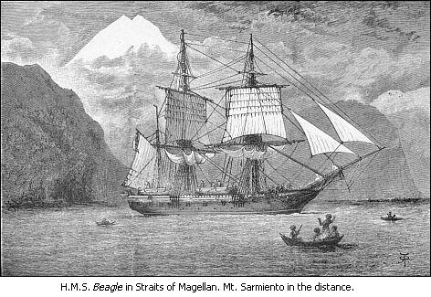

  
[Intangible Textual Heritage](../../../index)  [Age of
Reason](../../index)  [Darwin](../index)  [Index](index)  [Next](vob01) 

------------------------------------------------------------------------

[Buy this Book at
Amazon.com](https://www.amazon.com/exec/obidos/ASIN/014043268X/internetsacredte)

------------------------------------------------------------------------

*The Voyage of the Beagle*, by Charles Darwin, 11th ed. \[1890\], at
Intangible Textual Heritage

------------------------------------------------------------------------

A NATURALIST'S VOYAGE  
ROUND THE WORLD  
  
by  
CHARLES DARWIN, M.A., F.R.S.

 

|                  |                 |
|------------------|-----------------|
| First Edition    | *May 1860*      |
| Second Edition   | *May 1870*      |
| Third Edition    | *February 1872* |
| Fourth Edition   | *July 1874*     |
| Fifth Edition    | *March 1876*    |
| Sixth Edition    | *January 1879*  |
| Seventh Edition  | *May 1882*      |
| Eighth Edition   | *February 1884* |
| Ninth Edition    | *August 1886*   |
| Tenth Edition    | *January 1888*  |
| Eleventh Edition | *January 1890*  |
| Reprinted        | *June 1913*     |

 

 

 

## Journal of Researches into the Natural History and Geology of the countries visited during the voyage round the world of H.M.S. *Beagle*

### under the command of Captain Fitz Roy, R.N.

 

## By Charles Darwin, M.A., F.R.S.

AUTHOR OF 'ORIGIN OF SPECIES,' ETC.

 

 

A new edition with illustrations by R. T. Pritchett  
of places visited and objects described.  
  
LONDON  
JOHN MURRAY, ALBEMARLE STREET  
1913.

 

 

TO  
CHARLES LYELL, ESQ., F.R.S.

 

This second edition is dedicated with grateful pleasure, as an
acknowledgment that the chief part of whatever scientific merit this
journal and the other works of the author may possess, has been derived
from studying the well-known and admirable

PRINCIPLES OF GEOLOGY.

 

 

------------------------------------------------------------------------

[Next: Prefatory Notice to the Illustrated Edition](vob01)
