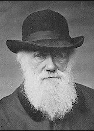

  
[Intangible Textual Heritage](../../../index.md)  [Age of
Reason](../../index)  [Darwin](../index.md) 

------------------------------------------------------------------------

[Buy this Book at
Amazon.com](https://www.amazon.com/exec/obidos/ASIN/0140436316/internetsacredte.md)

------------------------------------------------------------------------

<table width="75%">
<colgroup>
<col style="width: 50%" />
<col style="width: 50%" />
</colgroup>
<tbody>
<tr class="odd">
<td width="50%" data-valign="TOP"></td>
<td width="50%" data-valign="CENTER"><h1 id="the-descent-of-man" data-align="CENTER">The Descent of Man</h1>
<h5 id="nd-ed." data-align="CENTER">(2nd ed.)</h5>
<h2 id="by-charles-darwin" data-align="CENTER">by Charles Darwin</h2>
<h4 id="section" data-align="CENTER">[1874]</h4></td>
</tr>
</tbody>
</table>

------------------------------------------------------------------------

[Contents](#contents)    [Start Reading](dom00.md)

------------------------------------------------------------------------

|                                                                                                                           |
|---------------------------------------------------------------------------------------------------------------------------|
|  |

------------------------------------------------------------------------

[Title Page](dom00.md)  
[Preface to the Second Edition](dom01.md)  
[Contents](dom02.md)  
[Introduction](dom03.md)  

### Part I. The Descent or Origin of Man

[Chaper I. The Evidence of the Descent of Man From Some Lower
Form](dom04.md)  
[Chapter II. On The Manner of Development of Man From Some Lower
Form](dom05.md)  
[Chapter III. Comparison of the Mental Powers of Man and the Lower
Animals](dom06.md)  
[Chapter IV. Comparison of the Mental Powers of Man and the Lower
Animals--continued.](dom07.md)  
[Chapter V. On the Development of the Intellectual and Moral Faculties
During Primeval and Civilised Times](dom08.md)  
[Chapter VI. On the Affinities and Genealogy of Man](dom09.md)  
[Chapter VII. On the Races of Man](dom10.md)  

### Part II. Sexual Selection.

[Chapter VIII. Principles of Sexual Selection](dom11.md)  
[Chapter IX. Secondary Sexual Characters in the Lower Classes of the
Animal Kingdom](dom12.md)  
[Chapter X. Secondary Sexual Characters of Insects](dom13.md)  
[Chapter XI. Insects, continued](dom14.md)  
[Chapter XII. Secondary Sexual Characters of Fishes, Amphibians, and
Reptiles](dom15.md)  
[Chapter XIII. Secondary Sexual Characters of Birds](dom16.md)  
[Chapter XIV. Birds--continued](dom17.md)  
[Chapter XV. Birds--continued](dom18.md)  
[Chapter XVI. Birds--concluded](dom19.md)  
[Chapter XVII. Secondary Sexual Characters of Mammals](dom20.md)  
[Chapter XVIII. Secondary Sexual Characters of
Mammals--continued](dom21.md)  

### Part III. Sexual Selection in Relation to Man, and Conclusion

[Chapter XIX. Secondary Sexual Characters of Man](dom22.md)  
[Chapter XX. Secondary Sexual Characters Of Man--continued](dom23.md)  
[Chapter XXI. General Summary and Conclusion](dom24.md)  

 

[Supplemental Note. On Sexual Selection in Relation to Monkeys](dom25.md)  
[Index.](dom26.md)  
