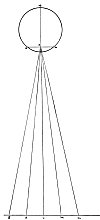

  
[Intangible Textual Heritage](../../index)  [Age of Reason](../index) 
[Index](index)   
[II. Linear Perspective Index](dvs001)  
  [Previous](0050)  [Next](0052) 

------------------------------------------------------------------------

[Buy this Book at
Amazon.com](https://www.amazon.com/exec/obidos/ASIN/0486225720/internetsacredte)

------------------------------------------------------------------------

*The Da Vinci Notebooks at Intangible Textual Heritage*

### 51.

### IN WHAT WAY THE EYE SEES OBJECTS PLACED IN FRONT OF IT.

The perception of the object depends on the direction of the eye.

Supposing that the ball figured above is the ball of the eye and let the
small portion of the ball which is cut off by the line *s t*

p. 31

[  
Click to enlarge](img/v103100.jpg)

be the pupil and all the objects mirrored on the centre of the face of
the eye, by means of the pupil, pass on at once and enter the pupil,
passing through the crystalline humour, which does not interfere in the
pupil with the things seen by means of the light. And the pupil having
received the objects, by means of the light, immediately refers them and
transmits them to the intellect by the line *a b*. And you must know
that the pupil transmits nothing perfectly to the intellect or common
sense excepting when the objects presented to it by means of light,
reach it by the line *a b;* as, for instance, by the line *b c*. For
although the lines *m n* and *f g* may be seen by the pupil they are not
perfectly taken in, because they do not coincide with the line *a b*.
And the proof is this: If the eye, shown above, wants to count the
letters placed in front, the eye will be obliged to turn from letter to
letter, because it cannot discern them unless they lie in the line *a
b;* as, for instance, in the line *a c*. All visible objects reach the
eye by the lines of a pyramid, and the point of the pyramid is the apex
and centre of it, in the centre of the pupil, as figured above.

 [28](#fn_30)

------------------------------------------------------------------------

### Footnotes

[31:28](0051.htm#fr_30) : 51. In this problem
the eye is conceived of as fixed and immovable; this is plain from line
11.

------------------------------------------------------------------------

[Next: 52.](0052)
