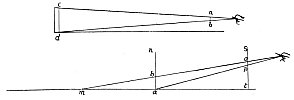
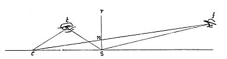

  
[Intangible Textual Heritage](../../index)  [Age of Reason](../index) 
[Index](index)   
[II. Linear Perspective Index](dvs001)  
  [Previous](0054)  [Next](0056) 

------------------------------------------------------------------------

[Buy this Book at
Amazon.com](https://www.amazon.com/exec/obidos/ASIN/0486225720/internetsacredte)

------------------------------------------------------------------------

*The Da Vinci Notebooks at Intangible Textual Heritage*

### 55.

p. 34

### ELEMENTS OF PERSPECTIVE.

All objects transmit their image to the eye in pyramids, and the nearer
to the eye these pyramids are intersected the smaller

[  
Click to enlarge](img/v103400.jpg)

will the image appear of the objects which cause them. Therefore, you
may intersect the pyramid with a vertical plane  [29](#fn_31) which reaches the base of the pyramid as
is shown in the plane *a n*.

[  
Click to enlarge](img/v103401.jpg)

The eye *f* and the eye *t* are one and the same thing; but the eye *f*
marks the distance, that is to say how far you are standing from the
object; and the eye *t* shows you the direction of it; that is whether
you are opposite, or on one side, or at an angle to the object you are
looking at. And remember that the eye *f* and the eye *t* must always be
kept on the same level. For example if you raise or lower the eye from
the distance point *f* you must do the same with the direction point
*t*. And if the point *f* shows how far the eye is distant from the
square plane but does not show on which

p. 35

side it is placed--and, if in the same way, the point *t* show *s* the
direction and not the distance, in order to ascertain both you must use
both points and they will be one and the same thing. If the eye  The relations of the distance points to the vanishing
point (55-56).*f* could see a perfect square of which all the
sides were equal to the distance between *s* and *c*, and if at the
nearest end of the side towards the eye a pole were placed, or some
other straight object, set up by a perpendicular line as shown at *r
s*--then, I say, that if you were to look at the side of the square that
is nearest to you it will appear at the bottom of the vertical plane *r
s*, and then look at the farther side and it would appear to you at the
height of the point *n* on the vertical plane. Thus, by this example,
you can understand that if the eye is above a number of objects all
placed on the same level, one beyond another, the more remote they are
the higher they will seem, up to the level of the eye, but no higher;
because objects placed upon the level on which your feet stand, so long
as it is flat--even if it be extended into infinity--would never be seen
above the eye; since the eye has in itself the point towards which all
the cones tend and converge which convey the images of the objects to
the eye. And this point always coincides with the point of diminution
which is the extreme of all we can see. And from the base line of the
first pyramid as far as the diminishing point

 [30](#fn_32)

------------------------------------------------------------------------

### Footnotes

[34:29](0055.htm#fr_31) 4: *Pariete*. Compare
the definitions in 85, 2-5, 6-27. These lines refer exclusively to the
third diagram. For the better understanding of this it should be
observed that *c s* must be regarded as representing the section or
profile of a square plane, placed horizontally (comp. lines 11, 14, 17)
for which the word *pianura* is subsequently employed (20, 22). Lines
6-13 contain certain preliminary observations to guide the reader in
understanding the diagram; the last three seem to have been added as a
supplement. Leonardo's mistake in writing *t denota* (line 6) for *f
denota* has been rectified.

[35:30](0055.htm#fr_32) : The two diagrams above
the chapter are explained by the first five lines. They have, however,
more letters than are referred to in the text, a circumstance we
frequently find occasion to remark.

------------------------------------------------------------------------

[Next: 56.](0056)
