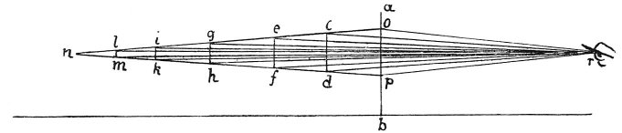

  
[Intangible Textual Heritage](../../index)  [Age of Reason](../index) 
[Index](index)   
[II. Linear Perspective Index](dvs001)  
  [Previous](0055)  [Next](0057) 

------------------------------------------------------------------------

[Buy this Book at
Amazon.com](https://www.amazon.com/exec/obidos/ASIN/0486225720/internetsacredte)

------------------------------------------------------------------------

*The Da Vinci Notebooks at Intangible Textual Heritage*

### 56.

 

there are only bases without pyramids which constantly diminish up to
this point. And from the first base where the vertical plane is placed
towards the point in the eye there will be only pyramids without bases;

p. 36

as shown in the example given above. Now, let *a b* be the said vertical
plane and *r* the point of the pyramid terminating in the eye, and *n*
the point of diminution which is always in a straight line opposite the
eye and always moves as the eye moves--just as when a rod is moved its
shadow moves, and moves with it, precisely as the shadow moves with a
body. And each point is the apex of a pyramid, all having a common base
with the intervening vertical plane. But although their bases are equal
their angles are not equal, because the diminishing point is the
termination of a smaller angle than that of the eye. If you ask me: "By
what practical experience can you show me these points?" I reply--so far
as concerns the diminishing point which moves with you --when you walk
by a ploughed field look at the straight furrows which come down with
their ends to the path where you are walking, and you will see that each
pair of furrows will look as though they tried to get nearer and meet at
the \[farther\] end.

 [31](#fn_33)

------------------------------------------------------------------------

### Footnotes

[36:31](0056.htm#fr_33) : For the easier
understanding of the diagram and of its connection with the preceding I
may here remark that the square plane shown above in profile by the line
*c s* is here indicated by *e d o p*. According to lines 1, 3 *a b* must
be imagined as a plane of glass placed perpendicularly at *o p*.

------------------------------------------------------------------------

[Next: 57.](0057)
