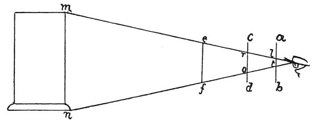

  
[Intangible Textual Heritage](../../index)  [Age of Reason](../index.md) 
[Index](index.md)   
[II. Linear Perspective Index](dvs001.md)  
  [Previous](0056)  [Next](0058.md) 

------------------------------------------------------------------------

[Buy this Book at
Amazon.com](https://www.amazon.com/exec/obidos/ASIN/0486225720/internetsacredte.md)

------------------------------------------------------------------------

*The Da Vinci Notebooks at Intangible Textual Heritage*

### 57.

 How to measure the pyramid of vision.As
regards the point in the eye; it is made more intelligible by this: If
you look into the eye of another person you will see your own image. Now
imagine 2 lines starting from your ears and going to the ears of that
image which you see in the other man's eye; you will understand that
these lines converge in such a way that they would meet in a point a
little way beyond your own image mirrored in the eye. And if you want to
measure the diminution of the pyramid in the air which occupies the
space between the object seen and the eye, you must do it according to
the diagram figured below. Let *m n* be a tower, and *e f* a, rod, which
you must move backwards and forwards till its ends correspond with those
of the tower  [32](#fn_34.md) ; then bring it
nearer to the eye, at *c d* and you

p. 37

will see that the image of the tower seems smaller, as at *r o*. Then
\[again\] bring it closer to the eye and you will see the rod project
far beyond the image of the tower

 

from *a* to *b* and from *t* to *b*, and so you will discern that, a
little farther within, the lines must converge in a point.

------------------------------------------------------------------------

### Footnotes

[36:32](0057.htm#fr_34.md) 9: *I sua stremi ..
della storre* (its ends ... of the tower) this is the case at *e f*.

------------------------------------------------------------------------

[Next: 58.](0058.md)
