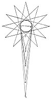

  
[Intangible Textual Heritage](../../index)  [Age of Reason](../index.md) 
[Index](index.md)   
[II. Linear Perspective Index](dvs001.md)  
  [Previous](0062)  [Next](0064.md) 

------------------------------------------------------------------------

[Buy this Book at
Amazon.com](https://www.amazon.com/exec/obidos/ASIN/0486225720/internetsacredte.md)

------------------------------------------------------------------------

*The Da Vinci Notebooks at Intangible Textual Heritage*

### 63.

p. 39

[  
Click to enlarge](img/v103900.jpg.md)

Every body in light and shade fills the surrounding air with infinite
images of itself; and these, by infinite pyramids diffused in the air,
represent this body throughout space and on every side. Each pyramid
that is composed of a long assemblage of rays includes within itself an
infinite number of pyramids and each has the same power as all, and all
as each. A circle of equidistant pyramids of vision will give to their
object angles of equal size; and an eye at each point will see the
object of the same size. The body of the atmosphere is full of infinite
pyramids composed of radiating straight lines, which are produced from
the surface of the bodies in light and shade, existing in the air; and
the farther they are from the object which produces them the more acute
they become and although in their distribution they intersect and cross
they never mingle together, but pass through all the surrounding air,
independently converging, spreading, and diffused. And they are all of
equal power \[and value\]; all equal to each, and each equal to all. By
these the images of objects are transmitted through all space and in
every direction, and each pyramid, in itself, includes, in each minutest
part, the whole form of the body causing it.

------------------------------------------------------------------------

[Next: 64.](0064.md)
