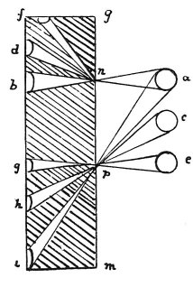

  
[Intangible Textual Heritage](../../index)  [Age of Reason](../index.md) 
[Index](index.md)   
[II. Linear Perspective Index](dvs001.md)  
  [Previous](0065)  [Next](0067.md) 

------------------------------------------------------------------------

[Buy this Book at
Amazon.com](https://www.amazon.com/exec/obidos/ASIN/0486225720/internetsacredte.md)

------------------------------------------------------------------------

*The Da Vinci Notebooks at Intangible Textual Heritage*

### 66.

 

The images of objects are all diffused through the atmosphere which
receives them; and all on every side in it. To prove this, let *a c e*
be objects of which the images are admitted to a dark chamber by the
small holes *n p* and thrown upon the plane *f i* opposite to these
holes. As many images will be produced in the chamber on the plane as
the number of the said holes.

------------------------------------------------------------------------

[Next: 67.](0067.md)
