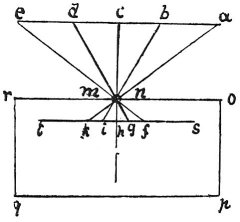

  
[Intangible Textual Heritage](../../index)  [Age of Reason](../index.md) 
[Index](index.md)   
[II. Linear Perspective Index](dvs001.md)  
  [Previous](0070)  [Next](0072.md) 

------------------------------------------------------------------------

[Buy this Book at
Amazon.com](https://www.amazon.com/exec/obidos/ASIN/0486225720/internetsacredte.md)

------------------------------------------------------------------------

*The Da Vinci Notebooks at Intangible Textual Heritage*

### 71.

### HOW THE IMAGES OF OBJECTS RECEIVED BY THE EYE INTERSECT WITHIN THE CRYSTALLINE HUMOUR OF THE EYE.

An experiment, showing how objects transmit their images or pictures,
intersecting

p. 45

 

within the eye in the crystalline humour, is seen when by some small
round hole penetrate the images of illuminated objects into a very dark
chamber. Then, receive these images on a white paper placed within this
dark room and rather near to the hole and you will see all the objects
on the paper in their proper forms and colours, but much smaller; and
they will be upside down by reason of that very intersection. These
images being transmitted from a place illuminated by the sun will seem
actually painted on this paper which must be extremely thin and looked
at from behind. And let the little perforation be made in a very thin
plate of iron. Let *a b e d e* be the object illuminated by the sun and
*o r* the front of the dark chamber in which is the said hole at *n m*.
Let *s t* be the sheet of paper intercepting the rays of the images of
these objects upside down, because the rays being straight, *a* on the
right hand becomes *k* on the left, and *e* on the left becomes *f* on
the right; and the same takes place inside the pupil.

 [38](#fn_40.md)

------------------------------------------------------------------------

### Footnotes

[45:38](0071.htm#fr_40.md) : This chapter is
already known through a translation into French by VENTURI. Compare his
'*Essai sur les ouvrages physico-mathématiques de L. da Vinci avec des
fragments tirés de ses Manuscrits, apportés de l'Italie. Lu a la
premiere classe de l'Institut national des Sciences et Arts.' Paris, An
V* (1797).

------------------------------------------------------------------------

[Next: 72.](0072.md)
