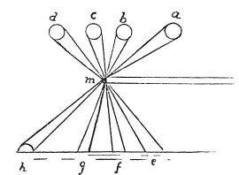
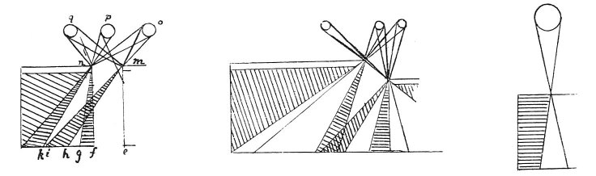

  
[Intangible Textual Heritage](../../index)  [Age of Reason](../index.md) 
[Index](index.md)   
[II. Linear Perspective Index](dvs001.md)  
  [Previous](0076)  [Next](0078.md) 

------------------------------------------------------------------------

[Buy this Book at
Amazon.com](https://www.amazon.com/exec/obidos/ASIN/0486225720/internetsacredte.md)

------------------------------------------------------------------------

*The Da Vinci Notebooks at Intangible Textual Heritage*

### 77.

 

### THE PRINCIPLE ON WHICH THE IMAGES OF BODIES PASS IN BETWEEN THE MARGINS OF THE OPENINGS BY WHICH THEY ENTER.

 The intersection of the rays (76-82).What
difference is there in the way in which images pass through narrow
openings and through large openings, or in those which pass by the sides
of shaded bodies? By moving the edges of the opening through which the
images are admitted, the images of immovable objects are made to move.
And this happens, as is shown in the 9th which demonstrates:  [39](#fn_41.md) the images of any object are all
everywhere, and all in each part of the surrounding air. It follows that
if one of the edges of the hole by which the images are admitted to a
dark chamber is moved it cuts off those rays of the image that were in
contact with it and gets nearer to other rays which previously were
remote from it &c

p. 47

### OF THE MOVEMENT OF THE EDGE AT THE RIGHT OR LEFT, OR THE UPPER, OR LOWER EDGE.

 

If you move the right side of the opening the image on the left will
move \[being that\] of the object which entered on the right side of the
opening; and the same result will happen with all the other sides of the
opening. This can be proved by the 2nd of this which shows: all the rays
which convey the images of objects through the air are straight lines.
Hence, if the images of very large bodies have to pass through very
small holes, and beyond these holes recover their large size, the lines
must necessarily intersect.  [40](#fn_42.md)

------------------------------------------------------------------------

### Footnotes

[46:39](0077.htm#fr_41.md) 11: *per la 9a che
dicie*. When Leonardo refers thus to a number it serves to indicate
marginal diagrams; this can in some instances be distinctly proved. The
ninth sketch on the page W. L. 145 b corresponds to the middle sketch of
the three reproduced.

[47:40](0077.htm#fr_42.md) : 77. 2. In the first of
the three diagrams Leonardo had drawn only one of the two margins, et
*m*.

------------------------------------------------------------------------

[Next: 78.](0078.md)
