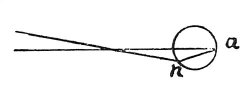
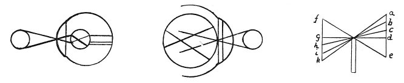

  
[Intangible Textual Heritage](../../index)  [Age of Reason](../index) 
[Index](index)   
[II. Linear Perspective Index](dvs001)  
  [Previous](0077)  [Next](0079) 

------------------------------------------------------------------------

[Buy this Book at
Amazon.com](https://www.amazon.com/exec/obidos/ASIN/0486225720/internetsacredte)

------------------------------------------------------------------------

*The Da Vinci Notebooks at Intangible Textual Heritage*

### 78.

 

Necessity has provided that all the images of objects in front of the
eye shall intersect in two places. One of these intersections is in the
pupil, the other in the crystalline lens; and if this were not the case
the eye could not see so great a number of objects as it does. This can
be proved, since all the lines which intersect do so in a point. Because
nothing is seen of objects excepting their surface; and their edges are
lines, in contradistinction to the definition of a surface. And each
minute part of a line is equal to a point; for *smallest* is said of
that than which nothing can be smaller, and this definition is
equivalent to the definition of the point. Hence it is possible for the
whole circumference of a circle to transmit its image to the point of
intersection, as is shown in the 4th of this which shows: all the
smallest parts of the images cross each

p. 48

 

other without interfering with each other. These demonstrations are to
illustrate the eye. No image, even of the smallest object, enters the
eye without being turned upside down; but as it penetrates into the
crystalline lens it is once more reversed and thus the image is restored
to the same position within the eye as that of the object outside the
eye.

------------------------------------------------------------------------

[Next: 79.](0079)
