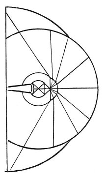

  
[Intangible Textual Heritage](../../index)  [Age of Reason](../index) 
[Index](index)   
[II. Linear Perspective Index](dvs001)  
  [Previous](0078)  [Next](0080) 

------------------------------------------------------------------------

[Buy this Book at
Amazon.com](https://www.amazon.com/exec/obidos/ASIN/0486225720/internetsacredte)

------------------------------------------------------------------------

*The Da Vinci Notebooks at Intangible Textual Heritage*

### 79.

### OF THE CENTRAL LINE OF THE EYE.

 

Only one line of the image, of all those that reach the visual virtue,
has no intersection; and this has no sensible dimensions because it is a
mathematical line which originates from a mathematical point, which has
no dimensions.

According to my adversary, necessity requires that the central line of
every image that enters by small and narrow openings into a dark chamber
shall be turned upside down, together with the images of the bodies that
surround it.

------------------------------------------------------------------------

[Next: 80.](0080)
