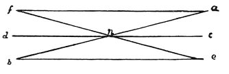

  
[Intangible Textual Heritage](../../index)  [Age of Reason](../index) 
[Index](index)   
[II. Linear Perspective Index](dvs001)  
  [Previous](0079)  [Next](0081) 

------------------------------------------------------------------------

[Buy this Book at
Amazon.com](https://www.amazon.com/exec/obidos/ASIN/0486225720/internetsacredte)

------------------------------------------------------------------------

*The Da Vinci Notebooks at Intangible Textual Heritage*

### 80.

### AS TO WHETHER THE CENTRAL LINE OF THE IMAGE CAN BE INTERSECTED, OR NOT, WITHIN THE OPENING.

It is impossible that the line should intersect itself; that is, that
its right should cross over to its left side, and so, its left side
become its right side. Because such

p. 49

 

an intersection demands two lines, one from each side; for there can be
no motion from right to left or from left to right in itself without
such extension and thickness as admit of such motion. And if there is
extension it is no longer a line but a surface, and we are investigating
the properties of a line, and not of a surface. And as the line, having
no centre of thickness cannot be divided, we must conclude that the line
can have no sides to intersect each other. This is proved by the
movement of the line *a f* to *a b* and of the line *e b* to *e f*,
which are the sides of the surface *a f e b*. But if you move the line
*a b* and the line *e f*, with the frontends *a e*, to the spot *c*, you
will have moved the opposite ends *f b* towards each other at the point
*d*. And from the two lines you will have drawn the straight line *c d*
which cuts the middle of the intersection of these two lines at the
point *n* without any intersection. For, you imagine these two lines as
having breadth, it is evident that by this motion the first will
entirely cover the other--being equal with it--without any intersection,
in the position *c d*. And this is sufficient to prove our proposition.

------------------------------------------------------------------------

[Next: 81.](0081)
