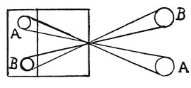
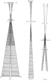

  
[Intangible Textual Heritage](../../index)  [Age of Reason](../index.md) 
[Index](index.md)   
[II. Linear Perspective Index](dvs001.md)  
  [Previous](0080)  [Next](0082.md) 

------------------------------------------------------------------------

[Buy this Book at
Amazon.com](https://www.amazon.com/exec/obidos/ASIN/0486225720/internetsacredte.md)

------------------------------------------------------------------------

*The Da Vinci Notebooks at Intangible Textual Heritage*

### 81.

### HOW THE INNUMERABLE RAYS FROM INNUMERABLE IMAGES CAN CONVERGE TO A POINT.

 

Just as all lines can meet at a point without interfering with each
other--being without breadth or thickness--in the same way all the
images of surfaces can meet there; and as each given point faces the
object opposite to it and each object faces an opposite point, the
converging rays of the image can pass through the point and diverge
again beyond it to reproduce and re-magnify the real size of that image.
But their impressions will

p. 50

[  
Click to enlarge](img/v105000.jpg.md)

p. 51

appear reversed--as is shown in the first, above; where it is said that
every image intersects as it enters the narrow openings made in a very
thin substance.

Read the marginal text on the other side.

In proportion as the opening is smaller than the shaded body, so much
less will the images transmitted through this opening intersect each
other. The sides of images which pass through openings into a dark room
intersect at a point which is nearer to the opening in proportion as the
opening is narrower. To prove this let *a b* be an object in light and
shade which sends not its shadow but the image of its darkened form
through the opening *d e* which is as wide as this shaded body; and its
sides *a b*, being straight lines (as has been proved) must intersect
between the shaded object and the opening; but nearer to the opening in
proportion as it is smaller than the object in shade. As is shown, on
your right hand and your left hand, in the two diagrams *a* *b* *c* *n*
*m* *o* where, the right opening *d* *e*, being equal in width to the
shaded object *a* *b*, the intersection of the sides of the said shaded
object occurs half way between the opening and the shaded object at the
point *c*. But this cannot happen in the left hand figure, the opening
*o* being much smaller than the shaded object *n* *m*.

It is impossible that the images of objects should be seen between the
objects and the

p. 52

openings through which the images of these bodies are admitted; and this
is plain, because where the atmosphere is illuminated these images are
not formed visibly.

When the images are made double by mutually crossing each other they are
invariably doubly as dark in tone. To prove this let *d* *e* *h* be such
a doubling which although it is only seen within the space between the
bodies in *b* and *i* this will not hinder its being seen from *f* *g*
or from *f* *m*; being composed of the images *a* *b* *i* *k* which run
together in *d* *e* *h*.

 [41](#fn_43.md)

 [42](#fn_44.md)

 [43](#fn_45.md)

 [44](#fn_46.md)

------------------------------------------------------------------------

### Footnotes

[52:41](0081.htm#fr_43.md) : 81. On the original
diagram at the beginning of this chapter Leonardo has written "*azurro*"
(blue) where in the facsimile I have marked *A*, and "*giallo*" (yellow)
where *B* stands.

[52:42](0081.htm#fr_44.md) : 15--23. These lines
stand between the diagrams I and III.

[52:43](0081.htm#fr_45.md) : 24--53. These lines
stand between the diagrams I and II.

[52:44](0081.htm#fr_46.md) : 54--97 are written
along the left side of diagram I.

------------------------------------------------------------------------

[Next: 82.](0082.md)
