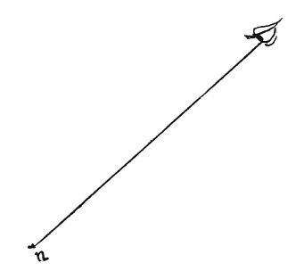

  
[Intangible Textual Heritage](../../index)  [Age of Reason](../index) 
[Index](index)   
[II. Linear Perspective Index](dvs001)  
  [Previous](0081)  [Next](0083) 

------------------------------------------------------------------------

[Buy this Book at
Amazon.com](https://www.amazon.com/exec/obidos/ASIN/0486225720/internetsacredte)

------------------------------------------------------------------------

*The Da Vinci Notebooks at Intangible Textual Heritage*

### 82.

An experiment showing that though the pupil may not be moved from its
position the objects seen by it may appear to move from their places.

If you look at an object at some distance from you and which is below
the eye, and fix both your eyes upon it and with one hand firmly hold
the upper lid open while

p. 53

 

with the other you push up the under lid--still keeping your eyes fixed
on the object gazed at--you will see that object double; one \[image\]
remaining steady, and the other moving in a contrary direction to the
pressure of your finger on the lower eyelid. How false the opinion is of
those who say that this happens because the pupil of the eye is
displaced from its position.

How the above mentioned facts prove that the pupil acts upside down in
seeing.

 [45](#fn_47)

------------------------------------------------------------------------

### Footnotes

[53:45](0082.htm#fr_47) : 82. 14--17. The
subject indicated by these two headings is fully discussed in the two
chapters that follow them in the original; but it did not seem to me
appropriate to include them here.

------------------------------------------------------------------------

[Next: 83.](0083)
