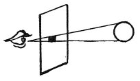

  
[Intangible Textual Heritage](../../index)  [Age of Reason](../index.md) 
[Index](index.md)   
[II. Linear Perspective Index](dvs001.md)  
  [Previous](0082)  [Next](0084.md) 

------------------------------------------------------------------------

[Buy this Book at
Amazon.com](https://www.amazon.com/exec/obidos/ASIN/0486225720/internetsacredte.md)

------------------------------------------------------------------------

*The Da Vinci Notebooks at Intangible Textual Heritage*

### 83.

### OF THE PLANE OF GLASS.

 

 Demostration of perspective by means of a
vertical glass plane (83-85).Perspective is nothing else than
seeing place \[or objects\] behind a plane of glass, quite transparent,
on the surface of which the objects behind that glass are to be drawn.
These can be traced in pyramids to the point in the eye, and these
pyramids are intersected on the glass plane.

------------------------------------------------------------------------

[Next: 84.](0084.md)
