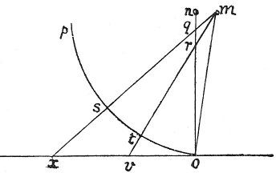

  
[Intangible Textual Heritage](../../index)  [Age of Reason](../index.md) 
[Index](index.md)   
[II. Linear Perspective Index](dvs001.md)  
  [Previous](0085)  [Next](0087.md) 

------------------------------------------------------------------------

[Buy this Book at
Amazon.com](https://www.amazon.com/exec/obidos/ASIN/0486225720/internetsacredte.md)

------------------------------------------------------------------------

*The Da Vinci Notebooks at Intangible Textual Heritage*

### 86.

 The angle of sight varies with the distance
(86-88)A simple and natural method; showing how objects appear to
the eye without any other medium.

p. 55

 

The object that is nearest to the eye always seems larger than another
of the same size at greater distance. The eye *m*, seeing the spaces *o
v x*, hardly detects the difference between them, and the. reason of
this is that it is close to them  [46](#fn_48.md) ;
but if these spaces are marked on the vertical plane *n o* the space *o
v* will be seen at *o r*, and in the same way the space *v x* will
appear at *r q*. And if you carry this out in any place where you can
walk round, it will look out of proportion by reason of the great
difference in the spaces *o r* and *r q*. And this proceeds from the eye
being so much below \[near\] the plane that the plane is foreshortened.
Hence, if you wanted to carry it out, you would have \[to arrange\] to
see the perspective through a single hole which must be at the point
*m*, or else you must go to a distance of at least 3 times the height of
the object you see. The plane *o p* being always equally remote from the
eye will reproduce the objects in a satisfactory way, so that they may
be seen from place to place.

------------------------------------------------------------------------

### Footnotes

[55:46](0086.htm#fr_48.md) 6: It is quite
inconceivable to me why M. RAVAISSON, in a note to his French
translation of this simple passage should have remarked: *Il est clair
que c'est par erreur que Leonard a ècrit* per esser visino *au lieu de*
per non esser visino. (See his printed ed. of MS. A. p. 38.)

------------------------------------------------------------------------

[Next: 87.](0087.md)
