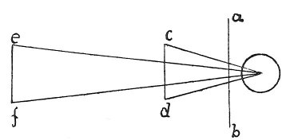

  
[Intangible Textual Heritage](../../index)  [Age of Reason](../index) 
[Index](index)   
[II. Linear Perspective Index](dvs001)  
  [Previous](0087)  [Next](0089) 

------------------------------------------------------------------------

[Buy this Book at
Amazon.com](https://www.amazon.com/exec/obidos/ASIN/0486225720/internetsacredte)

------------------------------------------------------------------------

*The Da Vinci Notebooks at Intangible Textual Heritage*

### 88.

 

Objects of equal size, situated in various places, will be seen by
different pyramids which will each be smaller in proportion as the
object is farther off.

------------------------------------------------------------------------

[Next: 89.](0089)
