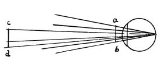

  
[Intangible Textual Heritage](../../index)  [Age of Reason](../index.md) 
[Index](index.md)   
[II. Linear Perspective Index](dvs001.md)  
  [Previous](0091)  [Next](0093.md) 

------------------------------------------------------------------------

[Buy this Book at
Amazon.com](https://www.amazon.com/exec/obidos/ASIN/0486225720/internetsacredte.md)

------------------------------------------------------------------------

*The Da Vinci Notebooks at Intangible Textual Heritage*

### 92.

### WHY WHEN AN OBJECT IS PLACED CLOSE TO THE EYE ITS EDGES ARE INDISTINCT.

When an object opposite the eye is brought too close to it, its edges
must become too confused to be distinguished; as it happens with objects
close to a light, which cast a large and indistinct shadow, so is it
with an eye which estimates objects opposite to it; in all cases of
linear perspective,

p. 57

 

the eye acts in the same way as the light. And the reason is that the
eye has one leading line (of vision) which dilates with distance and
embraces with true discernment large objects at a distance as well as
small ones that are close. But since the eye sends out a multitude of
lines which surround this chief central one and since these which are
farthest from the centre in this cone of lines are less able to discern
with accuracy, it follows that an object brought close to the eye is not
at a due distance, but is too near for the central line to be able to
discern the outlines of the object. So the edges fall within the lines
of weaker discerning power, and these are to the function of the eye
like dogs in the chase which can put up the game but cannot take it.
Thus these cannot take in the objects, but induce the central line of
sight to turn upon them, when they have put them up. Hence the objects
which are seen with these lines of sight have confused outlines.

------------------------------------------------------------------------

[Next: 93.](0093.md)
