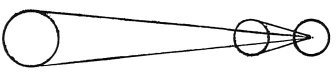

  
[Intangible Textual Heritage](../../index)  [Age of Reason](../index.md) 
[Index](index.md)   
[II. Linear Perspective Index](dvs001.md)  
  [Previous](0093)  [Next](0095.md) 

------------------------------------------------------------------------

[Buy this Book at
Amazon.com](https://www.amazon.com/exec/obidos/ASIN/0486225720/internetsacredte.md)

------------------------------------------------------------------------

*The Da Vinci Notebooks at Intangible Textual Heritage*

### 94.

 

### PERSPECTIVE.

There is no object so large but that at a great distance from the eye it
does not appear smaller than a smaller object near.

------------------------------------------------------------------------

[Next: 95.](0095.md)
