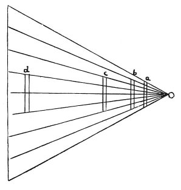

  
[Intangible Textual Heritage](../../index)  [Age of Reason](../index) 
[Index](index)   
[II. Linear Perspective Index](dvs001)  
  [Previous](0096)  [Next](0098) 

------------------------------------------------------------------------

[Buy this Book at
Amazon.com](https://www.amazon.com/exec/obidos/ASIN/0486225720/internetsacredte)

------------------------------------------------------------------------

*The Da Vinci Notebooks at Intangible Textual Heritage*

### 97.

 

### PERSPECTIVE.

Among objects of equal size, that which is most remote from the eye will
look the smallest.

------------------------------------------------------------------------

[Next: 98.](0098)
