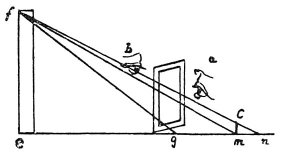

  
[Intangible Textual Heritage](../../index)  [Age of Reason](../index.md) 
[Index](index.md)   
[II. Linear Perspective Index](dvs001.md)  
  [Previous](0100)  [Next](0102.md) 

------------------------------------------------------------------------

[Buy this Book at
Amazon.com](https://www.amazon.com/exec/obidos/ASIN/0486225720/internetsacredte.md)

------------------------------------------------------------------------

*The Da Vinci Notebooks at Intangible Textual Heritage*

### 101.

 

Begin from the line *m f* with the eye below; then go up and do the same
with the line *n f*, then with the eye above and close to the 2 gauges
on the ground look at *m n*; then as *c m* is to *m n* so will *n m* be
to *n s*.

If *a n* goes 3 times into *f b, m p* will do the same into *p g*. Then
go backwards so far as that *c d* goes twice into *a n* and *p g* will
be equal to *g h*. And *m p* will go into *h p* as often as *d c* into
*o p*.

 [49](#fn_51.md)

------------------------------------------------------------------------

### Footnotes

[60:49](0101.htm#fr_51.md) : The first three lines
are unfortunately very obscure.

------------------------------------------------------------------------

[Next: 102.](0102.md)
