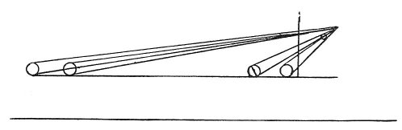

  
[Intangible Textual Heritage](../../index)  [Age of Reason](../index) 
[Index](index)   
[II. Linear Perspective Index](dvs001)  
  [Previous](0105)  [Next](0107) 

------------------------------------------------------------------------

[Buy this Book at
Amazon.com](https://www.amazon.com/exec/obidos/ASIN/0486225720/internetsacredte)

------------------------------------------------------------------------

*The Da Vinci Notebooks at Intangible Textual Heritage*

### 106.

### PERSPECTIVE.

If two similar and equal objects are placed one beyond the other at a
given distance the difference in their size will appear greater in
proportion as they are

p. 62

 

nearer to the eye that sees them. And conversely there will seem to be
less difference in their size in proportion as they are remote from the
eve.

This is proved by the proportions of their distances among themselves;
for, if the first of these two objects were as far from the eye, as the
2nd from the first this would be called the second proportion: since, if
the first is at 1 braccia from the eye and the 2nd at two braccia, two
being twice as much as one, the first object will look twice as large as
the second. But if you place the first at a hundred braccia from you and
the second at a hundred and one, you will find that the first is only so
much larger than the second as 100 is less than 101; and the converse is
equally true. And again, the same thing is proved by the 4th of this
book which shows that among objects that are equal, there is the same
proportion in the diminution of the size as in the increase in the
distance from the eye of the spectator.

------------------------------------------------------------------------

[Next: 107.](0107)
