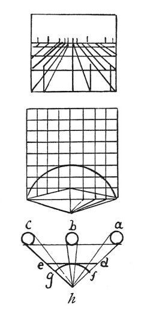

  
[Intangible Textual Heritage](../../index)  [Age of Reason](../index) 
[Index](index)   
[II. Linear Perspective Index](dvs001)  
  [Previous](0106)  [Next](0108) 

------------------------------------------------------------------------

[Buy this Book at
Amazon.com](https://www.amazon.com/exec/obidos/ASIN/0486225720/internetsacredte)

------------------------------------------------------------------------

*The Da Vinci Notebooks at Intangible Textual Heritage*

### 107.

### OF EQUAL OBJECTS THE MOST REMOTE LOOK THE SMALLEST.

 On natural perspective (107--109).The
practice of perspective may be divided into ... parts  [50](#fn_52) , of which the first treats of objects
seen by the eye at any distance; and it shows all these objects just as
the eye sees them diminished, without obliging a man to stand in one
place rather than another so long as the plane does not produce a second
foreshortening.

But the second practice is a combination of perspective derived partly
from art and partly from nature and the work done by its rules is in

p. 63

every portion of it, influenced by natural perspective and artificial
perspective. By natural perspective I mean that the plane on which this
perspective is represented is a flat surface, and this plane, although
it is parallel both in length and height, is forced to diminish in its
remoter parts more than in its nearer ones. And this is proved by the
first of what has been said above, and its diminution is natural. But
artificial perspective, that is that which is devised by art, does the
contrary; for objects equal in size increase on the plane where it is
foreshortened in proportion as the eye is more natural and nearer to the
plane, and as the part of the plane on which it is figured is farther
from the eye.

 

And let this plane be *d e* on which are seen 3 equal circles which are
beyond this plane *d e*, that is the circles *a b c*. Now you see that
the eye *h* sees on the vertical plane the sections of the images,
largest of those that are farthest and smallest of the nearest.

------------------------------------------------------------------------

### Footnotes

[62:50](0107.htm#fr_52) 4: *in* ... *parte*. The
space for the number is left blank in the original.

------------------------------------------------------------------------

[Next: 108.](0108)
