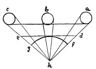

  
[Intangible Textual Heritage](../../index)  [Age of Reason](../index.md) 
[Index](index.md)   
[II. Linear Perspective Index](dvs001.md)  
  [Previous](0107)  [Next](0109.md) 

------------------------------------------------------------------------

[Buy this Book at
Amazon.com](https://www.amazon.com/exec/obidos/ASIN/0486225720/internetsacredte.md)

------------------------------------------------------------------------

*The Da Vinci Notebooks at Intangible Textual Heritage*

### 108.

 

Here follows what is wanting in the margin at the foot on the other side
of this page.

Natural perspective acts in a contrary way; for, at greater distances
the object seen appears smaller, and at a smaller distance the object
appears larger. But this said invention requires the spectator to stand
with his eye at a

p. 64

small hole and then, at that small hole, it will be very plain. But
since many (men's) eyes endeavour at the same time to see one and the
same picture produced by this artifice only one can see clearly the
effect of this perspective and all the others will see confusion. It is
well therefore to avoid such complex perspective and hold to simple
perspective which does not regard planes as foreshortened, but as much
as possible in their proper form. This simple perspective, in which the
plane intersects the pyramids by which the images are conveyed to the
eye at an equal distance from the eye is our constant experience, from
the curved form of the pupil of the eye on which the pyramids are
intersected at an equal distance from the visual virtue.

 [51](#fn_53.md)

------------------------------------------------------------------------

### Footnotes

[64:51](0108.htm#fr_53.md) 24: *la prima di sopra*
i. e. the first of the three diagrams which, in the original MS., are
placed in the margin at the beginning of this chapter.

------------------------------------------------------------------------

[Next: 109.](0109.md)
