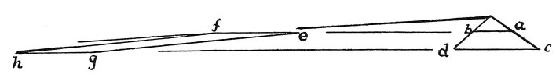

  
[Intangible Textual Heritage](../../index)  [Age of Reason](../index.md) 
[Index](index.md)   
[II. Linear Perspective Index](dvs001.md)  
  [Previous](0108)  [Next](dv10115.md) 

------------------------------------------------------------------------

[Buy this Book at
Amazon.com](https://www.amazon.com/exec/obidos/ASIN/0486225720/internetsacredte.md)

------------------------------------------------------------------------

*The Da Vinci Notebooks at Intangible Textual Heritage*

### 109.

### OF A MIXTURE OF NATURAL AND ARTIFICIAL PERSPECTIVE.

This diagram distinguishes natural from artificial perspective. But
before proceeding any farther I will define what is natural and what is
artificial perspective. Natural perspective says that the more remote of
a series of

 

objects of equal size will look the smaller, and conversely, the nearer
will look the larger and the apparent size will diminish in proportion
to the distance. But in artificial perspective when objects of unequal
size are placed at various distances, the smallest is nearer to the eye
than the largest and the greatest distance looks as though it were the
least of all; and the cause of this is the plane on which the objects
are represented; and which is at unequal distances from the eye
throughout its length. And this diminution

p. 65

of the plane is natural, but the perspective shown upon it is artificial
since it nowhere agrees with the true diminution of the said plane.
Whence it follows, that when the eye is somewhat removed from the
\[station point of the\] perspective that it has been gazing at, all the
objects represented look monstrous, and this does not occur in natural
perspective, which has been defined above. Let us say then, that the
square *a b c d* figured above is foreshortened being seen by the eye
situated in the centre of the side which is in front. But a mixture of
artificial and natural perspective will be seen in this tetragon called
*el main*  [52](#fn_54.md) , that is to say *e f g
h* which must appear to the eye of the spectator to be equal to *a b c
d* so long as the eye remains in its first position between *c* and *d*.
And this will be seen to have a good effect, because the natural
perspective of the plane will conceal the defects which would
\[otherwise\] seem monstrous.

p. 66

------------------------------------------------------------------------

### Footnotes

[65:52](0109.htm#fr_54.md) 20: *el main* is quite
legibly written in the original; the meaning and derivation of the word
are equally doubtful.

------------------------------------------------------------------------

[Next: Introduction](dv10115.md)
