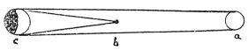
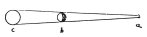

  
[Intangible Textual Heritage](../../index)  [Age of Reason](../index) 
[Index](index)   
[III. Six Books on Light and Shade Index](dvs002)  
  [Previous](0115)  [Next](0117) 

------------------------------------------------------------------------

[Buy this Book at
Amazon.com](https://www.amazon.com/exec/obidos/ASIN/0486225720/internetsacredte)

------------------------------------------------------------------------

*The Da Vinci Notebooks at Intangible Textual Heritage*

### 116.

 

Let *a* be the light, *b* the eye, *c* the object seen by the eye and in
the light. These show, first, the eye between

p. 72

 

the light and the body; the 2nd, the light between the eye and the body;
the 3rd the body between the eye and the light, *a* is the eye, *b* the
illuminated object, *c* the light.

------------------------------------------------------------------------

[Next: 117.](0117)
