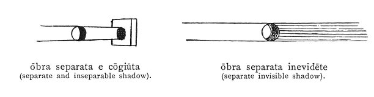

  
[Intangible Textual Heritage](../../index)  [Age of Reason](../index.md) 
[Index](index.md)   
[III. Six Books on Light and Shade Index](dvs002.md)  
  [Previous](0124)  [Next](0126.md) 

------------------------------------------------------------------------

[Buy this Book at
Amazon.com](https://www.amazon.com/exec/obidos/ASIN/0486225720/internetsacredte.md)

------------------------------------------------------------------------

*The Da Vinci Notebooks at Intangible Textual Heritage*

### 125.

### WHAT IS THE DIFFERENCE BETWEEN A SHADOW THAT IS INSEPARABLE FROM A BODY AND A CAST SHADOW?

An inseparable shadow is that which is never absent from the illuminated
body. As, for instance a ball, which so long as it is in the light
always has one side in shadow which never leaves it for any movement or
change of position in the ball. A separate shadow may be and may not be
produced by the body itself. Suppose the ball to be one braccia distant
from a wall with a light on the opposite side of it; this light will
throw upon the wall exactly as broad a shadow as is to be seen on the
side of the ball that is turned towards the wall. That portion of the
cast shadow will not be visible when the light is below the ball and the
shadow is thrown up towards the sky and finding no obstruction on its
way is lost.

 

------------------------------------------------------------------------

[Next: 126.](0126.md)
