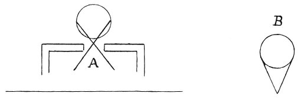

  
[Intangible Textual Heritage](../../index)  [Age of Reason](../index.md) 
[Index](index.md)   
[III. Six Books on Light and Shade Index](dvs002.md)  
  [Previous](0126)  [Next](0128.md) 

------------------------------------------------------------------------

[Buy this Book at
Amazon.com](https://www.amazon.com/exec/obidos/ASIN/0486225720/internetsacredte.md)

------------------------------------------------------------------------

*The Da Vinci Notebooks at Intangible Textual Heritage*

### 127.

 

How there are 2 different kinds of light; one being called diffused, the
other restricted. The diffused is that which freely illuminates objects.
The restricted is that which being admitted through an opening or window
illuminates them on that side only.

 [55](#fn_57.md)

------------------------------------------------------------------------

### Footnotes

[75:55](0127.htm#fr_57.md) : At the spot marked *A*
in the first diagram Leonardo wrote *lume costretto* (restricted light).
At the spot *B* on the second diagram he wrote *lume libero* (diffused
light).

------------------------------------------------------------------------

[Next: 128.](0128.md)
