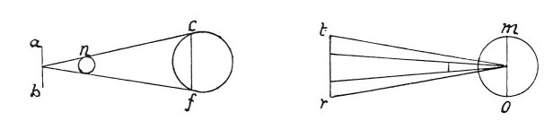
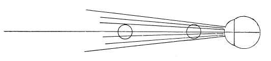
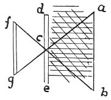
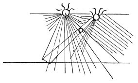

  
[Intangible Textual Heritage](../../index)  [Age of Reason](../index.md) 
[Index](index.md)   
[III. Six Books on Light and Shade Index](dvs002.md)  
  [Previous](0129)  [Next](0131.md) 

------------------------------------------------------------------------

[Buy this Book at
Amazon.com](https://www.amazon.com/exec/obidos/ASIN/0486225720/internetsacredte.md)

------------------------------------------------------------------------

*The Da Vinci Notebooks at Intangible Textual Heritage*

### 130.

p. 77

### FIRST BOOK ON LIGHT AND SHADE.

 On the nature of light (130. 131).The
reason by which we know that a light radiates from a single centre is
this: We plainly see that a large light is often much broader than some
small object which nevertheless--and although the rays \[of the large
light\] are much more than twice the extent \[of the small
body\]--always has its shadow cast on the nearest surface very visibly.
Let *c f* be a broad light and *n* be the object in front of it, casting
a shadow on the plane, and let *a b* be the plane. It is clear that it
is not the broad light that will cast the shadow *n* on the plane, but
that the light has within it a centre is shown by this experiment. The
shadow falls on the plane as is shown at *m o t r*.

 

 [56](#fn_58.md) Why, to two \[eyes\] or in front
of two eyes do 3 objects appear as two?

Why, when you estimate the direction of an object with two sights the
nearer

p. 78

appears confused. I say that the eye projects an infinite number of
lines which mingle or join those reaching it which come to it from the
object looked at. And it is only the central and sensible line that can
discern and discriminate colours and objects; all the others are false
and illusory. And if you place 2 objects at half an arm's length apart
if the nearer of the two is close to the eye its form will remain far
more confused than that of the second; the reason is that the first is
overcome by a greater number of false lines than the second and so is
rendered vague.

 

Light acts in the same manner, for in the effects of its lines (=rays),
and particularly in perspective, it much resembles the eye; and its
central rays are what cast the true shadow. When the object in front of
it is too quickly overcome with dim rays it will cast a broad and
disproportionate shadow, ill defined; but when the object which is to
cast the shadow and cuts off the rays near to the place where the shadow
falls, then the shadow is distinct; and the more so in proportion as the
light is far off, because at a long distance the central ray is less
overcome by false rays; because the lines from the eye and the solar and
other luminous rays passing through the atmosphere are obliged to travel
in straight lines. Unless they are deflected by a denser or rarer air,
when they will be bent at some point, but so long as the air is free
from grossness or moisture they will preserve their direct course,
always carrying the image of the object that intercepts them back to
their point of origin. And if this is the eye, the intercepting object
will be seen by its colour, as well as by form and size. But if the
intercepting plane has in it some small perforation opening into a
darker chamber--not darker in colour, but by absence of light--you will
see the rays enter through this hole and transmitting to the plane
beyond all the details of the

p. 79

 

 

object they proceed from both as to colour and form; only every thing
will be upside down. But the size \[of the image\] where the lines are
reconstructed will be in proportion to the relative distance of the
aperture from the plane on which the lines fall \[on one hand\] and from
their origin \[on the other\]. There they intersect and form 2 pyramids
with their point meeting \[a common apex\] and their bases opposite. Let
*a b* be the point of origin of the lines, *d e* the first plane, and
*c* the aperture with the intersection of the lines; *f g* is the inner
plane. You will find that *a* falls upon the inner plane below at *g*,
and *b* which is below will go up to the spot *f*; it will be quite
evident to experimenters that every luminous body has in itself a core
or centre, from which and to which all the lines radiate which are sent
forth by the surface of the luminous body and reflected back to it; or
which, having been thrown out and not intercepted, are dispersed in the
air.

------------------------------------------------------------------------

### Footnotes

[77:56](0130.htm#fr_58.md) 13: In the original MS.
no explanatory text is placed after this title-line; but a space is left
for it and the text beginning at line 15 comes next.

------------------------------------------------------------------------

[Next: 131.](0131.md)
